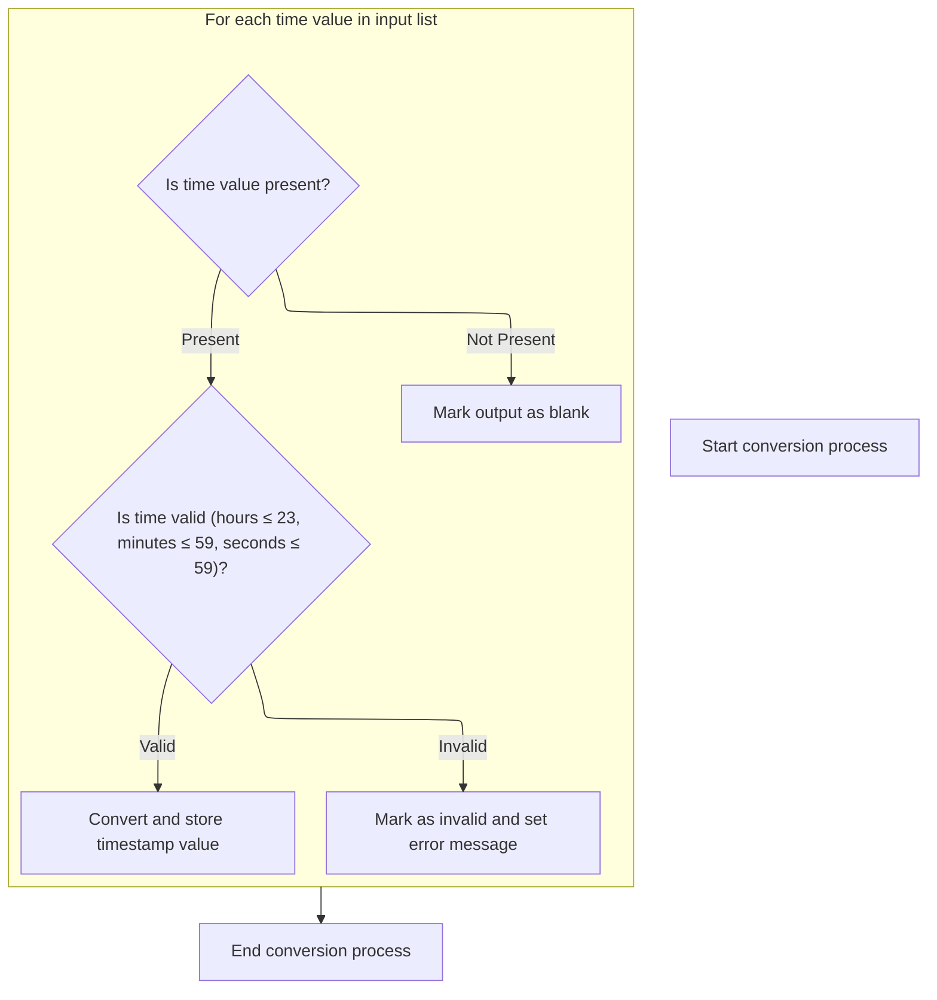
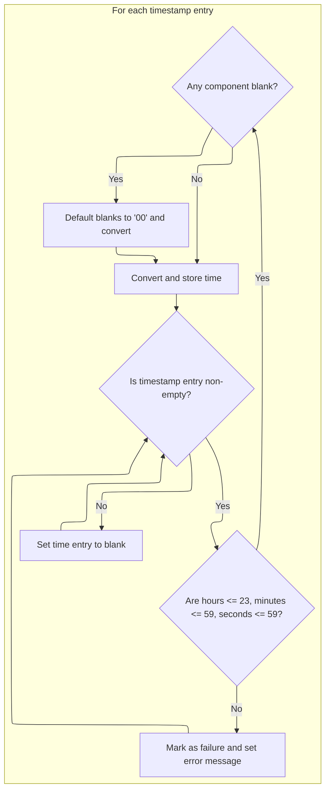

# Overview

This document explains the flow for converting arrays of time values to timestamp strings and vice versa. The conversion utility validates each entry, fills missing components with '00', and ensures outputs match business requirements for time formatting.

## Dependencies

### Program

- <SwmToken path="base/src/MMMS0291.cbl" pos="61:5:5" line-data="006800         MOVE &#39;MMMS0291 - Invalid MMMC0291-FUNC passed.&#39;          00006800">`MMMS0291`</SwmToken> (<SwmPath>[base/src/MMMS0291.cbl](base/src/MMMS0291.cbl)</SwmPath>)

### Copybooks

- SQLCA
- <SwmToken path="base/src/MMMS0291.cbl" pos="40:4:4" line-data="004700 COPY XXXN001A.                                                   00004700">`XXXN001A`</SwmToken> (<SwmPath>[base/src/XXXN001A.cpy](base/src/XXXN001A.cpy)</SwmPath>)
- <SwmToken path="base/src/MMMS0291.cbl" pos="55:4:4" line-data="006200       WHEN MMMC0291-CVT-TM-TO-TS                                 00006200">`MMMC0291`</SwmToken> (<SwmPath>[base/src/MMMC0291.cpy](base/src/MMMC0291.cpy)</SwmPath>)

# Where is this program used?

This program is used multiple times in the codebase as represented in the following diagram:

```mermaid
graph TD
  nhzz1("Managing Location Data (NNNS0487)") --> iwt5e("Time and Timestamp Conversion Utility (MMMS0291)"):::currentEntity
click nhzz1 openCode "base/src/NNNS0487.cbl:1"
y2a60("Retail Location Data Processing (NNNS0488)") --> iwt5e("Time and Timestamp Conversion Utility (MMMS0291)"):::currentEntity
click y2a60 openCode "base/src/NNNS0488.cbl:1"
  
  
click iwt5e openCode "base/src/MMMS0291.cbl:1"
    classDef currentEntity color:#000000,fill:#7CB9F4

%% Swimm:
%% graph TD
%%   nhzz1("Managing Location Data (NNNS0487)") --> iwt5e("Time and Timestamp Conversion Utility (<SwmToken path="base/src/MMMS0291.cbl" pos="61:5:5" line-data="006800         MOVE &#39;MMMS0291 - Invalid MMMC0291-FUNC passed.&#39;          00006800">`MMMS0291`</SwmToken>)"):::currentEntity
%% click nhzz1 openCode "<SwmPath>[base/src/NNNS0487.cbl](base/src/NNNS0487.cbl)</SwmPath>:1"
%% y2a60("Retail Location Data Processing (NNNS0488)") --> iwt5e("Time and Timestamp Conversion Utility (<SwmToken path="base/src/MMMS0291.cbl" pos="61:5:5" line-data="006800         MOVE &#39;MMMS0291 - Invalid MMMC0291-FUNC passed.&#39;          00006800">`MMMS0291`</SwmToken>)"):::currentEntity
%% click y2a60 openCode "<SwmPath>[base/src/NNNS0488.cbl](base/src/NNNS0488.cbl)</SwmPath>:1"
%%   
%%   
%% click iwt5e openCode "<SwmPath>[base/src/MMMS0291.cbl](base/src/MMMS0291.cbl)</SwmPath>:1"
%%     classDef currentEntity color:#000000,fill:#7CB9F4
```



## Detailed View of the Program's Functionality

a. Entry and Dispatch Logic

The program begins by initializing its internal state. This involves resetting various fields related to status and time tracking, ensuring that any previous data does not interfere with the current operation. This initialization is performed at the very start of the main procedure.

After initialization, the program determines which operation to perform based on an input function code. There are two main operations:

- Converting a time value to a timestamp.
- Converting a timestamp to a time value.

The program checks the function code:

- If the code requests a time-to-timestamp conversion, it proceeds to the corresponding conversion routine.
- If the code requests a timestamp-to-time conversion, it proceeds to the other conversion routine.
- If the code is invalid or unrecognized, the program sets a failure status and prepares an error message indicating that an invalid function code was provided.

After handling the request (or error), the program ends its execution and returns control to the caller.

b. Time-to-Timestamp Conversion Loop

When the program is instructed to convert time values to timestamps, it processes a list of up to 14 input time strings. For each entry in this list, the following steps are performed:

1. The program checks if the current time string is not blank.

   - If it is blank, the corresponding output timestamp is set to blank, ensuring the output structure matches the input.

2. For non-blank entries:

   - The time string is moved into a working area for processing.
   - Delimiters (such as hyphens and colons) are initialized to ensure the timestamp format is correct.

3. The program validates the time components:

   - It checks that the hours are less than or equal to 23, and both minutes and seconds are less than or equal to 59.
   - If any component (hours, minutes, seconds) is blank, it is defaulted to '00'.

4. If all components are valid:

   - The program constructs a timestamp string using the validated (and possibly defaulted) time components.
   - This timestamp is stored in the output array at the corresponding position.

5. If any component is invalid (for example, hours greater than 23):

   - The program sets a failure status.
   - An error message is prepared, indicating that an invalid time was provided.
   - The program then continues to the next input entry.

This loop ensures that each input time string is processed independently, and the output array of timestamps aligns with the input array in structure.

c. Timestamp-to-Time Conversion Loop

When the program is instructed to convert timestamps to time values, it processes a list of up to 14 input timestamp strings. For each entry in this list, the following steps are performed:

1. The program checks if the current timestamp string is not blank.

   - If it is blank, the corresponding output time string is set to blank, maintaining alignment between input and output.

2. For non-blank entries:

   - The timestamp string is moved into a structured working area for parsing.
   - Delimiters are initialized to ensure the time extraction process is consistent.

3. The program validates the extracted time components:

   - It checks that the hours are less than or equal to 23, and both minutes and seconds are less than or equal to 59.
   - If any component (hours, minutes, seconds) is blank, it is defaulted to '00'.

4. If all components are valid:

   - The program constructs a time string from the validated (and possibly defaulted) components.
   - This time string is stored in the output array at the corresponding position.

5. If any component is invalid:

   - The program sets a failure status.
   - An error message is prepared, indicating that an invalid timestamp was provided.
   - The program then continues to the next input entry.

This loop ensures that each input timestamp is processed independently, and the output array of time strings matches the input array in structure.

d. Initialization and Delimiter Setup

Throughout both conversion routines, the program uses dedicated steps to initialize delimiters (such as hyphens, colons, and dots) in the working storage fields. This ensures that the constructed timestamps and time strings always have the correct format, regardless of the input.

Additionally, before any conversion begins, the program resets relevant fields to their default states, preventing any leftover data from previous operations from affecting the current processing.

e. Error Handling

In both conversion routines, if an invalid input is detected (such as an out-of-range time component), the program:

- Sets a failure status flag.
- Prepares a descriptive error message for the user, indicating the nature of the error and prompting for a correct value.

This error handling ensures that the user is informed of any issues with their input and that the program does not produce misleading or incorrect output.

f. Program Termination

After completing the requested conversion (or handling an error), the program ends its execution and returns control to the caller. This ensures that the program performs only the requested operation for each invocation and maintains a clean state for subsequent calls.

# Rule Definition

| Paragraph Name                                                                                                                                                                                                                                                                                                                                                           | Rule ID | Category          | Description                                                                                                                                                                                                                                                                                                                                       | Conditions                                                                      | Remarks                                                                                                                                                                                                                                                                                                                                                                                                                                                                                                          |
| ------------------------------------------------------------------------------------------------------------------------------------------------------------------------------------------------------------------------------------------------------------------------------------------------------------------------------------------------------------------------ | ------- | ----------------- | ------------------------------------------------------------------------------------------------------------------------------------------------------------------------------------------------------------------------------------------------------------------------------------------------------------------------------------------------- | ------------------------------------------------------------------------------- | ---------------------------------------------------------------------------------------------------------------------------------------------------------------------------------------------------------------------------------------------------------------------------------------------------------------------------------------------------------------------------------------------------------------------------------------------------------------------------------------------------------------- |
| <SwmToken path="base/src/MMMS0291.cbl" pos="52:4:6" line-data="005900     PERFORM 100-INITIALIZE                                       00005900">`100-INITIALIZE`</SwmToken>                                                                                                                                                                                             | RL-001  | Data Assignment   | At the start of each batch conversion, all status, error message, and working fields must be initialized to blank or default values. The error message field and failure flag must be cleared.                                                                                                                                                    | At the beginning of the batch process, before any conversion logic is executed. | The error message field is a string. The failure flag is a single-character indicator. All working fields are set to their default values (e.g., spaces or zeros).                                                                                                                                                                                                                                                                                                                                               |
| <SwmToken path="base/src/MMMS0291.cbl" pos="51:2:4" line-data="005800 000-MAIN.                                                        00005800">`000-MAIN`</SwmToken>                                                                                                                                                                                                   | RL-002  | Conditional Logic | The function code determines which conversion to perform. If the code is 'TM2TS', convert time array to timestamp array. If 'TS2TM', convert timestamp array to time array. Otherwise, set failure flag and error message, and leave outputs blank.                                                                                               | Function code is present in the input.                                          | Function code values: 'TM2TS', 'TS2TM'. Error message for invalid code: '<SwmToken path="base/src/MMMS0291.cbl" pos="61:5:5" line-data="006800         MOVE &#39;MMMS0291 - Invalid MMMC0291-FUNC passed.&#39;          00006800">`MMMS0291`</SwmToken> - Invalid <SwmToken path="base/src/MMMS0291.cbl" pos="61:11:13" line-data="006800         MOVE &#39;MMMS0291 - Invalid MMMC0291-FUNC passed.&#39;          00006800">`MMMC0291-FUNC`</SwmToken> passed.' Output arrays are left blank for invalid codes. |
| <SwmToken path="base/src/MMMS0291.cbl" pos="56:4:12" line-data="006300         PERFORM 201-CONVERT-TM-TO-TS                             00006300">`201-CONVERT-TM-TO-TS`</SwmToken>                                                                                                                                                                                      | RL-003  | Computation       | For each entry in the time array, convert to a timestamp string. Blank entries result in blank output. Non-blank entries are parsed; missing components are defaulted to '00'. If any component is out of range, output is blank, failure flag is set, and error message is updated. Valid entries are formatted as '1700-01-01-HH:MM:SS.000000'. | Function code is 'TM2TS'. Each entry in the time array is processed.            | Input: up to 14 time strings, each in 'HH:MM:SS' format (8 characters). Output: up to 14 timestamp strings, each 26 characters, format '1700-01-01-HH:MM:SS.000000'. Blank input yields 26 spaces. Error message for invalid time: '<SwmToken path="base/src/MMMS0291.cbl" pos="61:5:5" line-data="006800         MOVE &#39;MMMS0291 - Invalid MMMC0291-FUNC passed.&#39;          00006800">`MMMS0291`</SwmToken> - INVALID TIME. PLEASE ENTER CORRECT TIME VALUE'.                                             |
| <SwmToken path="base/src/MMMS0291.cbl" pos="58:4:12" line-data="006500         PERFORM 301-CONVERT-TS-TO-TM                             00006500">`301-CONVERT-TS-TO-TM`</SwmToken>                                                                                                                                                                                      | RL-004  | Computation       | For each entry in the timestamp array, convert to a time string. Blank entries result in blank output. Non-blank entries are parsed; missing components are defaulted to '00'. If any component is out of range, output is blank, failure flag is set, and error message is updated. Valid entries are formatted as 'HH:MM:SS'.                   | Function code is 'TS2TM'. Each entry in the timestamp array is processed.       | Input: up to 14 timestamp strings, each 26 characters, format '1700-01-01-HH:MM:SS.000000'. Output: up to 14 time strings, each 8 characters, format 'HH:MM:SS'. Blank input yields 8 spaces. Error message for invalid timestamp: '<SwmToken path="base/src/MMMS0291.cbl" pos="61:5:5" line-data="006800         MOVE &#39;MMMS0291 - Invalid MMMC0291-FUNC passed.&#39;          00006800">`MMMS0291`</SwmToken> - INVALID TIME. PLEASE ENTER CORRECT TIMESTAMP VALUE'.                                        |
| <SwmToken path="base/src/MMMS0291.cbl" pos="56:4:12" line-data="006300         PERFORM 201-CONVERT-TM-TO-TS                             00006300">`201-CONVERT-TM-TO-TS`</SwmToken>, <SwmToken path="base/src/MMMS0291.cbl" pos="58:4:12" line-data="006500         PERFORM 301-CONVERT-TS-TO-TM                             00006500">`301-CONVERT-TS-TO-TM`</SwmToken> | RL-005  | Conditional Logic | The process must continue processing all entries in the input array, even if some are invalid. The output array must always have the same number of entries as the input, with blanks for invalid or blank inputs. Only the last error message generated during the batch is retained in the error message field.                                 | During batch processing of input arrays.                                        | Output arrays always match input array size. Only the last error message is present at the end of processing. Blank entries do not set error or failure flag.                                                                                                                                                                                                                                                                                                                                                    |
| <SwmToken path="base/src/MMMS0291.cbl" pos="56:4:12" line-data="006300         PERFORM 201-CONVERT-TM-TO-TS                             00006300">`201-CONVERT-TM-TO-TS`</SwmToken>, <SwmToken path="base/src/MMMS0291.cbl" pos="58:4:12" line-data="006500         PERFORM 301-CONVERT-TS-TO-TM                             00006500">`301-CONVERT-TS-TO-TM`</SwmToken> | RL-006  | Data Assignment   | All string fields in input and output must preserve their fixed lengths and delimiters as specified in the formats. Output entries for blank or invalid inputs must be filled with spaces to the correct length.                                                                                                                                  | Whenever assigning to output arrays or formatting strings.                      | Time strings: 8 characters, format 'HH:MM:SS'. Timestamp strings: 26 characters, format '1700-01-01-HH:MM:SS.000000'. Delimiters (':' and '-') must be preserved. Blank outputs are filled with spaces to the correct length.                                                                                                                                                                                                                                                                                    |

# User Stories

## User Story 1: Batch Conversion Initialization, Operation Selection, and Array Processing

---

### Story Description:

As a system, I want to initialize all status, error message, and working fields at the start of each batch, select the conversion operation based on the function code, process each entry in the input array according to the selected conversion (time-to-timestamp or timestamp-to-time), handle blank and invalid entries appropriately, ensure output arrays match input sizes, preserve fixed field lengths and delimiters, and retain only the last error message so that the batch conversion is robust, correctly formatted, and provides accurate error reporting.

---

### Business Rule Mapping:

| Rule ID | Paragraph Name                                                                                                                                                                                                                                                                                                                                                           | Rule Description                                                                                                                                                                                                                                                                                                                                  |
| ------- | ------------------------------------------------------------------------------------------------------------------------------------------------------------------------------------------------------------------------------------------------------------------------------------------------------------------------------------------------------------------------ | ------------------------------------------------------------------------------------------------------------------------------------------------------------------------------------------------------------------------------------------------------------------------------------------------------------------------------------------------- |
| RL-002  | <SwmToken path="base/src/MMMS0291.cbl" pos="51:2:4" line-data="005800 000-MAIN.                                                        00005800">`000-MAIN`</SwmToken>                                                                                                                                                                                                   | The function code determines which conversion to perform. If the code is 'TM2TS', convert time array to timestamp array. If 'TS2TM', convert timestamp array to time array. Otherwise, set failure flag and error message, and leave outputs blank.                                                                                               |
| RL-003  | <SwmToken path="base/src/MMMS0291.cbl" pos="56:4:12" line-data="006300         PERFORM 201-CONVERT-TM-TO-TS                             00006300">`201-CONVERT-TM-TO-TS`</SwmToken>                                                                                                                                                                                      | For each entry in the time array, convert to a timestamp string. Blank entries result in blank output. Non-blank entries are parsed; missing components are defaulted to '00'. If any component is out of range, output is blank, failure flag is set, and error message is updated. Valid entries are formatted as '1700-01-01-HH:MM:SS.000000'. |
| RL-005  | <SwmToken path="base/src/MMMS0291.cbl" pos="56:4:12" line-data="006300         PERFORM 201-CONVERT-TM-TO-TS                             00006300">`201-CONVERT-TM-TO-TS`</SwmToken>, <SwmToken path="base/src/MMMS0291.cbl" pos="58:4:12" line-data="006500         PERFORM 301-CONVERT-TS-TO-TM                             00006500">`301-CONVERT-TS-TO-TM`</SwmToken> | The process must continue processing all entries in the input array, even if some are invalid. The output array must always have the same number of entries as the input, with blanks for invalid or blank inputs. Only the last error message generated during the batch is retained in the error message field.                                 |
| RL-006  | <SwmToken path="base/src/MMMS0291.cbl" pos="56:4:12" line-data="006300         PERFORM 201-CONVERT-TM-TO-TS                             00006300">`201-CONVERT-TM-TO-TS`</SwmToken>, <SwmToken path="base/src/MMMS0291.cbl" pos="58:4:12" line-data="006500         PERFORM 301-CONVERT-TS-TO-TM                             00006500">`301-CONVERT-TS-TO-TM`</SwmToken> | All string fields in input and output must preserve their fixed lengths and delimiters as specified in the formats. Output entries for blank or invalid inputs must be filled with spaces to the correct length.                                                                                                                                  |
| RL-004  | <SwmToken path="base/src/MMMS0291.cbl" pos="58:4:12" line-data="006500         PERFORM 301-CONVERT-TS-TO-TM                             00006500">`301-CONVERT-TS-TO-TM`</SwmToken>                                                                                                                                                                                      | For each entry in the timestamp array, convert to a time string. Blank entries result in blank output. Non-blank entries are parsed; missing components are defaulted to '00'. If any component is out of range, output is blank, failure flag is set, and error message is updated. Valid entries are formatted as 'HH:MM:SS'.                   |
| RL-001  | <SwmToken path="base/src/MMMS0291.cbl" pos="52:4:6" line-data="005900     PERFORM 100-INITIALIZE                                       00005900">`100-INITIALIZE`</SwmToken>                                                                                                                                                                                             | At the start of each batch conversion, all status, error message, and working fields must be initialized to blank or default values. The error message field and failure flag must be cleared.                                                                                                                                                    |

---

### Relevant Functionality:

- <SwmToken path="base/src/MMMS0291.cbl" pos="51:2:4" line-data="005800 000-MAIN.                                                        00005800">`000-MAIN`</SwmToken>
  1. **RL-002:**
     - If function code is 'TM2TS':
       - Perform time to timestamp conversion for each entry
     - Else if function code is 'TS2TM':
       - Perform timestamp to time conversion for each entry
     - Else:
       - Set failure flag to 'Y'
       - Set error message to '<SwmToken path="base/src/MMMS0291.cbl" pos="61:5:5" line-data="006800         MOVE &#39;MMMS0291 - Invalid MMMC0291-FUNC passed.&#39;          00006800">`MMMS0291`</SwmToken> - Invalid <SwmToken path="base/src/MMMS0291.cbl" pos="61:11:13" line-data="006800         MOVE &#39;MMMS0291 - Invalid MMMC0291-FUNC passed.&#39;          00006800">`MMMC0291-FUNC`</SwmToken> passed.'
       - Set all output entries to blank
- <SwmToken path="base/src/MMMS0291.cbl" pos="56:4:12" line-data="006300         PERFORM 201-CONVERT-TM-TO-TS                             00006300">`201-CONVERT-TM-TO-TS`</SwmToken>
  1. **RL-003:**
     - For each entry in the time array (up to 14):
       - If entry is blank:
         - Set corresponding output to 26 spaces
       - Else:
         - Parse hours, minutes, seconds (default to '00' if blank)
         - If hours > 23 or minutes > 59 or seconds > 59:
           - Set output to 26 spaces
           - Set failure flag to 'Y'
           - Set error message to '<SwmToken path="base/src/MMMS0291.cbl" pos="61:5:5" line-data="006800         MOVE &#39;MMMS0291 - Invalid MMMC0291-FUNC passed.&#39;          00006800">`MMMS0291`</SwmToken> - INVALID TIME. PLEASE ENTER CORRECT TIME VALUE'
         - Else:
           - Format output as '1700-01-01-HH:MM:SS.000000'
  2. **RL-005:**
     - For each entry in the input array:
       - Process according to conversion rules
       - If entry is invalid, set failure flag and error message
       - Continue processing remaining entries
     - At end, error message field contains only the last error encountered
  3. **RL-006:**
     - When formatting output strings, ensure correct length and delimiters
     - For blank or invalid entries, fill output with spaces to required length
- <SwmToken path="base/src/MMMS0291.cbl" pos="58:4:12" line-data="006500         PERFORM 301-CONVERT-TS-TO-TM                             00006500">`301-CONVERT-TS-TO-TM`</SwmToken>
  1. **RL-004:**
     - For each entry in the timestamp array (up to 14):
       - If entry is blank:
         - Set corresponding output to 8 spaces
       - Else:
         - Extract hours, minutes, seconds (default to '00' if blank)
         - If hours > 23 or minutes > 59 or seconds > 59:
           - Set output to 8 spaces
           - Set failure flag to 'Y'
           - Set error message to '<SwmToken path="base/src/MMMS0291.cbl" pos="61:5:5" line-data="006800         MOVE &#39;MMMS0291 - Invalid MMMC0291-FUNC passed.&#39;          00006800">`MMMS0291`</SwmToken> - INVALID TIME. PLEASE ENTER CORRECT TIMESTAMP VALUE'
         - Else:
           - Format output as 'HH:MM:SS'
- <SwmToken path="base/src/MMMS0291.cbl" pos="52:4:6" line-data="005900     PERFORM 100-INITIALIZE                                       00005900">`100-INITIALIZE`</SwmToken>
  1. **RL-001:**
     - Set all status fields to blank or default values
     - Set the error message field to blank
     - Set the failure flag to blank or false
     - Set all working fields to their default values (e.g., spaces or zeros)

# Workflow

# Entry and Dispatch Logic

```mermaid
%%{init: {"flowchart": {"defaultRenderer": "elk"}} }%%
flowchart TD
    node1["Initialize process"] --> node2{"MMMC0291-FUNC?"}
    click node1 openCode "base/src/MMMS0291.cbl:59:61"
    node2 -->|"TM2TS"| node3["Convert time to timestamp"]
    click node2 openCode "base/src/MMMS0291.cbl:61:70"
    node2 -->|"TS2TM"| node4["Convert timestamp to time"]
    node2 -->|"Other"| node5["Set FAILURE, return error message"]
    click node3 openCode "base/src/MMMS0291.cbl:63:63"
    click node4 openCode "base/src/MMMS0291.cbl:65:65"
    click node5 openCode "base/src/MMMS0291.cbl:67:69"
    node3 --> node6["End"]
    node4 --> node6
    node5 --> node6
    click node6 openCode "base/src/MMMS0291.cbl:73:73"
classDef HeadingStyle fill:#777777,stroke:#333,stroke-width:2px;

%% Swimm:
%% %%{init: {"flowchart": {"defaultRenderer": "elk"}} }%%
%% flowchart TD
%%     node1["Initialize process"] --> node2{"<SwmToken path="base/src/MMMS0291.cbl" pos="61:11:13" line-data="006800         MOVE &#39;MMMS0291 - Invalid MMMC0291-FUNC passed.&#39;          00006800">`MMMC0291-FUNC`</SwmToken>?"}
%%     click node1 openCode "<SwmPath>[base/src/MMMS0291.cbl](base/src/MMMS0291.cbl)</SwmPath>:59:61"
%%     node2 -->|"TM2TS"| node3["Convert time to timestamp"]
%%     click node2 openCode "<SwmPath>[base/src/MMMS0291.cbl](base/src/MMMS0291.cbl)</SwmPath>:61:70"
%%     node2 -->|"TS2TM"| node4["Convert timestamp to time"]
%%     node2 -->|"Other"| node5["Set FAILURE, return error message"]
%%     click node3 openCode "<SwmPath>[base/src/MMMS0291.cbl](base/src/MMMS0291.cbl)</SwmPath>:63:63"
%%     click node4 openCode "<SwmPath>[base/src/MMMS0291.cbl](base/src/MMMS0291.cbl)</SwmPath>:65:65"
%%     click node5 openCode "<SwmPath>[base/src/MMMS0291.cbl](base/src/MMMS0291.cbl)</SwmPath>:67:69"
%%     node3 --> node6["End"]
%%     node4 --> node6
%%     node5 --> node6
%%     click node6 openCode "<SwmPath>[base/src/MMMS0291.cbl](base/src/MMMS0291.cbl)</SwmPath>:73:73"
%% classDef HeadingStyle fill:#777777,stroke:#333,stroke-width:2px;
```



This section governs the entry and dispatch logic for time/timestamp conversion requests. It ensures that each request is initialized properly, routed to the correct conversion routine based on the requested function, and that errors are handled with clear messaging.

| Category        | Rule Name                    | Description                                                                                                                |
| --------------- | ---------------------------- | -------------------------------------------------------------------------------------------------------------------------- |
| Data validation | Fresh Start for Each Request | Each new request must reset all status and time tracking fields to ensure no previous state affects the current operation. |
| Data validation | Output Status Enforcement    | The output status must be set to SUCCESS (0) for valid conversions and FAILURE (1) for invalid requests.                   |
| Business logic  | Time to Timestamp Routing    | If the request specifies 'TM2TS', the system must perform a time-to-timestamp conversion.                                  |
| Business logic  | Timestamp to Time Routing    | If the request specifies 'TS2TM', the system must perform a timestamp-to-time conversion.                                  |

<SwmSnippet path="/base/src/MMMS0291.cbl" line="51">

---

In <SwmToken path="base/src/MMMS0291.cbl" pos="51:2:4" line-data="005800 000-MAIN.                                                        00005800">`000-MAIN`</SwmToken>, we kick off the flow by calling the initialization routine to reset status and time tracking fields. This clears out any previous state so each conversion starts fresh.

```cobol
005800 000-MAIN.                                                        00005800
005900     PERFORM 100-INITIALIZE                                       00005900
```

---

</SwmSnippet>

<SwmSnippet path="/base/src/MMMS0291.cbl" line="54">

---

After initialization, <SwmToken path="base/src/MMMS0291.cbl" pos="51:2:4" line-data="005800 000-MAIN.                                                        00005800">`000-MAIN`</SwmToken> checks which conversion is requested and calls either the time-to-timestamp or timestamp-to-time routine. If the request is invalid, it sets an error and exits.

```cobol
006100     EVALUATE TRUE                                                00006100
006200       WHEN MMMC0291-CVT-TM-TO-TS                                 00006200
006300         PERFORM 201-CONVERT-TM-TO-TS                             00006300
006400       WHEN MMMC0291-CVT-TS-TO-TM                                 00006400
006500         PERFORM 301-CONVERT-TS-TO-TM                             00006500
006600       WHEN OTHER                                                 00006600
006700         SET FAILURE TO TRUE                                      00006700
006800         MOVE 'MMMS0291 - Invalid MMMC0291-FUNC passed.'          00006800
006900           TO IS-RTRN-MSG-TXT                                     00006900
007000     END-EVALUATE                                                 00007000
007100                                                                  00007100
007200                                                                  00007200
007300     GOBACK                                                       00007300
007400     .                                                            00007400
```

---

</SwmSnippet>

# Time-to-Timestamp Conversion Loop



This section is responsible for converting a list of up to 14 time values into timestamp strings, ensuring that each output corresponds to its input. It validates the time values, fills missing components with '00', and handles invalid or blank inputs according to business rules.

| Category        | Rule Name                       | Description                                                                                                                                                               |
| --------------- | ------------------------------- | ------------------------------------------------------------------------------------------------------------------------------------------------------------------------- |
| Data validation | Time value range validation     | Each non-blank input time value must be validated to ensure hours are 0-23, minutes are 0-59, and seconds are 0-59. Any value outside these ranges is considered invalid. |
| Business logic  | Blank input passthrough         | If an input time value is blank, the corresponding output timestamp must also be blank, ensuring the output array structure matches the input.                            |
| Business logic  | Default missing time components | If any component (hours, minutes, seconds) of a valid time value is missing, it must be filled with '00' before conversion to a timestamp.                                |
| Business logic  | Fixed array processing          | The conversion process must process all 14 input slots, regardless of whether they are blank, valid, or invalid, to ensure the output array always contains 14 entries.   |

<SwmSnippet path="/base/src/MMMS0291.cbl" line="96">

---

In <SwmToken path="base/src/MMMS0291.cbl" pos="96:2:10" line-data="010300 201-CONVERT-TM-TO-TS.                                            00010300">`201-CONVERT-TM-TO-TS`</SwmToken>, we loop through up to 14 input time strings. For each non-blank entry, we prep it for parsing by moving it to the working field and setting up delimiters for later validation and formatting.

```cobol
010300 201-CONVERT-TM-TO-TS.                                            00010300
010400                                                                  00010400
010500     PERFORM VARYING WS-CNT FROM 1 BY 1 UNTIL WS-CNT > WS-K       00010500
010600       IF WS-TIME-INOUT-CONV(WS-CNT) NOT EQUAL TO SPACES          00010600
010700         MOVE WS-TIME-INOUT-CONV(WS-CNT)                          00010700
010800                                     TO  WS-CURRENT-TIME          00010800
010900         PERFORM 110-INITIALIZE-TM-DELIM                          00010900
```

---

</SwmSnippet>

<SwmSnippet path="/base/src/MMMS0291.cbl" line="103">

---

After prepping the input, we validate each time component. If any are missing, we fill them with '00'. If all are valid, we build the timestamp and store it in the output array.

```cobol
011000         IF WS-CURRENT-HOURS <= '23' AND WS-CURRENT-MINUTE <= '59'00011000
011100                                     AND WS-CURRENT-SECOND <= '59'00011100
011200           IF WS-CURRENT-HOURS   = '  '                           00011200
011300              MOVE '00'         TO WS-CURRENT-HOURS               00011300
011400           END-IF                                                 00011400
011500           IF WS-CURRENT-MINUTE  = '  '                           00011500
011600              MOVE '00'         TO WS-CURRENT-MINUTE              00011600
011700           END-IF                                                 00011700
011800           IF WS-CURRENT-SECOND  = '  '                           00011800
011900              MOVE '00'         TO WS-CURRENT-SECOND              00011900
012000           END-IF                                                 00012000
012100                                                                  00012100
012200           MOVE WS-CURRENT-TIME-STAMP                             00012200
012300                                TO WS-CURRENT-DATE-DATA           00012300
012400           MOVE WS-CURRENT-DATE-DATA                              00012400
012500                                TO WS-TIMSTAMP-INOUT-CONV(WS-CNT) 00012500
```

---

</SwmSnippet>

<SwmSnippet path="/base/src/MMMS0291.cbl" line="119">

---

If any time component is out of range, we set the failure flag and write an error message for the user, then move on to the next input.

```cobol
012600         ELSE                                                     00012600
012700           SET  FAILURE TO TRUE                                   00012700
012800           MOVE 'MMMS0291 - Invalid MMMC0291-FUNC passed.'        00012800
012900             TO IS-RTRN-MSG-TXT                                   00012900
013000           STRING 'MMMS0291 - INVALID TIME. PLEASE ENTER CORRECT' 00013000
013100                  'TIME VALUE'                                    00013100
013200           DELIMITED BY SIZE INTO IS-RTRN-MSG-TXT                 00013200
013300         END-IF                                                   00013300
```

---

</SwmSnippet>

<SwmSnippet path="/base/src/MMMS0291.cbl" line="127">

---

For any blank input time string, we just clear the corresponding output timestamp, so the output array matches the input structure.

```cobol
013400       ELSE                                                       00013400
013500         MOVE SPACES TO WS-TIMSTAMP-INOUT-CONV(WS-CNT)            00013500
013600       END-IF                                                     00013600
013700     END-PERFORM                                                  00013700
```

---

</SwmSnippet>

# Timestamp-to-Time Conversion Loop



This section is responsible for converting an array of timestamp entries into corresponding time strings, ensuring each entry is validated and formatted according to business rules. It also handles error messaging for invalid entries.

| Category        | Rule Name                       | Description                                                                                                                                                                                                                    |
| --------------- | ------------------------------- | ------------------------------------------------------------------------------------------------------------------------------------------------------------------------------------------------------------------------------ |
| Data validation | Time component range validation | Each timestamp entry must be validated so that hours do not exceed 23, minutes do not exceed 59, and seconds do not exceed 59. If any component is out of range, the entry is marked as a failure and an error message is set. |
| Business logic  | Blank input passthrough         | For each input timestamp entry, if the entry is blank, the corresponding output time string must be set to blank.                                                                                                              |
| Business logic  | Default blank time components   | If any time component (hours, minutes, seconds) is blank in a non-blank timestamp, it must be defaulted to '00' before conversion.                                                                                             |
| Business logic  | Output time formatting          | The output time string for each entry must be formatted according to the structured time field, matching the expected output format.                                                                                           |

<SwmSnippet path="/base/src/MMMS0291.cbl" line="137">

---

In <SwmToken path="base/src/MMMS0291.cbl" pos="137:2:10" line-data="014400 301-CONVERT-TS-TO-TM.                                            00014400">`301-CONVERT-TS-TO-TM`</SwmToken>, we loop through up to 14 input timestamps. For each non-blank entry, we move it into a structured field, set up delimiters, and prep for time extraction and validation.

```cobol
014400 301-CONVERT-TS-TO-TM.                                            00014400
014500     PERFORM VARYING WS-CNT FROM 1 BY 1 UNTIL WS-CNT > WS-K       00014500
014600       IF WS-TIMSTAMP-INOUT-CONV(WS-CNT) NOT EQUAL TO SPACES      00014600
014700         MOVE WS-TIMSTAMP-INOUT-CONV(WS-CNT)                      00014700
014800                                     TO  WS-CURRENT-TIME-STAMP    00014800
014900         PERFORM 110-INITIALIZE-TM-DELIM                          00014900
```

---

</SwmSnippet>

<SwmSnippet path="/base/src/MMMS0291.cbl" line="143">

---

After prepping the input, we validate and fill in missing time parts, then write the result as a time string if everything checks out. This relies on the timestamp having a fixed structure for extracting time fields.

```cobol
015000         IF WS-CURRENT-HOURS <= '23' AND WS-CURRENT-MINUTE <= '59'00015000
015100                                     AND WS-CURRENT-SECOND <= '59'00015100
015200           IF WS-CURRENT-HOURS   = '  '                           00015200
015300              MOVE '00'         TO WS-CURRENT-HOURS               00015300
015400           END-IF                                                 00015400
015500           IF WS-CURRENT-MINUTE  = '  '                           00015500
015600              MOVE '00'         TO WS-CURRENT-MINUTE              00015600
015700           END-IF                                                 00015700
015800           IF WS-CURRENT-SECOND  = '  '                           00015800
015900              MOVE '00'         TO WS-CURRENT-SECOND              00015900
016000           END-IF                                                 00016000
016100           MOVE WS-CURRENT-TIME TO WS-TIME-INOUT-CONV(WS-CNT)     00016100
```

---

</SwmSnippet>

<SwmSnippet path="/base/src/MMMS0291.cbl" line="155">

---

If the extracted time is out of range, we set the failure flag and write an error message for the user, then move on to the next input.

```cobol
016200         ELSE                                                     00016200
016300           SET FAILURE TO TRUE                                    00016300
016400           MOVE 'MMMS0291 - Invalid MMMC0291-FUNC passed.'        00016400
016500             TO IS-RTRN-MSG-TXT                                   00016500
016600           STRING 'MMMS0291 - INVALID TIME. PLEASE ENTER CORRECT' 00016600
016700                  'TIMESTAMP VALUE'                               00016700
016800            DELIMITED BY SIZE INTO IS-RTRN-MSG-TXT                00016800
016900         END-IF                                                   00016900
```

---

</SwmSnippet>

<SwmSnippet path="/base/src/MMMS0291.cbl" line="163">

---

For any blank input timestamp, we just clear the corresponding output time string, so the output array matches the input structure.

```cobol
017000       ELSE                                                       00017000
017100         MOVE SPACES TO WS-TIME-INOUT-CONV(WS-CNT)                00017100
017200       END-IF                                                     00017200
017300     END-PERFORM                                                  00017300
```

---

</SwmSnippet>

&nbsp;

*This is an auto-generated document by Swimm 🌊 and has not yet been verified by a human*

<SwmMeta version="3.0.0" repo-id="Z2l0aHViJTNBJTNBU3dpbW1pby1keW5jYWxsLWRlbW8lM0ElM0FHaXJpLVN3aW1t" repo-name="Swimmio-dyncall-demo"><sup>Powered by [Swimm](https://app.swimm.io/)</sup></SwmMeta>
