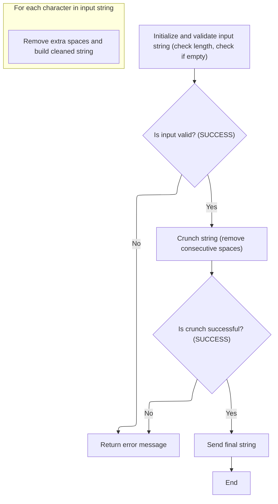

This document describes the flow for transforming and normalizing location data records. The process ensures that all relevant fields are mapped, names and addresses are normalized, missing dates and numeric values are defaulted, business rules for status flags are applied, and time fields are converted for Oracle compatibility. Non-shipping days are flagged for explicit reporting.

# Spec

## Detailed View of the Program's Functionality

# A. Overview of the Main Data Mapping and Normalization Flow

This section describes the main logic for mapping, transforming, and normalizing location data, as implemented in the main mapping routine. The process is designed to prepare data for database operations, ensuring consistency, normalization, and compatibility with downstream systems (such as Oracle).

## 1\. String Normalization (Space Crunching)

- The process begins by determining the length of the primary contact name field from the input data structure.
- A specialized string normalization routine is called. This routine receives the input string, its length, and a work area for results.
- The normalization routine checks if the input string is empty or contains only special low-value characters. If so, it marks the operation as failed and sets an error message.
- If the input is valid, the routine processes the string character by character, removing any consecutive spaces so that only a single space remains between words.
- The cleaned string is then returned and replaces the original value, ensuring that all downstream logic works with a consistently formatted name.

## 2\. Field Mapping

- After normalization, the routine copies each field from the input data structure to the corresponding field in the output structure.
- This includes all address, contact, and location fields for primary, secondary, and mailing addresses, as well as country and phone information.
- The process ensures that every relevant field is transferred, so the output structure is a complete, normalized representation of the input.

## 3\. Date Field Defaulting

- For each important date field (such as added date, deleted date, inactive date, opened date, closed date), the routine checks if the field is empty or contains a special zero value.
- If so, it assigns a default date value to ensure that no date fields are left unset.
- After defaulting, the date is copied to the output structure.

## 4\. Status Flag and Business Rule Application

- The routine checks the status flags for inactive and deleted states. If neither is set, it marks the record as active.
- Depending on the type of location, it applies business rules:
  - For vendor locations, it sets a specific type code.
  - For store locations, it clears certain fields.
  - For a special vendor type, it sets another type code and adjusts the active/inactive flag based on the inactive date.

## 5\. Additional Field Handling

- The routine copies status switches, account numbers, type codes, update timestamps, user IDs, and email addresses.
- It ensures that numeric IDs are set to zero if their string representations are empty.
- County and routing information is also transferred.

## 6\. Direct Ship and Numeric Field Normalization

- If the direct ship flag is not set, it is explicitly marked as not direct ship.
- For numeric fields that may contain non-numeric data, the routine sets them to zero if needed.

## 7\. Shipping Days and Obsolete Fields

- A subroutine is called to process shipping days, setting flags for days when shipping does not occur.
- Obsolete fields are set to a default null time value.

## 8\. Time Field Handling and Oracle Compatibility

- If a time field is empty, it is set to a default null time.
- The time field is then copied to the output structure.
- A subroutine is called to convert time fields to timestamp format if the context requires Oracle compatibility. This conversion is handled by a centralized routine, which updates the output fields if successful.

# B. String Validation and Space Crunching Logic

This section describes the logic of the string normalization routine, which is called to ensure consistent formatting of text fields.

## 1\. Initialization and Validation

- The routine initializes all working storage and output areas.
- It checks if the input string length exceeds the maximum allowed; if so, it truncates the length.
- If the input string is empty or contains only special low-value characters, the routine marks the operation as failed and sets an error message.

## 2\. Space Crunching

- If the input is valid, the routine processes each character in the string.
- It only copies the first space in any sequence of spaces, effectively removing consecutive spaces.
- All other characters are copied as-is, preserving the original content but ensuring only single spaces between words.

## 3\. Output

- After crunching, the cleaned string is copied back to the input area for use by the calling routine.

# C. Shipping Days Flagging

This section describes the logic for handling shipping days.

- For each day of the week, the routine checks if shipping is scheduled.
- If shipping is not scheduled for a particular day, it sets a corresponding flag to explicitly indicate that shipping does not occur on that day.
- This makes it easy for downstream logic or reporting to determine non-shipping days.

# D. Time Field to Timestamp Conversion

This section describes the logic for converting time fields to timestamp format for Oracle compatibility.

- If the context indicates that Oracle compatibility is required (such as during certain database operations), the routine prepares the time fields for conversion.
- It calls a centralized conversion routine, passing the relevant time fields.
- If the conversion is successful, the output fields are updated with the new timestamp values.
- If the conversion fails or is not required, the original time values are retained.

# E. Summary

The overall flow ensures that all location data is consistently normalized, validated, and prepared for database operations. String fields are cleaned, dates and numeric fields are defaulted as needed, business rules are applied, and compatibility with Oracle is maintained through timestamp conversion. This approach centralizes normalization logic, reduces duplication, and ensures data integrity throughout the system.

# Rule Definition

| Paragraph Name                                                                            | Rule ID | Category          | Description                                                                                                                                                                | Conditions                                                                                  | Remarks                                                                                                                                                                                                           |
| ----------------------------------------------------------------------------------------- | ------- | ----------------- | -------------------------------------------------------------------------------------------------------------------------------------------------------------------------- | ------------------------------------------------------------------------------------------- | ----------------------------------------------------------------------------------------------------------------------------------------------------------------------------------------------------------------- |
| 110-MOVE-PDA-FIELDS-2-DCL, 100-INITIALIZATION in YYYS0134.cbl                             | RL-001  | Computation       | All relevant string fields in location data must be normalized using a routine that removes consecutive spaces and validates input length.                                 | Whenever a string field (up to 80 characters) is processed for assignment or concatenation. | Maximum string length is 80 characters. Output is a cleaned string with at most one space between characters. If input is empty or only spaces, an error message is returned.                                     |
| 116-EDIT-SHIP-DAYS                                                                        | RL-002  | Conditional Logic | For each weekday, set the DOES-NOT-SHIP-XXX flag to TRUE ('Y') if the SHIPS-XXX flag is FALSE ('N'), and to FALSE ('N') otherwise.                                         | For each weekday (Monday through Sunday), when shipping flags are evaluated.                | DOES-NOT-SHIP-XXX flags are alphanumeric, typically 'Y' or 'N'. SHIPS-XXX flags are also 'Y' or 'N'.                                                                                                              |
| 112-CONVERT-TM-TO-TS, 132-CONVERT-TS-TO-TM                                                | RL-003  | Computation       | Convert time fields from 'HH:MM:SS' format to 'YYYY-MM-DD-HH.MM.SS.FFFFFF' format (length 26) for Oracle context or row operations.                                        | When in Oracle context or during row operations, and time fields are present.               | Input: up to three time strings in 'HH:MM:SS' format. Output: corresponding timestamp strings in 'YYYY-MM-DD-HH.MM.SS.FFFFFF' format, 26 characters. If conversion fails, original time string remains unchanged. |
| 110-MOVE-PDA-FIELDS-2-DCL, 112-CONVERT-TM-TO-TS, 132-CONVERT-TS-TO-TM                     | RL-004  | Data Assignment   | Obsolete time fields (FILLER1-TM, FILLER2-TM) must be retained for compatibility, and their timestamp equivalents updated if conversion is performed.                      | Whenever time conversion is performed or obsolete fields are present in the data model.     | Obsolete fields are retained in their original format. Timestamp equivalents are updated if conversion is performed.                                                                                              |
| 110-MOVE-PDA-FIELDS-2-DCL, 116-EDIT-SHIP-DAYS, 112-CONVERT-TM-TO-TS, 132-CONVERT-TS-TO-TM | RL-005  | Conditional Logic | Ensure all business rules for status flags and obsolete fields are applied as described, guaranteeing explicit non-shipping days and Oracle compatibility for time fields. | Whenever location data is processed for output or database operations.                      | Status flags are set explicitly according to business logic. Obsolete fields are handled as per compatibility requirements.                                                                                       |

# User Stories

## User Story 1: Comprehensive location data processing and business rule application

---

### Story Description:

As a system, I want to normalize location data, apply business logic for shipping days, convert time fields for Oracle compatibility, and retain obsolete fields for compatibility so that all location data is processed accurately, consistently, and meets business and technical requirements.

---

### Business Rule Mapping:

| Rule ID | Paragraph Name                                                                            | Rule Description                                                                                                                                                           |
| ------- | ----------------------------------------------------------------------------------------- | -------------------------------------------------------------------------------------------------------------------------------------------------------------------------- |
| RL-001  | 110-MOVE-PDA-FIELDS-2-DCL, 100-INITIALIZATION in YYYS0134.cbl                             | All relevant string fields in location data must be normalized using a routine that removes consecutive spaces and validates input length.                                 |
| RL-004  | 110-MOVE-PDA-FIELDS-2-DCL, 112-CONVERT-TM-TO-TS, 132-CONVERT-TS-TO-TM                     | Obsolete time fields (FILLER1-TM, FILLER2-TM) must be retained for compatibility, and their timestamp equivalents updated if conversion is performed.                      |
| RL-005  | 110-MOVE-PDA-FIELDS-2-DCL, 116-EDIT-SHIP-DAYS, 112-CONVERT-TM-TO-TS, 132-CONVERT-TS-TO-TM | Ensure all business rules for status flags and obsolete fields are applied as described, guaranteeing explicit non-shipping days and Oracle compatibility for time fields. |
| RL-002  | 116-EDIT-SHIP-DAYS                                                                        | For each weekday, set the DOES-NOT-SHIP-XXX flag to TRUE ('Y') if the SHIPS-XXX flag is FALSE ('N'), and to FALSE ('N') otherwise.                                         |
| RL-003  | 112-CONVERT-TM-TO-TS, 132-CONVERT-TS-TO-TM                                                | Convert time fields from 'HH:MM:SS' format to 'YYYY-MM-DD-HH.MM.SS.FFFFFF' format (length 26) for Oracle context or row operations.                                        |

---

### Relevant Functionality:

- **110-MOVE-PDA-FIELDS-2-DCL**
  1. **RL-001:**
     - For each string field to be normalized:
       - Pass the string and its length to the normalization routine.
       - Routine scans the string, copying characters to output, skipping consecutive spaces.
       - If input is empty or only spaces, set error message and failure status.
       - Otherwise, return cleaned string for further processing.
  2. **RL-004:**
     - Always keep FILLER1-TM and FILLER2-TM fields in the data structure.
     - When time conversion is performed:
       - Update corresponding timestamp fields (FILLER1-TS, FILLER2-TS) with converted values.
       - If conversion fails, leave obsolete fields unchanged.
  3. **RL-005:**
     - On data processing:
       - Normalize all relevant string fields.
       - Set DOES-NOT-SHIP-XXX flags based on SHIPS-XXX flags.
       - Convert time fields to Oracle-compatible format if required.
       - Retain and update obsolete fields as needed.
       - Ensure all rules are applied before output or database operation.
- **116-EDIT-SHIP-DAYS**
  1. **RL-002:**
     - For each weekday:
       - If SHIPS-XXX is FALSE ('N'), set DOES-NOT-SHIP-XXX to TRUE ('Y').
       - Else, set DOES-NOT-SHIP-XXX to FALSE ('N').
- **112-CONVERT-TM-TO-TS**
  1. **RL-003:**
     - If Oracle context or row operation:
       - For each time field (ORD-PROCNG-CTOF-TM, FILLER1-TM, FILLER2-TM):
         - Pass to conversion routine.
         - If conversion succeeds, assign timestamp to output field.
         - If conversion fails, retain original time string in output field.
     - Retain obsolete time fields for compatibility, update their timestamp equivalents if conversion is performed.

# Code Walkthrough

## Mapping and Normalizing Location Data

<SwmSnippet path="/base/src/NNNS0487.cbl" line="918">

---

110-MOVE-PDA-FIELDS-2-DCL maps and transforms location data, normalizes names via a call to YYYS0134.cbl, defaults dates and numeric fields, applies business rules for status flags, sets obsolete fields, and converts time fields to timestamps for Oracle compatibility. The call to YYYS0134.cbl ensures consistent string normalization.

```cobol
099500 110-MOVE-PDA-FIELDS-2-DCL.                                       00099500
099600     MOVE LENGTH OF PRIM-CONTACT-NM OF P-DDDTLO01 TO WS-STR-LEN   00099600
099700     CALL  YYYS0134-STRING-CRUNCH USING                           00099700
099800                            XXXN001A                              00099800
099900                            PRIM-CONTACT-NM OF P-DDDTLO01         00099900
100000                            WS-STR-LEN                            00100000
100100     INITIALIZE XXXN001A                                          00100100
100200     MOVE LOC-TYP-CD OF P-DDDTLO01 TO LOC-TYP-CD OF DCLXXXATION   00100200
100300     MOVE LOC-NBR OF P-DDDTLO01 TO LOC-NBR OF DCLXXXATION         00100300
100400     MOVE LOC-NM OF P-DDDTLO01 TO LOC-NM OF DCLXXXATION           00100400
100500     MOVE LOC-ABB OF P-DDDTLO01 TO LOC-ABB OF DCLXXXATION         00100500
100600     MOVE LGL-LOC-NAM OF P-DDDTLO01 TO LGL-LOC-NAM OF DCLXXXATION 00100600
100700     MOVE PRIM-CONTACT-NM OF P-DDDTLO01                           00100700
100800       TO PRIM-CONTACT-NM OF DCLXXXATION                          00100800
100900     MOVE PRIM-ADR-1 OF P-DDDTLO01 TO PRIM-ADR-1 OF DCLXXXATION   00100900
101000     MOVE PRIM-ADR-2 OF P-DDDTLO01 TO PRIM-ADR-2 OF DCLXXXATION   00101000
101100     MOVE PRIM-ADR-3 OF P-DDDTLO01 TO PRIM-ADR-3 OF DCLXXXATION   00101100
101200     MOVE PRIM-ADR-4 OF P-DDDTLO01 TO PRIM-ADR-4 OF DCLXXXATION   00101200
101300     MOVE PRIM-CITY OF P-DDDTLO01 TO PRIM-CITY OF DCLXXXATION     00101300
101400     MOVE PRIM-CITY-ID OF P-DDDTLO01                              00101400
101500       TO PRIM-CITY-ID OF DCLXXXATION                             00101500
101600     MOVE PRIM-STATE-CD OF P-DDDTLO01                             00101600
101700       TO PRIM-STATE-CD OF DCLXXXATION                            00101700
101800     MOVE PRIM-ZIP5-CD OF P-DDDTLO01                              00101800
101900       TO PRIM-ZIP5-CD OF DCLXXXATION                             00101900
102000     MOVE PRIM-ZIP4-CD OF P-DDDTLO01                              00102000
102100       TO PRIM-ZIP4-CD OF DCLXXXATION                             00102100
102200     MOVE PRIM-PHN-CNTRY-CD OF P-DDDTLO01                         00102200
102300       TO PRIM-PHN-CNTRY-CD OF DCLXXXATION                        00102300
102400     MOVE PRIM-AREA-CD OF P-DDDTLO01                              00102400
102500       TO PRIM-AREA-CD OF DCLXXXATION                             00102500
102600     MOVE PRIM-PHONE-NBR OF P-DDDTLO01                            00102600
102700       TO PRIM-PHONE-NBR OF DCLXXXATION                           00102700
102800     MOVE PRIM-CNTRY-NM OF P-DDDTLO01                             00102800
102900       TO PRIM-CNTRY-NM OF DCLXXXATION                            00102900
103000     MOVE PRIM-CNTRY-ABB OF P-DDDTLO01                            00103000
103100       TO PRIM-CNTRY-ABB OF DCLXXXATION                           00103100
103200     MOVE SEC-LOC-NM OF P-DDDTLO01 TO SEC-LOC-NM OF DCLXXXATION   00103200
103300     MOVE SEC-CONTACT-NM OF P-DDDTLO01                            00103300
103400       TO SEC-CONTACT-NM OF DCLXXXATION                           00103400
103500     MOVE SEC-ADR-1 OF P-DDDTLO01 TO SEC-ADR-1 OF DCLXXXATION     00103500
103600     MOVE SEC-ADR-2 OF P-DDDTLO01 TO SEC-ADR-2 OF DCLXXXATION     00103600
103700     MOVE SEC-ADR-3 OF P-DDDTLO01 TO SEC-ADR-3 OF DCLXXXATION     00103700
103800     MOVE SEC-ADR-4 OF P-DDDTLO01 TO SEC-ADR-4 OF DCLXXXATION     00103800
103900     MOVE SEC-CITY OF P-DDDTLO01 TO SEC-CITY OF DCLXXXATION       00103900
104000     MOVE SEC-STATE-CD OF P-DDDTLO01                              00104000
104100       TO SEC-STATE-CD OF DCLXXXATION                             00104100
104200     MOVE SEC-ZIP5-CD OF P-DDDTLO01 TO SEC-ZIP5-CD OF DCLXXXATION 00104200
104300     MOVE SEC-ZIP4-CD OF P-DDDTLO01 TO SEC-ZIP4-CD OF DCLXXXATION 00104300
104400     MOVE SEC-PHN-CNTRY-CD OF P-DDDTLO01                          00104400
104500       TO SEC-PHN-CNTRY-CD OF DCLXXXATION                         00104500
104600     MOVE SEC-AREA-CD OF P-DDDTLO01 TO SEC-AREA-CD OF DCLXXXATION 00104600
104700     MOVE SEC-PHONE-NBR OF P-DDDTLO01                             00104700
104800       TO SEC-PHONE-NBR OF DCLXXXATION                            00104800
104900     MOVE SEC-CNTRY-NM OF P-DDDTLO01                              00104900
105000       TO SEC-CNTRY-NM OF DCLXXXATION                             00105000
105100     MOVE SEC-CNTRY-ABB OF P-DDDTLO01                             00105100
105200       TO SEC-CNTRY-ABB OF DCLXXXATION                            00105200
105300     MOVE MAIL-TO-LOC-NM OF P-DDDTLO01                            00105300
105400       TO MAIL-TO-LOC-NM OF DCLXXXATION                           00105400
105500     MOVE MAIL-TO-CNTCT-NM OF P-DDDTLO01                          00105500
105600       TO MAIL-TO-CNTCT-NM OF DCLXXXATION                         00105600
105700     MOVE MAIL-TO-ADR-1 OF P-DDDTLO01                             00105700
105800       TO MAIL-TO-ADR-1 OF DCLXXXATION                            00105800
105900     MOVE MAIL-TO-ADR-2 OF P-DDDTLO01                             00105900
106000       TO MAIL-TO-ADR-2 OF DCLXXXATION                            00106000
106100     MOVE MAIL-TO-ADR-3 OF P-DDDTLO01                             00106100
106200       TO MAIL-TO-ADR-3 OF DCLXXXATION                            00106200
106300     MOVE MAIL-TO-ADR-4 OF P-DDDTLO01                             00106300
106400       TO MAIL-TO-ADR-4 OF DCLXXXATION                            00106400
106500     MOVE MAIL-TO-CITY OF P-DDDTLO01                              00106500
106600       TO MAIL-TO-CITY OF DCLXXXATION                             00106600
106700     MOVE MAIL-TO-STATE-CD OF P-DDDTLO01                          00106700
106800       TO MAIL-TO-STATE-CD OF DCLXXXATION                         00106800
106900     MOVE MAIL-TO-ZIP5-CD OF P-DDDTLO01                           00106900
107000       TO MAIL-TO-ZIP5-CD OF DCLXXXATION                          00107000
107100     MOVE MAIL-TO-ZIP4-CD OF P-DDDTLO01                           00107100
107200       TO MAIL-TO-ZIP4-CD OF DCLXXXATION                          00107200
107300     MOVE MAIL-PHN-CNTRY-CD OF P-DDDTLO01                         00107300
107400       TO MAIL-PHN-CNTRY-CD OF DCLXXXATION                        00107400
107500     MOVE MAIL-TO-AREA-CD OF P-DDDTLO01                           00107500
107600       TO MAIL-TO-AREA-CD OF DCLXXXATION                          00107600
107700     MOVE MAIL-TO-PHONE-NBR OF P-DDDTLO01                         00107700
107800       TO MAIL-TO-PHONE-NBR OF DCLXXXATION                        00107800
107900     MOVE MAIL-TO-CNTRY-NM OF P-DDDTLO01                          00107900
108000       TO MAIL-TO-CNTRY-NM OF DCLXXXATION                         00108000
108100     MOVE MAIL-TO-CNTRY-AB OF P-DDDTLO01                          00108100
108200       TO MAIL-TO-CNTRY-AB OF DCLXXXATION                         00108200
108300     MOVE CURR-FAX-ID OF P-DDDTLO01 TO CURR-FAX-ID OF DCLXXXATION 00108300
108400                                                                  00108400
108500     IF ADDED-DT OF P-DDDTLO01 = SPACES                           00108500
108600     OR ADDED-DT OF P-DDDTLO01 = K-ZERO-DT                        00108600
108700       MOVE K-DEF-DT TO ADDED-DT OF P-DDDTLO01                    00108700
108800     END-IF                                                       00108800
108900     MOVE ADDED-DT OF P-DDDTLO01 TO ADDED-DT OF DCLXXXATION       00108900
109000                                                                  00109000
109100     IF DELETE-DT OF P-DDDTLO01 = SPACES                          00109100
109200     OR DELETE-DT OF P-DDDTLO01 = K-ZERO-DT                       00109200
109300       MOVE K-DEF-DT TO DELETE-DT OF P-DDDTLO01                   00109300
109400     END-IF                                                       00109400
109500     MOVE DELETE-DT OF P-DDDTLO01 TO DELETE-DT OF DCLXXXATION     00109500
109600                                                                  00109600
109700     IF INACTIVE-DT OF P-DDDTLO01 = SPACES                        00109700
109800     OR INACTIVE-DT OF P-DDDTLO01 = K-ZERO-DT                     00109800
109900       MOVE K-DEF-DT TO INACTIVE-DT OF P-DDDTLO01                 00109900
110000     END-IF                                                       00110000
110100     MOVE INACTIVE-DT OF P-DDDTLO01 TO INACTIVE-DT OF DCLXXXATION 00110100
110200                                                                  00110200
110300     IF OPENED-DT OF P-DDDTLO01 = SPACES                          00110300
110400     OR OPENED-DT OF P-DDDTLO01 = K-ZERO-DT                       00110400
110500       MOVE K-DEF-DT TO OPENED-DT OF P-DDDTLO01                   00110500
110600     END-IF                                                       00110600
110700     MOVE OPENED-DT OF P-DDDTLO01 TO OPENED-DT OF DCLXXXATION     00110700
110800                                                                  00110800
110900     IF CLOSED-DT OF P-DDDTLO01 = SPACES                          00110900
111000     OR CLOSED-DT OF P-DDDTLO01 = K-ZERO-DT                       00111000
111100       MOVE K-DEF-DT TO CLOSED-DT OF P-DDDTLO01                   00111100
111200     END-IF                                                       00111200
111300     MOVE CLOSED-DT OF P-DDDTLO01 TO CLOSED-DT OF DCLXXXATION     00111300
111400                                                                  00111400
111500     IF NOT LO-INACTIVE AND NOT LO-DELETED                        00111500
111600       SET LO-ACTIVE TO TRUE                                      00111600
111700     END-IF                                                       00111700
111800                                                                  00111800
111900     EVALUATE TRUE                                                00111900
112000       WHEN LOC-TYP-CD OF DCLXXXATION = K-VEND-LOC-TYPE           00112000
112100         MOVE K-AP-TYPE-CD TO AP-TYP-CD OF P-DDDTLO01             00112100
112200                                                                  00112200
112300       WHEN LOC-TYP-CD OF DCLXXXATION = K-STORE-LOC-TYPE          00112300
112400         MOVE 0      TO AP-NBR    OF P-DDDTLO01                   00112400
112500         MOVE SPACES TO AP-TYP-CD OF P-DDDTLO01                   00112500
112600                                                                  00112600
112700       WHEN LOC-TYP-CD OF DCLXXXATION = K-DSD-VEND-LOC-TYPE       00112700
112800         MOVE K-DSD-AP-TYPE-CD TO AP-TYP-CD OF P-DDDTLO01         00112800
112900         IF INACTIVE-DT OF P-DDDTLO01 = K-DEF-DT                  00112900
113000           SET LO-ACTIVE TO TRUE                                  00113000
113100         ELSE                                                     00113100
113200           SET LO-INACTIVE TO TRUE                                00113200
113300         END-IF                                                   00113300
113400     END-EVALUATE                                                 00113400
113500                                                                  00113500
113600     MOVE INACTIVE-SW OF P-DDDTLO01 TO INACTIVE-SW OF DCLXXXATION 00113600
113700                                                                  00113700
113800     MOVE AP-NBR OF P-DDDTLO01 TO AP-NBR OF DCLXXXATION           00113800
113900     MOVE AP-TYP-CD OF P-DDDTLO01   TO AP-TYP-CD OF DCLXXXATION   00113900
114000                                                                  00114000
114100     MOVE LST-UPDT-TS OF P-DDDTLO01 TO LST-UPDT-TS OF DCLXXXATION 00114100
114200     MOVE LST-UPDT-USR-ID OF P-DDDTLO01                           00114200
114300       TO LST-UPDT-USR-ID OF DCLXXXATION                          00114300
114400     MOVE PRIM-EMAIL-ID    OF P-DDDTLO01                          00114400
114500       TO PRIM-EMAIL-ID    OF DCLXXXATION                         00114500
114600     MOVE SECY-EMAIL-ID    OF P-DDDTLO01                          00114600
114700       TO SECY-EMAIL-ID    OF DCLXXXATION                         00114700
114800     MOVE MAIL-TO-EMAIL-ID OF P-DDDTLO01                          00114800
114900       TO MAIL-TO-EMAIL-ID OF DCLXXXATION                         00114900
115000     IF FAC-ID-X = SPACES                                         00115000
115100       MOVE 0 TO FAC-ID OF P-DDDTLO01                             00115100
115200     END-IF                                                       00115200
115300     MOVE FAC-ID           OF P-DDDTLO01                          00115300
115400       TO FAC-ID           OF DCLXXXATION                         00115400
115500     IF ORG-ID-X = SPACES                                         00115500
115600       MOVE 0 TO ORG-ID OF P-DDDTLO01                             00115600
115700     END-IF                                                       00115700
115800     MOVE ORG-ID           OF P-DDDTLO01                          00115800
115900       TO ORG-ID           OF DCLXXXATION                         00115900
116000     MOVE B2B-PRIM-RTNG-ID OF P-DDDTLO01                          00116000
116100       TO B2B-PRIM-RTNG-ID OF DCLXXXATION                         00116100
116200     MOVE PRIM-CNTY-TXT    OF P-DDDTLO01                          00116200
116300       TO PRIM-CNTY-TXT    OF DCLXXXATION                         00116300
116400     MOVE SECY-CNTY-TXT    OF P-DDDTLO01                          00116400
116500       TO SECY-CNTY-TXT    OF DCLXXXATION                         00116500
116600     MOVE MAIL-TO-CNTY-TXT OF P-DDDTLO01                          00116600
116700       TO MAIL-TO-CNTY-TXT OF DCLXXXATION                         00116700
116800                                                                  00116800
116900     IF NOT LOC-IS-DIRECT-SHIP OF P-DDDTLO01                      00116900
117000       SET LOC-IS-NOT-DIRECT-SHIP  OF P-DDDTLO01 TO TRUE          00117000
117100     END-IF                                                       00117100
117200     MOVE DIR-SHP-LOC-SW     OF P-DDDTLO01                        00117200
117300       TO DIR-SHP-LOC-SW     OF DCLXXXATION                       00117300
117400                                                                  00117400
117500     IF LOC-ORD-PROCNG-DD    OF P-DDDTLO01 NOT NUMERIC            00117500
117600        MOVE 0 TO LOC-ORD-PROCNG-DD OF P-DDDTLO01                 00117600
117700     END-IF                                                       00117700
117800     MOVE LOC-ORD-PROCNG-DD  OF P-DDDTLO01                        00117800
117900       TO LOC-ORD-PROCNG-DD  OF DCLXXXATION                       00117900
118000                                                                  00118000
118100     PERFORM 116-EDIT-SHIP-DAYS                                   00118100
118200     MOVE SCH-SHP-DD-TXT     OF P-DDDTLO01                        00118200
118300       TO SCH-SHP-DD-TXT     OF DCLXXXATION                       00118300
118400                                                                  00118400
118500                                                                  00118500
118600     IF ORD-LEAD-TM-DD OF P-DDDTLO01 IS NOT NUMERIC               00118600
118700        MOVE 0 TO ORD-LEAD-TM-DD OF P-DDDTLO01                    00118700
118800     END-IF                                                       00118800
118900     MOVE ORD-LEAD-TM-DD   OF P-DDDTLO01                          00118900
119000       TO ORD-LEAD-TM-DD   OF DCLXXXATION                         00119000
119100                                                                  00119100
119200     IF ORD-BUFFER-TM-DD OF P-DDDTLO01 IS NOT NUMERIC             00119200
119300        MOVE 0 TO ORD-BUFFER-TM-DD OF P-DDDTLO01                  00119300
119400     END-IF                                                       00119400
119500     MOVE ORD-BUFFER-TM-DD   OF P-DDDTLO01                        00119500
119600       TO ORD-BUFFER-TM-DD   OF DCLXXXATION                       00119600
119700                                                                  00119700
119800** Obsolete fields - Order Lead time and Buffer time renamed      00119800
119900** to FILLER1-TM and FILLER2-TM respectively.                     00119900
120000     MOVE WS-NULL-TM TO FILLER1-TM  OF DCLXXXATION                00120000
120100                        FILLER2-TM  OF DCLXXXATION                00120100
120200** Obsolete fields                                                00120200
120300                                                                  00120300
120400     IF ORD-PROCNG-CTOF-TM OF P-DDDTLO01 = SPACES                 00120400
120500       MOVE WS-NULL-TM TO ORD-PROCNG-CTOF-TM OF P-DDDTLO01        00120500
120600     END-IF                                                       00120600
120700     MOVE ORD-PROCNG-CTOF-TM OF P-DDDTLO01                        00120700
120800       TO ORD-PROCNG-CTOF-TM OF DCLXXXATION                       00120800
120900                                                                  00120900
121000     PERFORM 112-CONVERT-TM-TO-TS                                 00121000
121100     .                                                            00121100
```

---

</SwmSnippet>

### String Validation and Space Crunching



<SwmSnippet path="/base/src/YYYS0134.cbl" line="47">

---

000-MAIN in YYYS0134.cbl validates the input, crunches spaces if valid, and returns the cleaned string. This keeps normalization logic centralized and reusable.

```cobol
009100 000-MAIN.                                                        00009100
009200     PERFORM 100-INITIALIZATION                                   00009200
009300     IF SUCCESS                                                   00009300
009400       PERFORM 200-CRUNCH-STRING                                  00009400
009500     END-IF                                                       00009500
009600     IF SUCCESS                                                   00009600
009700       PERFORM 300-SEND-FINAL-STRING                              00009700
009800     END-IF                                                       00009800
010300     GOBACK                                                       00010300
010400     .                                                            00010400
```

---

</SwmSnippet>

<SwmSnippet path="/base/src/YYYS0134.cbl" line="62">

---

100-INITIALIZATION in YYYS0134.cbl validates and truncates the input string if needed, and blocks crunching if the input is empty or invalid.

```cobol
011000 100-INITIALIZATION.                                              00011000
011100     INITIALIZE XXXN001A                                          00011100
011101                WS-OT-STR                                         00011101
011102                WS-BKUP-BYTE                                      00011102
011103                J                                                 00011103
011104                                                                  00011104
011105     IF STR-LEN          > WS-MAX-STR-LEN                         00011105
011106       MOVE WS-MAX-STR-LEN            TO STR-LEN                  00011106
011107     END-IF                                                       00011107
011108                                                                  00011108
011110     IF STR EQUAL SPACES OR LOW-VALUES                            00011110
011111         SET FAILURE                  TO TRUE                     00011111
011120         MOVE 'YYYS0134 - Text not passed for parsing.'           00011120
011130           TO IS-RTRN-MSG-TXT                                     00011130
011160     END-IF                                                       00011160
011800     .                                                            00011800
```

---

</SwmSnippet>

<SwmSnippet path="/base/src/YYYS0134.cbl" line="84">

---

200-CRUNCH-STRING in YYYS0134.cbl removes consecutive spaces by only copying the first space in any sequence, using a backup byte to track the previous character.

```cobol
012500 200-CRUNCH-STRING.                                               00012500
012600                                                                  00012600
013500     PERFORM VARYING I FROM +1 BY +1 UNTIL I > STR-LEN            00013500
013501                                                                  00013501
013502       IF STR-B(I) EQUAL SPACE AND WS-BKUP-BYTE EQUAL SPACE       00013502
013503         CONTINUE                                                 00013503
013504       ELSE                                                       00013504
013505         ADD +1                       TO J                        00013505
013506                                                                  00013506
013507         MOVE STR-B(I)                TO WS-STR-B(J)              00013507
013508       END-IF                                                     00013508
013509                                                                  00013509
013510       MOVE STR-B(I)                  TO WS-BKUP-BYTE             00013510
013520                                                                  00013520
013600     END-PERFORM                                                  00013600
036500     .                                                            00036500
```

---

</SwmSnippet>

### Shipping Days Flagging

<SwmSnippet path="/base/src/NNNS0487.cbl" line="1190">

---

116-EDIT-SHIP-DAYS checks each weekday's shipping flag (SHIPS-MON, SHIPS-TUE, etc.) and sets the corresponding DOES-NOT-SHIP-XXX flag to TRUE if shipping isn't scheduled. This makes non-shipping days explicit for later logic or reporting.

```cobol
126700 116-EDIT-SHIP-DAYS.                                              00126700
126800     IF NOT SHIPS-MON                                             00126800
126900       SET DOES-NOT-SHIP-MON TO TRUE                              00126900
127000     END-IF                                                       00127000
127100     IF NOT SHIPS-TUE                                             00127100
127200       SET DOES-NOT-SHIP-TUE TO TRUE                              00127200
127300     END-IF                                                       00127300
127400     IF NOT SHIPS-WED                                             00127400
127500       SET DOES-NOT-SHIP-WED TO TRUE                              00127500
127600     END-IF                                                       00127600
127700     IF NOT SHIPS-THU                                             00127700
127800       SET DOES-NOT-SHIP-THU TO TRUE                              00127800
127900     END-IF                                                       00127900
128000     IF NOT SHIPS-FRI                                             00128000
128100       SET DOES-NOT-SHIP-FRI TO TRUE                              00128100
128200     END-IF                                                       00128200
128300     IF NOT SHIPS-SAT                                             00128300
128400       SET DOES-NOT-SHIP-SAT TO TRUE                              00128400
128500     END-IF                                                       00128500
128600     IF NOT SHIPS-SUN                                             00128600
128700       SET DOES-NOT-SHIP-SUN TO TRUE                              00128700
128800     END-IF                                                       00128800
128900     .                                                            00128900
```

---

</SwmSnippet>

<SwmSnippet path="/base/src/NNNS0487.cbl" line="1139">

---

112-CONVERT-TM-TO-TS checks if we're in an Oracle context or doing a row operation, then calls MMMS0291.cbl to convert time fields to timestamps. If conversion succeeds, it updates the local fields with the new timestamp data; if not, it leaves them unchanged. Using MMMS0291.cbl centralizes conversion logic and handles errors cleanly.

```cobol
121600 112-CONVERT-TM-TO-TS.                                            00121600
121700     IF (YYYN005A-ORACLE OR EXIT-PUT-MODIFY-ROW                   00121700
121800         OR EXIT-PUT-INSERT-ROW)                                  00121800
121900       INITIALIZE MMMC0291-INPUT-TM                               00121900
122000                  MMMC0291-INPUT-TS                               00122000
122100                                                                  00122100
122200       MOVE ORD-PROCNG-CTOF-TM OF DCLXXXATION                     00122200
122300         TO WS-TIME-INOUT-CONV(1)                                 00122300
122400       MOVE FILLER1-TM  OF DCLXXXATION                            00122400
122500         TO WS-TIME-INOUT-CONV(2)                                 00122500
122600       MOVE FILLER2-TM  OF DCLXXXATION                            00122600
122700         TO WS-TIME-INOUT-CONV(3)                                 00122700
122800                                                                  00122800
122900       SET  MMMC0291-CVT-TM-TO-TS  TO TRUE                        00122900
123000       CALL WS-MMMS0291-PGM USING                                 00123000
123100                          XXXN001A                                00123100
123200                          MMMC0291                                00123200
123300                                                                  00123300
123400       IF SUCCESS                                                 00123400
123500         MOVE WS-TIMSTAMP-INOUT-CONV(1)                           00123500
123600           TO WS-ORD-PROCNG-CTOF-TM                               00123600
123700         MOVE WS-TIMSTAMP-INOUT-CONV(2)                           00123700
123800           TO WS-FILLER1-TS                                       00123800
123900         MOVE WS-TIMSTAMP-INOUT-CONV(3)                           00123900
124000           TO WS-FILLER2-TS                                       00124000
124100       END-IF                                                     00124100
124200     ELSE                                                         00124200
124300       MOVE ORD-PROCNG-CTOF-TM OF DCLXXXATION                     00124300
124400         TO WS-ORD-PROCNG-CTOF-TM                                 00124400
124500       MOVE FILLER1-TM  OF DCLXXXATION TO WS-FILLER1-TS           00124500
124600       MOVE FILLER2-TM  OF DCLXXXATION TO WS-FILLER2-TS           00124600
124700     END-IF                                                       00124700
124800     .                                                            00124800
```

---

</SwmSnippet>

&nbsp;

*This is an auto-generated document by Swimm 🌊 and has not yet been verified by a human*

<SwmMeta version="3.0.0" repo-id="Z2l0aHViJTNBJTNBU3dpbW1pby1keW5jYWxsLWRlbW8lM0ElM0FHaXJpLVN3aW1t" repo-name="Swimmio-dyncall-demo"><sup>Powered by [Swimm](https://app.swimm.io/)</sup></SwmMeta>
