# Overview

This document describes the flow for translating store data between legacy and new database formats. The process determines the translation direction, applies business rules for compatibility, and outputs the translated data or an error message.

## Dependencies

### Programs

- <SwmToken path="base/src/MMMS0160.cbl" pos="535:5:5" line-data="054400       MOVE &#39;MMMS0160 - Invalid remodel date!&#39;                    00054400">`MMMS0160`</SwmToken> (<SwmPath>[base/src/MMMS0160.cbl](base/src/MMMS0160.cbl)</SwmPath>)
- <SwmToken path="base/src/MMMS9012.cbl" pos="136:5:5" line-data="014300         MOVE &#39;MMMS9012 - Invalid date conversion function.&#39;      00014300">`MMMS9012`</SwmToken> (<SwmPath>[base/src/MMMS9012.cbl](base/src/MMMS9012.cbl)</SwmPath>)

### Copybooks

- <SwmToken path="base/src/MMMS0160.cbl" pos="48:4:4" line-data="005700  COPY MMMK001B.                                                  00005700">`MMMK001B`</SwmToken> (<SwmPath>[base/src/MMMK001B.cpy](base/src/MMMK001B.cpy)</SwmPath>)
- <SwmToken path="base/src/MMMS0160.cbl" pos="529:12:12" line-data="053800     CALL  MMMC9012-DATE-CONV USING XXXN001A                      00053800">`XXXN001A`</SwmToken> (<SwmPath>[base/src/XXXN001A.cpy](base/src/XXXN001A.cpy)</SwmPath>)
- <SwmToken path="base/src/MMMS0160.cbl" pos="236:4:4" line-data="024500     SET MMMC9012-CONV-FROM-DB2      TO TRUE                      00024500">`MMMC9012`</SwmToken> (<SwmPath>[base/src/MMMC9012.cpy](base/src/MMMC9012.cpy)</SwmPath>)
- <SwmToken path="base/src/MMMS0160.cbl" pos="79:4:4" line-data="008800       WHEN YYYN111A-NEW-2-OLD                                    00008800">`YYYN111A`</SwmToken> (<SwmPath>[base/src/YYYN111A.cpy](base/src/YYYN111A.cpy)</SwmPath>)
- <SwmToken path="base/src/MMMS0160.cbl" pos="118:14:14" line-data="012700     MOVE LOC-TYP-CD                 OF P-XXXTLR01                00012700">`XXXTLR01`</SwmToken>
- <SwmToken path="base/src/MMMS0160.cbl" pos="107:8:8" line-data="011600     PERFORM 210-POPULATE-XXXPST01                                00011600">`XXXPST01`</SwmToken> (<SwmPath>[base/src/XXXPST01.cpy](base/src/XXXPST01.cpy)</SwmPath>)
- <SwmToken path="base/src/MMMS0160.cbl" pos="62:4:4" line-data="007100 COPY PPPTRL01.                                                   00007100">`PPPTRL01`</SwmToken> (<SwmPath>[base/src/PPPTRL01.cpy](base/src/PPPTRL01.cpy)</SwmPath>)

## Detailed View of the Program's Functionality

a. Entry Point and Initialization

The translation process begins in the main routine. The first action is to clear out the new record structure to ensure no leftover data from previous operations. This is done by invoking an initialization routine that resets the relevant data areas.

b. Determining Translation Direction

After initialization, the code checks which translation direction is requested. There are two supported directions:

- New-to-Old: If this is requested, the code proceeds to perform the new-to-old translation logic.
- Old-to-New: If this is requested, the code proceeds to perform the old-to-new translation logic.
- Any other value is considered invalid, and the code sets a failure status and an error message indicating an invalid translation function.

c. New-to-Old Translation Flow

When the new-to-old translation is selected, the process involves two main steps:

1. The code first maps fields from the new structure to the old structure by calling a routine dedicated to populating the primary old-format structure. This involves copying and transforming fields according to repository-specific rules.
2. If the primary mapping is successful, a secondary routine is called to populate additional fields in another old-format structure. If the primary mapping fails, the secondary mapping is skipped.

d. Populating the Old Structure (New-to-Old)

The routine responsible for populating the old structure performs a series of field-by-field assignments from the new-format record to the old-format record. This includes business, location, and operational data. Special handling is included for certain fields:

- If specific facility type digits are missing (i.e., blank), they are defaulted to '0' to ensure downstream systems receive valid data.
- After all fields are mapped, the code constructs a zone description by prefixing the zone number with a specific string.
- The routine then delegates date conversion and rollup code transformation to specialized subroutines.

e. Date Conversion (New-to-Old)

For date fields, the code sets up the conversion direction and format, then calls a shared date conversion utility. This utility is responsible for converting dates between business and database formats. If the conversion fails, an error message is set, and the error is tagged to indicate it occurred during new-to-old processing.

f. Date Conversion Utility Logic

The shared date conversion utility performs several steps:

- It initializes the environment and validates the input date and format.
- If the input is valid, it determines the conversion direction (to or from the database format) and calls the appropriate conversion routine.
- If the input is invalid, it sets an error message and skips conversion.
- The conversion routines handle various date formats, including standard, packed, and Julian formats. Special logic is used to determine the century for two-digit years and to handle leap years for Julian dates.
- When converting from the database format, the utility checks for blank or default dates and sets them to a zero value if necessary. It then assembles the output date in the requested format or calls a helper for Julian conversion.

g. Handling Date Conversion Results

After each call to the date conversion utility, the code checks if the conversion was successful. If not, it sets an appropriate error message. For multiple date fields, each is handled separately, and errors are tagged to indicate which field failed.

h. Populating Additional Old Structure Fields

A secondary routine copies additional fields from the new structure to another old-format structure. This is a straightforward field-by-field mapping. For the remodel date, if it is missing or zero, it is set to a default value to avoid empty fields. The advertising zone description is formatted according to business rules.

i. Old-to-New Translation Flow

When the old-to-new translation is selected, the process involves:

- Initializing the new-format record structure.
- Copying fields from the old structure to the new structure, following repository-specific mapping rules.
- Special handling for certain fields, such as defaulting missing digits and applying business logic for zone numbers.
- After the main mapping, the code calls routines for date conversion and rollup code transformation.

j. Date Conversion (Old-to-New)

For old-to-new mapping, the code sets up the conversion direction and format for the date, then calls the shared date conversion utility. If the conversion fails, the error message is tagged to indicate it occurred during old-to-new processing.

k. Rollup Code Conversion (Old-to-New)

A dedicated routine loops through up to ten rollup codes, copying each from the old structure's text field into the new structure's numeric array. This is necessary because the new schema expects numeric values, not text.

l. Finalizing the New Structure

After rollup code conversion, the code copies the rollup code array and status flag into the new structure. All assignments are hand-mapped and specific to the repository's data model.

m. Error Handling

Throughout the process, if any step fails (such as an invalid translation direction or a failed date conversion), the code sets a failure status and an error message. Error messages are tagged to indicate the context of the failure, aiding in troubleshooting.

n. Summary

The overall flow is a dispatcher that selects the translation direction, performs field-by-field mapping between new and old structures, delegates complex transformations (like date and rollup code conversions) to specialized routines, and handles errors with context-specific messages. The logic is highly dependent on the specific data models of the repository and assumes that all required fields are present and valid unless explicitly checked.

# Rule Definition

| Paragraph Name                                                                                                                                                                                                                                                                                                                                                                                                                                                                                                                                                                                                                                                                                                                                                  | Rule ID | Category          | Description                                                                                                                                                                                                                                                                                                                                                                                                                                                                                                                                                                                                                                                           | Conditions                                                     | Remarks                                                                                                                                                                                                                                                                                                                                                                                                                                                                                                                                                                                                                                                                                                                                                                                                                                                                                   |
| --------------------------------------------------------------------------------------------------------------------------------------------------------------------------------------------------------------------------------------------------------------------------------------------------------------------------------------------------------------------------------------------------------------------------------------------------------------------------------------------------------------------------------------------------------------------------------------------------------------------------------------------------------------------------------------------------------------------------------------------------------------- | ------- | ----------------- | --------------------------------------------------------------------------------------------------------------------------------------------------------------------------------------------------------------------------------------------------------------------------------------------------------------------------------------------------------------------------------------------------------------------------------------------------------------------------------------------------------------------------------------------------------------------------------------------------------------------------------------------------------------------- | -------------------------------------------------------------- | ----------------------------------------------------------------------------------------------------------------------------------------------------------------------------------------------------------------------------------------------------------------------------------------------------------------------------------------------------------------------------------------------------------------------------------------------------------------------------------------------------------------------------------------------------------------------------------------------------------------------------------------------------------------------------------------------------------------------------------------------------------------------------------------------------------------------------------------------------------------------------------------- |
| <SwmToken path="base/src/MMMS0160.cbl" pos="75:2:4" line-data="008400 000-MAIN.                                                        00008400">`000-MAIN`</SwmToken>                                                                                                                                                                                                                                                                                                                                                                                                                                                                                                                                                                                          | RL-001  | Conditional Logic | The translation process must accept a direction flag indicating either new-to-old or old-to-new translation. The flag must be implemented as an enum or constant with two possible values.                                                                                                                                                                                                                                                                                                                                                                                                                                                                            | Direction flag is present and set to a valid value.            | Direction flag values: <SwmToken path="base/src/MMMS0160.cbl" pos="79:4:10" line-data="008800       WHEN YYYN111A-NEW-2-OLD                                    00008800">`YYYN111A-NEW-2-OLD`</SwmToken>, <SwmToken path="base/src/MMMS0160.cbl" pos="82:4:10" line-data="009100       WHEN YYYN111A-OLD-2-NEW                                    00009100">`YYYN111A-OLD-2-NEW`</SwmToken>. Only these two values are valid.                                                                                                                                                                                                                                                                                                                                                                                                                                                             |
| <SwmToken path="base/src/MMMS0160.cbl" pos="75:2:4" line-data="008400 000-MAIN.                                                        00008400">`000-MAIN`</SwmToken>                                                                                                                                                                                                                                                                                                                                                                                                                                                                                                                                                                                          | RL-002  | Conditional Logic | The translation process must accept as input either a new-format record (<SwmToken path="base/src/MMMS0160.cbl" pos="118:12:14" line-data="012700     MOVE LOC-TYP-CD                 OF P-XXXTLR01                00012700">`P-XXXTLR01`</SwmToken>) or an old-format record (<SwmToken path="base/src/MMMS0160.cbl" pos="107:8:8" line-data="011600     PERFORM 210-POPULATE-XXXPST01                                00011600">`XXXPST01`</SwmToken> and <SwmToken path="base/src/MMMS0160.cbl" pos="109:8:8" line-data="011800        PERFORM 240-POPULATE-DDDTRL01                             00011800">`DDDTRL01`</SwmToken>), depending on the direction flag. | Direction flag is set to a valid value.                        | Input records: <SwmToken path="base/src/MMMS0160.cbl" pos="118:12:14" line-data="012700     MOVE LOC-TYP-CD                 OF P-XXXTLR01                00012700">`P-XXXTLR01`</SwmToken> for new-to-old, <SwmToken path="base/src/MMMS0160.cbl" pos="107:8:8" line-data="011600     PERFORM 210-POPULATE-XXXPST01                                00011600">`XXXPST01`</SwmToken> and <SwmToken path="base/src/MMMS0160.cbl" pos="109:8:8" line-data="011800        PERFORM 240-POPULATE-DDDTRL01                             00011800">`DDDTRL01`</SwmToken> for old-to-new.                                                                                                                                                                                                                                                                                                            |
| <SwmToken path="base/src/MMMS0160.cbl" pos="80:4:10" line-data="008900         PERFORM 200-NEW-2-OLD                                    00008900">`200-NEW-2-OLD`</SwmToken>, <SwmToken path="base/src/MMMS0160.cbl" pos="107:4:8" line-data="011600     PERFORM 210-POPULATE-XXXPST01                                00011600">`210-POPULATE-XXXPST01`</SwmToken>, <SwmToken path="base/src/MMMS0160.cbl" pos="109:4:8" line-data="011800        PERFORM 240-POPULATE-DDDTRL01                             00011800">`240-POPULATE-DDDTRL01`</SwmToken>                                                                                                                                                                                                        | RL-003  | Data Assignment   | For new-to-old translation, map all relevant fields from the new-format record to the old-format primary and secondary records according to the mapping rules. This includes direct field mapping, formatting, and defaulting blank facility type digits to '0'.                                                                                                                                                                                                                                                                                                                                                                                                      | Direction flag is set to new-to-old.                           | Facility type digits: if blank, default to '0'. Output records: <SwmToken path="base/src/MMMS0160.cbl" pos="107:8:8" line-data="011600     PERFORM 210-POPULATE-XXXPST01                                00011600">`XXXPST01`</SwmToken> and <SwmToken path="base/src/MMMS0160.cbl" pos="109:8:8" line-data="011800        PERFORM 240-POPULATE-DDDTRL01                             00011800">`DDDTRL01`</SwmToken>.                                                                                                                                                                                                                                                                                                                                                                                                                                                                      |
| <SwmToken path="base/src/MMMS0160.cbl" pos="83:4:10" line-data="009200         PERFORM 500-OLD-2-NEW                                    00009200">`500-OLD-2-NEW`</SwmToken>                                                                                                                                                                                                                                                                                                                                                                                                                                                                                                                                                                                    | RL-004  | Data Assignment   | For old-to-new translation, map all relevant fields from the old-format primary and secondary records to the new-format record according to the mapping rules. This includes direct field mapping, formatting, and defaulting blank facility type digits to '0'.                                                                                                                                                                                                                                                                                                                                                                                                      | Direction flag is set to old-to-new.                           | Facility type digits: if blank, default to '0'. Output record: <SwmToken path="base/src/MMMS0160.cbl" pos="118:12:14" line-data="012700     MOVE LOC-TYP-CD                 OF P-XXXTLR01                00012700">`P-XXXTLR01`</SwmToken>.                                                                                                                                                                                                                                                                                                                                                                                                                                                                                                                                                                                                                                               |
| <SwmToken path="base/src/MMMS0160.cbl" pos="226:4:14" line-data="023500     PERFORM 220-NEW-2-OLD-DATE-CONV                              00023500">`220-NEW-2-OLD-DATE-CONV`</SwmToken>, <SwmToken path="base/src/MMMS0160.cbl" pos="485:4:14" line-data="049400     PERFORM 510-OLD-2-NEW-DATE-CONV                              00049400">`510-OLD-2-NEW-DATE-CONV`</SwmToken>, <SwmToken path="base/src/MMMS0160.cbl" pos="239:4:10" line-data="024800     PERFORM 900-PERFORM-DATE-CONV                                00024800">`900-PERFORM-DATE-CONV`</SwmToken> (calls <SwmToken path="base/src/MMMS9012.cbl" pos="136:5:5" line-data="014300         MOVE &#39;MMMS9012 - Invalid date conversion function.&#39;      00014300">`MMMS9012`</SwmToken>) | RL-005  | Computation       | Date fields must be converted between packed YYMMDD format (new) and <SwmToken path="base/src/MMMS0160.cbl" pos="236:10:10" line-data="024500     SET MMMC9012-CONV-FROM-DB2      TO TRUE                      00024500">`DB2`</SwmToken> string format YYYY/MM/DD (old), using a shared date conversion utility. If date conversion fails, set an error message and append the context suffix.                                                                                                                                                                                                                                                                       | Date field is present and conversion is required by direction. | Date formats: packed YYMMDD (6 digits, numeric), <SwmToken path="base/src/MMMS0160.cbl" pos="236:10:10" line-data="024500     SET MMMC9012-CONV-FROM-DB2      TO TRUE                      00024500">`DB2`</SwmToken> string YYYY/MM/DD (10 characters, with slashes). Context suffix: ' <SwmToken path="base/src/MMMS0160.cbl" pos="242:15:15" line-data="025100        STRING IS-RTRN-MSG-TXT, &#39; N2O&#39; DELIMITED BY &#39;-&#39;           00025100">`N2O`</SwmToken>' for new-to-old, ' <SwmToken path="base/src/MMMS0160.cbl" pos="507:15:15" line-data="051600        STRING IS-RTRN-MSG-TXT, &#39; O2N&#39; DELIMITED BY &#39;-&#39;           00051600">`O2N`</SwmToken>' for old-to-new.                                                                                                                                                                                    |
| <SwmToken path="base/src/MMMS0160.cbl" pos="228:4:12" line-data="023700     PERFORM 230-CONVERT-ROLLUP-TXT-OLD                           00023700">`230-CONVERT-ROLLUP-TXT-OLD`</SwmToken>, <SwmToken path="base/src/MMMS0160.cbl" pos="487:4:12" line-data="049600     PERFORM 520-CONVERT-ROLLUP-TXT-NEW                           00049600">`520-CONVERT-ROLLUP-TXT-NEW`</SwmToken>                                                                                                                                                                                                                                                                                                                                                                          | RL-006  | Computation       | Convert rollup codes between a 10-element numeric array (old) and a 20-character string (new), with each code occupying 2 characters. Non-numeric rollup codes must be set to 0 in the output array.                                                                                                                                                                                                                                                                                                                                                                                                                                                                  | Rollup code field is present.                                  | Old format: 10-element numeric array. New format: 20-character string, each code is 2 characters. Non-numeric codes are set to 0.                                                                                                                                                                                                                                                                                                                                                                                                                                                                                                                                                                                                                                                                                                                                                         |
| <SwmToken path="base/src/MMMS0160.cbl" pos="107:4:8" line-data="011600     PERFORM 210-POPULATE-XXXPST01                                00011600">`210-POPULATE-XXXPST01`</SwmToken>, <SwmToken path="base/src/MMMS0160.cbl" pos="109:4:8" line-data="011800        PERFORM 240-POPULATE-DDDTRL01                             00011800">`240-POPULATE-DDDTRL01`</SwmToken>                                                                                                                                                                                                                                                                                                                                                                                      | RL-007  | Computation       | Format ad zone descriptions in the old-format records as 'ZN ' followed by the zone number.                                                                                                                                                                                                                                                                                                                                                                                                                                                                                                                                                                           | Ad zone description field is present.                          | Output format: string, 'ZN ' + zone number (zone number is numeric, left-aligned, no padding specified).                                                                                                                                                                                                                                                                                                                                                                                                                                                                                                                                                                                                                                                                                                                                                                                  |
| <SwmToken path="base/src/MMMS0160.cbl" pos="75:2:4" line-data="008400 000-MAIN.                                                        00008400">`000-MAIN`</SwmToken>, <SwmToken path="base/src/MMMS0160.cbl" pos="226:4:14" line-data="023500     PERFORM 220-NEW-2-OLD-DATE-CONV                              00023500">`220-NEW-2-OLD-DATE-CONV`</SwmToken>, <SwmToken path="base/src/MMMS0160.cbl" pos="485:4:14" line-data="049400     PERFORM 510-OLD-2-NEW-DATE-CONV                              00049400">`510-OLD-2-NEW-DATE-CONV`</SwmToken>, <SwmToken path="base/src/MMMS0160.cbl" pos="239:4:10" line-data="024800     PERFORM 900-PERFORM-DATE-CONV                                00024800">`900-PERFORM-DATE-CONV`</SwmToken>                 | RL-008  | Conditional Logic | Set error/status messages in a dedicated field (<SwmToken path="base/src/MMMS0160.cbl" pos="88:4:10" line-data="009700           TO IS-RTRN-MSG-TXT                                     00009700">`IS-RTRN-MSG-TXT`</SwmToken>) with a standard prefix and context suffix, minimum length 80 characters. For invalid direction, the message must be '<SwmToken path="base/src/MMMS0160.cbl" pos="87:5:5" line-data="009600         MOVE &#39;XXXS0136 - Invalid translation function.&#39;          00009600">`XXXS0136`</SwmToken> - Invalid translation function.'                                                                                                  | Any error occurs, or direction flag is invalid.                | Error message field: <SwmToken path="base/src/MMMS0160.cbl" pos="88:4:10" line-data="009700           TO IS-RTRN-MSG-TXT                                     00009700">`IS-RTRN-MSG-TXT`</SwmToken>, minimum 80 characters. Standard prefix: program-specific (e.g., '<SwmToken path="base/src/MMMS0160.cbl" pos="87:5:5" line-data="009600         MOVE &#39;XXXS0136 - Invalid translation function.&#39;          00009600">`XXXS0136`</SwmToken> -'). Context suffix: ' <SwmToken path="base/src/MMMS0160.cbl" pos="242:15:15" line-data="025100        STRING IS-RTRN-MSG-TXT, &#39; N2O&#39; DELIMITED BY &#39;-&#39;           00025100">`N2O`</SwmToken>' for new-to-old, ' <SwmToken path="base/src/MMMS0160.cbl" pos="507:15:15" line-data="051600        STRING IS-RTRN-MSG-TXT, &#39; O2N&#39; DELIMITED BY &#39;-&#39;           00051600">`O2N`</SwmToken>' for old-to-new. |
| <SwmToken path="base/src/MMMS0160.cbl" pos="75:2:4" line-data="008400 000-MAIN.                                                        00008400">`000-MAIN`</SwmToken>                                                                                                                                                                                                                                                                                                                                                                                                                                                                                                                                                                                          | RL-009  | Conditional Logic | The translation process must not perform any mapping if the direction flag is invalid, and must set the appropriate error message.                                                                                                                                                                                                                                                                                                                                                                                                                                                                                                                                    | Direction flag is not a valid value.                           | Error message: '<SwmToken path="base/src/MMMS0160.cbl" pos="87:5:5" line-data="009600         MOVE &#39;XXXS0136 - Invalid translation function.&#39;          00009600">`XXXS0136`</SwmToken> - Invalid translation function.'                                                                                                                                                                                                                                                                                                                                                                                                                                                                                                                                                                                                                                                           |
| <SwmToken path="base/src/MMMS0160.cbl" pos="107:4:8" line-data="011600     PERFORM 210-POPULATE-XXXPST01                                00011600">`210-POPULATE-XXXPST01`</SwmToken>, <SwmToken path="base/src/MMMS0160.cbl" pos="109:4:8" line-data="011800        PERFORM 240-POPULATE-DDDTRL01                             00011800">`240-POPULATE-DDDTRL01`</SwmToken>, <SwmToken path="base/src/MMMS0160.cbl" pos="83:4:10" line-data="009200         PERFORM 500-OLD-2-NEW                                    00009200">`500-OLD-2-NEW`</SwmToken>                                                                                                                                                                                                        | RL-010  | Data Assignment   | Ensure all output fields are populated according to the mapping and formatting rules, and that any missing or blank required fields are defaulted as specified (e.g., facility type digits to '0').                                                                                                                                                                                                                                                                                                                                                                                                                                                                   | Output field is required and input is missing or blank.        | Facility type digits: default to '0' if blank. All output fields must be populated.                                                                                                                                                                                                                                                                                                                                                                                                                                                                                                                                                                                                                                                                                                                                                                                                       |
| <SwmToken path="base/src/MMMS0160.cbl" pos="75:2:4" line-data="008400 000-MAIN.                                                        00008400">`000-MAIN`</SwmToken>, <SwmToken path="base/src/MMMS0160.cbl" pos="226:4:14" line-data="023500     PERFORM 220-NEW-2-OLD-DATE-CONV                              00023500">`220-NEW-2-OLD-DATE-CONV`</SwmToken>, <SwmToken path="base/src/MMMS0160.cbl" pos="485:4:14" line-data="049400     PERFORM 510-OLD-2-NEW-DATE-CONV                              00049400">`510-OLD-2-NEW-DATE-CONV`</SwmToken>, <SwmToken path="base/src/MMMS0160.cbl" pos="239:4:10" line-data="024800     PERFORM 900-PERFORM-DATE-CONV                                00024800">`900-PERFORM-DATE-CONV`</SwmToken>                 | RL-011  | Conditional Logic | Handle all error scenarios by setting the appropriate error message and context suffix, and do not populate output fields in case of invalid direction.                                                                                                                                                                                                                                                                                                                                                                                                                                                                                                               | Any error occurs, or direction flag is invalid.                | Output fields are not populated if an error occurs or direction is invalid.                                                                                                                                                                                                                                                                                                                                                                                                                                                                                                                                                                                                                                                                                                                                                                                                               |

# User Stories

## User Story 1: Direction flag validation and error handling

---

### Story Description:

As a system, I want to validate the translation direction flag and handle all error scenarios so that invalid directions or conversion failures result in appropriate error messages and prevent incorrect data mapping.

---

### Business Rule Mapping:

| Rule ID | Paragraph Name                                                                                                                                                                                                                                                                                                                                                                                                                                                                                                                                                                                                                                                                                                                                  | Rule Description                                                                                                                                                                                                                                                                                                                                                                                                                                                                                                                                                     |
| ------- | ----------------------------------------------------------------------------------------------------------------------------------------------------------------------------------------------------------------------------------------------------------------------------------------------------------------------------------------------------------------------------------------------------------------------------------------------------------------------------------------------------------------------------------------------------------------------------------------------------------------------------------------------------------------------------------------------------------------------------------------------- | -------------------------------------------------------------------------------------------------------------------------------------------------------------------------------------------------------------------------------------------------------------------------------------------------------------------------------------------------------------------------------------------------------------------------------------------------------------------------------------------------------------------------------------------------------------------- |
| RL-001  | <SwmToken path="base/src/MMMS0160.cbl" pos="75:2:4" line-data="008400 000-MAIN.                                                        00008400">`000-MAIN`</SwmToken>                                                                                                                                                                                                                                                                                                                                                                                                                                                                                                                                                                          | The translation process must accept a direction flag indicating either new-to-old or old-to-new translation. The flag must be implemented as an enum or constant with two possible values.                                                                                                                                                                                                                                                                                                                                                                           |
| RL-008  | <SwmToken path="base/src/MMMS0160.cbl" pos="75:2:4" line-data="008400 000-MAIN.                                                        00008400">`000-MAIN`</SwmToken>, <SwmToken path="base/src/MMMS0160.cbl" pos="226:4:14" line-data="023500     PERFORM 220-NEW-2-OLD-DATE-CONV                              00023500">`220-NEW-2-OLD-DATE-CONV`</SwmToken>, <SwmToken path="base/src/MMMS0160.cbl" pos="485:4:14" line-data="049400     PERFORM 510-OLD-2-NEW-DATE-CONV                              00049400">`510-OLD-2-NEW-DATE-CONV`</SwmToken>, <SwmToken path="base/src/MMMS0160.cbl" pos="239:4:10" line-data="024800     PERFORM 900-PERFORM-DATE-CONV                                00024800">`900-PERFORM-DATE-CONV`</SwmToken> | Set error/status messages in a dedicated field (<SwmToken path="base/src/MMMS0160.cbl" pos="88:4:10" line-data="009700           TO IS-RTRN-MSG-TXT                                     00009700">`IS-RTRN-MSG-TXT`</SwmToken>) with a standard prefix and context suffix, minimum length 80 characters. For invalid direction, the message must be '<SwmToken path="base/src/MMMS0160.cbl" pos="87:5:5" line-data="009600         MOVE &#39;XXXS0136 - Invalid translation function.&#39;          00009600">`XXXS0136`</SwmToken> - Invalid translation function.' |
| RL-009  | <SwmToken path="base/src/MMMS0160.cbl" pos="75:2:4" line-data="008400 000-MAIN.                                                        00008400">`000-MAIN`</SwmToken>                                                                                                                                                                                                                                                                                                                                                                                                                                                                                                                                                                          | The translation process must not perform any mapping if the direction flag is invalid, and must set the appropriate error message.                                                                                                                                                                                                                                                                                                                                                                                                                                   |
| RL-011  | <SwmToken path="base/src/MMMS0160.cbl" pos="75:2:4" line-data="008400 000-MAIN.                                                        00008400">`000-MAIN`</SwmToken>, <SwmToken path="base/src/MMMS0160.cbl" pos="226:4:14" line-data="023500     PERFORM 220-NEW-2-OLD-DATE-CONV                              00023500">`220-NEW-2-OLD-DATE-CONV`</SwmToken>, <SwmToken path="base/src/MMMS0160.cbl" pos="485:4:14" line-data="049400     PERFORM 510-OLD-2-NEW-DATE-CONV                              00049400">`510-OLD-2-NEW-DATE-CONV`</SwmToken>, <SwmToken path="base/src/MMMS0160.cbl" pos="239:4:10" line-data="024800     PERFORM 900-PERFORM-DATE-CONV                                00024800">`900-PERFORM-DATE-CONV`</SwmToken> | Handle all error scenarios by setting the appropriate error message and context suffix, and do not populate output fields in case of invalid direction.                                                                                                                                                                                                                                                                                                                                                                                                              |

---

### Relevant Functionality:

- <SwmToken path="base/src/MMMS0160.cbl" pos="75:2:4" line-data="008400 000-MAIN.                                                        00008400">`000-MAIN`</SwmToken>
  1. **RL-001:**
     - On entry, check the direction flag.
     - If the flag is <SwmToken path="base/src/MMMS0160.cbl" pos="79:4:10" line-data="008800       WHEN YYYN111A-NEW-2-OLD                                    00008800">`YYYN111A-NEW-2-OLD`</SwmToken>, perform new-to-old translation.
     - If the flag is <SwmToken path="base/src/MMMS0160.cbl" pos="82:4:10" line-data="009100       WHEN YYYN111A-OLD-2-NEW                                    00009100">`YYYN111A-OLD-2-NEW`</SwmToken>, perform old-to-new translation.
     - If the flag is invalid, set error message and do not perform mapping.
  2. **RL-008:**
     - On error, set <SwmToken path="base/src/MMMS0160.cbl" pos="88:4:10" line-data="009700           TO IS-RTRN-MSG-TXT                                     00009700">`IS-RTRN-MSG-TXT`</SwmToken> to standard message with prefix and context suffix.
     - For invalid direction, set to '<SwmToken path="base/src/MMMS0160.cbl" pos="87:5:5" line-data="009600         MOVE &#39;XXXS0136 - Invalid translation function.&#39;          00009600">`XXXS0136`</SwmToken> - Invalid translation function.'
  3. **RL-009:**
     - If direction flag is invalid, set error message and do not perform any field mapping.
  4. **RL-011:**
     - On error or invalid direction, set error message and skip output field population.

## User Story 2: New-to-old record translation

---

### Story Description:

As a user, I want to translate new-format records to old-format primary and secondary records so that all relevant fields are mapped, formatted, and defaulted according to business rules.

---

### Business Rule Mapping:

| Rule ID | Paragraph Name                                                                                                                                                                                                                                                                                                                                                                                                                                                                                                                                                                                                                                                                                                                                                  | Rule Description                                                                                                                                                                                                                                                                                                                                                                                                                                                                                                                                                                                                                                                      |
| ------- | --------------------------------------------------------------------------------------------------------------------------------------------------------------------------------------------------------------------------------------------------------------------------------------------------------------------------------------------------------------------------------------------------------------------------------------------------------------------------------------------------------------------------------------------------------------------------------------------------------------------------------------------------------------------------------------------------------------------------------------------------------------- | --------------------------------------------------------------------------------------------------------------------------------------------------------------------------------------------------------------------------------------------------------------------------------------------------------------------------------------------------------------------------------------------------------------------------------------------------------------------------------------------------------------------------------------------------------------------------------------------------------------------------------------------------------------------- |
| RL-002  | <SwmToken path="base/src/MMMS0160.cbl" pos="75:2:4" line-data="008400 000-MAIN.                                                        00008400">`000-MAIN`</SwmToken>                                                                                                                                                                                                                                                                                                                                                                                                                                                                                                                                                                                          | The translation process must accept as input either a new-format record (<SwmToken path="base/src/MMMS0160.cbl" pos="118:12:14" line-data="012700     MOVE LOC-TYP-CD                 OF P-XXXTLR01                00012700">`P-XXXTLR01`</SwmToken>) or an old-format record (<SwmToken path="base/src/MMMS0160.cbl" pos="107:8:8" line-data="011600     PERFORM 210-POPULATE-XXXPST01                                00011600">`XXXPST01`</SwmToken> and <SwmToken path="base/src/MMMS0160.cbl" pos="109:8:8" line-data="011800        PERFORM 240-POPULATE-DDDTRL01                             00011800">`DDDTRL01`</SwmToken>), depending on the direction flag. |
| RL-003  | <SwmToken path="base/src/MMMS0160.cbl" pos="80:4:10" line-data="008900         PERFORM 200-NEW-2-OLD                                    00008900">`200-NEW-2-OLD`</SwmToken>, <SwmToken path="base/src/MMMS0160.cbl" pos="107:4:8" line-data="011600     PERFORM 210-POPULATE-XXXPST01                                00011600">`210-POPULATE-XXXPST01`</SwmToken>, <SwmToken path="base/src/MMMS0160.cbl" pos="109:4:8" line-data="011800        PERFORM 240-POPULATE-DDDTRL01                             00011800">`240-POPULATE-DDDTRL01`</SwmToken>                                                                                                                                                                                                        | For new-to-old translation, map all relevant fields from the new-format record to the old-format primary and secondary records according to the mapping rules. This includes direct field mapping, formatting, and defaulting blank facility type digits to '0'.                                                                                                                                                                                                                                                                                                                                                                                                      |
| RL-007  | <SwmToken path="base/src/MMMS0160.cbl" pos="107:4:8" line-data="011600     PERFORM 210-POPULATE-XXXPST01                                00011600">`210-POPULATE-XXXPST01`</SwmToken>, <SwmToken path="base/src/MMMS0160.cbl" pos="109:4:8" line-data="011800        PERFORM 240-POPULATE-DDDTRL01                             00011800">`240-POPULATE-DDDTRL01`</SwmToken>                                                                                                                                                                                                                                                                                                                                                                                      | Format ad zone descriptions in the old-format records as 'ZN ' followed by the zone number.                                                                                                                                                                                                                                                                                                                                                                                                                                                                                                                                                                           |
| RL-010  | <SwmToken path="base/src/MMMS0160.cbl" pos="107:4:8" line-data="011600     PERFORM 210-POPULATE-XXXPST01                                00011600">`210-POPULATE-XXXPST01`</SwmToken>, <SwmToken path="base/src/MMMS0160.cbl" pos="109:4:8" line-data="011800        PERFORM 240-POPULATE-DDDTRL01                             00011800">`240-POPULATE-DDDTRL01`</SwmToken>, <SwmToken path="base/src/MMMS0160.cbl" pos="83:4:10" line-data="009200         PERFORM 500-OLD-2-NEW                                    00009200">`500-OLD-2-NEW`</SwmToken>                                                                                                                                                                                                        | Ensure all output fields are populated according to the mapping and formatting rules, and that any missing or blank required fields are defaulted as specified (e.g., facility type digits to '0').                                                                                                                                                                                                                                                                                                                                                                                                                                                                   |
| RL-005  | <SwmToken path="base/src/MMMS0160.cbl" pos="226:4:14" line-data="023500     PERFORM 220-NEW-2-OLD-DATE-CONV                              00023500">`220-NEW-2-OLD-DATE-CONV`</SwmToken>, <SwmToken path="base/src/MMMS0160.cbl" pos="485:4:14" line-data="049400     PERFORM 510-OLD-2-NEW-DATE-CONV                              00049400">`510-OLD-2-NEW-DATE-CONV`</SwmToken>, <SwmToken path="base/src/MMMS0160.cbl" pos="239:4:10" line-data="024800     PERFORM 900-PERFORM-DATE-CONV                                00024800">`900-PERFORM-DATE-CONV`</SwmToken> (calls <SwmToken path="base/src/MMMS9012.cbl" pos="136:5:5" line-data="014300         MOVE &#39;MMMS9012 - Invalid date conversion function.&#39;      00014300">`MMMS9012`</SwmToken>) | Date fields must be converted between packed YYMMDD format (new) and <SwmToken path="base/src/MMMS0160.cbl" pos="236:10:10" line-data="024500     SET MMMC9012-CONV-FROM-DB2      TO TRUE                      00024500">`DB2`</SwmToken> string format YYYY/MM/DD (old), using a shared date conversion utility. If date conversion fails, set an error message and append the context suffix.                                                                                                                                                                                                                                                                       |
| RL-006  | <SwmToken path="base/src/MMMS0160.cbl" pos="228:4:12" line-data="023700     PERFORM 230-CONVERT-ROLLUP-TXT-OLD                           00023700">`230-CONVERT-ROLLUP-TXT-OLD`</SwmToken>, <SwmToken path="base/src/MMMS0160.cbl" pos="487:4:12" line-data="049600     PERFORM 520-CONVERT-ROLLUP-TXT-NEW                           00049600">`520-CONVERT-ROLLUP-TXT-NEW`</SwmToken>                                                                                                                                                                                                                                                                                                                                                                          | Convert rollup codes between a 10-element numeric array (old) and a 20-character string (new), with each code occupying 2 characters. Non-numeric rollup codes must be set to 0 in the output array.                                                                                                                                                                                                                                                                                                                                                                                                                                                                  |

---

### Relevant Functionality:

- <SwmToken path="base/src/MMMS0160.cbl" pos="75:2:4" line-data="008400 000-MAIN.                                                        00008400">`000-MAIN`</SwmToken>
  1. **RL-002:**
     - If direction is new-to-old, use <SwmToken path="base/src/MMMS0160.cbl" pos="118:12:14" line-data="012700     MOVE LOC-TYP-CD                 OF P-XXXTLR01                00012700">`P-XXXTLR01`</SwmToken> as input.
     - If direction is old-to-new, use <SwmToken path="base/src/MMMS0160.cbl" pos="107:8:8" line-data="011600     PERFORM 210-POPULATE-XXXPST01                                00011600">`XXXPST01`</SwmToken> and <SwmToken path="base/src/MMMS0160.cbl" pos="109:8:8" line-data="011800        PERFORM 240-POPULATE-DDDTRL01                             00011800">`DDDTRL01`</SwmToken> as input.
- <SwmToken path="base/src/MMMS0160.cbl" pos="80:4:10" line-data="008900         PERFORM 200-NEW-2-OLD                                    00008900">`200-NEW-2-OLD`</SwmToken>
  1. **RL-003:**
     - Map each field from <SwmToken path="base/src/MMMS0160.cbl" pos="118:12:14" line-data="012700     MOVE LOC-TYP-CD                 OF P-XXXTLR01                00012700">`P-XXXTLR01`</SwmToken> to corresponding fields in <SwmToken path="base/src/MMMS0160.cbl" pos="107:8:8" line-data="011600     PERFORM 210-POPULATE-XXXPST01                                00011600">`XXXPST01`</SwmToken> and <SwmToken path="base/src/MMMS0160.cbl" pos="109:8:8" line-data="011800        PERFORM 240-POPULATE-DDDTRL01                             00011800">`DDDTRL01`</SwmToken>.
     - For facility type, if either digit is blank, set to '0'.
     - Format ad zone description as 'ZN ' + zone number.
     - Call date and rollup code conversion routines as needed.
- <SwmToken path="base/src/MMMS0160.cbl" pos="107:4:8" line-data="011600     PERFORM 210-POPULATE-XXXPST01                                00011600">`210-POPULATE-XXXPST01`</SwmToken>
  1. **RL-007:**
     - Concatenate 'ZN ' and the zone number, store in ad zone description field.
  2. **RL-010:**
     - For each output field, if input is missing or blank, apply default value as specified.
     - For facility type, check each digit and default to '0' if blank.
- <SwmToken path="base/src/MMMS0160.cbl" pos="226:4:14" line-data="023500     PERFORM 220-NEW-2-OLD-DATE-CONV                              00023500">`220-NEW-2-OLD-DATE-CONV`</SwmToken>
  1. **RL-005:**
     - Set conversion direction and format flags.
     - Call <SwmToken path="base/src/MMMS9012.cbl" pos="136:5:5" line-data="014300         MOVE &#39;MMMS9012 - Invalid date conversion function.&#39;      00014300">`MMMS9012`</SwmToken> date conversion utility.
     - If conversion fails, set error message and append context suffix to <SwmToken path="base/src/MMMS0160.cbl" pos="88:4:10" line-data="009700           TO IS-RTRN-MSG-TXT                                     00009700">`IS-RTRN-MSG-TXT`</SwmToken>.
- <SwmToken path="base/src/MMMS0160.cbl" pos="228:4:12" line-data="023700     PERFORM 230-CONVERT-ROLLUP-TXT-OLD                           00023700">`230-CONVERT-ROLLUP-TXT-OLD`</SwmToken>
  1. **RL-006:**
     - For new-to-old: parse 20-character string into 10 numeric elements; if not numeric, set to 0.
     - For old-to-new: concatenate 10 numeric elements into a 20-character string.

## User Story 3: Old-to-new record translation

---

### Story Description:

As a user, I want to translate old-format primary and secondary records to a new-format record so that all relevant fields are mapped, formatted, and defaulted according to business rules.

---

### Business Rule Mapping:

| Rule ID | Paragraph Name                                                                                                                                                                                                                                                                                                                                                                                                                                                                                                                                                                                                                                                                                                                                                  | Rule Description                                                                                                                                                                                                                                                                                                                                                                                                                                                                                                                                                                                                                                                      |
| ------- | --------------------------------------------------------------------------------------------------------------------------------------------------------------------------------------------------------------------------------------------------------------------------------------------------------------------------------------------------------------------------------------------------------------------------------------------------------------------------------------------------------------------------------------------------------------------------------------------------------------------------------------------------------------------------------------------------------------------------------------------------------------- | --------------------------------------------------------------------------------------------------------------------------------------------------------------------------------------------------------------------------------------------------------------------------------------------------------------------------------------------------------------------------------------------------------------------------------------------------------------------------------------------------------------------------------------------------------------------------------------------------------------------------------------------------------------------- |
| RL-002  | <SwmToken path="base/src/MMMS0160.cbl" pos="75:2:4" line-data="008400 000-MAIN.                                                        00008400">`000-MAIN`</SwmToken>                                                                                                                                                                                                                                                                                                                                                                                                                                                                                                                                                                                          | The translation process must accept as input either a new-format record (<SwmToken path="base/src/MMMS0160.cbl" pos="118:12:14" line-data="012700     MOVE LOC-TYP-CD                 OF P-XXXTLR01                00012700">`P-XXXTLR01`</SwmToken>) or an old-format record (<SwmToken path="base/src/MMMS0160.cbl" pos="107:8:8" line-data="011600     PERFORM 210-POPULATE-XXXPST01                                00011600">`XXXPST01`</SwmToken> and <SwmToken path="base/src/MMMS0160.cbl" pos="109:8:8" line-data="011800        PERFORM 240-POPULATE-DDDTRL01                             00011800">`DDDTRL01`</SwmToken>), depending on the direction flag. |
| RL-010  | <SwmToken path="base/src/MMMS0160.cbl" pos="107:4:8" line-data="011600     PERFORM 210-POPULATE-XXXPST01                                00011600">`210-POPULATE-XXXPST01`</SwmToken>, <SwmToken path="base/src/MMMS0160.cbl" pos="109:4:8" line-data="011800        PERFORM 240-POPULATE-DDDTRL01                             00011800">`240-POPULATE-DDDTRL01`</SwmToken>, <SwmToken path="base/src/MMMS0160.cbl" pos="83:4:10" line-data="009200         PERFORM 500-OLD-2-NEW                                    00009200">`500-OLD-2-NEW`</SwmToken>                                                                                                                                                                                                        | Ensure all output fields are populated according to the mapping and formatting rules, and that any missing or blank required fields are defaulted as specified (e.g., facility type digits to '0').                                                                                                                                                                                                                                                                                                                                                                                                                                                                   |
| RL-005  | <SwmToken path="base/src/MMMS0160.cbl" pos="226:4:14" line-data="023500     PERFORM 220-NEW-2-OLD-DATE-CONV                              00023500">`220-NEW-2-OLD-DATE-CONV`</SwmToken>, <SwmToken path="base/src/MMMS0160.cbl" pos="485:4:14" line-data="049400     PERFORM 510-OLD-2-NEW-DATE-CONV                              00049400">`510-OLD-2-NEW-DATE-CONV`</SwmToken>, <SwmToken path="base/src/MMMS0160.cbl" pos="239:4:10" line-data="024800     PERFORM 900-PERFORM-DATE-CONV                                00024800">`900-PERFORM-DATE-CONV`</SwmToken> (calls <SwmToken path="base/src/MMMS9012.cbl" pos="136:5:5" line-data="014300         MOVE &#39;MMMS9012 - Invalid date conversion function.&#39;      00014300">`MMMS9012`</SwmToken>) | Date fields must be converted between packed YYMMDD format (new) and <SwmToken path="base/src/MMMS0160.cbl" pos="236:10:10" line-data="024500     SET MMMC9012-CONV-FROM-DB2      TO TRUE                      00024500">`DB2`</SwmToken> string format YYYY/MM/DD (old), using a shared date conversion utility. If date conversion fails, set an error message and append the context suffix.                                                                                                                                                                                                                                                                       |
| RL-004  | <SwmToken path="base/src/MMMS0160.cbl" pos="83:4:10" line-data="009200         PERFORM 500-OLD-2-NEW                                    00009200">`500-OLD-2-NEW`</SwmToken>                                                                                                                                                                                                                                                                                                                                                                                                                                                                                                                                                                                    | For old-to-new translation, map all relevant fields from the old-format primary and secondary records to the new-format record according to the mapping rules. This includes direct field mapping, formatting, and defaulting blank facility type digits to '0'.                                                                                                                                                                                                                                                                                                                                                                                                      |
| RL-006  | <SwmToken path="base/src/MMMS0160.cbl" pos="228:4:12" line-data="023700     PERFORM 230-CONVERT-ROLLUP-TXT-OLD                           00023700">`230-CONVERT-ROLLUP-TXT-OLD`</SwmToken>, <SwmToken path="base/src/MMMS0160.cbl" pos="487:4:12" line-data="049600     PERFORM 520-CONVERT-ROLLUP-TXT-NEW                           00049600">`520-CONVERT-ROLLUP-TXT-NEW`</SwmToken>                                                                                                                                                                                                                                                                                                                                                                          | Convert rollup codes between a 10-element numeric array (old) and a 20-character string (new), with each code occupying 2 characters. Non-numeric rollup codes must be set to 0 in the output array.                                                                                                                                                                                                                                                                                                                                                                                                                                                                  |

---

### Relevant Functionality:

- <SwmToken path="base/src/MMMS0160.cbl" pos="75:2:4" line-data="008400 000-MAIN.                                                        00008400">`000-MAIN`</SwmToken>
  1. **RL-002:**
     - If direction is new-to-old, use <SwmToken path="base/src/MMMS0160.cbl" pos="118:12:14" line-data="012700     MOVE LOC-TYP-CD                 OF P-XXXTLR01                00012700">`P-XXXTLR01`</SwmToken> as input.
     - If direction is old-to-new, use <SwmToken path="base/src/MMMS0160.cbl" pos="107:8:8" line-data="011600     PERFORM 210-POPULATE-XXXPST01                                00011600">`XXXPST01`</SwmToken> and <SwmToken path="base/src/MMMS0160.cbl" pos="109:8:8" line-data="011800        PERFORM 240-POPULATE-DDDTRL01                             00011800">`DDDTRL01`</SwmToken> as input.
- <SwmToken path="base/src/MMMS0160.cbl" pos="107:4:8" line-data="011600     PERFORM 210-POPULATE-XXXPST01                                00011600">`210-POPULATE-XXXPST01`</SwmToken>
  1. **RL-010:**
     - For each output field, if input is missing or blank, apply default value as specified.
     - For facility type, check each digit and default to '0' if blank.
- <SwmToken path="base/src/MMMS0160.cbl" pos="226:4:14" line-data="023500     PERFORM 220-NEW-2-OLD-DATE-CONV                              00023500">`220-NEW-2-OLD-DATE-CONV`</SwmToken>
  1. **RL-005:**
     - Set conversion direction and format flags.
     - Call <SwmToken path="base/src/MMMS9012.cbl" pos="136:5:5" line-data="014300         MOVE &#39;MMMS9012 - Invalid date conversion function.&#39;      00014300">`MMMS9012`</SwmToken> date conversion utility.
     - If conversion fails, set error message and append context suffix to <SwmToken path="base/src/MMMS0160.cbl" pos="88:4:10" line-data="009700           TO IS-RTRN-MSG-TXT                                     00009700">`IS-RTRN-MSG-TXT`</SwmToken>.
- <SwmToken path="base/src/MMMS0160.cbl" pos="83:4:10" line-data="009200         PERFORM 500-OLD-2-NEW                                    00009200">`500-OLD-2-NEW`</SwmToken>
  1. **RL-004:**
     - Map each field from <SwmToken path="base/src/MMMS0160.cbl" pos="107:8:8" line-data="011600     PERFORM 210-POPULATE-XXXPST01                                00011600">`XXXPST01`</SwmToken> and <SwmToken path="base/src/MMMS0160.cbl" pos="109:8:8" line-data="011800        PERFORM 240-POPULATE-DDDTRL01                             00011800">`DDDTRL01`</SwmToken> to corresponding fields in <SwmToken path="base/src/MMMS0160.cbl" pos="118:12:14" line-data="012700     MOVE LOC-TYP-CD                 OF P-XXXTLR01                00012700">`P-XXXTLR01`</SwmToken>.
     - For facility type, if either digit is blank, set to '0'.
     - Call date and rollup code conversion routines as needed.
- <SwmToken path="base/src/MMMS0160.cbl" pos="228:4:12" line-data="023700     PERFORM 230-CONVERT-ROLLUP-TXT-OLD                           00023700">`230-CONVERT-ROLLUP-TXT-OLD`</SwmToken>
  1. **RL-006:**
     - For new-to-old: parse 20-character string into 10 numeric elements; if not numeric, set to 0.
     - For old-to-new: concatenate 10 numeric elements into a 20-character string.

# Workflow

# Dispatching the Translation Logic

```mermaid
%%{init: {"flowchart": {"defaultRenderer": "elk"}} }%%
flowchart TD
    node1["Start translation process"] --> node2{"Requested translation direction?"}
    click node1 openCode "base/src/MMMS0160.cbl:75:76"
    node2 -->|"New-to-Old"| node3["Perform New-to-Old translation"]
    click node2 openCode "base/src/MMMS0160.cbl:78:79"
    node2 -->|"Old-to-New"| node4["Perform Old-to-New translation"]
    click node3 openCode "base/src/MMMS0160.cbl:80:80"
    click node4 openCode "base/src/MMMS0160.cbl:82:83"
    node2 -->|"Other"| node5["Set failure status and error message: 'XXXS0136 - Invalid translation function.'"]
    click node5 openCode "base/src/MMMS0160.cbl:85:88"
    node3 --> node6["Return to caller"]
    node4 --> node6
    node5 --> node6
    click node6 openCode "base/src/MMMS0160.cbl:91:91"

classDef HeadingStyle fill:#777777,stroke:#333,stroke-width:2px;

%% Swimm:
%% %%{init: {"flowchart": {"defaultRenderer": "elk"}} }%%
%% flowchart TD
%%     node1["Start translation process"] --> node2{"Requested translation direction?"}
%%     click node1 openCode "<SwmPath>[base/src/MMMS0160.cbl](base/src/MMMS0160.cbl)</SwmPath>:75:76"
%%     node2 -->|"New-to-Old"| node3["Perform New-to-Old translation"]
%%     click node2 openCode "<SwmPath>[base/src/MMMS0160.cbl](base/src/MMMS0160.cbl)</SwmPath>:78:79"
%%     node2 -->|"Old-to-New"| node4["Perform Old-to-New translation"]
%%     click node3 openCode "<SwmPath>[base/src/MMMS0160.cbl](base/src/MMMS0160.cbl)</SwmPath>:80:80"
%%     click node4 openCode "<SwmPath>[base/src/MMMS0160.cbl](base/src/MMMS0160.cbl)</SwmPath>:82:83"
%%     node2 -->|"Other"| node5["Set failure status and error message: '<SwmToken path="base/src/MMMS0160.cbl" pos="87:5:5" line-data="009600         MOVE &#39;XXXS0136 - Invalid translation function.&#39;          00009600">`XXXS0136`</SwmToken> - Invalid translation function.'"]
%%     click node5 openCode "<SwmPath>[base/src/MMMS0160.cbl](base/src/MMMS0160.cbl)</SwmPath>:85:88"
%%     node3 --> node6["Return to caller"]
%%     node4 --> node6
%%     node5 --> node6
%%     click node6 openCode "<SwmPath>[base/src/MMMS0160.cbl](base/src/MMMS0160.cbl)</SwmPath>:91:91"
%% 
%% classDef HeadingStyle fill:#777777,stroke:#333,stroke-width:2px;
```

This section is responsible for dispatching the translation logic based on the requested direction. It determines whether to perform a new-to-old or old-to-new translation, or to return an error if the request is invalid. It is the entry point for the translation process and ensures that only valid translation requests are processed.

| Category        | Rule Name                                | Description                                                                                                                                        |
| --------------- | ---------------------------------------- | -------------------------------------------------------------------------------------------------------------------------------------------------- |
| Data validation | Record Initialization Before Translation | Before dispatching the translation logic, the system must clear out the new record to prevent leftover data from affecting the translation result. |
| Business logic  | New-to-Old Translation Dispatch          | If the translation direction is 'N' (new-to-old), the system must perform the new-to-old translation and return a success status.                  |
| Business logic  | Old-to-New Translation Dispatch          | If the translation direction is 'O' (old-to-new), the system must perform the old-to-new translation and return a success status.                  |

<SwmSnippet path="/base/src/MMMS0160.cbl" line="75">

---

In <SwmToken path="base/src/MMMS0160.cbl" pos="75:2:4" line-data="008400 000-MAIN.                                                        00008400">`000-MAIN`</SwmToken> we kick off the translation by clearing out the new record (PERFORM <SwmToken path="base/src/MMMS0160.cbl" pos="76:4:6" line-data="008500     PERFORM 100-INITIALIZE                                       00008500">`100-INITIALIZE`</SwmToken>) so we don't have leftover data. Then, the code checks which translation direction is requested and branches to either new-to-old or old-to-new logic. If the request is invalid, it sets a failure flag and returns an error message. This is the entry point for the whole translation process.

```cobol
008400 000-MAIN.                                                        00008400
008500     PERFORM 100-INITIALIZE                                       00008500
```

---

</SwmSnippet>

<SwmSnippet path="/base/src/MMMS0160.cbl" line="78">

---

After prepping the record, <SwmToken path="base/src/MMMS0160.cbl" pos="75:2:4" line-data="008400 000-MAIN.                                                        00008400">`000-MAIN`</SwmToken> uses EVALUATE to pick which translation to run. If the request is for new-to-old, it calls <SwmToken path="base/src/MMMS0160.cbl" pos="80:4:10" line-data="008900         PERFORM 200-NEW-2-OLD                                    00008900">`200-NEW-2-OLD`</SwmToken> to map the new structure to the old one. If it's old-to-new, it calls <SwmToken path="base/src/MMMS0160.cbl" pos="83:4:10" line-data="009200         PERFORM 500-OLD-2-NEW                                    00009200">`500-OLD-2-NEW`</SwmToken>. If neither, it just fails and sets an error message. This is where the actual translation direction is chosen.

```cobol
008700     EVALUATE TRUE                                                00008700
008800       WHEN YYYN111A-NEW-2-OLD                                    00008800
008900         PERFORM 200-NEW-2-OLD                                    00008900
009000                                                                  00009000
009100       WHEN YYYN111A-OLD-2-NEW                                    00009100
009200         PERFORM 500-OLD-2-NEW                                    00009200
009300                                                                  00009300
009400       WHEN OTHER                                                 00009400
009500         SET FAILURE TO TRUE                                      00009500
009600         MOVE 'XXXS0136 - Invalid translation function.'          00009600
009700           TO IS-RTRN-MSG-TXT                                     00009700
009800     END-EVALUATE                                                 00009800
009900                                                                  00009900
010000     GOBACK                                                       00010000
010100     .                                                            00010100
```

---

</SwmSnippet>

# Mapping New Structure to Old Format

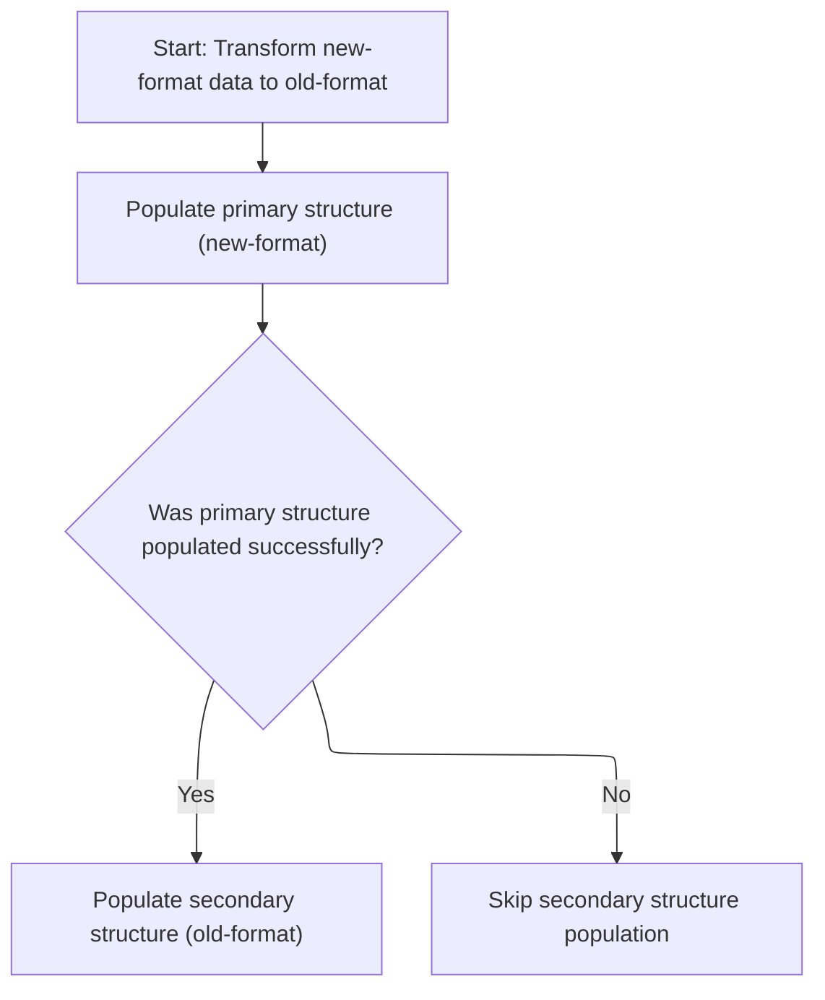

This section governs the transformation of data from a new-format structure to an old-format structure, ensuring compatibility with legacy systems. It determines whether the secondary structure is populated based on the success of the primary mapping.

| Category        | Rule Name                                  | Description                                                                                                                                             |
| --------------- | ------------------------------------------ | ------------------------------------------------------------------------------------------------------------------------------------------------------- |
| Data validation | Primary structure population prerequisite  | The primary structure must be populated using the new-format data before any further processing occurs.                                                 |
| Business logic  | Conditional secondary structure population | If the primary structure population is successful (SUCCESS = 0), the secondary structure (old-format) must be populated to complete the transformation. |

<SwmSnippet path="/base/src/MMMS0160.cbl" line="106">

---

<SwmToken path="base/src/MMMS0160.cbl" pos="106:2:8" line-data="011500 200-NEW-2-OLD.                                                   00011500">`200-NEW-2-OLD`</SwmToken> starts the new-to-old translation by calling <SwmToken path="base/src/MMMS0160.cbl" pos="107:4:8" line-data="011600     PERFORM 210-POPULATE-XXXPST01                                00011600">`210-POPULATE-XXXPST01`</SwmToken>, which does the main field mapping. If that works (SUCCESS), it continues to <SwmToken path="base/src/MMMS0160.cbl" pos="109:4:8" line-data="011800        PERFORM 240-POPULATE-DDDTRL01                             00011800">`240-POPULATE-DDDTRL01`</SwmToken> for more field translations. The flow stops early if the main mapping fails.

```cobol
011500 200-NEW-2-OLD.                                                   00011500
011600     PERFORM 210-POPULATE-XXXPST01                                00011600
011700     IF SUCCESS                                                   00011700
011800        PERFORM 240-POPULATE-DDDTRL01                             00011800
011900     END-IF                                                       00011900
012000     .                                                            00012000
```

---

</SwmSnippet>

# Transferring Store Data to Old Structure

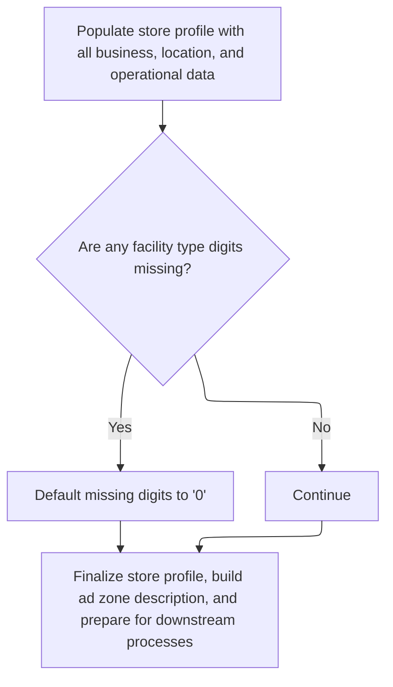

This section ensures that store data from the new format is accurately transferred to the legacy format, applying business rules for field mapping, defaulting missing values, and formatting data to meet downstream system requirements.

<SwmSnippet path="/base/src/MMMS0160.cbl" line="117">

---

In <SwmToken path="base/src/MMMS0160.cbl" pos="117:2:6" line-data="012600 210-POPULATE-XXXPST01.                                           00012600">`210-POPULATE-XXXPST01`</SwmToken> we copy a bunch of fields from the new structure (<SwmToken path="base/src/MMMS0160.cbl" pos="118:12:14" line-data="012700     MOVE LOC-TYP-CD                 OF P-XXXTLR01                00012700">`P-XXXTLR01`</SwmToken>) to the old one (<SwmToken path="base/src/MMMS0160.cbl" pos="117:6:6" line-data="012600 210-POPULATE-XXXPST01.                                           00012600">`XXXPST01`</SwmToken>), following repository-specific mapping rules. The code expects all fields to be present and valid, and it handles some formatting quirks like replacing spaces with '0' in certain fields to keep downstream systems happy.

```cobol
012600 210-POPULATE-XXXPST01.                                           00012600
012700     MOVE LOC-TYP-CD                 OF P-XXXTLR01                00012700
012800       TO ST-STORE-TYPE                                           00012800
012900     MOVE LOC-NBR                    OF P-XXXTLR01                00012900
013000       TO ST-STORE-NUMBER                                         00013000
013100     MOVE ASSOC-STR-NBR              OF P-XXXTLR01                00013100
013200       TO ST-ASSOCIATED-STORE                                     00013200
013300     MOVE COMPANY-ID                 OF P-XXXTLR01                00013300
013400       TO ST-COMPANY-NUMBER                                       00013400
013500     MOVE FINANCIAL-DIV-ID           OF P-XXXTLR01                00013500
013600       TO FN-DIVISION-CD             OF XXXPST01                  00013600
013700     MOVE LIN-OF-BUS-ID              OF P-XXXTLR01                00013700
013800       TO FN-LINE-OF-BUS-CD          OF XXXPST01                  00013800
013900     MOVE DIST-ID                    OF P-XXXTLR01                00013900
014000       TO ST-DISTRICT-CODE                                        00014000
014100     MOVE DIST-ID                    OF P-XXXTLR01                00014100
014200       TO ST-PAYROLL-AREA                                         00014200
014300     MOVE DIST-ID                    OF P-XXXTLR01                00014300
014400       TO ST-PAY-GROUP                                            00014400
014500     MOVE MKT-RGN-ID                 OF P-XXXTLR01                00014500
014600       TO ST-MARKET-AREA                                          00014600
014700     MOVE GEO-ZN-CD                  OF P-XXXTLR01                00014700
014800       TO ST-GEO-ZONE-ALPHA                                       00014800
014900     MOVE RETL-GEO-ZN-ID             OF P-XXXTLR01                00014900
015000       TO ST-GEO-ZONE-NUMERIC                                     00015000
015100     MOVE SCN-MAINT-SW               OF P-XXXTLR01                00015100
015200       TO ST-SCAN-ITEM-MAINTENANCE                                00015200
015300     MOVE FRNT-END-CD                OF P-XXXTLR01                00015300
015400       TO ST-SCAN-FRONT-END-TYPE                                  00015400
015500     MOVE PRC-BUL-SW                 OF P-XXXTLR01                00015500
015600       TO ST-PRICE-BULLETINS                                      00015600
015700     MOVE UPC-ON-PRC-BUL-SW          OF P-XXXTLR01                00015700
015800       TO ST-UPCS-ON-PRICE-BLTNS                                  00015800
015900     MOVE CMPTR-TYP-CD               OF P-XXXTLR01                00015900
016000       TO ST-COMPETITOR-CODE                                      00016000
016100     MOVE RETL-VID-ZN-NBR            OF P-XXXTLR01                00016100
016200       TO ST-VIDEO-PRICE-ZONE                                     00016200
016300     MOVE RETL-UNLD-CD               OF P-XXXTLR01                00016300
016400       TO ST-UNLOAD-FACILITY-FLAG                                 00016400
016500     MOVE NEW-STR-SW                 OF P-XXXTLR01                00016500
016600       TO ST-NEW-STORE-FLAG                                       00016600
016700     MOVE SEL-CIR-SW                 OF P-XXXTLR01                00016700
016800       TO ST-SELECT-CIRCLE-FLAG                                   00016800
016900     MOVE BKRM-SQ-FT                 OF P-XXXTLR01                00016900
017000       TO ST-BACKROOM-SQ-FT                                       00017000
017100     MOVE FD-LINER-FT                OF P-XXXTLR01                00017100
017200       TO ST-LINEAR-FT-FOOD                                       00017200
017300     MOVE NON-FD-LINER-FT            OF P-XXXTLR01                00017300
017400       TO ST-LINEAR-FT-NON-FOOD                                   00017400
017500     MOVE SETOFF-ROOM-SW             OF P-XXXTLR01                00017500
017600       TO ST-SET-OFF-ROOM-FLAG                                    00017600
017700     MOVE CAT-CLS-TBL-TXT            OF P-XXXTLR01                00017700
017800       TO ST-ITEM-CAT-CLASS-DATA                                  00017800
017900     MOVE CK-COLL-REPT-SW            OF P-XXXTLR01                00017900
018000       TO FC-CK-COLL-REPT-SW                                      00018000
018100     MOVE CK-COLL-CNTL-CD            OF P-XXXTLR01                00018100
018200       TO FC-CK-COLL-CNTR-CD                                      00018200
018300     MOVE CK-COLL-ADD-DEL-SW         OF P-XXXTLR01                00018300
018400       TO FC-CK-ADD-DEL-SW                                        00018400
018500     MOVE CK-ALT-STR-ID              OF P-XXXTLR01                00018500
018600       TO FC-CK-ALT-STR-NO                                        00018600
018700     MOVE CK-COLL-FEE-AMT            OF P-XXXTLR01                00018700
018800       TO FC-CK-COLL-FEE-AMT                                      00018800
018900     MOVE SALS-TAX-PCT               OF P-XXXTLR01                00018900
019000       TO SALE-TAX-PCT                                            00019000
019100     MOVE SOAP-SALE-VAR-PCT          OF P-XXXTLR01                00019100
019200       TO SOAP-SALE-VAR-PCT          OF XXXPST01                  00019200
019300     MOVE ON-SRS-CD                  OF P-XXXTLR01                00019300
019400       TO ST-SRS-SYS-CD                                           00019400
019500     MOVE SRS-DSD-ORD-SW             OF P-XXXTLR01                00019500
019600       TO SRS-DSD-ORDR-SW                                         00019600
019700     MOVE RETL-LOC-TYP-CD OF P-XXXTLR01 TO WS-X2                  00019700
```

---

</SwmSnippet>

<SwmSnippet path="/base/src/MMMS0160.cbl" line="189">

---

This just fills in '0' if <SwmToken path="base/src/MMMS0160.cbl" pos="189:4:6" line-data="019800     IF WS-B1 = SPACES                                            00019800">`WS-B1`</SwmToken> is blank, following a formatting rule.

```cobol
019800     IF WS-B1 = SPACES                                            00019800
019900       MOVE '0' TO WS-B1                                          00019900
020000     END-IF                                                       00020000
```

---

</SwmSnippet>

<SwmSnippet path="/base/src/MMMS0160.cbl" line="192">

---

After handling <SwmToken path="base/src/MMMS0160.cbl" pos="189:4:6" line-data="019800     IF WS-B1 = SPACES                                            00019800">`WS-B1`</SwmToken>, the code does the same for <SwmToken path="base/src/MMMS0160.cbl" pos="192:4:6" line-data="020100     IF WS-B2 = SPACES                                            00020100">`WS-B2`</SwmToken>—if it's blank, it gets a '0'. This keeps both bytes non-empty for downstream use.

```cobol
020100     IF WS-B2 = SPACES                                            00020100
020200       MOVE '0' TO WS-B2                                          00020200
020300     END-IF                                                       00020300
```

---

</SwmSnippet>

<SwmSnippet path="/base/src/MMMS0160.cbl" line="196">

---

After mapping the fields, the code builds a zone description by prefixing the zone number with 'ZN '. Then it calls routines for date conversion and rollup code transformation, which handle more complex data changes outside this function.

```cobol
020500     MOVE WS-N2                                                   00020500
020600       TO ST-FACILITY-TYPE                                        00020600
020700     MOVE DEA-NBR                    OF P-XXXTLR01                00020700
020800       TO ST-DEA-NUMBER                                           00020800
020900     MOVE STR-OPSTMT-SRT-CD          OF P-XXXTLR01                00020900
021000       TO ST-SORT-SEQUENCE-SOS                                    00021000
021100     MOVE STR-OPSTMT-TYP-CD          OF P-XXXTLR01                00021100
021200       TO ST-SOS-STORE-TYPE                                       00021200
021300     MOVE STR-OPSTMT-HDR-CD          OF P-XXXTLR01                00021300
021400       TO ST-SOS-HDR-STORE-TYPE                                   00021400
021500     MOVE PD-ZONE-NO                 OF P-XXXTLR01                00021500
021600       TO ST-RETAIL-ZONE                                          00021600
021700     MOVE SOS-PROC-SW                OF P-XXXTLR01                00021700
021800       TO ST-SOS-HDR-DONT-PROCESS-FLAG                            00021800
021900     MOVE RPRT-SEQ-NBR               OF P-XXXTLR01                00021900
022000       TO ST-REPORTING-SEQUENCE-NO                                00022000
022100     MOVE GRP-CD                     OF P-XXXTLR01                00022100
022200       TO ST-FACILITY-GROUP                                       00022200
022300     MOVE SPACES                                                  00022300
022400       TO ST-ADZONE-ABBREV                                        00022400
022500     MOVE CURR-AD-ZN-NBR             OF P-XXXTLR01                00022500
022600       TO WS-CURR-AD-ZN-NBR                                       00022600
022700     MOVE RETL-LOC-STAT-CD             OF P-XXXTLR01              00022700
022800       TO ST-STATUS-FLAG                                          00022800
022900                                                                  00022900
023000     STRING 'ZN '             DELIMITED BY SIZE                   00023000
023100            WS-CURR-AD-ZN-NBR DELIMITED BY SIZE                   00023100
023200            INTO ST-ADZONE-DESC                                   00023200
023300     END-STRING                                                   00023300
023400                                                                  00023400
023500     PERFORM 220-NEW-2-OLD-DATE-CONV                              00023500
023600                                                                  00023600
023700     PERFORM 230-CONVERT-ROLLUP-TXT-OLD                           00023700
```

---

</SwmSnippet>

# Converting Dates from New to Old Format

This section governs the conversion of date values from a new format to an old format, ensuring that the correct conversion direction and format are set before invoking the shared date conversion utility. It also ensures that errors are handled appropriately if the conversion fails.

| Category        | Rule Name                        | Description                                                                                                                                           |
| --------------- | -------------------------------- | ----------------------------------------------------------------------------------------------------------------------------------------------------- |
| Data validation | Conversion Success Indication    | Successful date conversion must be indicated by a return code value of '0'.                                                                           |
| Business logic  | Conversion Direction Enforcement | Date conversion must be performed from the application (new) format to the database (old) format, as indicated by the conversion direction value '2'. |
| Business logic  | Date Format Specification        | The date format for conversion must be set to 'YYMMDD' in packed 7-digit format, as indicated by the format value '6'.                                |

<SwmSnippet path="/base/src/MMMS0160.cbl" line="235">

---

In <SwmToken path="base/src/MMMS0160.cbl" pos="235:2:12" line-data="024400 220-NEW-2-OLD-DATE-CONV.                                         00024400">`220-NEW-2-OLD-DATE-CONV`</SwmToken>, the code sets up the direction and format for the date conversion, then calls <SwmToken path="base/src/MMMS0160.cbl" pos="239:4:10" line-data="024800     PERFORM 900-PERFORM-DATE-CONV                                00024800">`900-PERFORM-DATE-CONV`</SwmToken> to actually do the work. This hands off the details to a shared utility.

```cobol
024400 220-NEW-2-OLD-DATE-CONV.                                         00024400
024500     SET MMMC9012-CONV-FROM-DB2      TO TRUE                      00024500
024600     SET MMMC9012-PIC-P7-YYMMDD      TO TRUE                      00024600
024700                                                                  00024700
024800     PERFORM 900-PERFORM-DATE-CONV                                00024800
```

---

</SwmSnippet>

## Delegating Date Conversion to Utility

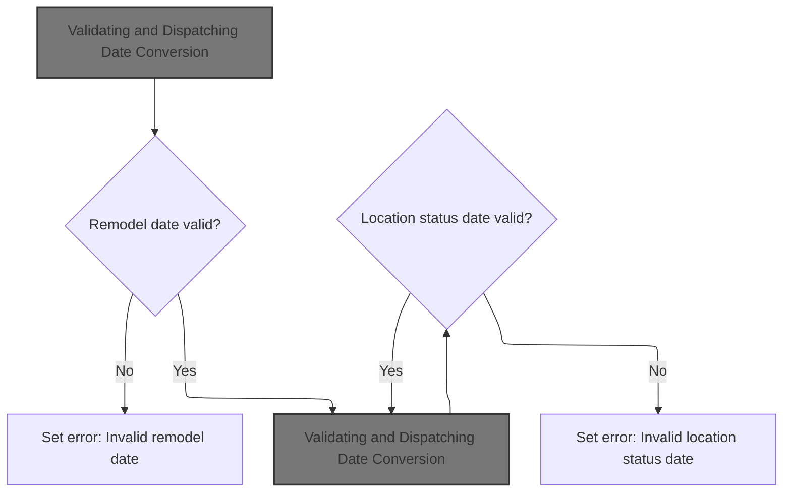

This section is responsible for validating key business dates and delegating their conversion to a shared utility. It ensures only valid dates are processed and provides clear error feedback when conversion fails.

| Category        | Rule Name                       | Description                                                                                                                                                                                        |
| --------------- | ------------------------------- | -------------------------------------------------------------------------------------------------------------------------------------------------------------------------------------------------- |
| Data validation | Remodel Date Validation         | If the remodel date provided is not valid according to business rules, an error message 'Invalid remodel date' must be set and no conversion attempted for that field.                             |
| Data validation | Location Status Date Validation | If the location status date is not valid according to business rules, an error message 'Invalid location status date' must be set and no conversion attempted for that field.                      |
| Business logic  | Delegated Date Conversion       | All valid date fields must be passed to the shared date conversion utility for processing. If the utility returns a failure, an error message must be set indicating which date conversion failed. |

<SwmSnippet path="/base/src/MMMS0160.cbl" line="528">

---

In <SwmToken path="base/src/MMMS0160.cbl" pos="528:2:8" line-data="053700 900-PERFORM-DATE-CONV.                                           00053700">`900-PERFORM-DATE-CONV`</SwmToken>, the code calls the external date conversion utility (<SwmToken path="base/src/MMMS9012.cbl" pos="136:5:5" line-data="014300         MOVE &#39;MMMS9012 - Invalid date conversion function.&#39;      00014300">`MMMS9012`</SwmToken>), passing all the relevant date fields. If the conversion fails, it sets an error message. This offloads the date logic to a shared program.

```cobol
053700 900-PERFORM-DATE-CONV.                                           00053700
053800     CALL  MMMC9012-DATE-CONV USING XXXN001A                      00053800
053900                                    MMMC9012                      00053900
054000                                    ST-REMODEL-DATE               00054000
054100                                    STR-REMODL-DT                 00054100
054200                                                                  00054200
054300     IF NOT SUCCESS                                               00054300
054400       MOVE 'MMMS0160 - Invalid remodel date!'                    00054400
054500         TO IS-RTRN-MSG-TXT                                       00054500
054600     END-IF                                                       00054600
```

---

</SwmSnippet>

### Validating and Dispatching Date Conversion

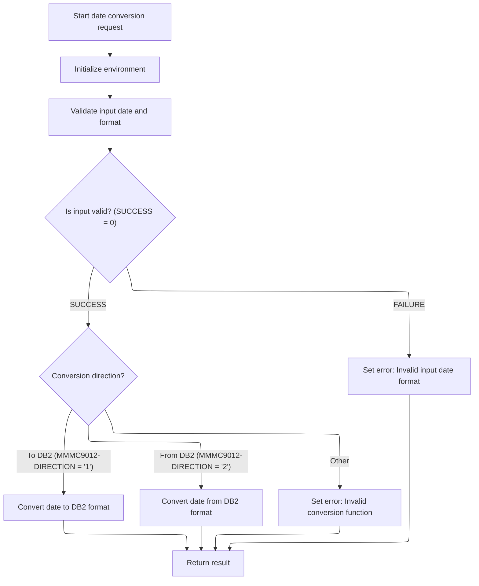

This section governs the validation and dispatching of date conversion requests, ensuring only valid inputs are processed and the correct conversion direction is selected based on user input.

| Category        | Rule Name                                                                                                                                                                         | Description                                                                                                                                                                                                                                                                                         |
| --------------- | --------------------------------------------------------------------------------------------------------------------------------------------------------------------------------- | --------------------------------------------------------------------------------------------------------------------------------------------------------------------------------------------------------------------------------------------------------------------------------------------------- |
| Data validation | Non-Numeric Input Reset                                                                                                                                                           | If the input date fields are not numeric for the selected format, they must be reset to zero before conversion is attempted.                                                                                                                                                                        |
| Business logic  | Convert To <SwmToken path="base/src/MMMS0160.cbl" pos="236:10:10" line-data="024500     SET MMMC9012-CONV-FROM-DB2      TO TRUE                      00024500">`DB2`</SwmToken>   | If the input is valid and the conversion direction is '1', the system must convert the date to <SwmToken path="base/src/MMMS0160.cbl" pos="236:10:10" line-data="024500     SET MMMC9012-CONV-FROM-DB2      TO TRUE                      00024500">`DB2`</SwmToken> format and return the result.   |
| Business logic  | Convert From <SwmToken path="base/src/MMMS0160.cbl" pos="236:10:10" line-data="024500     SET MMMC9012-CONV-FROM-DB2      TO TRUE                      00024500">`DB2`</SwmToken> | If the input is valid and the conversion direction is '2', the system must convert the date from <SwmToken path="base/src/MMMS0160.cbl" pos="236:10:10" line-data="024500     SET MMMC9012-CONV-FROM-DB2      TO TRUE                      00024500">`DB2`</SwmToken> format and return the result. |

<SwmSnippet path="/base/src/MMMS9012.cbl" line="120">

---

<SwmToken path="base/src/MMMS9012.cbl" pos="120:2:4" line-data="012700 000-MAIN.                                                        00012700">`000-MAIN`</SwmToken> in <SwmToken path="base/src/MMMS9012.cbl" pos="136:5:5" line-data="014300         MOVE &#39;MMMS9012 - Invalid date conversion function.&#39;      00014300">`MMMS9012`</SwmToken> runs initialization and input checks, then picks the right conversion routine (to or from <SwmToken path="base/src/MMMS9012.cbl" pos="128:10:10" line-data="013500       WHEN MMMC9012-CONV-TO-DB2                                  00013500">`DB2`</SwmToken>) based on the direction flag. If the input is bad, it just sets an error and skips conversion.

```cobol
012700 000-MAIN.                                                        00012700
012800     PERFORM 100-INITIALIZE                                       00012800
012900     PERFORM 200-CHECK-INPUTS                                     00012900
013000                                                                  00013000
013100     EVALUATE TRUE                                                00013100
013200       WHEN NOT SUCCESS                                           00013200
013300         CONTINUE                                                 00013300
013400                                                                  00013400
013500       WHEN MMMC9012-CONV-TO-DB2                                  00013500
013600         PERFORM 300-CONV-TO-DB2                                  00013600
013700                                                                  00013700
013800       WHEN MMMC9012-CONV-FROM-DB2                                00013800
013900         PERFORM 400-CONV-FROM-DB2                                00013900
014000                                                                  00014000
014100       WHEN OTHER                                                 00014100
014200         SET FAILURE TO TRUE                                      00014200
014300         MOVE 'MMMS9012 - Invalid date conversion function.'      00014300
014400           TO IS-RTRN-MSG-TXT                                     00014400
014500     END-EVALUATE                                                 00014500
014600                                                                  00014600
014700     GOBACK                                                       00014700
014800     .                                                            00014800
```

---

</SwmSnippet>

<SwmSnippet path="/base/src/MMMS9012.cbl" line="147">

---

<SwmToken path="base/src/MMMS9012.cbl" pos="147:2:4" line-data="015400 100-INITIALIZE.                                                  00015400">`100-INITIALIZE`</SwmToken> here is just a label—there's no actual code, so nothing happens. It's a placeholder for potential setup logic.

```cobol
015400 100-INITIALIZE.                                                  00015400
015500     INITIALIZE XXXN001A                                          00015500
015600     .                                                            00015600
```

---

</SwmSnippet>

<SwmSnippet path="/base/src/MMMS9012.cbl" line="155">

---

<SwmToken path="base/src/MMMS9012.cbl" pos="155:2:6" line-data="016200 200-CHECK-INPUTS.                                                00016200">`200-CHECK-INPUTS`</SwmToken> checks if the input date fields are numeric for each supported format. If not, it resets them to zero. This keeps the conversion logic from choking on bad data. If anything fails, it sets an error message.

```cobol
016200 200-CHECK-INPUTS.                                                00016200
016300     EVALUATE TRUE                                                00016300
016400       WHEN MMMC9012-CONV-TO-DB2                                  00016400
016500       AND  MMMC9012-PIC-N8-MMDDYYYY                              00016500
016600         IF WS-DATE-N8 NOT NUMERIC                                00016600
016700           MOVE 0 TO WS-DATE-N8                                   00016700
016800         END-IF                                                   00016800
016900       WHEN MMMC9012-CONV-TO-DB2                                  00016900
017000       AND  MMMC9012-PIC-N8-YYYYMMDD                              00017000
017100         IF WS-DATE-N8 NOT NUMERIC                                00017100
017200           MOVE 0 TO WS-DATE-N8                                   00017200
017300         END-IF                                                   00017300
017400       WHEN MMMC9012-CONV-TO-DB2                                  00017400
017500       AND  MMMC9012-PIC-N6-MMDDYY                                00017500
017600         IF WS-DATE-N6 NOT NUMERIC                                00017600
017700           MOVE 0 TO WS-DATE-N6                                   00017700
017800         END-IF                                                   00017800
017900       WHEN MMMC9012-CONV-TO-DB2                                  00017900
018000       AND  MMMC9012-PIC-N6-YYMMDD                                00018000
018100         IF WS-DATE-N6 NOT NUMERIC                                00018100
018200           MOVE 0 TO WS-DATE-N6                                   00018200
018300         END-IF                                                   00018300
018400       WHEN MMMC9012-CONV-TO-DB2                                  00018400
018500       AND  MMMC9012-PIC-P7-MMDDYY                                00018500
018600         IF WS-DATE-P7 NOT NUMERIC                                00018600
018700           MOVE 0 TO WS-DATE-P7                                   00018700
018800         END-IF                                                   00018800
018900       WHEN MMMC9012-CONV-TO-DB2                                  00018900
019000       AND  MMMC9012-PIC-P7-YYMMDD                                00019000
019100         IF WS-DATE-P7 NOT NUMERIC                                00019100
019200           MOVE 0 TO WS-DATE-P7                                   00019200
019300         END-IF                                                   00019300
019400       WHEN MMMC9012-CONV-TO-DB2                                  00019400
019500       AND  MMMC9012-PIC-X10-YYYYHMMHDD                           00019500
019600           CONTINUE                                               00019600
019700       WHEN MMMC9012-CONV-TO-DB2                                  00019700
019800       AND  MMMC9012-PIC-N7-YYYYJJJ                               00019800
019900       IF  WS-DATE-N7 NOT NUMERIC                                 00019900
020000          MOVE 0  TO WS-DATE-N7                                   00020000
020100       END-IF                                                     00020100
020200     END-EVALUATE                                                 00020200
020300                                                                  00020300
020400     IF NOT SUCCESS                                               00020400
020500       MOVE 'MMMS9012 - Invalid input date format.'               00020500
020600         TO IS-RTRN-MSG-TXT                                       00020600
020700     END-IF                                                       00020700
020800     .                                                            00020800
```

---

</SwmSnippet>

### Converting Dates to <SwmToken path="base/src/MMMS0160.cbl" pos="236:10:10" line-data="024500     SET MMMC9012-CONV-FROM-DB2      TO TRUE                      00024500">`DB2`</SwmToken> Format

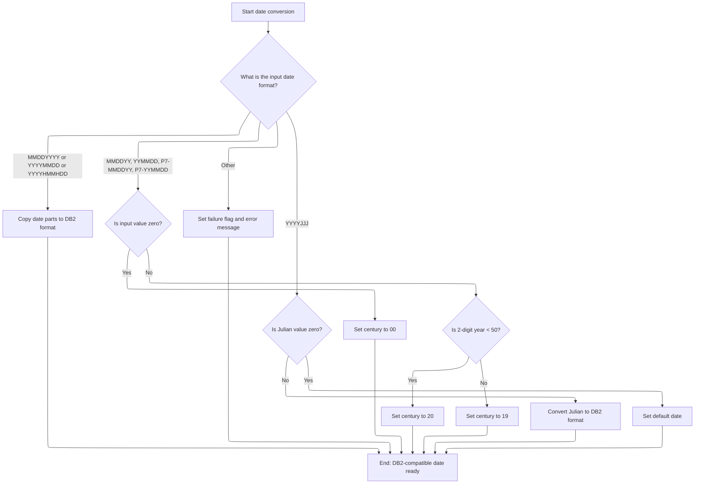

This section standardizes incoming date values into a DB2-compatible format, handling multiple input formats, century logic for two-digit years, Julian date conversion, and error/default handling for invalid or zero values.

| Category       | Rule Name                      | Description                                                                                                                                                                                                                                                                                                                                                                                                                                                |
| -------------- | ------------------------------ | ---------------------------------------------------------------------------------------------------------------------------------------------------------------------------------------------------------------------------------------------------------------------------------------------------------------------------------------------------------------------------------------------------------------------------------------------------------- |
| Business logic | Direct format copy             | If the input date format is MMDDYYYY, YYYYMMDD, or YYYYHMMHDD, the date parts are copied directly to the <SwmToken path="base/src/MMMS0160.cbl" pos="236:10:10" line-data="024500     SET MMMC9012-CONV-FROM-DB2      TO TRUE                      00024500">`DB2`</SwmToken> format without century logic.                                                                                                                                                |
| Business logic | Zero value century             | For two-digit year formats (MMDDYY, YYMMDD, <SwmToken path="base/src/MMMS9012.cbl" pos="178:8:10" line-data="018500       AND  MMMC9012-PIC-P7-MMDDYY                                00018500">`P7-MMDDYY`</SwmToken>, <SwmToken path="base/src/MMMS0160.cbl" pos="237:8:10" line-data="024600     SET MMMC9012-PIC-P7-YYMMDD      TO TRUE                      00024600">`P7-YYMMDD`</SwmToken>), if the input value is zero, the century is set to '00'. |
| Business logic | Century cutoff logic           | For two-digit year formats, if the year is less than 50, the century is set to '20'; otherwise, it is set to '19'.                                                                                                                                                                                                                                                                                                                                         |
| Business logic | Julian zero default            | If the input format is YYYYJJJ (Julian), and the value is zero, the default date '01/01/1600' is used.                                                                                                                                                                                                                                                                                                                                                     |
| Business logic | Date separator standardization | All output DB2-compatible dates must use '/' as the separator between date parts.                                                                                                                                                                                                                                                                                                                                                                          |

<SwmSnippet path="/base/src/MMMS9012.cbl" line="207">

---

<SwmToken path="base/src/MMMS9012.cbl" pos="207:2:8" line-data="021400 300-CONV-TO-DB2.                                                 00021400">`300-CONV-TO-DB2`</SwmToken> branches on the date format code, moves the input to the right working variable, and assembles the <SwmToken path="base/src/MMMS9012.cbl" pos="207:8:8" line-data="021400 300-CONV-TO-DB2.                                                 00021400">`DB2`</SwmToken> date. For two-digit years, it uses a cutoff (like <50) to pick the century. Julian dates are handled by a separate subroutine. If the input is zero or invalid, it sets a default date or error.

```cobol
021400 300-CONV-TO-DB2.                                                 00021400
021500     EVALUATE TRUE                                                00021500
021600       WHEN MMMC9012-PIC-N8-MMDDYYYY                              00021600
021700         MOVE WS-DATE-N8       TO WS-MMDDYYYY                     00021700
021800         MOVE WS-MMDDYYYY-MM   TO WS-MM-DD-YYYY-MM                00021800
021900         MOVE WS-MMDDYYYY-DD   TO WS-MM-DD-YYYY-DD                00021900
022000         MOVE WS-MMDDYYYY-YYYY TO WS-MM-DD-YYYY-YYYY              00022000
022100       WHEN MMMC9012-PIC-N8-YYYYMMDD                              00022100
022200         MOVE WS-DATE-N8       TO WS-YYYYMMDD                     00022200
022300         MOVE WS-YYYYMMDD-MM   TO WS-MM-DD-YYYY-MM                00022300
022400         MOVE WS-YYYYMMDD-DD   TO WS-MM-DD-YYYY-DD                00022400
022500         MOVE WS-YYYYMMDD-YYYY TO WS-MM-DD-YYYY-YYYY              00022500
022600       WHEN MMMC9012-PIC-N6-MMDDYY                                00022600
022700         MOVE WS-DATE-N6       TO WS-MMDDYY                       00022700
022800         MOVE WS-MMDDYY-MM     TO WS-MM-DD-YYYY-MM                00022800
022900         MOVE WS-MMDDYY-DD     TO WS-MM-DD-YYYY-DD                00022900
023000         MOVE WS-MMDDYY-YY     TO WS-MM-DD-YYYY-YY                00023000
023100         IF WS-MMDDYY = 0                                         00023100
023200             MOVE 00 TO WS-MM-DD-YYYY-CC                          00023200
023300         ELSE                                                     00023300
023400*            IF WS-MMDDYY-YY < 20                                 00023400
023410             IF WS-MMDDYY-YY < 50                                 00023410
023500               MOVE 20 TO WS-MM-DD-YYYY-CC                        00023500
023600             ELSE                                                 00023600
023700               MOVE 19 TO WS-MM-DD-YYYY-CC                        00023700
023800             END-IF                                               00023800
023900         END-IF                                                   00023900
024000       WHEN MMMC9012-PIC-N6-YYMMDD                                00024000
024100         MOVE WS-DATE-N6       TO WS-YYMMDD                       00024100
024200         MOVE WS-YYMMDD-MM     TO WS-MM-DD-YYYY-MM                00024200
024300         MOVE WS-YYMMDD-DD     TO WS-MM-DD-YYYY-DD                00024300
024400         MOVE WS-YYMMDD-YY     TO WS-MM-DD-YYYY-YY                00024400
024500         IF WS-YYMMDD = 0                                         00024500
024600            MOVE 00 TO WS-MM-DD-YYYY-CC                           00024600
024700         ELSE                                                     00024700
024800*            IF WS-YYMMDD-YY < 20                                 00024800
024810             IF WS-YYMMDD-YY < 50                                 00024810
024900               MOVE 20 TO WS-MM-DD-YYYY-CC                        00024900
025000             ELSE                                                 00025000
025100               MOVE 19 TO WS-MM-DD-YYYY-CC                        00025100
025200             END-IF                                               00025200
025300         END-IF                                                   00025300
025400       WHEN MMMC9012-PIC-P7-MMDDYY                                00025400
025500         MOVE WS-DATE-P7       TO WS-MMDDYY                       00025500
025600         MOVE WS-MMDDYY-MM     TO WS-MM-DD-YYYY-MM                00025600
025700         MOVE WS-MMDDYY-DD     TO WS-MM-DD-YYYY-DD                00025700
025800         MOVE WS-MMDDYY-YY     TO WS-MM-DD-YYYY-YY                00025800
025900         IF WS-MMDDYY = 0                                         00025900
026000             MOVE 00 TO WS-MM-DD-YYYY-CC                          00026000
026100         ELSE                                                     00026100
026200*            IF WS-MMDDYY-YY < 40                                 00026200
026210             IF WS-MMDDYY-YY < 50                                 00026210
026300               MOVE 20 TO WS-MM-DD-YYYY-CC                        00026300
026400             ELSE                                                 00026400
026500               MOVE 19 TO WS-MM-DD-YYYY-CC                        00026500
026600             END-IF                                               00026600
026700         END-IF                                                   00026700
026800       WHEN MMMC9012-PIC-P7-YYMMDD                                00026800
026900         MOVE WS-DATE-P7       TO WS-YYMMDD                       00026900
027000         MOVE WS-YYMMDD-MM     TO WS-MM-DD-YYYY-MM                00027000
027100         MOVE WS-YYMMDD-DD     TO WS-MM-DD-YYYY-DD                00027100
027200         MOVE WS-YYMMDD-YY     TO WS-MM-DD-YYYY-YY                00027200
027300         IF WS-YYMMDD = 0                                         00027300
027400            MOVE 00 TO WS-MM-DD-YYYY-CC                           00027400
027500         ELSE                                                     00027500
027600*            IF WS-YYMMDD-YY < 20                                 00027600
027610             IF WS-YYMMDD-YY < 50                                 00027610
027700               MOVE 20 TO WS-MM-DD-YYYY-CC                        00027700
027800             ELSE                                                 00027800
027900               MOVE 19 TO WS-MM-DD-YYYY-CC                        00027900
028000             END-IF                                               00028000
028100         END-IF                                                   00028100
028200       WHEN MMMC9012-PIC-X10-YYYYHMMHDD                           00028200
028300         MOVE WS-DATE                TO   WS-YYYYHMMHDD           00028300
028400         MOVE WS-YYYYHMMHDD-MM       TO   WS-MM-DD-YYYY-MM        00028400
028500         MOVE WS-YYYYHMMHDD-DD       TO   WS-MM-DD-YYYY-DD        00028500
028600         MOVE WS-YYYYHMMHDD-YYYY     TO   WS-MM-DD-YYYY-YYYY      00028600
028700       WHEN MMMC9012-PIC-N7-YYYYJJJ                               00028700
028800         IF WS-DATE-N7 NOT EQUAL ZERO                             00028800
028900            MOVE WS-DATE-N7           TO WS-YYYYJJJ               00028900
029000            PERFORM 900-JULIAN-TO-DB2-CONV                        00029000
029100         ELSE                                                     00029100
029200            MOVE K-DEF-DT             TO WS-MM-DD-YYYY            00029200
029300         END-IF                                                   00029300
029400       WHEN OTHER                                                 00029400
029500         SET FAILURE TO TRUE                                      00029500
029600         MOVE 'MMMS9012 - Invalid date conversion type.'          00029600
029700           TO IS-RTRN-MSG-TXT                                     00029700
029800     END-EVALUATE                                                 00029800
029900                                                                  00029900
030000     MOVE '/' TO  WS-MM-DD-YYYY-S1                                00030000
030100     MOVE '/' TO  WS-MM-DD-YYYY-S2                                00030100
030200     .                                                            00030200
```

---

</SwmSnippet>

<SwmSnippet path="/base/src/MMMS9012.cbl" line="361">

---

<SwmToken path="base/src/MMMS9012.cbl" pos="361:2:10" line-data="036400 900-JULIAN-TO-DB2-CONV.                                          00036400">`900-JULIAN-TO-DB2-CONV`</SwmToken> converts Julian dates to standard format. It handles January and February directly, then uses arrays and a leap year check for other months. If it's a leap year and the day is 60, it bumps the day by one.

```cobol
036400 900-JULIAN-TO-DB2-CONV.                                          00036400
036500     INITIALIZE WS-TEMP WS-MM-DD-YYYY WS-CNTR                     00036500
036600                                                                  00036600
036700     IF WS-YYYYJJJ-JJJ IS >= 1 AND WS-YYYYJJJ-JJJ  <= 31          00036700
036800        MOVE WS-YYYYJJJ-JJJ           TO WS-MM-DD-YYYY-DD         00036800
036900        MOVE 1                        TO WS-MM-DD-YYYY-MM         00036900
037000        MOVE WS-YYYYJJJ-YYYY          TO WS-MM-DD-YYYY-YYYY       00037000
037100     ELSE IF                                                      00037100
037200            WS-YYYYJJJ-JJJ IS >= 32 AND WS-YYYYJJJ-JJJ  <= 59     00037200
037300            SUBTRACT 31 FROM WS-YYYYJJJ-JJJ                       00037300
037400                        GIVING WS-MM-DD-YYYY-DD                   00037400
037500            MOVE 2                    TO WS-MM-DD-YYYY-MM         00037500
037600            MOVE WS-YYYYJJJ-YYYY      TO WS-MM-DD-YYYY-YYYY       00037600
037700     ELSE                                                         00037700
037800       PERFORM 990-LEAP-YEAR-FIND                                 00037800
037900       IF WS-ORDY-YEAR                                            00037900
038000          PERFORM VARYING WS-CNTR FROM +1 BY +1 UNTIL WS-CNTR > 1200038000
038100           IF WS-YYYYJJJ-JJJ IS >= WS-JUL-MNTH-STRT(WS-CNTR)      00038100
038200              AND WS-YYYYJJJ-JJJ IS <= WS-JUL-MNTH-END (WS-CNTR)  00038200
038300              MOVE WS-JUL-MNTH-NUM(WS-CNTR)                       00038300
038400                                      TO WS-MM-DD-YYYY-MM         00038400
038500              SUBTRACT WS-JUL-MNTH-STRT(WS-CNTR)                  00038500
038600                                  FROM WS-YYYYJJJ-JJJ             00038600
038700                                  GIVING WS-TEMP                  00038700
038800              ADD 1                   TO WS-TEMP                  00038800
038900              MOVE WS-TEMP            TO WS-MM-DD-YYYY-DD         00038900
039000              MOVE WS-YYYYJJJ-YYYY    TO WS-MM-DD-YYYY-YYYY       00039000
039100              MOVE 13                 TO WS-CNTR                  00039100
039200           END-IF                                                 00039200
039300          END-PERFORM                                             00039300
039400       ELSE                                                       00039400
039500          PERFORM VARYING WS-CNTR FROM +1 BY +1 UNTIL WS-CNTR > 1200039500
039600           IF WS-YYYYJJJ-JJJ IS >= WS-JUL-MNTH-STRT(WS-CNTR) + 1  00039600
039700           AND WS-YYYYJJJ-JJJ IS <= WS-JUL-MNTH-END (WS-CNTR) + 1 00039700
039800              MOVE WS-JUL-MNTH-NUM(WS-CNTR)                       00039800
039900                                      TO WS-MM-DD-YYYY-MM         00039900
040000              SUBTRACT WS-JUL-MNTH-STRT(WS-CNTR)                  00040000
040100                                  FROM WS-YYYYJJJ-JJJ             00040100
040200                                  GIVING WS-TEMP                  00040200
040300*             ADD 1                   TO WS-TEMP                  00040300
040400              MOVE WS-TEMP            TO WS-MM-DD-YYYY-DD         00040400
040500              MOVE WS-YYYYJJJ-YYYY    TO WS-MM-DD-YYYY-YYYY       00040500
040600              MOVE 13                 TO WS-CNTR                  00040600
040700           END-IF                                                 00040700
040800          END-PERFORM                                             00040800
040900* MFR Deals and Cost leap year conversion change start            00040900
041000         IF WS-LEAP-YEAR AND WS-YYYYJJJ-JJJ = 60                  00041000
041100           ADD 1         TO WS-MM-DD-YYYY-DD                      00041100
041200         END-IF                                                   00041200
041300* MFR Deals and Cost leap year conversion change end              00041300
041400       END-IF                                                     00041400
041500     END-IF                                                       00041500
041600     .                                                            00041600
```

---

</SwmSnippet>

### Converting Dates from <SwmToken path="base/src/MMMS0160.cbl" pos="236:10:10" line-data="024500     SET MMMC9012-CONV-FROM-DB2      TO TRUE                      00024500">`DB2`</SwmToken> to Business Formats

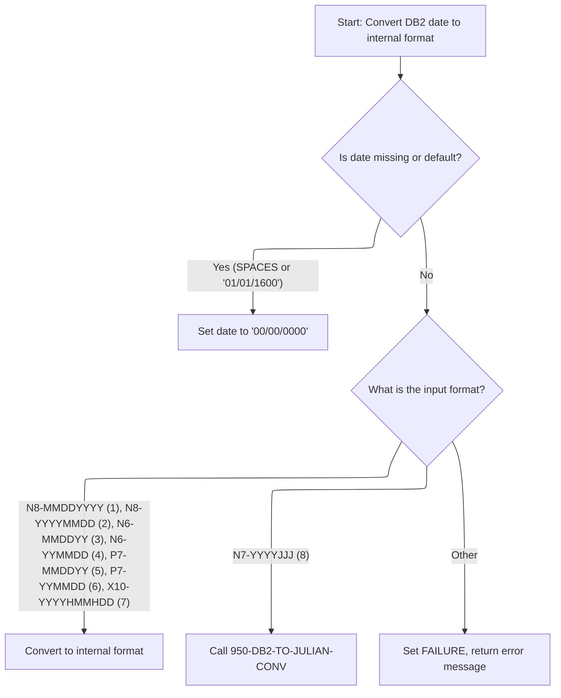

This section is responsible for converting dates retrieved from <SwmToken path="base/src/MMMS0160.cbl" pos="236:10:10" line-data="024500     SET MMMC9012-CONV-FROM-DB2      TO TRUE                      00024500">`DB2`</SwmToken> into standardized internal business formats for downstream business processing. It ensures that dates are correctly interpreted, handles missing or default values, and provides error feedback for unsupported formats.

| Category        | Rule Name                        | Description                                                                                                                                                                                                                                                                                                                                                                                                                                                                                                                                                                                                                                                                                                                                                                                                                                                                                                                                                                                                                                                                                                                                                                                                                                                                                                                                                                                                                                                                                                                                                 |
| --------------- | -------------------------------- | ----------------------------------------------------------------------------------------------------------------------------------------------------------------------------------------------------------------------------------------------------------------------------------------------------------------------------------------------------------------------------------------------------------------------------------------------------------------------------------------------------------------------------------------------------------------------------------------------------------------------------------------------------------------------------------------------------------------------------------------------------------------------------------------------------------------------------------------------------------------------------------------------------------------------------------------------------------------------------------------------------------------------------------------------------------------------------------------------------------------------------------------------------------------------------------------------------------------------------------------------------------------------------------------------------------------------------------------------------------------------------------------------------------------------------------------------------------------------------------------------------------------------------------------------------------- |
| Data validation | Supported Date Formats           | The conversion process must support the following input format codes: '1' (<SwmToken path="base/src/MMMS9012.cbl" pos="158:8:10" line-data="016500       AND  MMMC9012-PIC-N8-MMDDYYYY                              00016500">`N8-MMDDYYYY`</SwmToken>), '2' (<SwmToken path="base/src/MMMS9012.cbl" pos="163:8:10" line-data="017000       AND  MMMC9012-PIC-N8-YYYYMMDD                              00017000">`N8-YYYYMMDD`</SwmToken>), '3' (<SwmToken path="base/src/MMMS9012.cbl" pos="168:8:10" line-data="017500       AND  MMMC9012-PIC-N6-MMDDYY                                00017500">`N6-MMDDYY`</SwmToken>), '4' (<SwmToken path="base/src/MMMS9012.cbl" pos="173:8:10" line-data="018000       AND  MMMC9012-PIC-N6-YYMMDD                                00018000">`N6-YYMMDD`</SwmToken>), '5' (<SwmToken path="base/src/MMMS9012.cbl" pos="178:8:10" line-data="018500       AND  MMMC9012-PIC-P7-MMDDYY                                00018500">`P7-MMDDYY`</SwmToken>), '6' (<SwmToken path="base/src/MMMS0160.cbl" pos="237:8:10" line-data="024600     SET MMMC9012-PIC-P7-YYMMDD      TO TRUE                      00024600">`P7-YYMMDD`</SwmToken>), '7' (<SwmToken path="base/src/MMMS9012.cbl" pos="188:8:10" line-data="019500       AND  MMMC9012-PIC-X10-YYYYHMMHDD                           00019500">`X10-YYYYHMMHDD`</SwmToken>), and '8' (<SwmToken path="base/src/MMMS9012.cbl" pos="191:8:10" line-data="019800       AND  MMMC9012-PIC-N7-YYYYJJJ                               00019800">`N7-YYYYJJJ`</SwmToken>). |
| Business logic  | Missing or Default Date Handling | If the input date is blank (SPACES) or equal to the default date ('01/01/1600'), the output date must be set to '00/00/0000'.                                                                                                                                                                                                                                                                                                                                                                                                                                                                                                                                                                                                                                                                                                                                                                                                                                                                                                                                                                                                                                                                                                                                                                                                                                                                                                                                                                                                                               |
| Business logic  | Julian Date Conversion           | If the input format code is '8' (<SwmToken path="base/src/MMMS9012.cbl" pos="191:8:10" line-data="019800       AND  MMMC9012-PIC-N7-YYYYJJJ                               00019800">`N7-YYYYJJJ`</SwmToken>), the date must be converted to Julian format using a specialized conversion process that accounts for leap years and month-day calculations.                                                                                                                                                                                                                                                                                                                                                                                                                                                                                                                                                                                                                                                                                                                                                                                                                                                                                                                                                                                                                                                                                                                                                                                                   |
| Business logic  | Standardized Output Format       | All successfully converted dates must be output in the standardized internal format required by downstream business processes.                                                                                                                                                                                                                                                                                                                                                                                                                                                                                                                                                                                                                                                                                                                                                                                                                                                                                                                                                                                                                                                                                                                                                                                                                                                                                                                                                                                                                              |

<SwmSnippet path="/base/src/MMMS9012.cbl" line="305">

---

<SwmToken path="base/src/MMMS9012.cbl" pos="305:2:8" line-data="030800 400-CONV-FROM-DB2.                                               00030800">`400-CONV-FROM-DB2`</SwmToken> checks for blank or default dates and sets them to zero. Then it branches on the output format code, assembles the output date, and calls a helper for Julian conversion if needed. If the format code is unknown, it errors out.

```cobol
030800 400-CONV-FROM-DB2.                                               00030800
030900     EVALUATE TRUE                                                00030900
031000       WHEN WS-MM-DD-YYYY = SPACES                                00031000
031100        MOVE K-ZERO-DT TO WS-MM-DD-YYYY                           00031100
031200       WHEN WS-MM-DD-YYYY = K-DEF-DT                              00031200
031300        MOVE K-ZERO-DT TO WS-MM-DD-YYYY                           00031300
031400     END-EVALUATE                                                 00031400
031500                                                                  00031500
031600     EVALUATE TRUE                                                00031600
031700       WHEN MMMC9012-PIC-N8-MMDDYYYY                              00031700
031800         MOVE WS-MM-DD-YYYY-MM   TO WS-MMDDYYYY-MM                00031800
031900         MOVE WS-MM-DD-YYYY-DD   TO WS-MMDDYYYY-DD                00031900
032000         MOVE WS-MM-DD-YYYY-YYYY TO WS-MMDDYYYY-YYYY              00032000
032100         MOVE WS-MMDDYYYY        TO WS-DATE-N8                    00032100
032200       WHEN MMMC9012-PIC-N8-YYYYMMDD                              00032200
032300         MOVE WS-MM-DD-YYYY-MM   TO WS-YYYYMMDD-MM                00032300
032400         MOVE WS-MM-DD-YYYY-DD   TO WS-YYYYMMDD-DD                00032400
032500         MOVE WS-MM-DD-YYYY-YYYY TO WS-YYYYMMDD-YYYY              00032500
032600         MOVE WS-YYYYMMDD        TO WS-DATE-N8                    00032600
032700       WHEN MMMC9012-PIC-N6-MMDDYY                                00032700
032800         MOVE WS-MM-DD-YYYY-MM   TO WS-MMDDYY-MM                  00032800
032900         MOVE WS-MM-DD-YYYY-DD   TO WS-MMDDYY-DD                  00032900
033000         MOVE WS-MM-DD-YYYY-YY   TO WS-MMDDYY-YY                  00033000
033100         MOVE WS-MMDDYY          TO WS-DATE-N6                    00033100
033200       WHEN MMMC9012-PIC-N6-YYMMDD                                00033200
033300         MOVE WS-MM-DD-YYYY-MM   TO WS-YYMMDD-MM                  00033300
033400         MOVE WS-MM-DD-YYYY-DD   TO WS-YYMMDD-DD                  00033400
033500         MOVE WS-MM-DD-YYYY-YY   TO WS-YYMMDD-YY                  00033500
033600         MOVE WS-YYMMDD          TO WS-DATE-N6                    00033600
033700       WHEN MMMC9012-PIC-P7-MMDDYY                                00033700
033800         MOVE WS-MM-DD-YYYY-MM   TO WS-MMDDYY-MM                  00033800
033900         MOVE WS-MM-DD-YYYY-DD   TO WS-MMDDYY-DD                  00033900
034000         MOVE WS-MM-DD-YYYY-YY   TO WS-MMDDYY-YY                  00034000
034100         MOVE WS-MMDDYY          TO WS-DATE-P7                    00034100
034200       WHEN MMMC9012-PIC-P7-YYMMDD                                00034200
034300         MOVE WS-MM-DD-YYYY-MM   TO WS-YYMMDD-MM                  00034300
034400         MOVE WS-MM-DD-YYYY-DD   TO WS-YYMMDD-DD                  00034400
034500         MOVE WS-MM-DD-YYYY-YY   TO WS-YYMMDD-YY                  00034500
034600         MOVE WS-YYMMDD          TO WS-DATE-P7                    00034600
034700       WHEN MMMC9012-PIC-X10-YYYYHMMHDD                           00034700
034800         MOVE WS-MM-DD-YYYY-MM   TO WS-YYYYHMMHDD-MM              00034800
034900         MOVE WS-MM-DD-YYYY-DD   TO WS-YYYYHMMHDD-DD              00034900
035000         MOVE WS-MM-DD-YYYY-YYYY TO WS-YYYYHMMHDD-YYYY            00035000
035100         MOVE '-'                TO WS-YYYYHMMHDD-H1              00035100
035200         MOVE '-'                TO WS-YYYYHMMHDD-H2              00035200
035300         MOVE WS-YYYYHMMHDD    TO WS-DATE                         00035300
035400       WHEN MMMC9012-PIC-N7-YYYYJJJ                               00035400
035500         PERFORM 950-DB2-TO-JULIAN-CONV                           00035500
035600       WHEN OTHER                                                 00035600
035700         SET FAILURE TO TRUE                                      00035700
035800         MOVE 'MMMS9012 - Invalid date conversion type.'          00035800
035900           TO IS-RTRN-MSG-TXT                                     00035900
036000     END-EVALUATE                                                 00036000
036100     .                                                            00036100
```

---

</SwmSnippet>

<SwmSnippet path="/base/src/MMMS9012.cbl" line="416">

---

<SwmToken path="base/src/MMMS9012.cbl" pos="416:2:10" line-data="041900 950-DB2-TO-JULIAN-CONV.                                          00041900">`950-DB2-TO-JULIAN-CONV`</SwmToken> converts <SwmToken path="base/src/MMMS9012.cbl" pos="419:6:10" line-data="042200     MOVE WS-MM-DD-YYYY-YYYY          TO WS-YYYYJJJ-YYYY          00042200">`MM-DD-YYYY`</SwmToken> to YYYYJJJ. Jan/Feb are handled directly, other months use arrays to sum days, and leap years get a special adjustment.

```cobol
041900 950-DB2-TO-JULIAN-CONV.                                          00041900
042000     INITIALIZE WS-TEMP WS-YYYYJJJ WS-CNTR                        00042000
042100                                                                  00042100
042200     MOVE WS-MM-DD-YYYY-YYYY          TO WS-YYYYJJJ-YYYY          00042200
042300                                                                  00042300
042400     IF WS-MM-DD-YYYY-MM = 1                                      00042400
042500        MOVE WS-MM-DD-YYYY-DD         TO WS-YYYYJJJ-JJJ           00042500
042600     ELSE IF                                                      00042600
042700            WS-MM-DD-YYYY-MM = 2                                  00042700
042800            ADD 31 TO WS-MM-DD-YYYY-DD                            00042800
042900                        GIVING WS-YYYYJJJ-JJJ                     00042900
043000     ELSE                                                         00043000
043100       PERFORM 990-LEAP-YEAR-FIND                                 00043100
043200       PERFORM VARYING WS-CNTR FROM +3 BY +1 UNTIL WS-CNTR > 12   00043200
043300         IF WS-MM-DD-YYYY-MM = WS-JUL-MNTH-NUM(WS-CNTR)           00043300
043400            ADD WS-JUL-MNTH-STRT(WS-CNTR)                         00043400
043500                                      TO WS-MM-DD-YYYY-DD         00043500
043600                                  GIVING WS-YYYYJJJ-JJJ           00043600
043700            IF WS-ORDY-YEAR                                       00043700
043800              SUBTRACT 1 FROM WS-YYYYJJJ-JJJ                      00043800
043900                                  GIVING WS-YYYYJJJ-JJJ           00043900
044000            END-IF                                                00044000
044100            MOVE 13                   TO WS-CNTR                  00044100
044200         END-IF                                                   00044200
044300       END-PERFORM                                                00044300
044400       END-IF                                                     00044400
044500     END-IF                                                       00044500
044600*MFR - deals and cost                                             00044600
044700*/Added below line to move working str to linkage section variable00044700
044800     MOVE WS-YYYYJJJ TO WS-DATE                                   00044800
044900*MFR - deals and cost                                             00044900
045000                                                                  00045000
045100     .                                                            00045100
```

---

</SwmSnippet>

### Handling Results from Date Conversion Utility

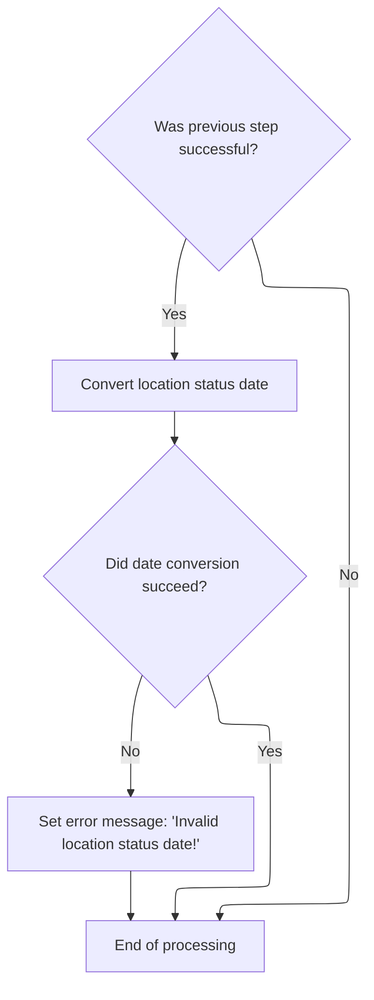

<SwmSnippet path="/base/src/MMMS0160.cbl" line="539">

---

After returning from <SwmToken path="base/src/MMMS9012.cbl" pos="136:5:5" line-data="014300         MOVE &#39;MMMS9012 - Invalid date conversion function.&#39;      00014300">`MMMS9012`</SwmToken> in <SwmToken path="base/src/MMMS0160.cbl" pos="239:4:10" line-data="024800     PERFORM 900-PERFORM-DATE-CONV                                00024800">`900-PERFORM-DATE-CONV`</SwmToken>, the code checks if the first conversion worked. If so, it calls the utility again for another date field. If that fails, it sets a different error message. This way, each date field gets its own error handling.

```cobol
054800     IF SUCCESS                                                   00054800
054900       CALL MMMC9012-DATE-CONV USING XXXN001A                     00054900
055000                                     MMMC9012                     00055000
055100                                     WS-DUMMY-DATE                00055100
055200                                     RETL-LOC-STAT-DT             00055200
055300                                                                  00055300
055400       IF NOT SUCCESS                                             00055400
055500         MOVE 'MMMS0160 - Invalid location status date!'          00055500
055600          TO IS-RTRN-MSG-TXT                                      00055600
055700       END-IF                                                     00055700
055800     END-IF                                                       00055800
```

---

</SwmSnippet>

## Post-Conversion Error Handling

<SwmSnippet path="/base/src/MMMS0160.cbl" line="241">

---

After coming back from <SwmToken path="base/src/MMMS0160.cbl" pos="239:4:10" line-data="024800     PERFORM 900-PERFORM-DATE-CONV                                00024800">`900-PERFORM-DATE-CONV`</SwmToken> in <SwmToken path="base/src/MMMS0160.cbl" pos="226:4:14" line-data="023500     PERFORM 220-NEW-2-OLD-DATE-CONV                              00023500">`220-NEW-2-OLD-DATE-CONV`</SwmToken>, if there was an error, the code appends ' <SwmToken path="base/src/MMMS0160.cbl" pos="242:15:15" line-data="025100        STRING IS-RTRN-MSG-TXT, &#39; N2O&#39; DELIMITED BY &#39;-&#39;           00025100">`N2O`</SwmToken>' to the error message so you know where the failure happened.

```cobol
025000     IF NOT SUCCESS                                               00025000
025100        STRING IS-RTRN-MSG-TXT, ' N2O' DELIMITED BY '-'           00025100
025200           INTO IS-RTRN-MSG-TXT                                   00025200
025300        END-STRING                                                00025300
025400     END-IF                                                       00025400
```

---

</SwmSnippet>

# Mapping Store Location and Business Info

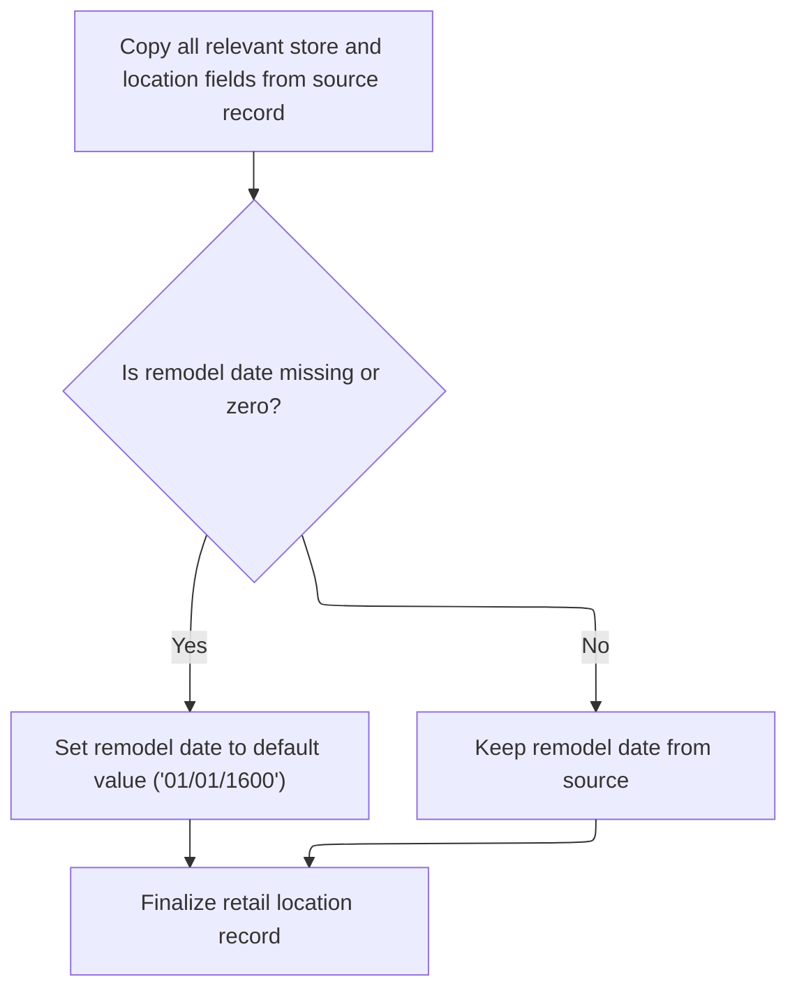

This section is responsible for mapping all relevant store and location fields from a source record to a retail location record, ensuring that required fields are populated and formatted according to business rules.

| Category        | Rule Name                           | Description                                                                                                                                    |
| --------------- | ----------------------------------- | ---------------------------------------------------------------------------------------------------------------------------------------------- |
| Data validation | Default Remodel Date                | If the remodel date is missing, blank, or set to zero ('00/00/0000'), it must be replaced with the default value '01/01/1600'.                 |
| Business logic  | Advertising Zone Description Format | The advertising zone description must be formatted as 'ZN ' followed by the zone number, ensuring a standardized output for zone descriptions. |

<SwmSnippet path="/base/src/MMMS0160.cbl" line="271">

---

In <SwmToken path="base/src/MMMS0160.cbl" pos="271:2:6" line-data="028000 240-POPULATE-DDDTRL01.                                           00028000">`240-POPULATE-DDDTRL01`</SwmToken>, the code copies fields from the new structure to the old one, field by field. It assumes all the data is there and valid—if not, things could go sideways, but there's no check for that.

```cobol
028000 240-POPULATE-DDDTRL01.                                           00028000
028100     MOVE LOC-TYP-CD                 OF P-XXXTLR01                00028100
028200       TO FC-RL-STORE-CD                                          00028200
028300     MOVE LOC-NBR                    OF P-XXXTLR01                00028300
028400       TO FC-STORE-NO                                             00028400
028500     MOVE ASSOC-STR-NBR              OF P-XXXTLR01                00028500
028600       TO FC-RL-ASSOC-STR-NO                                      00028600
028700     MOVE COMPANY-ID                 OF P-XXXTLR01                00028700
028800       TO FC-RL-COMPANY-NO                                        00028800
028900     MOVE FINANCIAL-DIV-ID           OF P-XXXTLR01                00028900
029000       TO FN-DIVISION-CD             OF P-DDDTRL01                00029000
029100     MOVE LIN-OF-BUS-ID              OF P-XXXTLR01                00029100
029200       TO FN-LINE-OF-BUS-CD          OF P-DDDTRL01                00029200
029300     MOVE DIST-ID                    OF P-XXXTLR01                00029300
029400       TO FC-RL-DISTRICT-NO                                       00029400
029500     MOVE DIST-ID                    OF P-XXXTLR01                00029500
029600       TO FC-RL-PAYROL-AR-NO                                      00029600
029700     MOVE DIST-ID                    OF P-XXXTLR01                00029700
029800       TO FC-RL-PAY-GROUP-NO                                      00029800
029900     MOVE MKT-RGN-ID                 OF P-XXXTLR01                00029900
030000       TO FC-RL-MARKET-AR-NO                                      00030000
030100     MOVE GEO-ZN-CD                  OF P-XXXTLR01                00030100
030200       TO FC-RL-GEO-ZONE-CD                                       00030200
030300     MOVE RETL-GEO-ZN-ID             OF P-XXXTLR01                00030300
030400       TO FC-RL-GEO-ZONE-NO                                       00030400
030500     MOVE SCN-MAINT-SW               OF P-XXXTLR01                00030500
030600       TO FC-RL-SCAN-MAIN-CD                                      00030600
030700     MOVE FRNT-END-CD                OF P-XXXTLR01                00030700
030800       TO FC-RL-FRONT-END-CD                                      00030800
030900     MOVE PRC-BUL-SW                 OF P-XXXTLR01                00030900
031000       TO FC-RL-PRICE-BUL-CD                                      00031000
031100     MOVE UPC-ON-PRC-BUL-SW          OF P-XXXTLR01                00031100
031200       TO FC-RL-UPC-ON-PB-CD                                      00031200
031300     MOVE CMPTR-TYP-CD               OF P-XXXTLR01                00031300
031400       TO FC-RL-COMPETITR-CD                                      00031400
031500     MOVE RETL-VID-ZN-NBR            OF P-XXXTLR01                00031500
031600       TO FC-RL-VID-PRZN-NO                                       00031600
031700     MOVE RETL-UNLD-CD               OF P-XXXTLR01                00031700
031800       TO FC-RL-UNLOAD-SW                                         00031800
031900     MOVE NEW-STR-SW                 OF P-XXXTLR01                00031900
032000       TO FC-RL-NEW-STORE-CD                                      00032000
032100     MOVE SEL-CIR-SW                 OF P-XXXTLR01                00032100
032200       TO FC-RL-SELECTCIR-CD                                      00032200
032300     MOVE BKRM-SQ-FT                 OF P-XXXTLR01                00032300
032400       TO FC-RL-BCKRM-FT-QTY                                      00032400
032500     MOVE FD-LINER-FT                OF P-XXXTLR01                00032500
032600       TO FC-RL-LFT-FOOD-QTY                                      00032600
032700     MOVE NON-FD-LINER-FT            OF P-XXXTLR01                00032700
032800       TO FC-RL-LFT-NONF-QTY                                      00032800
032900     MOVE SETOFF-ROOM-SW             OF P-XXXTLR01                00032900
033000       TO FC-RL-SETOFF-CD                                         00033000
033100     MOVE CAT-CLS-TBL-TXT            OF P-XXXTLR01                00033100
033200       TO FC-RL-CAT-CLASS-TB                                      00033200
033300     MOVE LAT-K                      OF P-XXXTLR01                00033300
033400       TO FC-RL-LATITUDE-K                                        00033400
033500     MOVE LON-K                      OF P-XXXTLR01                00033500
033600       TO FC-RL-LONGITUDE-K                                       00033600
033700     MOVE RETL-LOC-TYP-CD            OF P-XXXTLR01                00033700
033800       TO FC-RL-TYPE-CD                                           00033800
033900     MOVE DEA-NBR                    OF P-XXXTLR01                00033900
034000       TO FC-RL-STORE-DEA-NO                                      00034000
034100     MOVE STR-OPSTMT-SRT-CD          OF P-XXXTLR01                00034100
034200       TO FC-RL-SORT-SOS-NO                                       00034200
034300     MOVE STR-OPSTMT-TYP-CD          OF P-XXXTLR01                00034300
034400       TO FC-RL-SOS-TYPE-CD                                       00034400
034500     MOVE STR-OPSTMT-HDR-CD          OF P-XXXTLR01                00034500
034600       TO FC-RL-SOSHDRTYP-CD                                      00034600
034700     MOVE PD-ZONE-NO                 OF P-XXXTLR01                00034700
034800       TO FC-RL-RETL-ZONE-NO                                      00034800
034900     MOVE SOS-PROC-SW                OF P-XXXTLR01                00034900
035000       TO FC-RL-NOPROCESS-CD                                      00035000
035100     MOVE RPRT-SEQ-NBR               OF P-XXXTLR01                00035100
035200       TO FC-RL-RPRT-SEQ-NO                                       00035200
035300     MOVE GRP-CD                     OF P-XXXTLR01                00035300
035400       TO FC-RL-GROUP-CD                                          00035400
035500     MOVE ROLUP-REPT-TBL-TXT         OF P-XXXTLR01                00035500
035600       TO FN-ROLLUP-REPT-CD          OF P-DDDTRL01                00035600
035700     MOVE STR-REMODL-DT              OF P-XXXTLR01                00035700
035800       TO FC-RL-REMODEL-DT           OF P-DDDTRL01                00035800
```

---

</SwmSnippet>

<SwmSnippet path="/base/src/MMMS0160.cbl" line="350">

---

After copying fields, the code checks if the remodel date is blank or zero and sets it to '01/01/1600' if so. This keeps the field from being empty, which some systems can't handle.

```cobol
035900     IF FC-RL-REMODEL-DT             EQUAL SPACE OR K-ZERO-DT     00035900
036000       MOVE K-DEF-DT                 TO FC-RL-REMODEL-DT          00036000
036100     END-IF                                                       00036100
```

---

</SwmSnippet>

<SwmSnippet path="/base/src/MMMS0160.cbl" line="353">

---

At the end of <SwmToken path="base/src/MMMS0160.cbl" pos="109:4:8" line-data="011800        PERFORM 240-POPULATE-DDDTRL01                             00011800">`240-POPULATE-DDDTRL01`</SwmToken>, the code builds the zone description by prefixing the zone number with 'ZN '. This is just a formatting rule for output.

```cobol
036200     MOVE RETL-LOC-STAT-CD           OF P-XXXTLR01                00036200
036300       TO FC-RL-STATUS-CD                                         00036300
036400                                                                  00036400
036500     MOVE SPACES                                                  00036500
036600       TO FC-RL-ADZONE-ABB                                        00036600
036700     MOVE CURR-AD-ZN-NBR             OF P-XXXTLR01                00036700
036800       TO WS-CURR-AD-ZN-NBR                                       00036800
036900                                                                  00036900
037000     STRING 'ZN '             DELIMITED BY SIZE                   00037000
037100            WS-CURR-AD-ZN-NBR DELIMITED BY SIZE                   00037100
037200            INTO FC-RL-ADZONE-DES                                 00037200
037300     END-STRING                                                   00037300
037400     .                                                            00037400
```

---

</SwmSnippet>

# Mapping Old Structure to New Format

This section governs the mapping of data from the legacy store structure (old format) to the new store structure (new format) for downstream processing and reporting. The mapping ensures that all relevant business fields are transferred, formatted, and validated according to business requirements, including special handling for certain fields and values.

| Category        | Rule Name                    | Description                                                                                                                                                                                                                                                                                                                                                                                                                                                                                                                                                                    |
| --------------- | ---------------------------- | ------------------------------------------------------------------------------------------------------------------------------------------------------------------------------------------------------------------------------------------------------------------------------------------------------------------------------------------------------------------------------------------------------------------------------------------------------------------------------------------------------------------------------------------------------------------------------ |
| Data validation | Blank field defaulting       | If <SwmToken path="base/src/MMMS0160.cbl" pos="189:4:6" line-data="019800     IF WS-B1 = SPACES                                            00019800">`WS-B1`</SwmToken> or <SwmToken path="base/src/MMMS0160.cbl" pos="192:4:6" line-data="020100     IF WS-B2 = SPACES                                            00020100">`WS-B2`</SwmToken> are blank, they must be set to '0' before mapping to the new structure.                                                                                                                                                        |
| Business logic  | Complete field mapping       | All fields from the old structure must be mapped to their corresponding fields in the new structure, ensuring no required business data is omitted.                                                                                                                                                                                                                                                                                                                                                                                                                            |
| Business logic  | Retail zone special handling | <SwmToken path="base/src/MMMS0160.cbl" pos="206:4:8" line-data="021500     MOVE PD-ZONE-NO                 OF P-XXXTLR01                00021500">`PD-ZONE-NO`</SwmToken> must be set to 99999 if the store type is not 'S', if the retail zone is 999, or if the store is inactive. It must be set to 88888 if the retail zone is 888 or less than 100. Otherwise, <SwmToken path="base/src/MMMS0160.cbl" pos="206:4:8" line-data="021500     MOVE PD-ZONE-NO                 OF P-XXXTLR01                00021500">`PD-ZONE-NO`</SwmToken> is set to the retail zone value. |
| Business logic  | Rollup code conversion       | After all fields are mapped, rollup code text must be converted to the new format using the designated conversion routine.                                                                                                                                                                                                                                                                                                                                                                                                                                                     |

<SwmSnippet path="/base/src/MMMS0160.cbl" line="371">

---

In <SwmToken path="base/src/MMMS0160.cbl" pos="371:2:8" line-data="038000 500-OLD-2-NEW.                                                   00038000">`500-OLD-2-NEW`</SwmToken>, the code copies fields from the old structure to the new one, field by field. The mapping is specific to this repo, so you need to know both schemas to follow it.

```cobol
038000 500-OLD-2-NEW.                                                   00038000
038100     INITIALIZE P-XXXTLR01                                        00038100
038200                                                                  00038200
038300     MOVE ST-STORE-NUMBER                                         00038300
038400       TO LOC-NBR                    OF P-XXXTLR01                00038400
038500     MOVE ST-STORE-TYPE                                           00038500
038600       TO LOC-TYP-CD                 OF P-XXXTLR01                00038600
038700     MOVE ST-DISTRICT-CODE                                        00038700
038800       TO DIST-ID                    OF P-XXXTLR01                00038800
038900     MOVE ST-MARKET-AREA                                          00038900
039000       TO MKT-RGN-ID                 OF P-XXXTLR01                00039000
039100     MOVE ST-COMPANY-NUMBER                                       00039100
039200       TO COMPANY-ID                 OF P-XXXTLR01                00039200
039300     MOVE ST-GEO-ZONE-ALPHA                                       00039300
039400       TO GEO-ZN-CD                  OF P-XXXTLR01                00039400
039500     MOVE ST-GEO-ZONE-NUMERIC                                     00039500
039600       TO RETL-GEO-ZN-ID             OF P-XXXTLR01                00039600
039700     MOVE ST-SCAN-ITEM-MAINTENANCE                                00039700
039800       TO SCN-MAINT-SW               OF P-XXXTLR01                00039800
039900     MOVE ST-SCAN-FRONT-END-TYPE                                  00039900
040000       TO FRNT-END-CD                OF P-XXXTLR01                00040000
040100     MOVE ST-PRICE-BULLETINS                                      00040100
040200       TO PRC-BUL-SW                 OF P-XXXTLR01                00040200
040300     MOVE ST-UPCS-ON-PRICE-BLTNS                                  00040300
040400       TO UPC-ON-PRC-BUL-SW          OF P-XXXTLR01                00040400
040500     MOVE ST-COMPETITOR-CODE                                      00040500
040600       TO CMPTR-TYP-CD               OF P-XXXTLR01                00040600
040700     MOVE ST-ASSOCIATED-STORE                                     00040700
040800       TO ASSOC-STR-NBR              OF P-XXXTLR01                00040800
040900     MOVE ST-STORE-TYPE                                           00040900
041000       TO ASSOC-STR-TYP-CD           OF P-XXXTLR01                00041000
041100     MOVE ST-REPORTING-SEQUENCE-NO                                00041100
041200       TO RPRT-SEQ-NBR               OF P-XXXTLR01                00041200
041300     MOVE ST-SORT-SEQUENCE-SOS                                    00041300
041400       TO STR-OPSTMT-SRT-CD          OF P-XXXTLR01                00041400
041500     MOVE ST-VIDEO-PRICE-ZONE                                     00041500
041600       TO RETL-VID-ZN-NBR            OF P-XXXTLR01                00041600
041700     MOVE ST-UNLOAD-FACILITY-FLAG                                 00041700
041800       TO RETL-UNLD-CD               OF P-XXXTLR01                00041800
041900     MOVE ST-NEW-STORE-FLAG                                       00041900
042000       TO NEW-STR-SW                 OF P-XXXTLR01                00042000
042100     MOVE ST-FACILITY-TYPE                                        00042100
042200       TO WS-N2                                                   00042200
```

---

</SwmSnippet>

<SwmSnippet path="/base/src/MMMS0160.cbl" line="414">

---

After copying the main fields, the code checks if <SwmToken path="base/src/MMMS0160.cbl" pos="414:4:6" line-data="042300     IF WS-B1 = SPACES                                            00042300">`WS-B1`</SwmToken> is blank and fills it with '0' if needed, just like in the new-to-old logic.

```cobol
042300     IF WS-B1 = SPACES                                            00042300
042400       MOVE '0' TO WS-B1                                          00042400
042500     END-IF                                                       00042500
```

---

</SwmSnippet>

<SwmSnippet path="/base/src/MMMS0160.cbl" line="417">

---

Right after <SwmToken path="base/src/MMMS0160.cbl" pos="189:4:6" line-data="019800     IF WS-B1 = SPACES                                            00019800">`WS-B1`</SwmToken>, the code does the same for <SwmToken path="base/src/MMMS0160.cbl" pos="417:4:6" line-data="042600     IF WS-B2 = SPACES                                            00042600">`WS-B2`</SwmToken>—fills it with '0' if it's blank.

```cobol
042600     IF WS-B2 = SPACES                                            00042600
042700       MOVE '0' TO WS-B2                                          00042700
042800     END-IF                                                       00042800
```

---

</SwmSnippet>

<SwmSnippet path="/base/src/MMMS0160.cbl" line="420">

---

After formatting <SwmToken path="base/src/MMMS0160.cbl" pos="189:4:6" line-data="019800     IF WS-B1 = SPACES                                            00019800">`WS-B1`</SwmToken> and <SwmToken path="base/src/MMMS0160.cbl" pos="192:4:6" line-data="020100     IF WS-B2 = SPACES                                            00020100">`WS-B2`</SwmToken>, the code moves <SwmToken path="base/src/MMMS0160.cbl" pos="420:4:6" line-data="042900     MOVE WS-X2                                                   00042900">`WS-X2`</SwmToken> to the output field, continuing the mapping sequence.

```cobol
042900     MOVE WS-X2                                                   00042900
043000       TO RETL-LOC-TYP-CD            OF P-XXXTLR01                00043000
043100     MOVE ST-FACILITY-GROUP                                       00043100
043200       TO GRP-CD                     OF P-XXXTLR01                00043200
043300     MOVE ST-SELECT-CIRCLE-FLAG                                   00043300
043400       TO SEL-CIR-SW                 OF P-XXXTLR01                00043400
043500     MOVE ST-BACKROOM-SQ-FT                                       00043500
043600       TO BKRM-SQ-FT                 OF P-XXXTLR01                00043600
043700     MOVE ST-LINEAR-FT-FOOD                                       00043700
043800       TO FD-LINER-FT                OF P-XXXTLR01                00043800
043900     MOVE ST-LINEAR-FT-NON-FOOD                                   00043900
044000       TO NON-FD-LINER-FT            OF P-XXXTLR01                00044000
044100     MOVE ST-SET-OFF-ROOM-FLAG                                    00044100
044200       TO SETOFF-ROOM-SW             OF P-XXXTLR01                00044200
044300     MOVE ST-DEA-NUMBER                                           00044300
044400       TO DEA-NBR                    OF P-XXXTLR01                00044400
```

---

</SwmSnippet>

<SwmSnippet path="/base/src/MMMS0160.cbl" line="437">

---

Here the code sets <SwmToken path="base/src/MMMS0160.cbl" pos="439:8:12" line-data="044800         MOVE 99999 TO PD-ZONE-NO  OF P-XXXTLR01                  00044800">`PD-ZONE-NO`</SwmToken> using a bunch of special cases and constants like 99999 and 88888. These numbers mean something specific to the business, but you won't know what without more context.

```cobol
044600     EVALUATE TRUE                                                00044600
044700       WHEN ST-STORE-TYPE NOT = 'S'                               00044700
044800         MOVE 99999 TO PD-ZONE-NO  OF P-XXXTLR01                  00044800
044900       WHEN ST-RETAIL-ZONE = 888                                  00044900
045000         MOVE 88888 TO PD-ZONE-NO  OF P-XXXTLR01                  00045000
045100       WHEN ST-RETAIL-ZONE = 999                                  00045100
045200         MOVE 99999 TO PD-ZONE-NO  OF P-XXXTLR01                  00045200
045300       WHEN NOT ST-ACTIVE OF XXXPST01                             00045300
045400         MOVE 99999 TO PD-ZONE-NO  OF P-XXXTLR01                  00045400
045500       WHEN ST-RETAIL-ZONE < 100                                  00045500
045600         MOVE 88888 TO PD-ZONE-NO  OF P-XXXTLR01                  00045600
045700       WHEN OTHER                                                 00045700
045800         MOVE ST-RETAIL-ZONE                                      00045800
045900           TO PD-ZONE-NO           OF P-XXXTLR01                  00045900
046000     END-EVALUATE                                                 00046000
```

---

</SwmSnippet>

<SwmSnippet path="/base/src/MMMS0160.cbl" line="453">

---

After handling the zone logic, the code continues mapping the rest of the fields from old to new. These are just the remaining assignments.

```cobol
046200     MOVE ST-SOS-STORE-TYPE                                       00046200
046300       TO STR-OPSTMT-TYP-CD          OF P-XXXTLR01                00046300
046400     MOVE ST-SOS-HDR-DONT-PROCESS-FLAG                            00046400
046500       TO SOS-PROC-SW                OF P-XXXTLR01                00046500
046600     MOVE ST-SOS-HDR-STORE-TYPE                                   00046600
046700       TO STR-OPSTMT-HDR-CD          OF P-XXXTLR01                00046700
046800     MOVE ST-ITEM-CAT-CLASS-DATA                                  00046800
046900       TO CAT-CLS-TBL-TXT            OF P-XXXTLR01                00046900
047000     MOVE FC-CK-COLL-REPT-SW                                      00047000
047100       TO CK-COLL-REPT-SW            OF P-XXXTLR01                00047100
047200     MOVE FC-CK-ADD-DEL-SW                                        00047200
047300       TO CK-COLL-ADD-DEL-SW         OF P-XXXTLR01                00047300
047400     MOVE FC-CK-COLL-CNTR-CD                                      00047400
047500       TO CK-COLL-CNTL-CD            OF P-XXXTLR01                00047500
047600     MOVE FC-CK-ALT-STR-NO                                        00047600
047700       TO CK-ALT-STR-ID              OF P-XXXTLR01                00047700
047800     MOVE FC-CK-COLL-FEE-AMT                                      00047800
047900       TO CK-COLL-FEE-AMT            OF P-XXXTLR01                00047900
048000     MOVE FN-DIVISION-CD             OF XXXPST01                  00048000
048100       TO FINANCIAL-DIV-ID           OF P-XXXTLR01                00048100
048200     MOVE FN-LINE-OF-BUS-CD          OF XXXPST01                  00048200
048300       TO LIN-OF-BUS-ID              OF P-XXXTLR01                00048300
048400     MOVE SALE-TAX-PCT                                            00048400
048500       TO SALS-TAX-PCT               OF P-XXXTLR01                00048500
048600     MOVE SOAP-SALE-VAR-PCT          OF XXXPST01                  00048600
048700       TO SOAP-SALE-VAR-PCT          OF P-XXXTLR01                00048700
048800     MOVE ST-SRS-SYS-CD                                           00048800
048900       TO ON-SRS-CD                  OF P-XXXTLR01                00048900
049000     MOVE SRS-DSD-ORDR-SW                                         00049000
049100       TO SRS-DSD-ORD-SW             OF P-XXXTLR01                00049100
```

---

</SwmSnippet>

<SwmSnippet path="/base/src/MMMS0160.cbl" line="485">

---

After mapping all the fields, the code calls helper routines for date and rollup code conversion. These handle the tricky parts separately so the main function stays readable.

```cobol
049400     PERFORM 510-OLD-2-NEW-DATE-CONV                              00049400
049500                                                                  00049500
049600     PERFORM 520-CONVERT-ROLLUP-TXT-NEW                           00049600
```

---

</SwmSnippet>

## Converting Dates for Old-to-New Mapping

```mermaid
%%{init: {"flowchart": {"defaultRenderer": "elk"}} }%%
flowchart TD
    node1["Set conversion direction: to DB2"]
    click node1 openCode "base/src/MMMS0160.cbl:51000:51100"
    node1 --> node2["Set date format: P7-YYMMDD"]
    click node2 openCode "base/src/MMMS0160.cbl:51100:51200"
    node2 --> node3["Perform date conversion"]
    click node3 openCode "base/src/MMMS0160.cbl:51300:51300"
    node3 --> node4{"Was conversion successful?"}
    click node4 openCode "base/src/MMMS0160.cbl:51500:51500"
    node4 -->|"Yes"| node5["End"]
    node4 -->|"No"| node6["Append O2N to status message"]
    click node6 openCode "base/src/MMMS0160.cbl:51600:51800"
    node6 --> node5
    click node5 openCode "base/src/MMMS0160.cbl:51900:51900"
classDef HeadingStyle fill:#777777,stroke:#333,stroke-width:2px;

%% Swimm:
%% %%{init: {"flowchart": {"defaultRenderer": "elk"}} }%%
%% flowchart TD
%%     node1["Set conversion direction: to <SwmToken path="base/src/MMMS0160.cbl" pos="236:10:10" line-data="024500     SET MMMC9012-CONV-FROM-DB2      TO TRUE                      00024500">`DB2`</SwmToken>"]
%%     click node1 openCode "<SwmPath>[base/src/MMMS0160.cbl](base/src/MMMS0160.cbl)</SwmPath>:51000:51100"
%%     node1 --> node2["Set date format: <SwmToken path="base/src/MMMS0160.cbl" pos="237:8:10" line-data="024600     SET MMMC9012-PIC-P7-YYMMDD      TO TRUE                      00024600">`P7-YYMMDD`</SwmToken>"]
%%     click node2 openCode "<SwmPath>[base/src/MMMS0160.cbl](base/src/MMMS0160.cbl)</SwmPath>:51100:51200"
%%     node2 --> node3["Perform date conversion"]
%%     click node3 openCode "<SwmPath>[base/src/MMMS0160.cbl](base/src/MMMS0160.cbl)</SwmPath>:51300:51300"
%%     node3 --> node4{"Was conversion successful?"}
%%     click node4 openCode "<SwmPath>[base/src/MMMS0160.cbl](base/src/MMMS0160.cbl)</SwmPath>:51500:51500"
%%     node4 -->|"Yes"| node5["End"]
%%     node4 -->|"No"| node6["Append <SwmToken path="base/src/MMMS0160.cbl" pos="507:15:15" line-data="051600        STRING IS-RTRN-MSG-TXT, &#39; O2N&#39; DELIMITED BY &#39;-&#39;           00051600">`O2N`</SwmToken> to status message"]
%%     click node6 openCode "<SwmPath>[base/src/MMMS0160.cbl](base/src/MMMS0160.cbl)</SwmPath>:51600:51800"
%%     node6 --> node5
%%     click node5 openCode "<SwmPath>[base/src/MMMS0160.cbl](base/src/MMMS0160.cbl)</SwmPath>:51900:51900"
%% classDef HeadingStyle fill:#777777,stroke:#333,stroke-width:2px;
```

This section ensures that dates from the old schema are correctly converted to the new schema format, enabling consistent data handling and troubleshooting across systems.

| Category        | Rule Name                        | Description                                                                                                                                                                                                                                                |
| --------------- | -------------------------------- | ---------------------------------------------------------------------------------------------------------------------------------------------------------------------------------------------------------------------------------------------------------- |
| Data validation | Conversion Success Criteria      | A conversion is considered successful only if the SUCCESS flag is set to 0 after the utility call.                                                                                                                                                         |
| Business logic  | Conversion Direction Enforcement | The conversion direction must be set to 'to <SwmToken path="base/src/MMMS0160.cbl" pos="236:10:10" line-data="024500     SET MMMC9012-CONV-FROM-DB2      TO TRUE                      00024500">`DB2`</SwmToken>' before any date conversion is performed. |
| Business logic  | Date Format Standardization      | The date format for conversion must be set to YYMMDD packed format before conversion begins.                                                                                                                                                               |
| Business logic  | Centralized Conversion Utility   | Date conversion must be performed using the shared date utility to ensure consistency across all conversions.                                                                                                                                              |

<SwmSnippet path="/base/src/MMMS0160.cbl" line="500">

---

In <SwmToken path="base/src/MMMS0160.cbl" pos="500:2:12" line-data="050900 510-OLD-2-NEW-DATE-CONV.                                         00050900">`510-OLD-2-NEW-DATE-CONV`</SwmToken> we prep for date conversion by setting the direction to 'to <SwmToken path="base/src/MMMS0160.cbl" pos="501:10:10" line-data="051000     SET MMMC9012-CONV-TO-DB2        TO TRUE                      00051000">`DB2`</SwmToken>' and picking the YYMMDD packed format. Then we call <SwmToken path="base/src/MMMS0160.cbl" pos="504:4:10" line-data="051300     PERFORM 900-PERFORM-DATE-CONV                                00051300">`900-PERFORM-DATE-CONV`</SwmToken>, which actually does the conversion by calling the shared date utility. This is needed because the old and new schemas use different date formats, and this step standardizes them for the new structure.

```cobol
050900 510-OLD-2-NEW-DATE-CONV.                                         00050900
051000     SET MMMC9012-CONV-TO-DB2        TO TRUE                      00051000
051100     SET MMMC9012-PIC-P7-YYMMDD      TO TRUE                      00051100
051200                                                                  00051200
051300     PERFORM 900-PERFORM-DATE-CONV                                00051300
```

---

</SwmSnippet>

<SwmSnippet path="/base/src/MMMS0160.cbl" line="506">

---

After coming back from <SwmToken path="base/src/MMMS0160.cbl" pos="239:4:10" line-data="024800     PERFORM 900-PERFORM-DATE-CONV                                00024800">`900-PERFORM-DATE-CONV`</SwmToken> in <SwmToken path="base/src/MMMS0160.cbl" pos="485:4:14" line-data="049400     PERFORM 510-OLD-2-NEW-DATE-CONV                              00049400">`510-OLD-2-NEW-DATE-CONV`</SwmToken>, if the conversion failed, we tag the error message with ' <SwmToken path="base/src/MMMS0160.cbl" pos="507:15:15" line-data="051600        STRING IS-RTRN-MSG-TXT, &#39; O2N&#39; DELIMITED BY &#39;-&#39;           00051600">`O2N`</SwmToken>' so it's clear this error happened during old-to-new mapping. This helps with troubleshooting when multiple conversions are in play.

```cobol
051500     IF NOT SUCCESS                                               00051500
051600        STRING IS-RTRN-MSG-TXT, ' O2N' DELIMITED BY '-'           00051600
051700           INTO IS-RTRN-MSG-TXT                                   00051700
051800        END-STRING                                                00051800
051900     END-IF                                                       00051900
```

---

</SwmSnippet>

## Converting Rollup Codes for Old-to-New Mapping

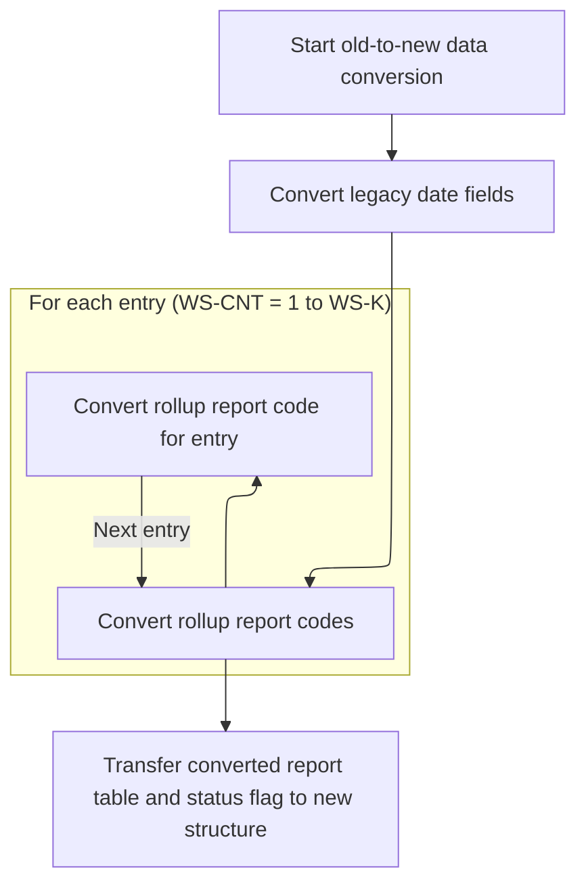

<SwmSnippet path="/base/src/MMMS0160.cbl" line="485">

---

Back in <SwmToken path="base/src/MMMS0160.cbl" pos="83:4:10" line-data="009200         PERFORM 500-OLD-2-NEW                                    00009200">`500-OLD-2-NEW`</SwmToken>, after running the date conversion with <SwmToken path="base/src/MMMS0160.cbl" pos="485:4:14" line-data="049400     PERFORM 510-OLD-2-NEW-DATE-CONV                              00049400">`510-OLD-2-NEW-DATE-CONV`</SwmToken>, we immediately call <SwmToken path="base/src/MMMS0160.cbl" pos="487:4:12" line-data="049600     PERFORM 520-CONVERT-ROLLUP-TXT-NEW                           00049600">`520-CONVERT-ROLLUP-TXT-NEW`</SwmToken>. This hands off the rollup code transformation to a dedicated routine, keeping the main function clean and letting each helper handle its own logic. If you want to see how rollup codes are actually converted, you have to look inside <SwmToken path="base/src/MMMS0160.cbl" pos="487:4:12" line-data="049600     PERFORM 520-CONVERT-ROLLUP-TXT-NEW                           00049600">`520-CONVERT-ROLLUP-TXT-NEW`</SwmToken>.

```cobol
049400     PERFORM 510-OLD-2-NEW-DATE-CONV                              00049400
049500                                                                  00049500
049600     PERFORM 520-CONVERT-ROLLUP-TXT-NEW                           00049600
```

---

</SwmSnippet>

<SwmSnippet path="/base/src/MMMS0160.cbl" line="517">

---

<SwmToken path="base/src/MMMS0160.cbl" pos="517:2:10" line-data="052600 520-CONVERT-ROLLUP-TXT-NEW.                                      00052600">`520-CONVERT-ROLLUP-TXT-NEW`</SwmToken> loops through up to 10 rollup codes, copying each one from the old structure's text field into the new structure's numeric array. This is needed because the new schema expects numeric values, not text. The code assumes both arrays are big enough and indexed the same way.

```cobol
052600 520-CONVERT-ROLLUP-TXT-NEW.                                      00052600
052700     PERFORM VARYING WS-CNT FROM 1 BY 1 UNTIL WS-CNT > WS-K       00052700
052800       MOVE FN-ROLLUP-REPT-CD OF XXXPST01 (WS-CNT)                00052800
052900         TO WS-REPT-TBL-NUMERIC (WS-CNT)                          00052900
053000     END-PERFORM                                                  00053000
053100     .                                                            00053100
```

---

</SwmSnippet>

<SwmSnippet path="/base/src/MMMS0160.cbl" line="489">

---

After finishing rollup code conversion in <SwmToken path="base/src/MMMS0160.cbl" pos="83:4:10" line-data="009200         PERFORM 500-OLD-2-NEW                                    00009200">`500-OLD-2-NEW`</SwmToken>, the code wraps up by copying the rollup code array and status flag into the new structure. All these MOVE statements are hand-mapped and specific to this repo's data model, so you have to know both schemas to follow or change them.

```cobol
049800     MOVE WS-REPT-TBL-TXT                                         00049800
049900       TO ROLUP-REPT-TBL-TXT         OF P-XXXTLR01                00049900
050000                                                                  00050000
050100     MOVE ST-STATUS-FLAG                                          00050100
050200       TO RETL-LOC-STAT-CD           OF P-XXXTLR01                00050200
050300     .                                                            00050300
```

---

</SwmSnippet>

&nbsp;

*This is an auto-generated document by Swimm 🌊 and has not yet been verified by a human*

<SwmMeta version="3.0.0" repo-id="Z2l0aHViJTNBJTNBU3dpbW1pby1keW5jYWxsLWRlbW8lM0ElM0FHaXJpLVN3aW1t" repo-name="Swimmio-dyncall-demo"><sup>Powered by [Swimm](https://app.swimm.io/)</sup></SwmMeta>
