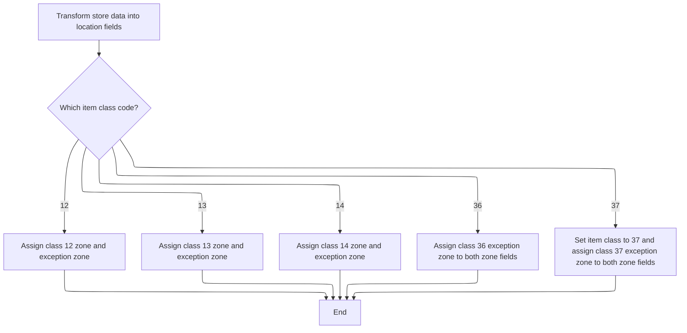

This document describes how store and item class data is translated between new and old formats. The translation direction is determined by an input indicator, and the mapping logic handles item classes 12, 13, 14, 36, and 37. The output is data in the requested format.

# Spec

## Detailed View of the Program's Functionality

a. Entry Point and Translation Routing

The program begins execution in its main section, where it first performs an initialization routine to set up the working state. After initialization, it checks a control value to determine which translation direction is required: new-to-old or old-to-new. If the control value indicates a new-to-old translation, it proceeds to the routine that handles mapping from the new data structure to the old one. If the control value indicates an old-to-new translation, it calls the routine for the reverse mapping. If the control value is anything else, it sets a failure flag and writes an error message indicating an invalid translation function. After handling the translation or error, the program ends.

b. Initialization

The initialization routine is straightforward: it resets or clears the primary working area to ensure no residual data from previous operations can interfere with the current translation.

c. New-to-Old Data Mapping

When a new-to-old translation is requested, the program first calls a routine responsible for populating the main old-format data structure. This routine copies the store type and store number from the new-format input into the corresponding fields in the old-format structure. It then examines the item class code and, depending on its value (specifically for classes 12, 13, 14, 36, and 37), moves the appropriate zone and exception zone fields from the new-format input into the correct locations in the old-format structure. Each item class has its own mapping logic, and if the item class does not match any of the specified values, no mapping occurs for that class.

If the main data mapping is successful, the program proceeds to a secondary mapping routine that populates additional reporting fields in another old-format structure. This secondary routine again copies the store type and number, and then, based on the item class code, moves the relevant zone and exception zone fields into their respective reporting fields. As before, only the specified item classes are handled.

d. Old-to-New Data Mapping

For old-to-new translation, the program starts by copying the store type and store number from the old-format structure into the new-format output. It then examines the item class code and, for each of the handled classes (12, 13, 14, 36, and 37), moves the appropriate zone and exception zone fields from the old-format structure into the new-format output. For item class 37, it also explicitly sets the item class code in the output, ensuring the mapping is clear. If the item class code does not match any of the handled values, no mapping occurs for that class.

e. Summary

The program acts as a bidirectional translator between two data formats, focusing on a small set of item classes. It ensures that store and item class information, along with associated zone data, is accurately mapped between the old and new structures, with clear error handling for unsupported translation requests. The logic is highly structured, with each translation direction and item class handled in a dedicated section, making the flow predictable and maintainable.

# Rule Definition

| Paragraph Name        | Rule ID | Category          | Description                                                                                                                                                                                                      | Conditions                                                          | Remarks                                                                                                                                                                              |
| --------------------- | ------- | ----------------- | ---------------------------------------------------------------------------------------------------------------------------------------------------------------------------------------------------------------- | ------------------------------------------------------------------- | ------------------------------------------------------------------------------------------------------------------------------------------------------------------------------------ |
| 000-MAIN              | RL-001  | Conditional Logic | The program evaluates the function code input to determine whether to perform new-to-old or old-to-new translation. If the function code is not recognized, it sets a failure flag and outputs an error message. | Function code input is provided.                                    | Function code values: 'N' for new-to-old, 'O' for old-to-new. Any other value triggers error. Error message: 'MMMS0162 - Invalid translation function.' Failure flag is set to TRUE. |
| 210-POPULATE-DDDPST01 | RL-002  | Data Assignment   | When performing new-to-old translation, the program copies LOC-TYP-CD and LOC-NBR from the new format input to ST-STORE-TYPE and ST-STORE-NUMBER in the old format output.                                       | Function code is 'N' (new-to-old translation).                      | LOC-TYP-CD and LOC-NBR are copied as-is to ST-STORE-TYPE and ST-STORE-NUMBER. Data types must match between input and output formats.                                                |
| 210-POPULATE-DDDPST01 | RL-003  | Conditional Logic | For new-to-old translation, the program evaluates ITM-CLS-CD and sets zone and exception zone fields in the old format output according to the value.                                                            | Function code is 'N' and ITM-CLS-CD is present in new format input. | ITM-CLS-CD values:                                                                                                                                                                   |

- 12: set ST-CLASS12-ZONE to AD-ZONE, ST-CLASS12-EXCEPTION-AD-ZONE to AD-ZONE-EXCP
- 13: set ST-CLASS13-ZONE to AD-ZONE, ST-CLASS13-EXCEPTION-AD-ZONE to AD-ZONE-EXCP
- 14: set ST-CLASS14-ZONE to AD-ZONE, ST-CLASS14-EXCEPTION-AD-ZONE to AD-ZONE-EXCP
- 36: set ST-CLASS36-EXCEPTION-AD-ZONE to AD-ZONE-EXCP
- 37: set ST-CLASS37-EXCEPTION-AD-ZONE to AD-ZONE-EXCP For other values, no zone or exception zone fields are set. | | 500-OLD-2-NEW | RL-004 | Data Assignment | When performing old-to-new translation, the program copies ST-STORE-TYPE and ST-STORE-NUMBER from the old format input to LOC-TYP-CD and LOC-NBR in the new format output. | Function code is 'O' (old-to-new translation). | ST-STORE-TYPE and ST-STORE-NUMBER are copied as-is to LOC-TYP-CD and LOC-NBR. Data types must match between input and output formats. | | 500-OLD-2-NEW | RL-005 | Conditional Logic | For old-to-new translation, the program evaluates ITM-CLS-CD and sets zone and exception zone fields in the new format output according to the value. | Function code is 'O' and ITM-CLS-CD is provided as input. | ITM-CLS-CD values:
- 12: set AD-ZONE to ST-CLASS12-ZONE, AD-ZONE-EXCP to ST-CLASS12-EXCEPTION-AD-ZONE
- 13: set AD-ZONE to ST-CLASS13-ZONE, AD-ZONE-EXCP to ST-CLASS13-EXCEPTION-AD-ZONE
- 14: set AD-ZONE to ST-CLASS14-ZONE, AD-ZONE-EXCP to ST-CLASS14-EXCEPTION-AD-ZONE
- 36: set AD-ZONE and AD-ZONE-EXCP to ST-CLASS36-EXCEPTION-AD-ZONE
- 37: set ITM-CLS-CD in output to 37, set AD-ZONE and AD-ZONE-EXCP to ST-CLASS37-EXCEPTION-AD-ZONE For other values, no zone or exception zone fields are set. |

# User Stories

## User Story 1: New-to-old translation including direction selection and error handling

---

### Story Description:

As a user, I want the program to evaluate the function code and, if it is 'N', perform new-to-old translation by copying LOC-TYP-CD and LOC-NBR to ST-STORE-TYPE and ST-STORE-NUMBER, and set zone and exception zone fields in the old format output based on the ITM-CLS-CD value, so that the old format output is correctly populated or an error is reported if the function code is invalid.

---

### Business Rule Mapping:

| Rule ID | Paragraph Name        | Rule Description                                                                                                                                                                                                 |
| ------- | --------------------- | ---------------------------------------------------------------------------------------------------------------------------------------------------------------------------------------------------------------- |
| RL-001  | 000-MAIN              | The program evaluates the function code input to determine whether to perform new-to-old or old-to-new translation. If the function code is not recognized, it sets a failure flag and outputs an error message. |
| RL-002  | 210-POPULATE-DDDPST01 | When performing new-to-old translation, the program copies LOC-TYP-CD and LOC-NBR from the new format input to ST-STORE-TYPE and ST-STORE-NUMBER in the old format output.                                       |
| RL-003  | 210-POPULATE-DDDPST01 | For new-to-old translation, the program evaluates ITM-CLS-CD and sets zone and exception zone fields in the old format output according to the value.                                                            |

---

### Relevant Functionality:

- **000-MAIN**
  1. **RL-001:**
     - If function code is 'N':
       - Perform new-to-old translation
     - Else if function code is 'O':
       - Perform old-to-new translation
     - Else:
       - Set failure flag to TRUE
       - Set error message to indicate invalid function code
- **210-POPULATE-DDDPST01**
  1. **RL-002:**
     - Copy LOC-TYP-CD from new format input to ST-STORE-TYPE in old format output
     - Copy LOC-NBR from new format input to ST-STORE-NUMBER in old format output
  2. **RL-003:**
     - Evaluate ITM-CLS-CD:
       - If 12:
         - Set ST-CLASS12-ZONE to AD-ZONE
         - Set ST-CLASS12-EXCEPTION-AD-ZONE to AD-ZONE-EXCP
       - If 13:
         - Set ST-CLASS13-ZONE to AD-ZONE
         - Set ST-CLASS13-EXCEPTION-AD-ZONE to AD-ZONE-EXCP
       - If 14:
         - Set ST-CLASS14-ZONE to AD-ZONE
         - Set ST-CLASS14-EXCEPTION-AD-ZONE to AD-ZONE-EXCP
       - If 36:
         - Set ST-CLASS36-EXCEPTION-AD-ZONE to AD-ZONE-EXCP
       - If 37:
         - Set ST-CLASS37-EXCEPTION-AD-ZONE to AD-ZONE-EXCP
       - Else:
         - Do not set any zone or exception zone fields

## User Story 2: Old-to-new translation including direction selection and error handling

---

### Story Description:

As a user, I want the program to evaluate the function code and, if it is 'O', perform old-to-new translation by copying ST-STORE-TYPE and ST-STORE-NUMBER to LOC-TYP-CD and LOC-NBR, and set zone and exception zone fields in the new format output based on the ITM-CLS-CD value, so that the new format output is correctly populated or an error is reported if the function code is invalid.

---

### Business Rule Mapping:

| Rule ID | Paragraph Name | Rule Description                                                                                                                                                                                                 |
| ------- | -------------- | ---------------------------------------------------------------------------------------------------------------------------------------------------------------------------------------------------------------- |
| RL-001  | 000-MAIN       | The program evaluates the function code input to determine whether to perform new-to-old or old-to-new translation. If the function code is not recognized, it sets a failure flag and outputs an error message. |
| RL-004  | 500-OLD-2-NEW  | When performing old-to-new translation, the program copies ST-STORE-TYPE and ST-STORE-NUMBER from the old format input to LOC-TYP-CD and LOC-NBR in the new format output.                                       |
| RL-005  | 500-OLD-2-NEW  | For old-to-new translation, the program evaluates ITM-CLS-CD and sets zone and exception zone fields in the new format output according to the value.                                                            |

---

### Relevant Functionality:

- **000-MAIN**
  1. **RL-001:**
     - If function code is 'N':
       - Perform new-to-old translation
     - Else if function code is 'O':
       - Perform old-to-new translation
     - Else:
       - Set failure flag to TRUE
       - Set error message to indicate invalid function code
- **500-OLD-2-NEW**
  1. **RL-004:**
     - Copy ST-STORE-TYPE from old format input to LOC-TYP-CD in new format output
     - Copy ST-STORE-NUMBER from old format input to LOC-NBR in new format output
  2. **RL-005:**
     - Evaluate ITM-CLS-CD:
       - If 12:
         - Set AD-ZONE to ST-CLASS12-ZONE
         - Set AD-ZONE-EXCP to ST-CLASS12-EXCEPTION-AD-ZONE
       - If 13:
         - Set AD-ZONE to ST-CLASS13-ZONE
         - Set AD-ZONE-EXCP to ST-CLASS13-EXCEPTION-AD-ZONE
       - If 14:
         - Set AD-ZONE to ST-CLASS14-ZONE
         - Set AD-ZONE-EXCP to ST-CLASS14-EXCEPTION-AD-ZONE
       - If 36:
         - Set AD-ZONE to ST-CLASS36-EXCEPTION-AD-ZONE
         - Set AD-ZONE-EXCP to ST-CLASS36-EXCEPTION-AD-ZONE
       - If 37:
         - Set ITM-CLS-CD in output to 37
         - Set AD-ZONE to ST-CLASS37-EXCEPTION-AD-ZONE
         - Set AD-ZONE-EXCP to ST-CLASS37-EXCEPTION-AD-ZONE
       - Else:
         - Do not set any zone or exception zone fields

# Code Walkthrough

## Entry Point and Translation Routing

<SwmSnippet path="/base/src/MMMS0162.cbl" line="53">

---

`000-MAIN` kicks off the flow by initializing state and then routing to either new-to-old or old-to-new translation based on YYYN111A-FUNCTION. If it's 'N', it calls 200-NEW-2-OLD to handle mapping from the new format to the old one. If it's 'O', it calls 500-OLD-2-NEW for the reverse. Anything else triggers a failure flag and a clear error message. Calling 200-NEW-2-OLD here is what actually starts the data mapping when new-to-old is requested.

```cobol
005700 000-MAIN.                                                        00005700
005800     PERFORM 100-INITIALIZE                                       00005800
005900                                                                  00005900
006000     EVALUATE TRUE                                                00006000
006100       WHEN YYYN111A-NEW-2-OLD                                    00006100
006200         PERFORM 200-NEW-2-OLD                                    00006200
006300                                                                  00006300
006400       WHEN YYYN111A-OLD-2-NEW                                    00006400
006500         PERFORM 500-OLD-2-NEW                                    00006500
006600                                                                  00006600
006700       WHEN OTHER                                                 00006700
006800         SET FAILURE TO TRUE                                      00006800
006900         MOVE 'MMMS0162 - Invalid translation function.'          00006900
007000           TO IS-RTRN-MSG-TXT                                     00007000
007100     END-EVALUATE                                                 00007100
007200                                                                  00007200
007300     GOBACK                                                       00007300
007400     .                                                            00007400
```

---

</SwmSnippet>

### New-to-Old Data Mapping

<SwmSnippet path="/base/src/MMMS0162.cbl" line="84">

---

`200-NEW-2-OLD` handles the new-to-old mapping by first calling 210-POPULATE-DDDPST01 to move store and item class data into the old structure. Only if that works (SUCCESS), it continues to 220-POPULATE-DDDTRL01 for additional reporting structure mapping. Calling 210-POPULATE-DDDPST01 here is what actually gets the main data into the old format.

```cobol
008800 200-NEW-2-OLD.                                                   00008800
008900     PERFORM 210-POPULATE-DDDPST01                                00008900
009000     IF SUCCESS                                                   00009000
009100       PERFORM 220-POPULATE-DDDTRL01                              00009100
009200     END-IF                                                       00009200
009300     .                                                            00009300
```

---

</SwmSnippet>

<SwmSnippet path="/base/src/MMMS0162.cbl" line="95">

---

`210-POPULATE-DDDPST01` copies store type and number from the input, then uses EVALUATE on ITM-CLS-CD to selectively map zone and exception zone fields for item classes 12, 13, 14, 36, and 37. Each case moves the right fields into the old structure, and anything else is skipped.

```cobol
009900 210-POPULATE-DDDPST01.                                           00009900
010000     MOVE LOC-TYP-CD                   OF P-DDDTCZ01              00010000
010100       TO ST-STORE-TYPE                                           00010100
010200                                                                  00010200
010300     MOVE LOC-NBR                      OF P-DDDTCZ01              00010300
010400       TO ST-STORE-NUMBER                                         00010400
010500                                                                  00010500
010600     EVALUATE ITM-CLS-CD                                          00010600
010700      WHEN 12                                                     00010700
010800                                                                  00010800
010900       MOVE AD-ZONE                    OF P-DDDTCZ01              00010900
011000         TO ST-CLASS12-ZONE                                       00011000
011100       MOVE AD-ZONE-EXCP               OF P-DDDTCZ01              00011100
011200         TO ST-CLASS12-EXCEPTION-AD-ZONE                          00011200
011300                                                                  00011300
011400      WHEN 13                                                     00011400
011500                                                                  00011500
011600       MOVE AD-ZONE                    OF P-DDDTCZ01              00011600
011700         TO ST-CLASS13-ZONE                                       00011700
011800       MOVE AD-ZONE-EXCP               OF P-DDDTCZ01              00011800
011900         TO ST-CLASS13-EXCEPTION-AD-ZONE                          00011900
012000                                                                  00012000
012100      WHEN 14                                                     00012100
012200                                                                  00012200
012300       MOVE AD-ZONE                    OF P-DDDTCZ01              00012300
012400         TO ST-CLASS14-ZONE                                       00012400
012500       MOVE AD-ZONE-EXCP               OF P-DDDTCZ01              00012500
012600         TO ST-CLASS14-EXCEPTION-AD-ZONE                          00012600
012700                                                                  00012700
012800      WHEN 36                                                     00012800
012900                                                                  00012900
013000       MOVE AD-ZONE-EXCP               OF P-DDDTCZ01              00013000
013100         TO ST-CLASS36-EXCEPTION-AD-ZONE                          00013100
013200                                                                  00013200
013300      WHEN 37                                                     00013300
013400                                                                  00013400
013500       MOVE AD-ZONE-EXCP               OF P-DDDTCZ01              00013500
013600         TO ST-CLASS37-EXCEPTION-AD-ZONE                          00013600
013700     END-EVALUATE                                                 00013700
013800     .                                                            00013800
```

---

</SwmSnippet>

### Old-to-New Data Mapping



<SwmSnippet path="/base/src/MMMS0162.cbl" line="184">

---

`500-OLD-2-NEW` copies store type and number into the output, then uses EVALUATE on ITM-CLS-CD to map the right zone and exception zone fields for each item class. For class 37, it also sets ITM-CLS-CD in the output, making the mapping explicit. Each handled class gets its fields moved as needed, and anything else is ignored.

```cobol
018800 500-OLD-2-NEW.                                                   00018800
018900     MOVE ST-STORE-TYPE                                           00018900
019000       TO LOC-TYP-CD                   OF P-DDDTCZ01              00019000
019100                                                                  00019100
019200     MOVE ST-STORE-NUMBER                                         00019200
019300       TO LOC-NBR                      OF P-DDDTCZ01              00019300
019400                                                                  00019400
019500     EVALUATE ITM-CLS-CD                                          00019500
019600      WHEN 12                                                     00019600
019900       MOVE ST-CLASS12-ZONE                                       00019900
020000         TO AD-ZONE                    OF P-DDDTCZ01              00020000
020100       MOVE ST-CLASS12-EXCEPTION-AD-ZONE                          00020100
020200         TO AD-ZONE-EXCP               OF P-DDDTCZ01              00020200
020300                                                                  00020300
020400      WHEN 13                                                     00020400
020700       MOVE ST-CLASS13-ZONE                                       00020700
020800         TO AD-ZONE                    OF P-DDDTCZ01              00020800
020900       MOVE ST-CLASS13-EXCEPTION-AD-ZONE                          00020900
021000         TO AD-ZONE-EXCP               OF P-DDDTCZ01              00021000
021100                                                                  00021100
021200      WHEN 14                                                     00021200
021500       MOVE ST-CLASS14-ZONE                                       00021500
021600         TO AD-ZONE                    OF P-DDDTCZ01              00021600
021700       MOVE ST-CLASS14-EXCEPTION-AD-ZONE                          00021700
021800         TO AD-ZONE-EXCP               OF P-DDDTCZ01              00021800
021900                                                                  00021900
022000      WHEN 36                                                     00022000
022300       MOVE ST-CLASS36-EXCEPTION-AD-ZONE                          00022300
022400         TO AD-ZONE                    OF P-DDDTCZ01              00022400
022500       MOVE ST-CLASS36-EXCEPTION-AD-ZONE                          00022500
022600         TO AD-ZONE-EXCP               OF P-DDDTCZ01              00022600
022700                                                                  00022700
022800      WHEN 37                                                     00022800
023000       MOVE 37                                                    00023000
023100         TO ITM-CLS-CD                 OF P-DDDTCZ01              00023100
023200       MOVE ST-CLASS37-EXCEPTION-AD-ZONE                          00023200
023300         TO AD-ZONE                    OF P-DDDTCZ01              00023300
023400       MOVE ST-CLASS37-EXCEPTION-AD-ZONE                          00023400
023500         TO AD-ZONE-EXCP               OF P-DDDTCZ01              00023500
023600     END-EVALUATE                                                 00023600
023700     .                                                            00023700
```

---

</SwmSnippet>

&nbsp;

*This is an auto-generated document by Swimm 🌊 and has not yet been verified by a human*

<SwmMeta version="3.0.0" repo-id="Z2l0aHViJTNBJTNBU3dpbW1pby1keW5jYWxsLWRlbW8lM0ElM0FHaXJpLVN3aW1t" repo-name="Swimmio-dyncall-demo"><sup>Powered by [Swimm](https://app.swimm.io/)</sup></SwmMeta>
