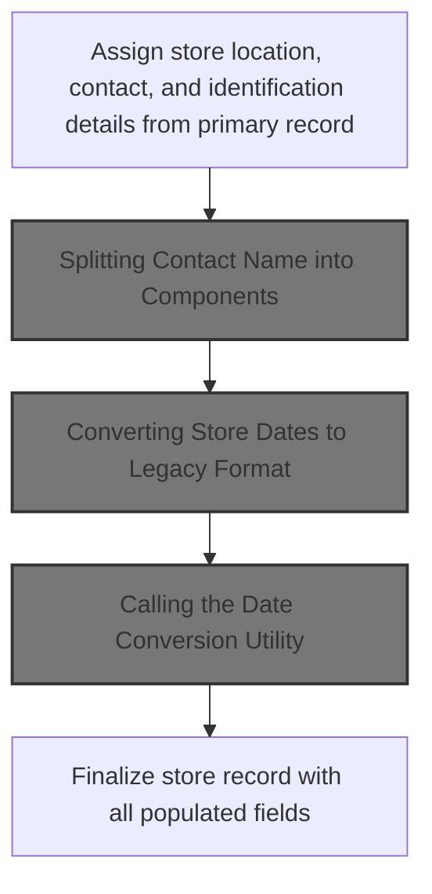
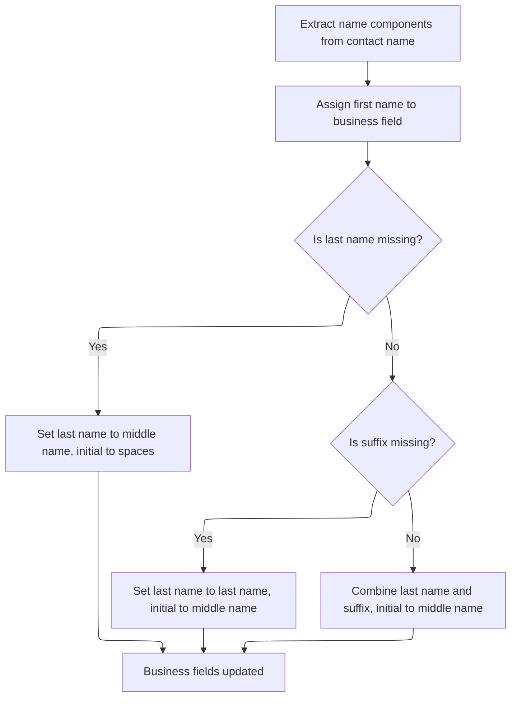
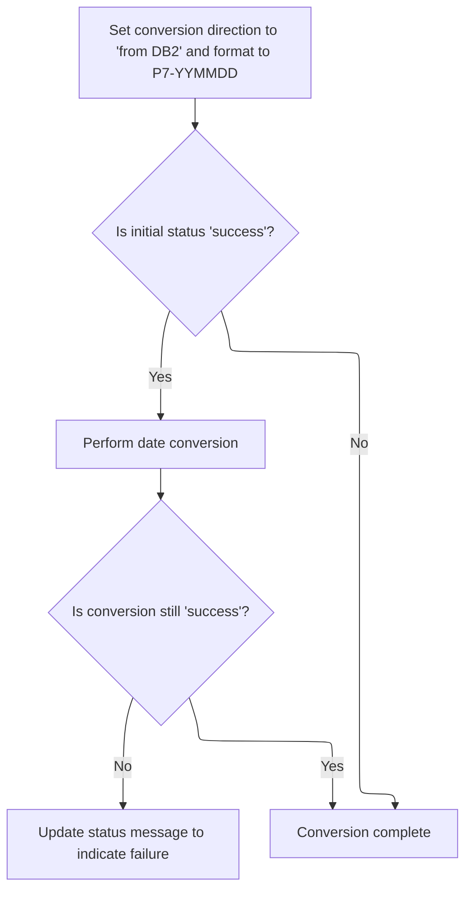
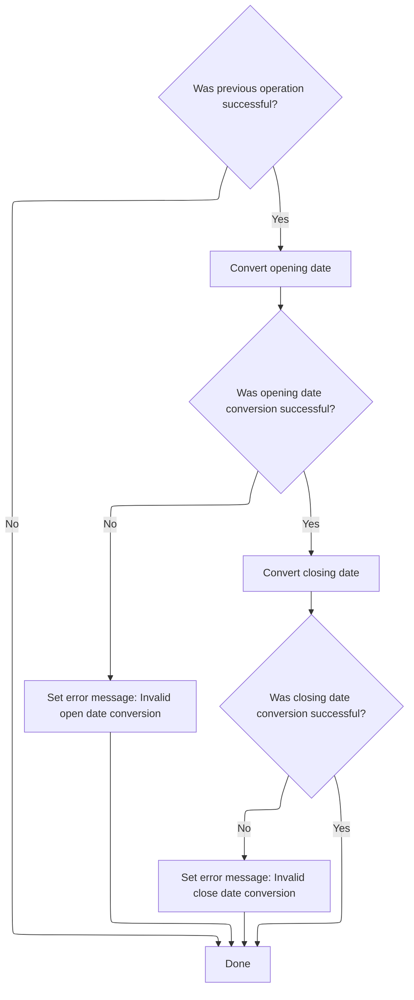
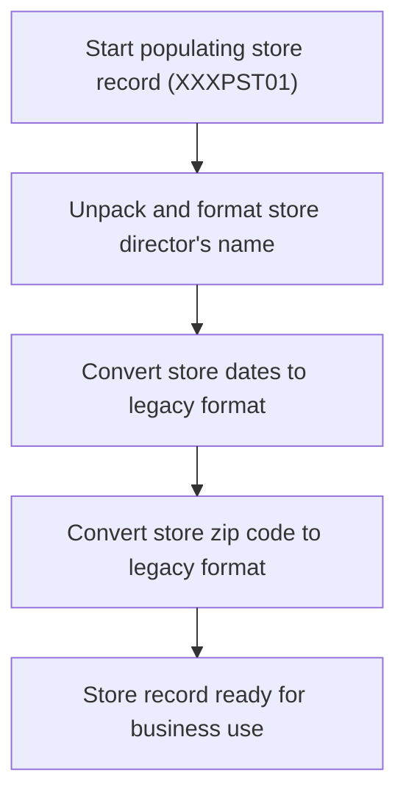
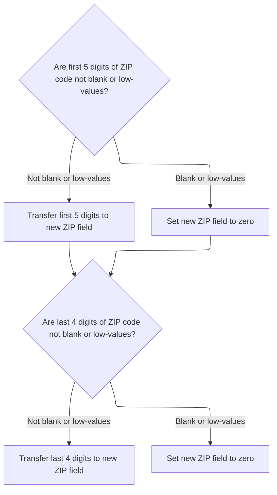

# Overview

This document explains the flow for converting store data between new and legacy formats. The process determines the translation direction and transforms store records to ensure compatibility with downstream systems.

## Dependencies

### Programs

- <SwmToken path="base/src/MMMS0158.cbl" pos="77:5:5" line-data="009100         MOVE &#39;MMMS0158 - Invalid translation function.&#39;          00009100">`MMMS0158`</SwmToken> (<SwmPath>[base/src/MMMS0158.cbl](base/src/MMMS0158.cbl)</SwmPath>)
- <SwmToken path="base/src/MMMS0158.cbl" pos="323:4:4" line-data="033700     CALL  YYYS0134-STRING-CRUNCH USING                           00033700">`YYYS0134`</SwmToken> (<SwmPath>[base/src/YYYS0134.cbl](base/src/YYYS0134.cbl)</SwmPath>)
- <SwmToken path="base/src/MMMS0158.cbl" pos="379:4:4" line-data="039300       CALL MMMS9012-DATE-CONV USING XXXN001A                     00039300">`MMMS9012`</SwmToken> (<SwmPath>[base/src/MMMS9012.cbl](base/src/MMMS9012.cbl)</SwmPath>)

### Copybooks

- <SwmToken path="base/src/YYYS0134.cbl" pos="27:4:4" line-data="006900 COPY YYYN000A.                                                   00006900">`YYYN000A`</SwmToken> (<SwmPath>[base/src/YYYN000A.cpy](base/src/YYYN000A.cpy)</SwmPath>)
- <SwmToken path="base/src/MMMS0158.cbl" pos="89:4:4" line-data="010300     INITIALIZE XXXN001A                                          00010300">`XXXN001A`</SwmToken> (<SwmPath>[base/src/XXXN001A.cpy](base/src/XXXN001A.cpy)</SwmPath>)
- <SwmToken path="base/src/MMMS0158.cbl" pos="38:4:4" line-data="005200  COPY MMMK001B.                                                  00005200">`MMMK001B`</SwmToken> (<SwmPath>[base/src/MMMK001B.cpy](base/src/MMMK001B.cpy)</SwmPath>)
- <SwmToken path="base/src/MMMS0158.cbl" pos="176:4:4" line-data="019000     SET MMMC9012-CONV-FROM-DB2        TO TRUE                    00019000">`MMMC9012`</SwmToken> (<SwmPath>[base/src/MMMC9012.cpy](base/src/MMMC9012.cpy)</SwmPath>)
- <SwmToken path="base/src/MMMS0158.cbl" pos="69:4:4" line-data="008300       WHEN YYYN111A-NEW-2-OLD                                    00008300">`YYYN111A`</SwmToken> (<SwmPath>[base/src/YYYN111A.cpy](base/src/YYYN111A.cpy)</SwmPath>)
- <SwmToken path="base/src/MMMS0158.cbl" pos="50:4:4" line-data="006400 COPY PPPTLO01.                                                   00006400">`PPPTLO01`</SwmToken> (<SwmPath>[base/src/PPPTLO01.cpy](base/src/PPPTLO01.cpy)</SwmPath>)
- <SwmToken path="base/src/MMMS0158.cbl" pos="97:8:8" line-data="011100     PERFORM 210-POPULATE-XXXPST01                                00011100">`XXXPST01`</SwmToken> (<SwmPath>[base/src/XXXPST01.cpy](base/src/XXXPST01.cpy)</SwmPath>)
- <SwmToken path="base/src/MMMS0158.cbl" pos="52:4:4" line-data="006600 COPY PPPTRL01.                                                   00006600">`PPPTRL01`</SwmToken> (<SwmPath>[base/src/PPPTRL01.cpy](base/src/PPPTRL01.cpy)</SwmPath>)

## Detailed View of the Program's Functionality

a. Overview of the Space Cruncher Utility (<SwmToken path="base/src/MMMS0158.cbl" pos="323:4:4" line-data="033700     CALL  YYYS0134-STRING-CRUNCH USING                           00033700">`YYYS0134`</SwmToken>)

This utility is designed to clean up strings by removing extra spaces, ensuring that there is at most one space between words. It is typically used after concatenating name fields (such as first, middle, and last names) to produce a neatly formatted result.

b. Initialization and Input Validation

When the utility starts, it first resets its internal workspace and helper variables to ensure no leftover data from previous runs. It checks the length of the input string and trims it if it exceeds the maximum allowed length. If the input string is empty or contains only blank/low-value characters, it sets an error status and prepares an error message, halting further processing.

c. Space Crunching Logic

If the input passes validation, the utility processes the string character by character. It keeps track of the previous character and only allows a single space between non-space characters. If it encounters consecutive spaces, it skips the extra ones. Otherwise, it copies the character to the output buffer and updates the previous character tracker. This loop continues until all characters in the input string have been examined.

d. Finalizing and Returning the Cleaned String

After crunching the string, the utility blanks out the output area and copies the cleaned result into the output string. This ensures that only the cleaned version is returned, with no residual data from earlier runs.

e. Error Handling

If any step fails (either during initialization or crunching), the utility sets an error status and message, and does not return a processed string. This prevents invalid or incomplete data from being used downstream.

---

a. Main Conversion Flow (<SwmToken path="base/src/MMMS0158.cbl" pos="77:5:5" line-data="009100         MOVE &#39;MMMS0158 - Invalid translation function.&#39;          00009100">`MMMS0158`</SwmToken>)

This program acts as a dispatcher for data conversion between new and legacy store formats. It starts by resetting its main workspace to avoid contamination from previous runs. It then checks the requested conversion direction: new-to-old, old-to-new, or invalid. Based on this, it branches to the appropriate conversion routine or sets an error status if the request is invalid.

b. New-to-Old Conversion

For new-to-old conversion, the program first copies all relevant store fields from the input record to the legacy structure. This includes location, contact, and identification details. After copying, it unpacks the contact name into its components (first, middle, last, suffix) using a string splitting routine. It then converts store dates to the legacy format using a date conversion utility, and finally formats zip codes to ensure they meet legacy expectations (setting them to default values if missing).

c. Name Unpacking

The contact name is split into its components using a space delimiter. If the last name is missing, the middle name is used as the last name and initials are cleared. If a suffix is present, it is appended to the last name with a space. The result is stored in the legacy structure, ready for use.

d. Date Conversion (New-to-Old)

The program sets flags to indicate the direction and format of date conversion, then calls a utility to perform the actual conversion. If the conversion fails, it updates the error message with a marker indicating the step where the failure occurred.

e. Zip Code Formatting (New-to-Old)

The program checks if the input zip code fields are zero. If so, it sets them to default strings ('00000' or '0000'). Otherwise, it copies the actual values. This ensures the legacy output always has valid zip code strings.

f. Old-to-New Conversion

For old-to-new conversion, the program copies legacy store fields into the new structure. It sets the store status based on activity and department presence. It then packs the name fields into a single string and calls the space cruncher utility to clean up the result. Afterward, it converts dates to the new format and processes zip codes, converting them from string to numeric as required by the new structure.

g. Name Packing and Cleaning

The program builds the contact name from its parts and calls the space cruncher utility to remove extra spaces. The cleaned name is stored in the output record. If the cruncher fails, the main data structure is reset to avoid passing on bad data.

h. Date Conversion (Old-to-New)

Flags are set to indicate conversion to the new format, and the date conversion utility is called. If the conversion fails, the error message is tagged to indicate the step where the failure occurred.

i. Zip Code Validation and Conversion (Old-to-New)

The program checks if the zip code fields are present and valid. If so, it converts them to numeric and stores them in the output structure. If not, it sets the output fields to zero, ensuring only valid data is passed on.

j. Common Date Conversion Utility

The date conversion utility is called for each relevant date field (delete, open, close). If any conversion fails, a specific error message is set for that field. If all succeed, the converted dates are stored in the output structure.

---

This detailed flow ensures robust conversion between new and legacy store formats, with careful handling of names, dates, and zip codes, and clear error reporting at each step.

# Rule Definition

| Paragraph Name                                                                                                                                                                                                                                                                                                                                                                                                                                                                                                                                          | Rule ID | Category          | Description                                                                                                                                                                                                                                                                                                                                                                                                                                                                                                                                                                                                               | Conditions                                                                                          | Remarks                                                                                                                                                                                                                                                                                                                                                                                                                                                                                                   |
| ------------------------------------------------------------------------------------------------------------------------------------------------------------------------------------------------------------------------------------------------------------------------------------------------------------------------------------------------------------------------------------------------------------------------------------------------------------------------------------------------------------------------------------------------------- | ------- | ----------------- | ------------------------------------------------------------------------------------------------------------------------------------------------------------------------------------------------------------------------------------------------------------------------------------------------------------------------------------------------------------------------------------------------------------------------------------------------------------------------------------------------------------------------------------------------------------------------------------------------------------------------- | --------------------------------------------------------------------------------------------------- | --------------------------------------------------------------------------------------------------------------------------------------------------------------------------------------------------------------------------------------------------------------------------------------------------------------------------------------------------------------------------------------------------------------------------------------------------------------------------------------------------------- |
| <SwmToken path="base/src/MMMS0158.cbl" pos="66:4:6" line-data="008000     PERFORM 100-INITIALIZE                                       00008000">`100-INITIALIZE`</SwmToken> in <SwmPath>[base/src/MMMS0158.cbl](base/src/MMMS0158.cbl)</SwmPath>, <SwmToken path="base/src/YYYS0134.cbl" pos="48:4:6" line-data="009200     PERFORM 100-INITIALIZATION                                   00009200">`100-INITIALIZATION`</SwmToken> in <SwmPath>[base/src/YYYS0134.cbl](base/src/YYYS0134.cbl)</SwmPath>                                                | RL-001  | Data Assignment   | Before any translation, the program must clear all previous values in the translation context to ensure a clean state.                                                                                                                                                                                                                                                                                                                                                                                                                                                                                                    | Always, before any translation operation.                                                           | The context structure is reset using INITIALIZE. No specific output format, but all fields are set to their default (blank/zero) values.                                                                                                                                                                                                                                                                                                                                                                  |
| <SwmToken path="base/src/MMMS0158.cbl" pos="65:2:4" line-data="007900 000-MAIN.                                                        00007900">`000-MAIN`</SwmToken> in <SwmPath>[base/src/MMMS0158.cbl](base/src/MMMS0158.cbl)</SwmPath>                                                                                                                                                                                                                                                                                                             | RL-002  | Conditional Logic | The program reads the translation function code and branches to new-to-old or old-to-new routines. If the code is invalid, it sets failure status and an error message.                                                                                                                                                                                                                                                                                                                                                                                                                                                   | Function code is read from input; 'N' for new-to-old, 'O' for old-to-new, anything else is invalid. | Failure status is set to '0', error message is '<SwmToken path="base/src/MMMS0158.cbl" pos="77:5:5" line-data="009100         MOVE &#39;MMMS0158 - Invalid translation function.&#39;          00009100">`MMMS0158`</SwmToken> - Invalid translation function.'                                                                                                                                                                                                                                           |
| <SwmToken path="base/src/MMMS0158.cbl" pos="132:4:8" line-data="014600     PERFORM 220-UNPK-NAME                                        00014600">`220-UNPK-NAME`</SwmToken> in <SwmPath>[base/src/MMMS0158.cbl](base/src/MMMS0158.cbl)</SwmPath>                                                                                                                                                                                                                                                                                                       | RL-003  | Computation       | Splits the contact name into first, middle/initial, last, and suffix components, assigning them according to rules for missing values.                                                                                                                                                                                                                                                                                                                                                                                                                                                                                    | Only applies during new-to-old translation.                                                         | Names are split by spaces. If last name is missing, use middle name as last and initial as spaces. If suffix is missing, use last name and middle name. If suffix is present, combine last name and suffix with a space.                                                                                                                                                                                                                                                                                  |
| <SwmToken path="base/src/MMMS0158.cbl" pos="134:4:14" line-data="014800     PERFORM 230-NEW-2-OLD-DATE-CONV                              00014800">`230-NEW-2-OLD-DATE-CONV`</SwmToken> in <SwmPath>[base/src/MMMS0158.cbl](base/src/MMMS0158.cbl)</SwmPath>, <SwmToken path="base/src/MMMS0158.cbl" pos="180:4:10" line-data="019400       PERFORM 900-DATE-CONVERSION-PARA                           00019400">`900-DATE-CONVERSION-PARA`</SwmToken> in <SwmPath>[base/src/MMMS0158.cbl](base/src/MMMS0158.cbl)</SwmPath>                             | RL-004  | Computation       | Converts <SwmToken path="base/src/MMMS0158.cbl" pos="382:2:4" line-data="039600                                     DELETE-DT OF P-DDDTLO01      00039600">`DELETE-DT`</SwmToken>, <SwmToken path="base/src/MMMS0158.cbl" pos="394:2:4" line-data="040800                                     OPENED-DT OF P-DDDTLO01      00040800">`OPENED-DT`</SwmToken>, and <SwmToken path="base/src/MMMS0158.cbl" pos="406:2:4" line-data="042000                                     CLOSED-DT OF P-DDDTLO01      00042000">`CLOSED-DT`</SwmToken> from 8-character YYYYMMDD format to 7-character YYMMDD format.                  | Only applies during new-to-old translation.                                                         | Date conversion direction is set to 'from <SwmToken path="base/src/MMMS0158.cbl" pos="176:10:10" line-data="019000     SET MMMC9012-CONV-FROM-DB2        TO TRUE                    00019000">`DB2`</SwmToken>', format is <SwmToken path="base/src/MMMS0158.cbl" pos="177:8:10" line-data="019100     SET MMMC9012-PIC-P7-YYMMDD        TO TRUE                    00019100">`P7-YYMMDD`</SwmToken>. Output is a 7-character string (e.g., '0240601').                                                   |
| <SwmToken path="base/src/MMMS0158.cbl" pos="136:4:14" line-data="015000     PERFORM 240-NEW-2-OLD-ZIPC-CONV                              00015000">`240-NEW-2-OLD-ZIPC-CONV`</SwmToken> in <SwmPath>[base/src/MMMS0158.cbl](base/src/MMMS0158.cbl)</SwmPath>                                                                                                                                                                                                                                                                                            | RL-005  | Computation       | Formats ZIP codes as zero-padded strings. If input is zero, output is '00000' or '0000'. Otherwise, pad left with zeros as needed.                                                                                                                                                                                                                                                                                                                                                                                                                                                                                        | Only applies during new-to-old translation.                                                         | <SwmToken path="base/src/MMMS0158.cbl" pos="194:4:8" line-data="020800     IF PRIM-ZIP5-CD OF P-DDDTLO01 = 0                            00020800">`PRIM-ZIP5-CD`</SwmToken> is formatted as a 5-character string, <SwmToken path="base/src/MMMS0158.cbl" pos="200:4:8" line-data="021400     IF PRIM-ZIP4-CD OF P-DDDTLO01 = 0                            00021400">`PRIM-ZIP4-CD`</SwmToken> as a 4-character string. Zero values are output as '00000' or '0000'.                                       |
| <SwmToken path="base/src/MMMS0158.cbl" pos="305:4:8" line-data="031900     PERFORM 510-PACK-NAME                                        00031900">`510-PACK-NAME`</SwmToken> in <SwmPath>[base/src/MMMS0158.cbl](base/src/MMMS0158.cbl)</SwmPath>, <SwmPath>[base/src/YYYS0134.cbl](base/src/YYYS0134.cbl)</SwmPath>                                                                                                                                                                                                                                    | RL-006  | Computation       | Concatenates first, initial, and last name into contact name, inserts at most one space between components, and removes extra spaces using a string cruncher utility.                                                                                                                                                                                                                                                                                                                                                                                                                                                     | Only applies during old-to-new translation.                                                         | Contact name is a single string with at most one space between components. If string cruncher fails, main data structure is reset.                                                                                                                                                                                                                                                                                                                                                                        |
| <SwmToken path="base/src/MMMS0158.cbl" pos="307:4:14" line-data="032100     PERFORM 520-OLD-2-NEW-DATE-CONV                              00032100">`520-OLD-2-NEW-DATE-CONV`</SwmToken> in <SwmPath>[base/src/MMMS0158.cbl](base/src/MMMS0158.cbl)</SwmPath>, <SwmToken path="base/src/MMMS0158.cbl" pos="180:4:10" line-data="019400       PERFORM 900-DATE-CONVERSION-PARA                           00019400">`900-DATE-CONVERSION-PARA`</SwmToken> in <SwmPath>[base/src/MMMS0158.cbl](base/src/MMMS0158.cbl)</SwmPath>                             | RL-007  | Computation       | Converts <SwmToken path="base/src/MMMS0158.cbl" pos="381:2:6" line-data="039500                                     ST-DELETE-DATE               00039500">`ST-DELETE-DATE`</SwmToken>, <SwmToken path="base/src/MMMS0158.cbl" pos="393:2:6" line-data="040700                                     ST-OPENING-DATE              00040700">`ST-OPENING-DATE`</SwmToken>, and <SwmToken path="base/src/MMMS0158.cbl" pos="405:2:6" line-data="041900                                     ST-CLOSING-DATE              00041900">`ST-CLOSING-DATE`</SwmToken> from 7-character YYMMDD format to 8-character YYYYMMDD format. | Only applies during old-to-new translation.                                                         | Date conversion direction is set to 'to <SwmToken path="base/src/MMMS0158.cbl" pos="176:10:10" line-data="019000     SET MMMC9012-CONV-FROM-DB2        TO TRUE                    00019000">`DB2`</SwmToken>', format is <SwmToken path="base/src/MMMS0158.cbl" pos="177:8:10" line-data="019100     SET MMMC9012-PIC-P7-YYMMDD        TO TRUE                    00019100">`P7-YYMMDD`</SwmToken>. Output is an 8-character string (e.g., '20240601').                                                   |
| <SwmToken path="base/src/MMMS0158.cbl" pos="309:4:14" line-data="032300     PERFORM 530-OLD-2-NEW-ZIPC-CONV                              00032300">`530-OLD-2-NEW-ZIPC-CONV`</SwmToken> in <SwmPath>[base/src/MMMS0158.cbl](base/src/MMMS0158.cbl)</SwmPath>                                                                                                                                                                                                                                                                                            | RL-008  | Computation       | Converts ZIP code strings to numeric values. If input is blank or low-values, output is zero. Otherwise, convert to numeric.                                                                                                                                                                                                                                                                                                                                                                                                                                                                                              | Only applies during old-to-new translation.                                                         | <SwmToken path="base/src/MMMS0158.cbl" pos="194:6:6" line-data="020800     IF PRIM-ZIP5-CD OF P-DDDTLO01 = 0                            00020800">`ZIP5`</SwmToken> is converted from a 5-character string to a numeric value. <SwmToken path="base/src/MMMS0158.cbl" pos="200:6:6" line-data="021400     IF PRIM-ZIP4-CD OF P-DDDTLO01 = 0                            00021400">`ZIP4`</SwmToken> is converted from a 4-character string to a numeric value. Blank or low-value input results in zero.   |
| <SwmToken path="base/src/MMMS0158.cbl" pos="73:4:10" line-data="008700         PERFORM 500-OLD-2-NEW                                    00008700">`500-OLD-2-NEW`</SwmToken> in <SwmPath>[base/src/MMMS0158.cbl](base/src/MMMS0158.cbl)</SwmPath>                                                                                                                                                                                                                                                                                                       | RL-009  | Conditional Logic | Sets store status to inactive if legacy fields indicate inactive or no departments; otherwise, sets to active.                                                                                                                                                                                                                                                                                                                                                                                                                                                                                                            | Only applies during old-to-new translation.                                                         | Status is set by checking legacy fields for inactivity or no departments.                                                                                                                                                                                                                                                                                                                                                                                                                                 |
| Throughout <SwmPath>[base/src/MMMS0158.cbl](base/src/MMMS0158.cbl)</SwmPath> and <SwmPath>[base/src/YYYS0134.cbl](base/src/YYYS0134.cbl)</SwmPath> (e.g., error handling in <SwmToken path="base/src/MMMS0158.cbl" pos="180:4:10" line-data="019400       PERFORM 900-DATE-CONVERSION-PARA                           00019400">`900-DATE-CONVERSION-PARA`</SwmToken>, <SwmToken path="base/src/YYYS0134.cbl" pos="48:4:6" line-data="009200     PERFORM 100-INITIALIZATION                                   00009200">`100-INITIALIZATION`</SwmToken>) | RL-010  | Data Assignment   | Sets SUCCESS to '1' for successful operations and '0' for failures. Sets <SwmToken path="base/src/MMMS0158.cbl" pos="78:4:10" line-data="009200           TO IS-RTRN-MSG-TXT                                     00009200">`IS-RTRN-MSG-TXT`</SwmToken> to a descriptive error message if any step fails.                                                                                                                                                                                                                                                                                                                 | Any step fails or succeeds.                                                                         | SUCCESS is a flag ('1' for success, '0' for failure). Error messages are descriptive strings, sometimes with markers like <SwmToken path="base/src/MMMS0158.cbl" pos="182:14:15" line-data="019600         STRING IS-RTRN-MSG-TXT, &#39;-N2O&#39; DELIMITED BY &#39;.&#39;          00019600">`-N2O`</SwmToken> or <SwmToken path="base/src/MMMS0158.cbl" pos="346:14:15" line-data="036000         STRING IS-RTRN-MSG-TXT, &#39;-O2N&#39; DELIMITED BY &#39;.&#39;          00036000">`-O2N`</SwmToken>. |

# User Stories

## User Story 1: New-to-Old Translation Field Mapping and Conversion

---

### Story Description:

As a user, I want all relevant fields to be mapped and converted from the new format to the old format, including splitting contact names, converting dates, and formatting ZIP codes, so that legacy systems receive data in the expected structure.

---

### Business Rule Mapping:

| Rule ID | Paragraph Name                                                                                                                                                                                                                                                                                                                                                                                                                                                                                                              | Rule Description                                                                                                                                                                                                                                                                                                                                                                                                                                                                                                                                                                                         |
| ------- | --------------------------------------------------------------------------------------------------------------------------------------------------------------------------------------------------------------------------------------------------------------------------------------------------------------------------------------------------------------------------------------------------------------------------------------------------------------------------------------------------------------------------- | -------------------------------------------------------------------------------------------------------------------------------------------------------------------------------------------------------------------------------------------------------------------------------------------------------------------------------------------------------------------------------------------------------------------------------------------------------------------------------------------------------------------------------------------------------------------------------------------------------- |
| RL-003  | <SwmToken path="base/src/MMMS0158.cbl" pos="132:4:8" line-data="014600     PERFORM 220-UNPK-NAME                                        00014600">`220-UNPK-NAME`</SwmToken> in <SwmPath>[base/src/MMMS0158.cbl](base/src/MMMS0158.cbl)</SwmPath>                                                                                                                                                                                                                                                                           | Splits the contact name into first, middle/initial, last, and suffix components, assigning them according to rules for missing values.                                                                                                                                                                                                                                                                                                                                                                                                                                                                   |
| RL-004  | <SwmToken path="base/src/MMMS0158.cbl" pos="134:4:14" line-data="014800     PERFORM 230-NEW-2-OLD-DATE-CONV                              00014800">`230-NEW-2-OLD-DATE-CONV`</SwmToken> in <SwmPath>[base/src/MMMS0158.cbl](base/src/MMMS0158.cbl)</SwmPath>, <SwmToken path="base/src/MMMS0158.cbl" pos="180:4:10" line-data="019400       PERFORM 900-DATE-CONVERSION-PARA                           00019400">`900-DATE-CONVERSION-PARA`</SwmToken> in <SwmPath>[base/src/MMMS0158.cbl](base/src/MMMS0158.cbl)</SwmPath> | Converts <SwmToken path="base/src/MMMS0158.cbl" pos="382:2:4" line-data="039600                                     DELETE-DT OF P-DDDTLO01      00039600">`DELETE-DT`</SwmToken>, <SwmToken path="base/src/MMMS0158.cbl" pos="394:2:4" line-data="040800                                     OPENED-DT OF P-DDDTLO01      00040800">`OPENED-DT`</SwmToken>, and <SwmToken path="base/src/MMMS0158.cbl" pos="406:2:4" line-data="042000                                     CLOSED-DT OF P-DDDTLO01      00042000">`CLOSED-DT`</SwmToken> from 8-character YYYYMMDD format to 7-character YYMMDD format. |
| RL-005  | <SwmToken path="base/src/MMMS0158.cbl" pos="136:4:14" line-data="015000     PERFORM 240-NEW-2-OLD-ZIPC-CONV                              00015000">`240-NEW-2-OLD-ZIPC-CONV`</SwmToken> in <SwmPath>[base/src/MMMS0158.cbl](base/src/MMMS0158.cbl)</SwmPath>                                                                                                                                                                                                                                                                | Formats ZIP codes as zero-padded strings. If input is zero, output is '00000' or '0000'. Otherwise, pad left with zeros as needed.                                                                                                                                                                                                                                                                                                                                                                                                                                                                       |

---

### Relevant Functionality:

- <SwmToken path="base/src/MMMS0158.cbl" pos="132:4:8" line-data="014600     PERFORM 220-UNPK-NAME                                        00014600">`220-UNPK-NAME`</SwmToken> **in** <SwmPath>[base/src/MMMS0158.cbl](base/src/MMMS0158.cbl)</SwmPath>
  1. **RL-003:**
     - Split contact name by spaces into first, middle, last, suffix.
     - If last name is missing:
       - Set last name to middle name.
       - Set initial to spaces.
     - Else:
       - Set initial to middle name.
       - If suffix is missing:
         - Set last name to last name.
       - Else:
         - Combine last name and suffix with a space for last name.
- <SwmToken path="base/src/MMMS0158.cbl" pos="134:4:14" line-data="014800     PERFORM 230-NEW-2-OLD-DATE-CONV                              00014800">`230-NEW-2-OLD-DATE-CONV`</SwmToken> **in** <SwmPath>[base/src/MMMS0158.cbl](base/src/MMMS0158.cbl)</SwmPath>
  1. **RL-004:**
     - Set date conversion direction to 'from <SwmToken path="base/src/MMMS0158.cbl" pos="176:10:10" line-data="019000     SET MMMC9012-CONV-FROM-DB2        TO TRUE                    00019000">`DB2`</SwmToken>'.
     - Set format to <SwmToken path="base/src/MMMS0158.cbl" pos="177:8:10" line-data="019100     SET MMMC9012-PIC-P7-YYMMDD        TO TRUE                    00019100">`P7-YYMMDD`</SwmToken>.
     - For each date field:
       - Call date conversion routine.
       - If conversion fails, append <SwmToken path="base/src/MMMS0158.cbl" pos="182:14:15" line-data="019600         STRING IS-RTRN-MSG-TXT, &#39;-N2O&#39; DELIMITED BY &#39;.&#39;          00019600">`-N2O`</SwmToken> to error message.
- <SwmToken path="base/src/MMMS0158.cbl" pos="136:4:14" line-data="015000     PERFORM 240-NEW-2-OLD-ZIPC-CONV                              00015000">`240-NEW-2-OLD-ZIPC-CONV`</SwmToken> **in** <SwmPath>[base/src/MMMS0158.cbl](base/src/MMMS0158.cbl)</SwmPath>
  1. **RL-005:**
     - If <SwmToken path="base/src/MMMS0158.cbl" pos="194:6:6" line-data="020800     IF PRIM-ZIP5-CD OF P-DDDTLO01 = 0                            00020800">`ZIP5`</SwmToken> input is zero, set output to '00000'.
     - Else, pad input left with zeros to 5 characters.
     - If <SwmToken path="base/src/MMMS0158.cbl" pos="200:6:6" line-data="021400     IF PRIM-ZIP4-CD OF P-DDDTLO01 = 0                            00021400">`ZIP4`</SwmToken> input is zero, set output to '0000'.
     - Else, pad input left with zeros to 4 characters.

## User Story 2: Old-to-New Translation Field Mapping and Conversion

---

### Story Description:

As a user, I want all relevant fields to be mapped and converted from the old format to the new format, including concatenating contact names, converting dates, formatting ZIP codes, and determining store status, so that modern systems receive data in the expected structure.

---

### Business Rule Mapping:

| Rule ID | Paragraph Name                                                                                                                                                                                                                                                                                                                                                                                                                                                                                                              | Rule Description                                                                                                                                                                                                                                                                                                                                                                                                                                                                                                                                                                                                          |
| ------- | --------------------------------------------------------------------------------------------------------------------------------------------------------------------------------------------------------------------------------------------------------------------------------------------------------------------------------------------------------------------------------------------------------------------------------------------------------------------------------------------------------------------------- | ------------------------------------------------------------------------------------------------------------------------------------------------------------------------------------------------------------------------------------------------------------------------------------------------------------------------------------------------------------------------------------------------------------------------------------------------------------------------------------------------------------------------------------------------------------------------------------------------------------------------- |
| RL-006  | <SwmToken path="base/src/MMMS0158.cbl" pos="305:4:8" line-data="031900     PERFORM 510-PACK-NAME                                        00031900">`510-PACK-NAME`</SwmToken> in <SwmPath>[base/src/MMMS0158.cbl](base/src/MMMS0158.cbl)</SwmPath>, <SwmPath>[base/src/YYYS0134.cbl](base/src/YYYS0134.cbl)</SwmPath>                                                                                                                                                                                                        | Concatenates first, initial, and last name into contact name, inserts at most one space between components, and removes extra spaces using a string cruncher utility.                                                                                                                                                                                                                                                                                                                                                                                                                                                     |
| RL-007  | <SwmToken path="base/src/MMMS0158.cbl" pos="307:4:14" line-data="032100     PERFORM 520-OLD-2-NEW-DATE-CONV                              00032100">`520-OLD-2-NEW-DATE-CONV`</SwmToken> in <SwmPath>[base/src/MMMS0158.cbl](base/src/MMMS0158.cbl)</SwmPath>, <SwmToken path="base/src/MMMS0158.cbl" pos="180:4:10" line-data="019400       PERFORM 900-DATE-CONVERSION-PARA                           00019400">`900-DATE-CONVERSION-PARA`</SwmToken> in <SwmPath>[base/src/MMMS0158.cbl](base/src/MMMS0158.cbl)</SwmPath> | Converts <SwmToken path="base/src/MMMS0158.cbl" pos="381:2:6" line-data="039500                                     ST-DELETE-DATE               00039500">`ST-DELETE-DATE`</SwmToken>, <SwmToken path="base/src/MMMS0158.cbl" pos="393:2:6" line-data="040700                                     ST-OPENING-DATE              00040700">`ST-OPENING-DATE`</SwmToken>, and <SwmToken path="base/src/MMMS0158.cbl" pos="405:2:6" line-data="041900                                     ST-CLOSING-DATE              00041900">`ST-CLOSING-DATE`</SwmToken> from 7-character YYMMDD format to 8-character YYYYMMDD format. |
| RL-008  | <SwmToken path="base/src/MMMS0158.cbl" pos="309:4:14" line-data="032300     PERFORM 530-OLD-2-NEW-ZIPC-CONV                              00032300">`530-OLD-2-NEW-ZIPC-CONV`</SwmToken> in <SwmPath>[base/src/MMMS0158.cbl](base/src/MMMS0158.cbl)</SwmPath>                                                                                                                                                                                                                                                                | Converts ZIP code strings to numeric values. If input is blank or low-values, output is zero. Otherwise, convert to numeric.                                                                                                                                                                                                                                                                                                                                                                                                                                                                                              |
| RL-009  | <SwmToken path="base/src/MMMS0158.cbl" pos="73:4:10" line-data="008700         PERFORM 500-OLD-2-NEW                                    00008700">`500-OLD-2-NEW`</SwmToken> in <SwmPath>[base/src/MMMS0158.cbl](base/src/MMMS0158.cbl)</SwmPath>                                                                                                                                                                                                                                                                           | Sets store status to inactive if legacy fields indicate inactive or no departments; otherwise, sets to active.                                                                                                                                                                                                                                                                                                                                                                                                                                                                                                            |

---

### Relevant Functionality:

- <SwmToken path="base/src/MMMS0158.cbl" pos="305:4:8" line-data="031900     PERFORM 510-PACK-NAME                                        00031900">`510-PACK-NAME`</SwmToken> **in** <SwmPath>[base/src/MMMS0158.cbl](base/src/MMMS0158.cbl)</SwmPath>
  1. **RL-006:**
     - Concatenate first, initial, last name with spaces.
     - Call string cruncher utility to remove extra spaces.
     - If string cruncher fails, reset main data structure.
- <SwmToken path="base/src/MMMS0158.cbl" pos="307:4:14" line-data="032100     PERFORM 520-OLD-2-NEW-DATE-CONV                              00032100">`520-OLD-2-NEW-DATE-CONV`</SwmToken> **in** <SwmPath>[base/src/MMMS0158.cbl](base/src/MMMS0158.cbl)</SwmPath>
  1. **RL-007:**
     - Set date conversion direction to 'to <SwmToken path="base/src/MMMS0158.cbl" pos="176:10:10" line-data="019000     SET MMMC9012-CONV-FROM-DB2        TO TRUE                    00019000">`DB2`</SwmToken>'.
     - Set format to <SwmToken path="base/src/MMMS0158.cbl" pos="177:8:10" line-data="019100     SET MMMC9012-PIC-P7-YYMMDD        TO TRUE                    00019100">`P7-YYMMDD`</SwmToken>.
     - For each date field:
       - Call date conversion routine.
       - If conversion fails, append <SwmToken path="base/src/MMMS0158.cbl" pos="346:14:15" line-data="036000         STRING IS-RTRN-MSG-TXT, &#39;-O2N&#39; DELIMITED BY &#39;.&#39;          00036000">`-O2N`</SwmToken> to error message.
- <SwmToken path="base/src/MMMS0158.cbl" pos="309:4:14" line-data="032300     PERFORM 530-OLD-2-NEW-ZIPC-CONV                              00032300">`530-OLD-2-NEW-ZIPC-CONV`</SwmToken> **in** <SwmPath>[base/src/MMMS0158.cbl](base/src/MMMS0158.cbl)</SwmPath>
  1. **RL-008:**
     - If <SwmToken path="base/src/MMMS0158.cbl" pos="194:6:6" line-data="020800     IF PRIM-ZIP5-CD OF P-DDDTLO01 = 0                            00020800">`ZIP5`</SwmToken> input is blank or low-values, set output to zero.
     - Else, convert string to numeric value.
     - If <SwmToken path="base/src/MMMS0158.cbl" pos="200:6:6" line-data="021400     IF PRIM-ZIP4-CD OF P-DDDTLO01 = 0                            00021400">`ZIP4`</SwmToken> input is blank or low-values, set output to zero.
     - Else, convert string to numeric value.
- <SwmToken path="base/src/MMMS0158.cbl" pos="73:4:10" line-data="008700         PERFORM 500-OLD-2-NEW                                    00008700">`500-OLD-2-NEW`</SwmToken> **in** <SwmPath>[base/src/MMMS0158.cbl](base/src/MMMS0158.cbl)</SwmPath>
  1. **RL-009:**
     - If legacy fields indicate inactive or no departments:
       - Set status to inactive.
     - Else:
       - Set status to active.

## User Story 3: Translation Operation Setup, Direction, and Outcome Reporting

---

### Story Description:

As a system, I want to initialize the translation context, determine the translation direction, handle invalid function codes, and report the outcome with success flags and error messages so that each translation operation starts cleanly, executes the correct routine, and provides clear feedback on success or failure.

---

### Business Rule Mapping:

| Rule ID | Paragraph Name                                                                                                                                                                                                                                                                                                                                                                                                                                                                                                                                          | Rule Description                                                                                                                                                                                                                                                                                          |
| ------- | ------------------------------------------------------------------------------------------------------------------------------------------------------------------------------------------------------------------------------------------------------------------------------------------------------------------------------------------------------------------------------------------------------------------------------------------------------------------------------------------------------------------------------------------------------- | --------------------------------------------------------------------------------------------------------------------------------------------------------------------------------------------------------------------------------------------------------------------------------------------------------- |
| RL-001  | <SwmToken path="base/src/MMMS0158.cbl" pos="66:4:6" line-data="008000     PERFORM 100-INITIALIZE                                       00008000">`100-INITIALIZE`</SwmToken> in <SwmPath>[base/src/MMMS0158.cbl](base/src/MMMS0158.cbl)</SwmPath>, <SwmToken path="base/src/YYYS0134.cbl" pos="48:4:6" line-data="009200     PERFORM 100-INITIALIZATION                                   00009200">`100-INITIALIZATION`</SwmToken> in <SwmPath>[base/src/YYYS0134.cbl](base/src/YYYS0134.cbl)</SwmPath>                                                | Before any translation, the program must clear all previous values in the translation context to ensure a clean state.                                                                                                                                                                                    |
| RL-002  | <SwmToken path="base/src/MMMS0158.cbl" pos="65:2:4" line-data="007900 000-MAIN.                                                        00007900">`000-MAIN`</SwmToken> in <SwmPath>[base/src/MMMS0158.cbl](base/src/MMMS0158.cbl)</SwmPath>                                                                                                                                                                                                                                                                                                             | The program reads the translation function code and branches to new-to-old or old-to-new routines. If the code is invalid, it sets failure status and an error message.                                                                                                                                   |
| RL-010  | Throughout <SwmPath>[base/src/MMMS0158.cbl](base/src/MMMS0158.cbl)</SwmPath> and <SwmPath>[base/src/YYYS0134.cbl](base/src/YYYS0134.cbl)</SwmPath> (e.g., error handling in <SwmToken path="base/src/MMMS0158.cbl" pos="180:4:10" line-data="019400       PERFORM 900-DATE-CONVERSION-PARA                           00019400">`900-DATE-CONVERSION-PARA`</SwmToken>, <SwmToken path="base/src/YYYS0134.cbl" pos="48:4:6" line-data="009200     PERFORM 100-INITIALIZATION                                   00009200">`100-INITIALIZATION`</SwmToken>) | Sets SUCCESS to '1' for successful operations and '0' for failures. Sets <SwmToken path="base/src/MMMS0158.cbl" pos="78:4:10" line-data="009200           TO IS-RTRN-MSG-TXT                                     00009200">`IS-RTRN-MSG-TXT`</SwmToken> to a descriptive error message if any step fails. |

---

### Relevant Functionality:

- <SwmToken path="base/src/MMMS0158.cbl" pos="66:4:6" line-data="008000     PERFORM 100-INITIALIZE                                       00008000">`100-INITIALIZE`</SwmToken> **in** <SwmPath>[base/src/MMMS0158.cbl](base/src/MMMS0158.cbl)</SwmPath>
  1. **RL-001:**
     - At the start of the program, call INITIALIZE on the context structure.
     - Ensure all fields are cleared before proceeding.
- <SwmToken path="base/src/MMMS0158.cbl" pos="65:2:4" line-data="007900 000-MAIN.                                                        00007900">`000-MAIN`</SwmToken> **in** <SwmPath>[base/src/MMMS0158.cbl](base/src/MMMS0158.cbl)</SwmPath>
  1. **RL-002:**
     - Read function code.
     - If 'N', perform new-to-old translation.
     - If 'O', perform old-to-new translation.
     - Else, set failure status and error message.
- **Throughout** <SwmPath>[base/src/MMMS0158.cbl](base/src/MMMS0158.cbl)</SwmPath> **and** <SwmPath>[base/src/YYYS0134.cbl](base/src/YYYS0134.cbl)</SwmPath> **(e.g.**
  1. **RL-010:**
     - After each operation, check for success.
     - If failure, set SUCCESS to '0' and set error message.
     - If success, set SUCCESS to '1'.

# Workflow

# Dispatching the Conversion Flow

```mermaid
%%{init: {"flowchart": {"defaultRenderer": "elk"}} }%%
flowchart TD
    node1["Reset translation context"] --> node2{"Requested translation direction?"}
    click node1 openCode "base/src/MMMS0158.cbl:102:104"
    node2 -->|"New-to-Old ('N')"| node3["Perform New-to-Old translation"]
    click node2 openCode "base/src/MMMS0158.cbl:82:93"
    click node3 openCode "base/src/MMMS0158.cbl:84:84"
    node2 -->|"Old-to-New ('O')"| node4["Perform Old-to-New translation"]
    click node4 openCode "base/src/MMMS0158.cbl:87:87"
    node2 -->|"Other"| node5["Set failure status to 1 and error message: 'MMMS0158 - Invalid translation function.'"]
    click node5 openCode "base/src/MMMS0158.cbl:90:92"
    node3 --> node6["End"]
    node4 --> node6
    node5 --> node6
    click node6 openCode "base/src/MMMS0158.cbl:95:96"
classDef HeadingStyle fill:#777777,stroke:#333,stroke-width:2px;

%% Swimm:
%% %%{init: {"flowchart": {"defaultRenderer": "elk"}} }%%
%% flowchart TD
%%     node1["Reset translation context"] --> node2{"Requested translation direction?"}
%%     click node1 openCode "<SwmPath>[base/src/MMMS0158.cbl](base/src/MMMS0158.cbl)</SwmPath>:102:104"
%%     node2 -->|"New-to-Old ('N')"| node3["Perform New-to-Old translation"]
%%     click node2 openCode "<SwmPath>[base/src/MMMS0158.cbl](base/src/MMMS0158.cbl)</SwmPath>:82:93"
%%     click node3 openCode "<SwmPath>[base/src/MMMS0158.cbl](base/src/MMMS0158.cbl)</SwmPath>:84:84"
%%     node2 -->|"Old-to-New ('O')"| node4["Perform Old-to-New translation"]
%%     click node4 openCode "<SwmPath>[base/src/MMMS0158.cbl](base/src/MMMS0158.cbl)</SwmPath>:87:87"
%%     node2 -->|"Other"| node5["Set failure status to 1 and error message: '<SwmToken path="base/src/MMMS0158.cbl" pos="77:5:5" line-data="009100         MOVE &#39;MMMS0158 - Invalid translation function.&#39;          00009100">`MMMS0158`</SwmToken> - Invalid translation function.'"]
%%     click node5 openCode "<SwmPath>[base/src/MMMS0158.cbl](base/src/MMMS0158.cbl)</SwmPath>:90:92"
%%     node3 --> node6["End"]
%%     node4 --> node6
%%     node5 --> node6
%%     click node6 openCode "<SwmPath>[base/src/MMMS0158.cbl](base/src/MMMS0158.cbl)</SwmPath>:95:96"
%% classDef HeadingStyle fill:#777777,stroke:#333,stroke-width:2px;
```



This section governs the dispatching of the conversion flow, determining which translation logic to execute based on the requested direction, and ensuring the translation context is clean before processing. It also handles error reporting for invalid requests.

| Category       | Rule Name                       | Description                                                                                       |
| -------------- | ------------------------------- | ------------------------------------------------------------------------------------------------- |
| Business logic | New-to-Old Translation Dispatch | If the requested translation direction is 'N', the system must perform a New-to-Old translation.  |
| Business logic | Old-to-New Translation Dispatch | If the requested translation direction is 'O', the system must perform an Old-to-New translation. |

<SwmSnippet path="/base/src/MMMS0158.cbl" line="65">

---

In <SwmToken path="base/src/MMMS0158.cbl" pos="65:2:4" line-data="007900 000-MAIN.                                                        00007900">`000-MAIN`</SwmToken> we're kicking off the process. The first thing we do is call <SwmToken path="base/src/MMMS0158.cbl" pos="66:4:6" line-data="008000     PERFORM 100-INITIALIZE                                       00008000">`100-INITIALIZE`</SwmToken> to wipe out any leftover data in the main working area. This avoids garbage from previous runs messing up the current conversion. Only after that do we branch out to the actual conversion logic based on the function code.

```cobol
007900 000-MAIN.                                                        00007900
008000     PERFORM 100-INITIALIZE                                       00008000
```

---

</SwmSnippet>

<SwmSnippet path="/base/src/MMMS0158.cbl" line="88">

---

<SwmToken path="base/src/MMMS0158.cbl" pos="88:2:4" line-data="010200 100-INITIALIZE.                                                  00010200">`100-INITIALIZE`</SwmToken> just resets the <SwmToken path="base/src/MMMS0158.cbl" pos="89:4:4" line-data="010300     INITIALIZE XXXN001A                                          00010300">`XXXN001A`</SwmToken> structure, clearing out any previous values. This is a straight-up data wipe to make sure the rest of the flow doesn't see old junk.

```cobol
010200 100-INITIALIZE.                                                  00010200
010300     INITIALIZE XXXN001A                                          00010300
010400     .                                                            00010400
```

---

</SwmSnippet>

<SwmSnippet path="/base/src/MMMS0158.cbl" line="68">

---

Back in <SwmToken path="base/src/MMMS0158.cbl" pos="65:2:4" line-data="007900 000-MAIN.                                                        00007900">`000-MAIN`</SwmToken>, after clearing the workspace, we check which conversion is needed by looking at YYYN111A-FUNCTION. If it's 'N', we jump to <SwmToken path="base/src/MMMS0158.cbl" pos="70:4:10" line-data="008400         PERFORM 200-NEW-2-OLD                                    00008400">`200-NEW-2-OLD`</SwmToken> to handle new-to-old data mapping. If it's 'O', we go to <SwmToken path="base/src/MMMS0158.cbl" pos="73:4:10" line-data="008700         PERFORM 500-OLD-2-NEW                                    00008700">`500-OLD-2-NEW`</SwmToken>. Anything else triggers an error message and sets the failure flag, so the user knows something went wrong.

```cobol
008200     EVALUATE TRUE                                                00008200
008300       WHEN YYYN111A-NEW-2-OLD                                    00008300
008400         PERFORM 200-NEW-2-OLD                                    00008400
008500                                                                  00008500
008600       WHEN YYYN111A-OLD-2-NEW                                    00008600
008700         PERFORM 500-OLD-2-NEW                                    00008700
008800                                                                  00008800
008900       WHEN OTHER                                                 00008900
009000         SET FAILURE TO TRUE                                      00009000
009100         MOVE 'MMMS0158 - Invalid translation function.'          00009100
009200           TO IS-RTRN-MSG-TXT                                     00009200
009300     END-EVALUATE                                                 00009300
009400                                                                  00009400
009500     GOBACK                                                       00009500
009600     .                                                            00009600
```

---

</SwmSnippet>

# Mapping New Store Data to Legacy Format

This section governs the mapping of new store data into a legacy format, ensuring that only valid store data is processed and preventing the propagation of errors into location data mapping.

| Category        | Rule Name                    | Description                                                                                                      |
| --------------- | ---------------------------- | ---------------------------------------------------------------------------------------------------------------- |
| Data validation | Conditional Location Mapping | Location data mapping is only performed if the store data mapping is successful (SUCCESS = 0).                   |
| Data validation | Success Code Requirement     | The SUCCESS variable must be set to 0 to indicate successful completion of store data mapping before proceeding. |
| Business logic  | Store Data Precedence        | Store fields must be populated from the input data before any location data mapping occurs.                      |

<SwmSnippet path="/base/src/MMMS0158.cbl" line="96">

---

<SwmToken path="base/src/MMMS0158.cbl" pos="96:2:8" line-data="011000 200-NEW-2-OLD.                                                   00011000">`200-NEW-2-OLD`</SwmToken> starts by calling <SwmToken path="base/src/MMMS0158.cbl" pos="97:4:8" line-data="011100     PERFORM 210-POPULATE-XXXPST01                                00011100">`210-POPULATE-XXXPST01`</SwmToken> to fill in the store fields from the input. Only if that works (SUCCESS is set) do we move on to <SwmToken path="base/src/MMMS0158.cbl" pos="99:4:8" line-data="011300        PERFORM 250-POPULATE-DDDTRL01                             00011300">`250-POPULATE-DDDTRL01`</SwmToken> to handle the location data. If the first step fails, we skip the rest to avoid propagating bad data.

```cobol
011000 200-NEW-2-OLD.                                                   00011000
011100     PERFORM 210-POPULATE-XXXPST01                                00011100
011200     IF SUCCESS                                                   00011200
011300        PERFORM 250-POPULATE-DDDTRL01                             00011300
011400     END-IF                                                       00011400
011500     .                                                            00011500
```

---

</SwmSnippet>

# Populating Store Fields from Input Data



This section ensures that all necessary store fields are populated from the input data, including direct field mapping, name component extraction, and legacy formatting for dates and zip codes. The goal is to produce a complete and valid store record for downstream processing.

| Category       | Rule Name                  | Description                                                                                                                                                                                                                                                                                               |
| -------------- | -------------------------- | --------------------------------------------------------------------------------------------------------------------------------------------------------------------------------------------------------------------------------------------------------------------------------------------------------- |
| Business logic | Mandatory field mapping    | All store identification, location, and contact fields must be populated from the corresponding fields in the input data structure. No field should be left blank unless the input data is missing.                                                                                                       |
| Business logic | Contact name decomposition | The contact name must be split into first name, initial, and last name components for the store director, using the provided contact name string.                                                                                                                                                         |
| Business logic | Legacy date conversion     | Store opening, closing, remodel, and delete dates must be converted from <SwmToken path="base/src/MMMS0158.cbl" pos="176:10:10" line-data="019000     SET MMMC9012-CONV-FROM-DB2        TO TRUE                    00019000">`DB2`</SwmToken> format to the legacy format required by downstream systems. |
| Business logic | Legacy zip code conversion | Zip code values must be converted to the legacy format required by downstream systems after all other field mappings are complete.                                                                                                                                                                        |

<SwmSnippet path="/base/src/MMMS0158.cbl" line="107">

---

In <SwmToken path="base/src/MMMS0158.cbl" pos="107:2:6" line-data="012100 210-POPULATE-XXXPST01.                                           00012100">`210-POPULATE-XXXPST01`</SwmToken> we're just copying fields from the input structure <SwmToken path="base/src/MMMS0158.cbl" pos="108:12:14" line-data="012200     MOVE LOC-TYP-CD                   OF P-DDDTLO01              00012200">`P-DDDTLO01`</SwmToken> into the store structure, field by field. This is straight mapping—no transformations yet, just making sure the right data lands in the right place.

```cobol
012100 210-POPULATE-XXXPST01.                                           00012100
012200     MOVE LOC-TYP-CD                   OF P-DDDTLO01              00012200
012300       TO ST-STORE-TYPE                                           00012300
012400     MOVE LOC-NBR                      OF P-DDDTLO01              00012400
012500       TO ST-STORE-NUMBER                                         00012500
012600                                                                  00012600
012700     MOVE LOC-NM                       OF P-DDDTLO01              00012700
012800       TO ST-STORE-NAME                                           00012800
012900     MOVE LOC-ABB                      OF P-DDDTLO01              00012900
013000       TO ST-STORE-NAME-ABBREV                                    00013000
013100     MOVE PRIM-ADR-1                   OF P-DDDTLO01              00013100
013200       TO ST-STORE-LOCATION                                       00013200
013300     MOVE PRIM-ADR-2                   OF P-DDDTLO01              00013300
013400       TO ST-STORE-LOCATION-2                                     00013400
013500     MOVE PRIM-CITY                    OF P-DDDTLO01              00013500
013600       TO ST-CITY                                                 00013600
013700     MOVE PRIM-CITY-ID                 OF P-DDDTLO01              00013700
013800       TO ST-CITY-IDENTIFIER                                      00013800
013900     MOVE PRIM-STATE-CD                OF P-DDDTLO01              00013900
014000       TO ST-STATE                                                00014000
014100     MOVE PRIM-AREA-CD                 OF P-DDDTLO01              00014100
014200       TO ST-AREA-CODE                                            00014200
014300     MOVE PRIM-PHONE-NBR               OF P-DDDTLO01              00014300
014400       TO ST-PHONE-NUMBER                                         00014400
```

---

</SwmSnippet>

<SwmSnippet path="/base/src/MMMS0158.cbl" line="132">

---

After copying the basic fields, we PERFORM <SwmToken path="base/src/MMMS0158.cbl" pos="132:4:8" line-data="014600     PERFORM 220-UNPK-NAME                                        00014600">`220-UNPK-NAME`</SwmToken> to break out the contact name into its components. Then we handle date and zip code conversions in separate routines, since those need special formatting for the legacy system.

```cobol
014600     PERFORM 220-UNPK-NAME                                        00014600
014700                                                                  00014700
014800     PERFORM 230-NEW-2-OLD-DATE-CONV                              00014800
014900                                                                  00014900
015000     PERFORM 240-NEW-2-OLD-ZIPC-CONV                              00015000
```

---

</SwmSnippet>

## Splitting Contact Name into Components



This section is responsible for parsing a contact name string into its constituent parts (first, middle, last, suffix) and assigning them to dedicated business fields, ensuring that missing components are handled according to business rules for legacy compatibility.

| Category        | Rule Name                  | Description                                                                                                                                                                                                           |
| --------------- | -------------------------- | --------------------------------------------------------------------------------------------------------------------------------------------------------------------------------------------------------------------- |
| Data validation | Field length enforcement   | All extracted name components must fit within their respective field lengths: first name (13 characters), initial (1 character), last name (15 characters), and suffix (if present, combined within last name field). |
| Business logic  | Missing last name handling | If the contact name string does not contain a last name, the middle name is used as the last name and the initial field is cleared (set to spaces).                                                                   |
| Business logic  | Suffix combination         | If the contact name string contains a suffix, the suffix is appended to the last name with a space separator, and the initial field is set to the middle name.                                                        |
| Business logic  | No suffix handling         | If the contact name string does not contain a suffix, the last name is used as-is and the initial field is set to the middle name.                                                                                    |
| Business logic  | First name assignment      | The first name extracted from the contact name string is always assigned to the first name business field.                                                                                                            |

<SwmSnippet path="/base/src/MMMS0158.cbl" line="143">

---

In <SwmToken path="base/src/MMMS0158.cbl" pos="143:2:6" line-data="015700 220-UNPK-NAME.                                                   00015700">`220-UNPK-NAME`</SwmToken> we break apart the contact name string into first, middle, last, and suffix using UNSTRING. This sets up the individual name fields for later use.

```cobol
015700 220-UNPK-NAME.                                                   00015700
015800     INITIALIZE WS-NAME-STUFF                                     00015800
015900                                                                  00015900
016000     UNSTRING PRIM-CONTACT-NM DELIMITED BY ALL SPACES             00016000
016100         INTO WS-FIRST-NAME,                                      00016100
016200              WS-MIDLE-NAME,                                      00016200
016300              WS-LAST-NAME,                                       00016300
016400              WS-JR-SR-NAME                                       00016400
016500     END-UNSTRING                                                 00016500
016600                                                                  00016600
016700     MOVE WS-FIRST-NAME               TO ST-FIRST-NAME            00016700
```

---

</SwmSnippet>

<SwmSnippet path="/base/src/MMMS0158.cbl" line="155">

---

If the last name is missing after splitting, we move the middle name into the last name field and clear the initials. Otherwise, we use the middle name as the initial.

```cobol
016900     IF WS-LAST-NAME = SPACES                                     00016900
017000        MOVE WS-MIDLE-NAME            TO ST-LAST-NAME             00017000
017100        MOVE SPACES                   TO ST-INIT                  00017100
```

---

</SwmSnippet>

<SwmSnippet path="/base/src/MMMS0158.cbl" line="158">

---

If there's a suffix, we tack it onto the last name with a space. If not, we just use the last name as-is. This way, the output fields are ready for legacy storage or display.

```cobol
017200     ELSE                                                         00017200
017300       MOVE WS-MIDLE-NAME             TO ST-INIT                  00017300
017400       IF WS-JR-SR-NAME = SPACES                                  00017400
017500         MOVE WS-LAST-NAME            TO ST-LAST-NAME             00017500
017600       ELSE                                                       00017600
017700         STRING WS-LAST-NAME  DELIMITED BY SPACE                  00017700
017800                ' '           DELIMITED BY SIZE                   00017800
017900                WS-JR-SR-NAME DELIMITED BY SPACE                  00017900
018000         INTO   ST-LAST-NAME                                      00018000
018100       END-IF                                                     00018100
018200     END-IF                                                       00018200
```

---

</SwmSnippet>

## Converting Store Dates to Legacy Format



This section governs the conversion of store dates from <SwmToken path="base/src/MMMS0158.cbl" pos="176:10:10" line-data="019000     SET MMMC9012-CONV-FROM-DB2        TO TRUE                    00019000">`DB2`</SwmToken> format to the legacy <SwmToken path="base/src/MMMS0158.cbl" pos="177:8:10" line-data="019100     SET MMMC9012-PIC-P7-YYMMDD        TO TRUE                    00019100">`P7-YYMMDD`</SwmToken> format, ensuring correct direction and format flags are set, and handling success or failure cases appropriately.

| Category        | Rule Name                        | Description                                                                                                                                                                                                                                                                                |
| --------------- | -------------------------------- | ------------------------------------------------------------------------------------------------------------------------------------------------------------------------------------------------------------------------------------------------------------------------------------------ |
| Data validation | Conversion Direction Enforcement | The conversion direction must be set to 'from <SwmToken path="base/src/MMMS0158.cbl" pos="176:10:10" line-data="019000     SET MMMC9012-CONV-FROM-DB2        TO TRUE                    00019000">`DB2`</SwmToken>' before any date conversion is attempted.                               |
| Data validation | Legacy Format Enforcement        | The date format flag must be set to <SwmToken path="base/src/MMMS0158.cbl" pos="177:8:10" line-data="019100     SET MMMC9012-PIC-P7-YYMMDD        TO TRUE                    00019100">`P7-YYMMDD`</SwmToken> before conversion, ensuring all output dates conform to legacy requirements. |
| Business logic  | Conditional Conversion Execution | Date conversion is only performed if the initial status is 'success'. If not, the process is skipped and marked complete.                                                                                                                                                                  |
| Business logic  | Success Completion               | If the conversion is successful, the process completes without modifying the status message.                                                                                                                                                                                               |

<SwmSnippet path="/base/src/MMMS0158.cbl" line="175">

---

<SwmToken path="base/src/MMMS0158.cbl" pos="175:2:12" line-data="018900 230-NEW-2-OLD-DATE-CONV.                                         00018900">`230-NEW-2-OLD-DATE-CONV`</SwmToken> sets up the conversion direction and format flags, then calls <SwmToken path="base/src/MMMS0158.cbl" pos="180:4:10" line-data="019400       PERFORM 900-DATE-CONVERSION-PARA                           00019400">`900-DATE-CONVERSION-PARA`</SwmToken> if everything's good. If the conversion fails, it updates the error message with a special <SwmToken path="base/src/MMMS0158.cbl" pos="182:14:15" line-data="019600         STRING IS-RTRN-MSG-TXT, &#39;-N2O&#39; DELIMITED BY &#39;.&#39;          00019600">`-N2O`</SwmToken> marker.

```cobol
018900 230-NEW-2-OLD-DATE-CONV.                                         00018900
019000     SET MMMC9012-CONV-FROM-DB2        TO TRUE                    00019000
019100     SET MMMC9012-PIC-P7-YYMMDD        TO TRUE                    00019100
019200                                                                  00019200
019300     IF SUCCESS                                                   00019300
019400       PERFORM 900-DATE-CONVERSION-PARA                           00019400
019500       IF NOT SUCCESS                                             00019500
019600         STRING IS-RTRN-MSG-TXT, '-N2O' DELIMITED BY '.'          00019600
019700            INTO IS-RTRN-MSG-TXT                                  00019700
019800         END-STRING                                               00019800
019900       END-IF                                                     00019900
020000     END-IF                                                       00020000
```

---

</SwmSnippet>

## Calling the Date Conversion Utility

This section governs the process of converting a store's delete date using a standardized date conversion utility. It ensures that only valid conversions are processed and that any errors are communicated clearly to downstream systems or users.

| Category        | Rule Name                       | Description                                                                                                                                                                                                                                                                                      |
| --------------- | ------------------------------- | ------------------------------------------------------------------------------------------------------------------------------------------------------------------------------------------------------------------------------------------------------------------------------------------------ |
| Data validation | Conversion on Success Only      | Date conversion must only be attempted if the input status indicates success (i.e., SUCCESS = 0).                                                                                                                                                                                                |
| Business logic  | Standardized Conversion Utility | The conversion utility must use the designated conversion program identifier (<SwmToken path="base/src/MMMS0158.cbl" pos="379:4:4" line-data="039300       CALL MMMS9012-DATE-CONV USING XXXN001A                     00039300">`MMMS9012`</SwmToken>) for all date conversions in this section. |
| Business logic  | Delete Date Field Scope         | Only the delete date field (<SwmToken path="base/src/MMMS0158.cbl" pos="381:2:6" line-data="039500                                     ST-DELETE-DATE               00039500">`ST-DELETE-DATE`</SwmToken>) is subject to conversion in this section; other date fields are not processed here.   |

<SwmSnippet path="/base/src/MMMS0158.cbl" line="377">

---

In <SwmToken path="base/src/MMMS0158.cbl" pos="377:2:8" line-data="039100 900-DATE-CONVERSION-PARA.                                        00039100">`900-DATE-CONVERSION-PARA`</SwmToken> we call <SwmToken path="base/src/MMMS0158.cbl" pos="379:4:8" line-data="039300       CALL MMMS9012-DATE-CONV USING XXXN001A                     00039300">`MMMS9012-DATE-CONV`</SwmToken> to handle the actual date conversion. If it fails, we set a specific error message for that date field.

```cobol
039100 900-DATE-CONVERSION-PARA.                                        00039100
039200     IF SUCCESS                                                   00039200
039300       CALL MMMS9012-DATE-CONV USING XXXN001A                     00039300
039400                                     MMMC9012                     00039400
039500                                     ST-DELETE-DATE               00039500
039600                                     DELETE-DT OF P-DDDTLO01      00039600
039700                                                                  00039700
039800       IF NOT SUCCESS                                             00039800
039900         MOVE 'MMMS0158 - Invalid delete date conversion.'        00039900
040000           TO IS-RTRN-MSG-TXT                                     00040000
040100       END-IF                                                     00040100
040200     END-IF                                                       00040200
```

---

</SwmSnippet>

### Validating Inputs Before Conversion

This section is responsible for validating all input parameters before any data conversion is attempted. It ensures that only valid and supported conversion directions and formats are accepted, and that any errors are flagged before processing continues.

| Category        | Rule Name                     | Description                                                                                                                                                                                                                                                                                                                                                                                                                                                                    |
| --------------- | ----------------------------- | ------------------------------------------------------------------------------------------------------------------------------------------------------------------------------------------------------------------------------------------------------------------------------------------------------------------------------------------------------------------------------------------------------------------------------------------------------------------------------ |
| Data validation | Valid Conversion Direction    | Only conversion directions with values '1' (to <SwmToken path="base/src/MMMS0158.cbl" pos="176:10:10" line-data="019000     SET MMMC9012-CONV-FROM-DB2        TO TRUE                    00019000">`DB2`</SwmToken>) or '2' (from <SwmToken path="base/src/MMMS0158.cbl" pos="176:10:10" line-data="019000     SET MMMC9012-CONV-FROM-DB2        TO TRUE                    00019000">`DB2`</SwmToken>) are considered valid. Any other value must result in a failure status. |
| Data validation | Valid Picture Format          | Only picture formats with values '1' through '8' are considered valid for conversion. Any other value must result in a failure status.                                                                                                                                                                                                                                                                                                                                         |
| Business logic  | Success Status on Valid Input | If all inputs pass validation, the status code must be set to SUCCESS (0) and processing may continue.                                                                                                                                                                                                                                                                                                                                                                         |

See <SwmLink doc-title="Date Conversion Flow">[Date Conversion Flow](.swm%5Cdate-conversion-flow.ou601xfz.sw.md)</SwmLink>

### Handling Results from Date Conversion



<SwmSnippet path="/base/src/MMMS0158.cbl" line="390">

---

Back in <SwmToken path="base/src/MMMS0158.cbl" pos="180:4:10" line-data="019400       PERFORM 900-DATE-CONVERSION-PARA                           00019400">`900-DATE-CONVERSION-PARA`</SwmToken>, after returning from the date conversion utility, we check if it worked. If not, we set an error message for the open date field.

```cobol
040400     IF SUCCESS                                                   00040400
040500       CALL MMMS9012-DATE-CONV USING XXXN001A                     00040500
040600                                     MMMC9012                     00040600
040700                                     ST-OPENING-DATE              00040700
040800                                     OPENED-DT OF P-DDDTLO01      00040800
040900                                                                  00040900
041000       IF NOT SUCCESS                                             00041000
041100         MOVE 'MMMS0158 - Invalid open date conversion.'          00041100
041200           TO IS-RTRN-MSG-TXT                                     00041200
041300       END-IF                                                     00041300
041400     END-IF                                                       00041400
```

---

</SwmSnippet>

<SwmSnippet path="/base/src/MMMS0158.cbl" line="402">

---

If all conversions succeed, the converted dates are stored and no error messages are set. If any fail, we set a message for that specific field.

```cobol
041600     IF SUCCESS                                                   00041600
041700       CALL MMMS9012-DATE-CONV USING XXXN001A                     00041700
041800                                     MMMC9012                     00041800
041900                                     ST-CLOSING-DATE              00041900
042000                                     CLOSED-DT OF P-DDDTLO01      00042000
042100                                                                  00042100
042200       IF NOT SUCCESS                                             00042200
042300         MOVE 'MMMS0158 - Invalid close date conversion.'         00042300
042400           TO IS-RTRN-MSG-TXT                                     00042400
042500       END-IF                                                     00042500
042600     END-IF                                                       00042600
```

---

</SwmSnippet>

## Finalizing Store Data and Zip Code Conversion



<SwmSnippet path="/base/src/MMMS0158.cbl" line="132">

---

After date conversion, we format zip codes so the legacy system gets what it expects.

```cobol
014600     PERFORM 220-UNPK-NAME                                        00014600
014700                                                                  00014700
014800     PERFORM 230-NEW-2-OLD-DATE-CONV                              00014800
014900                                                                  00014900
015000     PERFORM 240-NEW-2-OLD-ZIPC-CONV                              00015000
```

---

</SwmSnippet>

# Formatting Zip Codes for Legacy Output

```mermaid
%%{init: {"flowchart": {"defaultRenderer": "elk"}} }%%
flowchart TD
    start("[#quot;Start ZIP code conversion#quot;]") --> node1{"Is 5-digit ZIP code zero?"}
    click start openCode "base/src/MMMS0158.cbl:193:194"
    node1 -->|"Yes"| node2["Set 5-digit ZIP output to '00000'"]
    click node1 openCode "base/src/MMMS0158.cbl:194:196"
    node1 -->|"No"| node3["Copy 5-digit ZIP input to output"]
    click node2 openCode "base/src/MMMS0158.cbl:195:196"
    click node3 openCode "base/src/MMMS0158.cbl:197:198"
    node2 --> node4{"Is 4-digit ZIP code zero?"}
    node3 --> node4
    click node4 openCode "base/src/MMMS0158.cbl:200:202"
    node4 -->|"Yes"| node5["Set 4-digit ZIP output to '0000'"]
    click node5 openCode "base/src/MMMS0158.cbl:201:202"
    node4 -->|"No"| node6["Copy 4-digit ZIP input to output"]
    click node6 openCode "base/src/MMMS0158.cbl:203:204"
    node5 --> end("[#quot;Conversion complete#quot;]")
    node6 --> end("[#quot;Conversion complete#quot;]")
    click end openCode "base/src/MMMS0158.cbl:204:204"
classDef HeadingStyle fill:#777777,stroke:#333,stroke-width:2px;

%% Swimm:
%% %%{init: {"flowchart": {"defaultRenderer": "elk"}} }%%
%% flowchart TD
%%     start("[#quot;Start ZIP code conversion#quot;]") --> node1{"Is 5-digit ZIP code zero?"}
%%     click start openCode "<SwmPath>[base/src/MMMS0158.cbl](base/src/MMMS0158.cbl)</SwmPath>:193:194"
%%     node1 -->|"Yes"| node2["Set 5-digit ZIP output to '00000'"]
%%     click node1 openCode "<SwmPath>[base/src/MMMS0158.cbl](base/src/MMMS0158.cbl)</SwmPath>:194:196"
%%     node1 -->|"No"| node3["Copy 5-digit ZIP input to output"]
%%     click node2 openCode "<SwmPath>[base/src/MMMS0158.cbl](base/src/MMMS0158.cbl)</SwmPath>:195:196"
%%     click node3 openCode "<SwmPath>[base/src/MMMS0158.cbl](base/src/MMMS0158.cbl)</SwmPath>:197:198"
%%     node2 --> node4{"Is 4-digit ZIP code zero?"}
%%     node3 --> node4
%%     click node4 openCode "<SwmPath>[base/src/MMMS0158.cbl](base/src/MMMS0158.cbl)</SwmPath>:200:202"
%%     node4 -->|"Yes"| node5["Set 4-digit ZIP output to '0000'"]
%%     click node5 openCode "<SwmPath>[base/src/MMMS0158.cbl](base/src/MMMS0158.cbl)</SwmPath>:201:202"
%%     node4 -->|"No"| node6["Copy 4-digit ZIP input to output"]
%%     click node6 openCode "<SwmPath>[base/src/MMMS0158.cbl](base/src/MMMS0158.cbl)</SwmPath>:203:204"
%%     node5 --> end("[#quot;Conversion complete#quot;]")
%%     node6 --> end("[#quot;Conversion complete#quot;]")
%%     click end openCode "<SwmPath>[base/src/MMMS0158.cbl](base/src/MMMS0158.cbl)</SwmPath>:204:204"
%% classDef HeadingStyle fill:#777777,stroke:#333,stroke-width:2px;
```

This section ensures that legacy output fields for ZIP codes are always populated with valid strings, either by converting zero values to default strings or passing through the actual values. This guarantees compatibility and prevents blank or invalid ZIP code fields in downstream legacy processes.

| Category       | Rule Name                          | Description                                                                                        |
| -------------- | ---------------------------------- | -------------------------------------------------------------------------------------------------- |
| Business logic | Default 5-digit ZIP for zero input | If the input 5-digit ZIP code is zero, the output field must be set to the string '00000'.         |
| Business logic | Pass-through 5-digit ZIP           | If the input 5-digit ZIP code is not zero, the output field must be set to the actual input value. |
| Business logic | Default 4-digit ZIP for zero input | If the input 4-digit ZIP code is zero, the output field must be set to the string '0000'.          |
| Business logic | Pass-through 4-digit ZIP           | If the input 4-digit ZIP code is not zero, the output field must be set to the actual input value. |

<SwmSnippet path="/base/src/MMMS0158.cbl" line="193">

---

In <SwmToken path="base/src/MMMS0158.cbl" pos="193:2:12" line-data="020700 240-NEW-2-OLD-ZIPC-CONV.                                         00020700">`240-NEW-2-OLD-ZIPC-CONV`</SwmToken> we check if the input zip code fields are zero. If so, we set them to '00000' or '0000' so the output always has valid strings for legacy use.

```cobol
020700 240-NEW-2-OLD-ZIPC-CONV.                                         00020700
020800     IF PRIM-ZIP5-CD OF P-DDDTLO01 = 0                            00020800
020900       MOVE '00000'                    TO ST-ZIP-FIRST-5          00020900
021000     ELSE                                                         00021000
021100       MOVE PRIM-ZIP5-CD OF P-DDDTLO01 TO ST-ZIP-FIRST-5          00021100
021200     END-IF                                                       00021200
```

---

</SwmSnippet>

<SwmSnippet path="/base/src/MMMS0158.cbl" line="200">

---

If either zip code part is zero, we set the output to the default string. Otherwise, we use the actual value. This guarantees the output is always filled.

```cobol
021400     IF PRIM-ZIP4-CD OF P-DDDTLO01 = 0                            00021400
021500       MOVE '0000'                     TO ST-ZIP-LAST-4           00021500
021600     ELSE                                                         00021600
021700       MOVE PRIM-ZIP4-CD OF P-DDDTLO01 TO ST-ZIP-LAST-4           00021700
021800     END-IF                                                       00021800
```

---

</SwmSnippet>

# Mapping Legacy Store Data to New Format

This section is responsible for mapping legacy store data into the new format, ensuring all relevant fields are transferred, statuses are set according to business rules, and name, date, and zip code fields are properly formatted for downstream use.

| Category       | Rule Name               | Description                                                                                                                                                                                       |
| -------------- | ----------------------- | ------------------------------------------------------------------------------------------------------------------------------------------------------------------------------------------------- |
| Business logic | Store Status Assignment | If the legacy store status flag is 'I' (inactive) or 'X' (no departments), the store status in the new format must be set to inactive ('I'); otherwise, it must be set to active ('A').           |
| Business logic | Contact Name Packing    | The contact name in the new format must be created by combining the separate first, middle, and last name fields from the legacy data, removing any extra spaces, and storing the cleaned result. |

<SwmSnippet path="/base/src/MMMS0158.cbl" line="272">

---

In <SwmToken path="base/src/MMMS0158.cbl" pos="272:2:8" line-data="028600 500-OLD-2-NEW.                                                   00028600">`500-OLD-2-NEW`</SwmToken> we copy legacy store fields into the new structure, field by field. This sets up the base data before we handle status, names, dates, and zip codes.

```cobol
028600 500-OLD-2-NEW.                                                   00028600
028700     MOVE ST-STORE-NUMBER                                         00028700
028800       TO LOC-NBR                      OF P-DDDTLO01              00028800
028900     MOVE ST-STORE-TYPE                                           00028900
029000       TO LOC-TYP-CD                   OF P-DDDTLO01              00029000
029100     MOVE ST-STORE-NAME                                           00029100
029200       TO LOC-NM                       OF P-DDDTLO01              00029200
029300     MOVE ST-STORE-NAME                                           00029300
029400       TO LGL-LOC-NAM                  OF P-DDDTLO01              00029400
029500     MOVE ST-STORE-LOCATION                                       00029500
029600       TO PRIM-ADR-1                   OF P-DDDTLO01              00029600
029700     MOVE ST-CITY-IDENTIFIER                                      00029700
029800       TO PRIM-CITY-ID                 OF P-DDDTLO01              00029800
029900     MOVE ST-AREA-CODE                                            00029900
030000       TO PRIM-AREA-CD                 OF P-DDDTLO01              00030000
030100     MOVE ST-PHONE-NUMBER                                         00030100
030200       TO PRIM-PHONE-NBR               OF P-DDDTLO01              00030200
030300     MOVE ST-STORE-NAME-ABBREV                                    00030300
030400       TO LOC-ABB                      OF P-DDDTLO01              00030400
030500     MOVE ST-STORE-LOCATION-2                                     00030500
030600       TO PRIM-ADR-2                   OF P-DDDTLO01              00030600
030700     MOVE ST-CITY                                                 00030700
030800       TO PRIM-CITY                    OF P-DDDTLO01              00030800
030900     MOVE ST-STATE                                                00030900
031000       TO PRIM-STATE-CD                OF P-DDDTLO01              00031000
```

---

</SwmSnippet>

<SwmSnippet path="/base/src/MMMS0158.cbl" line="298">

---

After copying the fields, we check if the store is inactive or has no departments. If so, we set the status to inactive; otherwise, it's marked active.

```cobol
031200     IF ST-INACTIVE                                               00031200
031300     OR ST-NO-DEPTS                                               00031300
031400       SET LO-INACTIVE TO TRUE                                    00031400
031500     ELSE                                                         00031500
031600       SET LO-ACTIVE   TO TRUE                                    00031600
031700     END-IF                                                       00031700
```

---

</SwmSnippet>

<SwmSnippet path="/base/src/MMMS0158.cbl" line="305">

---

After setting the status, we PERFORM <SwmToken path="base/src/MMMS0158.cbl" pos="305:4:8" line-data="031900     PERFORM 510-PACK-NAME                                        00031900">`510-PACK-NAME`</SwmToken> to combine the name fields into a single string. Then we handle date and zip code conversions for the new format.

```cobol
031900     PERFORM 510-PACK-NAME                                        00031900
032000                                                                  00032000
032100     PERFORM 520-OLD-2-NEW-DATE-CONV                              00032100
032200                                                                  00032200
032300     PERFORM 530-OLD-2-NEW-ZIPC-CONV                              00032300
```

---

</SwmSnippet>

## Packing and Cleaning Contact Name

This section is responsible for constructing a contact name from its individual components and ensuring the final output is formatted without extra spaces for consistency and data quality.

| Category       | Rule Name                  | Description                                                                                                                                                                                                     |
| -------------- | -------------------------- | --------------------------------------------------------------------------------------------------------------------------------------------------------------------------------------------------------------- |
| Business logic | Contact name composition   | The contact name must be constructed by concatenating the first name, middle initial, and last name, in that order.                                                                                             |
| Business logic | Space removal              | Any extra spaces within the constructed contact name must be removed before storing the output.                                                                                                                 |
| Business logic | Missing component handling | If any of the name components (first, middle initial, last) are missing or blank, the contact name must still be constructed using the available components, with no additional spaces added for missing parts. |
| Business logic | Output record assignment   | The cleaned contact name must be stored in the designated output record field for use by downstream systems.                                                                                                    |

<SwmSnippet path="/base/src/MMMS0158.cbl" line="316">

---

In <SwmToken path="base/src/MMMS0158.cbl" pos="316:2:6" line-data="033000 510-PACK-NAME.                                                   00033000">`510-PACK-NAME`</SwmToken> we build the contact name from its parts, then call <SwmToken path="base/src/MMMS0158.cbl" pos="323:4:8" line-data="033700     CALL  YYYS0134-STRING-CRUNCH USING                           00033700">`YYYS0134-STRING-CRUNCH`</SwmToken> to strip out extra spaces. The cleaned name is then stored in the output record.

```cobol
033000 510-PACK-NAME.                                                   00033000
033100     MOVE SPACES        TO WS-NAME-STUFF                          00033100
033200     MOVE ST-FIRST-NAME TO WS-FIRST-NAME                          00033200
033300     MOVE ST-INIT       TO WS-MIDLE-NAME                          00033300
033400     MOVE ST-LAST-NAME  TO WS-LAST-NAME                           00033400
033500                                                                  00033500
033600     MOVE LENGTH OF WS-NAME-STUFF TO WS-CONTACT-LEN               00033600
033700     CALL  YYYS0134-STRING-CRUNCH USING                           00033700
033800                            XXXN001A                              00033800
033900                            WS-NAME-STUFF                         00033900
034000                            WS-CONTACT-LEN                        00034000
034100                                                                  00034100
034200     MOVE WS-NAME-STUFF TO PRIM-CONTACT-NM OF P-DDDTLO01          00034200
```

---

</SwmSnippet>

### Validating and Crunching the Input String

```mermaid
%%{init: {"flowchart": {"defaultRenderer": "elk"}} }%%
flowchart TD
    node1["Initialize and validate input string"] --> node2{"Initialization successful?"}
    click node1 openCode "base/src/YYYS0134.cbl:62:77"
    node2 -->|"Yes"| node3["Crunch string"]
    node2 -->|"No"| node6["Stop: Input invalid"]
    click node2 openCode "base/src/YYYS0134.cbl:49:51"
    
    subgraph loop1["For each character in input string"]
        node3 --> node7{"Are both current and previous characters spaces?"}
        click node7 openCode "base/src/YYYS0134.cbl:88:89"
        node7 -->|"Yes"| node8["Skip character"]
        click node8 openCode "base/src/YYYS0134.cbl:89:90"
        node7 -->|"No"| node9["Add character to output"]
        click node9 openCode "base/src/YYYS0134.cbl:91:93"
        node8 --> node10["Update previous character"]
        node9 --> node10
        click node10 openCode "base/src/YYYS0134.cbl:96:96"
        node10 --> node11{"More characters?"}
        click node11 openCode "base/src/YYYS0134.cbl:86:98"
        node11 -->|"Yes"| node7
        node11 -->|"No"| node12["Finish crunching"]
        click node12 openCode "base/src/YYYS0134.cbl:98:99"
    end
    node3 --> node4{"Crunch successful?"}
    click node3 openCode "base/src/YYYS0134.cbl:84:99"
    node4 -->|"Yes"| node5["Send final string"]
    click node5 openCode "base/src/YYYS0134.cbl:102:105"
    node4 -->|"No"| node6
    node5 --> node6["Done"]
    click node6 openCode "base/src/YYYS0134.cbl:55:56"
classDef HeadingStyle fill:#777777,stroke:#333,stroke-width:2px;

%% Swimm:
%% %%{init: {"flowchart": {"defaultRenderer": "elk"}} }%%
%% flowchart TD
%%     node1["Initialize and validate input string"] --> node2{"Initialization successful?"}
%%     click node1 openCode "<SwmPath>[base/src/YYYS0134.cbl](base/src/YYYS0134.cbl)</SwmPath>:62:77"
%%     node2 -->|"Yes"| node3["Crunch string"]
%%     node2 -->|"No"| node6["Stop: Input invalid"]
%%     click node2 openCode "<SwmPath>[base/src/YYYS0134.cbl](base/src/YYYS0134.cbl)</SwmPath>:49:51"
%%     
%%     subgraph loop1["For each character in input string"]
%%         node3 --> node7{"Are both current and previous characters spaces?"}
%%         click node7 openCode "<SwmPath>[base/src/YYYS0134.cbl](base/src/YYYS0134.cbl)</SwmPath>:88:89"
%%         node7 -->|"Yes"| node8["Skip character"]
%%         click node8 openCode "<SwmPath>[base/src/YYYS0134.cbl](base/src/YYYS0134.cbl)</SwmPath>:89:90"
%%         node7 -->|"No"| node9["Add character to output"]
%%         click node9 openCode "<SwmPath>[base/src/YYYS0134.cbl](base/src/YYYS0134.cbl)</SwmPath>:91:93"
%%         node8 --> node10["Update previous character"]
%%         node9 --> node10
%%         click node10 openCode "<SwmPath>[base/src/YYYS0134.cbl](base/src/YYYS0134.cbl)</SwmPath>:96:96"
%%         node10 --> node11{"More characters?"}
%%         click node11 openCode "<SwmPath>[base/src/YYYS0134.cbl](base/src/YYYS0134.cbl)</SwmPath>:86:98"
%%         node11 -->|"Yes"| node7
%%         node11 -->|"No"| node12["Finish crunching"]
%%         click node12 openCode "<SwmPath>[base/src/YYYS0134.cbl](base/src/YYYS0134.cbl)</SwmPath>:98:99"
%%     end
%%     node3 --> node4{"Crunch successful?"}
%%     click node3 openCode "<SwmPath>[base/src/YYYS0134.cbl](base/src/YYYS0134.cbl)</SwmPath>:84:99"
%%     node4 -->|"Yes"| node5["Send final string"]
%%     click node5 openCode "<SwmPath>[base/src/YYYS0134.cbl](base/src/YYYS0134.cbl)</SwmPath>:102:105"
%%     node4 -->|"No"| node6
%%     node5 --> node6["Done"]
%%     click node6 openCode "<SwmPath>[base/src/YYYS0134.cbl](base/src/YYYS0134.cbl)</SwmPath>:55:56"
%% classDef HeadingStyle fill:#777777,stroke:#333,stroke-width:2px;
```



This section ensures that only valid input strings are processed and that the output string is cleaned of redundant spaces. It prevents errors from propagating by halting processing if any validation or crunching step fails.

| Category        | Rule Name                        | Description                                                                                                                                     |
| --------------- | -------------------------------- | ----------------------------------------------------------------------------------------------------------------------------------------------- |
| Data validation | Blank or invalid input rejection | If the input string is blank, contains only spaces, or contains only low-values, the process is stopped and an error message is set.            |
| Business logic  | Consecutive space reduction      | Only the first space in any sequence of consecutive spaces is retained in the output string; all additional spaces in the sequence are removed. |

<SwmSnippet path="/base/src/YYYS0134.cbl" line="47">

---

In <SwmToken path="base/src/YYYS0134.cbl" pos="47:2:4" line-data="009100 000-MAIN.                                                        00009100">`000-MAIN`</SwmToken> of <SwmToken path="base/src/MMMS0158.cbl" pos="323:4:4" line-data="033700     CALL  YYYS0134-STRING-CRUNCH USING                           00033700">`YYYS0134`</SwmToken>, we run initialization, crunch the string, and send the result, but only if each step succeeds. This keeps errors from propagating.

```cobol
009100 000-MAIN.                                                        00009100
009200     PERFORM 100-INITIALIZATION                                   00009200
009300     IF SUCCESS                                                   00009300
009400       PERFORM 200-CRUNCH-STRING                                  00009400
009500     END-IF                                                       00009500
009600     IF SUCCESS                                                   00009600
009700       PERFORM 300-SEND-FINAL-STRING                              00009700
009800     END-IF                                                       00009800
010300     GOBACK                                                       00010300
010400     .                                                            00010400
```

---

</SwmSnippet>

<SwmSnippet path="/base/src/YYYS0134.cbl" line="62">

---

In <SwmToken path="base/src/YYYS0134.cbl" pos="62:2:4" line-data="011000 100-INITIALIZATION.                                              00011000">`100-INITIALIZATION`</SwmToken> we check the input string length and make sure it's not blank. If it's too long or empty, we set an error and bail out.

```cobol
011000 100-INITIALIZATION.                                              00011000
011100     INITIALIZE XXXN001A                                          00011100
011101                WS-OT-STR                                         00011101
011102                WS-BKUP-BYTE                                      00011102
011103                J                                                 00011103
011104                                                                  00011104
011105     IF STR-LEN          > WS-MAX-STR-LEN                         00011105
011106       MOVE WS-MAX-STR-LEN            TO STR-LEN                  00011106
011107     END-IF                                                       00011107
011108                                                                  00011108
011110     IF STR EQUAL SPACES OR LOW-VALUES                            00011110
011111         SET FAILURE                  TO TRUE                     00011111
011120         MOVE 'YYYS0134 - Text not passed for parsing.'           00011120
011130           TO IS-RTRN-MSG-TXT                                     00011130
011160     END-IF                                                       00011160
011800     .                                                            00011800
```

---

</SwmSnippet>

<SwmSnippet path="/base/src/YYYS0134.cbl" line="84">

---

In <SwmToken path="base/src/YYYS0134.cbl" pos="84:2:6" line-data="012500 200-CRUNCH-STRING.                                               00012500">`200-CRUNCH-STRING`</SwmToken> we loop through the input and copy only the first space in a sequence, dropping extras. This cleans up the string for output.

```cobol
012500 200-CRUNCH-STRING.                                               00012500
012600                                                                  00012600
013500     PERFORM VARYING I FROM +1 BY +1 UNTIL I > STR-LEN            00013500
013501                                                                  00013501
013502       IF STR-B(I) EQUAL SPACE AND WS-BKUP-BYTE EQUAL SPACE       00013502
013503         CONTINUE                                                 00013503
013504       ELSE                                                       00013504
013505         ADD +1                       TO J                        00013505
013506                                                                  00013506
013507         MOVE STR-B(I)                TO WS-STR-B(J)              00013507
013508       END-IF                                                     00013508
013509                                                                  00013509
013510       MOVE STR-B(I)                  TO WS-BKUP-BYTE             00013510
013520                                                                  00013520
013600     END-PERFORM                                                  00013600
036500     .                                                            00036500
```

---

</SwmSnippet>

<SwmSnippet path="/base/src/YYYS0134.cbl" line="102">

---

In <SwmToken path="base/src/YYYS0134.cbl" pos="102:2:8" line-data="036600 300-SEND-FINAL-STRING.                                           00036600">`300-SEND-FINAL-STRING`</SwmToken> we first blank out the output string, then copy in the cleaned result. This avoids leftover junk from earlier runs.

```cobol
036600 300-SEND-FINAL-STRING.                                           00036600
036700     MOVE SPACES                      TO STR(1:STR-LEN)           00036700
036800     MOVE WS-OT-STR                   TO STR(1:STR-LEN)           00036800
037000     .                                                            00037000
```

---

</SwmSnippet>

### Handling Errors After Name Packing

<SwmSnippet path="/base/src/MMMS0158.cbl" line="330">

---

Back in <SwmToken path="base/src/MMMS0158.cbl" pos="305:4:8" line-data="031900     PERFORM 510-PACK-NAME                                        00031900">`510-PACK-NAME`</SwmToken>, if the string cruncher didn't work, we reset the main data structure to avoid passing on bad data.

```cobol
034400     IF NOT SUCCESS                                               00034400
034500       INITIALIZE XXXN001A                                        00034500
034600     END-IF                                                       00034600
```

---

</SwmSnippet>

## Converting and Validating Store Dates

```mermaid
%%{init: {"flowchart": {"defaultRenderer": "elk"}} }%%
flowchart TD
    node1["Prepare for date conversion"]
    click node1 openCode "base/src/MMMS0158.cbl:339:342"
    node1 --> node2{"Is conversion initially successful?"}
    click node2 openCode "base/src/MMMS0158.cbl:343:343"
    node2 -->|"Yes"| node3["Perform date conversion"]
    click node3 openCode "base/src/MMMS0158.cbl:344:344"
    node3 --> node4{"Is conversion successful after attempt?"}
    click node4 openCode "base/src/MMMS0158.cbl:345:345"
    node4 -->|"No"| node5["Update status message with -O2N"]
    click node5 openCode "base/src/MMMS0158.cbl:346:348"
    node4 -->|"Yes"| node6["Conversion complete"]
    click node6 openCode "base/src/MMMS0158.cbl:349:350"
    node2 -->|"No"| node6
classDef HeadingStyle fill:#777777,stroke:#333,stroke-width:2px;

%% Swimm:
%% %%{init: {"flowchart": {"defaultRenderer": "elk"}} }%%
%% flowchart TD
%%     node1["Prepare for date conversion"]
%%     click node1 openCode "<SwmPath>[base/src/MMMS0158.cbl](base/src/MMMS0158.cbl)</SwmPath>:339:342"
%%     node1 --> node2{"Is conversion initially successful?"}
%%     click node2 openCode "<SwmPath>[base/src/MMMS0158.cbl](base/src/MMMS0158.cbl)</SwmPath>:343:343"
%%     node2 -->|"Yes"| node3["Perform date conversion"]
%%     click node3 openCode "<SwmPath>[base/src/MMMS0158.cbl](base/src/MMMS0158.cbl)</SwmPath>:344:344"
%%     node3 --> node4{"Is conversion successful after attempt?"}
%%     click node4 openCode "<SwmPath>[base/src/MMMS0158.cbl](base/src/MMMS0158.cbl)</SwmPath>:345:345"
%%     node4 -->|"No"| node5["Update status message with <SwmToken path="base/src/MMMS0158.cbl" pos="346:14:15" line-data="036000         STRING IS-RTRN-MSG-TXT, &#39;-O2N&#39; DELIMITED BY &#39;.&#39;          00036000">`-O2N`</SwmToken>"]
%%     click node5 openCode "<SwmPath>[base/src/MMMS0158.cbl](base/src/MMMS0158.cbl)</SwmPath>:346:348"
%%     node4 -->|"Yes"| node6["Conversion complete"]
%%     click node6 openCode "<SwmPath>[base/src/MMMS0158.cbl](base/src/MMMS0158.cbl)</SwmPath>:349:350"
%%     node2 -->|"No"| node6
%% classDef HeadingStyle fill:#777777,stroke:#333,stroke-width:2px;
```



<SwmSnippet path="/base/src/MMMS0158.cbl" line="339">

---

In <SwmToken path="base/src/MMMS0158.cbl" pos="339:2:12" line-data="035300 520-OLD-2-NEW-DATE-CONV.                                         00035300">`520-OLD-2-NEW-DATE-CONV`</SwmToken> we set the flags to tell the date conversion utility we're converting to <SwmToken path="base/src/MMMS0158.cbl" pos="340:10:10" line-data="035400     SET MMMC9012-CONV-TO-DB2          TO TRUE                    00035400">`DB2`</SwmToken> format and want the <SwmToken path="base/src/MMMS0158.cbl" pos="341:8:10" line-data="035500     SET MMMC9012-PIC-P7-YYMMDD        TO TRUE                    00035500">`P7-YYMMDD`</SwmToken> picture. If everything's been successful so far, we call <SwmToken path="base/src/MMMS0158.cbl" pos="344:4:10" line-data="035800       PERFORM 900-DATE-CONVERSION-PARA                           00035800">`900-DATE-CONVERSION-PARA`</SwmToken> to actually do the conversion. If that fails, we tag the error message with <SwmToken path="base/src/MMMS0158.cbl" pos="346:14:15" line-data="036000         STRING IS-RTRN-MSG-TXT, &#39;-O2N&#39; DELIMITED BY &#39;.&#39;          00036000">`-O2N`</SwmToken> so it's clear this error came from the old-to-new date conversion step.

```cobol
035300 520-OLD-2-NEW-DATE-CONV.                                         00035300
035400     SET MMMC9012-CONV-TO-DB2          TO TRUE                    00035400
035500     SET MMMC9012-PIC-P7-YYMMDD        TO TRUE                    00035500
035600                                                                  00035600
035700     IF SUCCESS                                                   00035700
035800       PERFORM 900-DATE-CONVERSION-PARA                           00035800
035900       IF NOT SUCCESS                                             00035900
036000         STRING IS-RTRN-MSG-TXT, '-O2N' DELIMITED BY '.'          00036000
036100            INTO IS-RTRN-MSG-TXT                                  00036100
036200         END-STRING                                               00036200
036300       END-IF                                                     00036300
036400     END-IF                                                       00036400
```

---

</SwmSnippet>

<SwmSnippet path="/base/src/MMMS0158.cbl" line="305">

---

Back in <SwmToken path="base/src/MMMS0158.cbl" pos="73:4:10" line-data="008700         PERFORM 500-OLD-2-NEW                                    00008700">`500-OLD-2-NEW`</SwmToken>, after handling the date conversion in <SwmToken path="base/src/MMMS0158.cbl" pos="307:4:14" line-data="032100     PERFORM 520-OLD-2-NEW-DATE-CONV                              00032100">`520-OLD-2-NEW-DATE-CONV`</SwmToken>, we move on to <SwmToken path="base/src/MMMS0158.cbl" pos="309:4:14" line-data="032300     PERFORM 530-OLD-2-NEW-ZIPC-CONV                              00032300">`530-OLD-2-NEW-ZIPC-CONV`</SwmToken> to process the zip code fields. This step converts the zip codes from string to numeric, matching what the output structure expects.

```cobol
031900     PERFORM 510-PACK-NAME                                        00031900
032000                                                                  00032000
032100     PERFORM 520-OLD-2-NEW-DATE-CONV                              00032100
032200                                                                  00032200
032300     PERFORM 530-OLD-2-NEW-ZIPC-CONV                              00032300
```

---

</SwmSnippet>

# Validating and Converting Zip Codes



This section ensures that ZIP code data is validated and converted into numeric fields for further processing. It prevents invalid or missing ZIP code data from being used downstream by zeroing out any invalid input.

<SwmSnippet path="/base/src/MMMS0158.cbl" line="357">

---

In <SwmToken path="base/src/MMMS0158.cbl" pos="357:2:12" line-data="037100 530-OLD-2-NEW-ZIPC-CONV.                                         00037100">`530-OLD-2-NEW-ZIPC-CONV`</SwmToken> we check if the first 5 characters of the ZIP code are actually present (not spaces or low-values). If they're good, we convert them to a number and store them; if not, we just set the output to zero. This keeps invalid or missing ZIP codes from polluting the output.

```cobol
037100 530-OLD-2-NEW-ZIPC-CONV.                                         00037100
037200     IF ST-ZIP-FIRST-5 IS NOT EQUAL (SPACES OR LOW-VALUES)        00037200
037300        MOVE ST-ZIP-FIRST-5     TO WS-ZIP5-CD                     00037300
037400        MOVE WS-ZIP5-CD-NUMERIC TO PRIM-ZIP5-CD OF P-DDDTLO01     00037400
037500     ELSE                                                         00037500
037600        MOVE 0                  TO PRIM-ZIP5-CD OF P-DDDTLO01     00037600
037700     END-IF                                                       00037700
```

---

</SwmSnippet>

<SwmSnippet path="/base/src/MMMS0158.cbl" line="365">

---

After handling the first 5 ZIP code characters, we do the same check and conversion for the last 4. If they're valid, we convert and store them; if not, we set the output to zero. This way, both parts of the ZIP+4 code are always either valid numbers or zeroed out.

```cobol
037900     IF ST-ZIP-LAST-4 IS NOT EQUAL (SPACES OR LOW-VALUES)         00037900
038000        MOVE ST-ZIP-LAST-4      TO WS-ZIP4-CD                     00038000
038100        MOVE WS-ZIP4-CD-NUMERIC TO PRIM-ZIP4-CD OF P-DDDTLO01     00038100
038200     ELSE                                                         00038200
038300        MOVE 0                  TO PRIM-ZIP4-CD OF P-DDDTLO01     00038300
038400     END-IF                                                       00038400
```

---

</SwmSnippet>

&nbsp;

*This is an auto-generated document by Swimm 🌊 and has not yet been verified by a human*

<SwmMeta version="3.0.0" repo-id="Z2l0aHViJTNBJTNBU3dpbW1pby1keW5jYWxsLWRlbW8lM0ElM0FHaXJpLVN3aW1t" repo-name="Swimmio-dyncall-demo"><sup>Powered by [Swimm](https://app.swimm.io/)</sup></SwmMeta>
