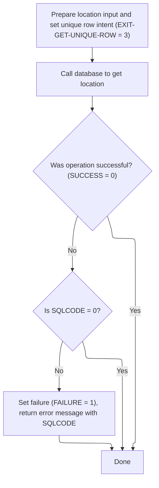
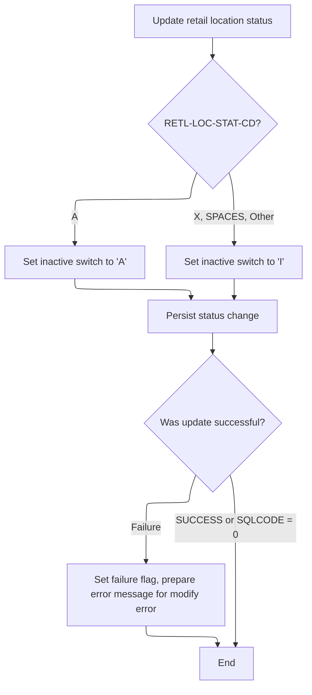

This document describes how the system updates the status of a retail location. The process starts with a request to update a location's status, retrieves the latest data for that location, and applies business rules to determine the new status before saving the change.

# Spec

## Detailed View of the Program's Functionality

# Detailed Explanation of the Status Update Flow in base/src/NNNS0488.cbl

---

## a. Initiating the Status Update

The process begins with a routine dedicated to updating the status in a specific table. This routine first saves the current exit codes to a working storage area to preserve their state. It then attempts to retrieve the latest location data by invoking a subroutine responsible for fetching this information. If this retrieval is successful, the process continues to synchronize the status code by calling another subroutine. Regardless of the outcome, the exit codes are restored to their original location at the end of the process.

---

## b. Retrieving Location Data

To fetch the latest location data, the process first prepares the input structure by clearing it and copying over the relevant location number and type code from the current context. It then sets a flag indicating that a unique row retrieval operation is intended. After this setup, it calls an external data access routine (DAO) that interacts with the database to fetch the required location data.

Once the DAO call completes, the process evaluates the outcome:

- If the operation was not successful but the SQL code indicates no error, it continues without setting a failure.
- If the operation was not successful and the SQL code indicates an error, it sets a failure flag, clears the return message text, records the SQL code, and constructs a detailed error message indicating a problem occurred while fetching a unique row from the location table.

---

## c. Calling the Location DAO

The actual interaction with the database is delegated to an external program (DAO). This DAO is called with all necessary parameters, including the input structure, SQL communication area, and other context information. The DAO is responsible for performing the database operation (such as select, update, or insert) and returning the results or status back to the calling routine.

---

## d. Syncing Status and Handling Update

After successfully retrieving the location data, the process proceeds to synchronize the status code. It evaluates the current status code of the retail location:

- If the status code is 'A', it sets the inactive switch to 'A' (active).
- If the status code is 'X', blank, or any other value, it sets the inactive switch to 'I' (inactive).

Once the appropriate value is set, it flags that a modify operation is required and calls the DAO again to persist the status change in the database.

After the DAO call, the process checks the result:

- If the operation was not successful but the SQL code is zero, it continues without error.
- If the operation was not successful and the SQL code is not zero, it sets a failure flag, clears the return message text, records the SQL code, and constructs a detailed error message indicating a problem occurred while modifying the location table.

---

## e. Summary of the Flow

1. **Preparation:** Save current exit codes and prepare for status update.
2. **Data Retrieval:** Fetch the latest location data from the database using a DAO, handling errors as needed.
3. **Status Synchronization:** Based on the retrieved data, determine the correct inactive/active status and update the database accordingly.
4. **Error Handling:** At each step, check for errors and construct meaningful error messages if problems occur.
5. **Cleanup:** Restore exit codes to their original state.

---

This flow ensures that the status update is only attempted if the latest location data is successfully retrieved, and that all errors are handled gracefully with informative messages. The use of external DAO routines abstracts the database operations, making the main program logic focused on business rules and error handling.

# Rule Definition

| Paragraph Name                                                                            | Rule ID | Category          | Description                                                                                                                                                                                                                                                                                     | Conditions                                                                                                                                        | Remarks                                                                                                                                                                                                                                                        |
| ----------------------------------------------------------------------------------------- | ------- | ----------------- | ----------------------------------------------------------------------------------------------------------------------------------------------------------------------------------------------------------------------------------------------------------------------------------------------- | ------------------------------------------------------------------------------------------------------------------------------------------------- | -------------------------------------------------------------------------------------------------------------------------------------------------------------------------------------------------------------------------------------------------------------- |
| 100-INITIALIZATION, 110-MOVE-PDA-FIELDS-2-DCL                                             | RL-001  | Data Assignment   | The system must receive a request to update the status of a retail location, with input fields for location number, location type code, and retail location status code. These fields must be validated for presence and correct format before proceeding.                                      | A request is received with LOC-NBR (numeric, 7 digits), LOC-TYP-CD (alphanumeric, 1 character), and RETL-LOC-STAT-CD (alphanumeric, 1 character). | LOC-NBR: number, 7 digits; LOC-TYP-CD: string, 1 character; RETL-LOC-STAT-CD: string, 1 character. All must be present and valid.                                                                                                                              |
| 1200-EXIT-GET-UNIQUE-ROW, 2200-GET-xxxation, 3000-CALL-LO-DAO                             | RL-002  | Conditional Logic | The system must retrieve the latest location data from the XXXAIL_LOC table using LOC-NBR and LOC-TYP-CD as keys. Processing only continues if the retrieval is successful (SQLCODE = 0).                                                                                                       | LOC-NBR and LOC-TYP-CD are provided and valid. SQL SELECT returns SQLCODE = 0.                                                                    | SQLCODE = 0 indicates success. Retrieval is done via a SELECT statement using the provided keys.                                                                                                                                                               |
| 2200-GET-xxxation, 1200-EXIT-GET-UNIQUE-ROW                                               | RL-003  | Conditional Logic | If the retrieval of location data is unsuccessful, the system must set RETURN-CODE to 1 (FAILURE), populate IS-RTRN-MSG-TXT with an error message including the SQLCODE, and return the parameter block without updating the database.                                                          | SQLCODE != 0 after attempting to retrieve location data.                                                                                          | RETURN-CODE: number, 0 (success) or 1 (failure). IS-RTRN-MSG-TXT: string, includes error and SQLCODE. No database update occurs.                                                                                                                               |
| 2300-SYNC-STAT-CODE                                                                       | RL-004  | Conditional Logic | If retrieval is successful, the system must set INACTIVE-SW based on RETL-LOC-STAT-CD: 'A' sets INACTIVE-SW to 'A'; 'X', space, or any other value sets INACTIVE-SW to 'I'.                                                                                                                     | SQLCODE = 0 and RETL-LOC-STAT-CD is present.                                                                                                      | INACTIVE-SW: string, 1 character. 'A' for active, 'I' for inactive. RETL-LOC-STAT-CD: string, 1 character.                                                                                                                                                     |
| 2300-SYNC-STAT-CODE, 3000-CALL-LO-DAO, 1440-D0-MODIFY-ROW, 5000-CALL-NNNU0488-CUD-ROUTINE | RL-005  | Computation       | The system must persist the updated INACTIVE-SW value to the XXXAIL_LOC table for the specified location.                                                                                                                                                                                       | INACTIVE-SW has been set and retrieval was successful.                                                                                            | Update is performed via an UPDATE statement or equivalent DAO call. INACTIVE-SW is written as a 1-character string.                                                                                                                                            |
| 2300-SYNC-STAT-CODE, 1440-D0-MODIFY-ROW, 5000-CALL-NNNU0488-CUD-ROUTINE                   | RL-006  | Conditional Logic | After attempting to persist the change, the system must check the result: if update is successful (SQLCODE = 0), set RETURN-CODE to 0 and IS-RTRN-MSG-TXT to a success message; if update fails (SQLCODE != 0), set RETURN-CODE to 1 and IS-RTRN-MSG-TXT to an error message including SQLCODE. | Update operation attempted on XXXAIL_LOC.                                                                                                         | RETURN-CODE: number, 0 (success) or 1 (failure). IS-RTRN-MSG-TXT: string, includes success or error message and SQLCODE.                                                                                                                                       |
| 120-EXIT-STUFF, 130-MOVE-DCL-2-PDA-FIELDS, 2300-SYNC-STAT-CODE                            | RL-007  | Data Assignment   | The system must return the updated parameter block (P-DDDTLO01) containing all relevant fields, including LOC-NBR, LOC-TYP-CD, RETL-LOC-STAT-CD, INACTIVE-SW, IS-RTRN-MSG-TXT, RETURN-CODE, and SQLCODE.                                                                                        | Processing is complete (success or failure).                                                                                                      | P-DDDTLO01: structure containing all relevant fields. Field types: LOC-NBR (number, 7 digits), LOC-TYP-CD (string, 1 char), RETL-LOC-STAT-CD (string, 1 char), INACTIVE-SW (string, 1 char), IS-RTRN-MSG-TXT (string), RETURN-CODE (number), SQLCODE (number). |
| 2300-SYNC-STAT-CODE, 5000-CALL-NNNU0488-CUD-ROUTINE                                       | RL-008  | Computation       | The XXXAIL_LOC table must reflect the updated INACTIVE-SW value for the specified location if the update was successful.                                                                                                                                                                        | Update operation completed with SQLCODE = 0.                                                                                                      | INACTIVE-SW in XXXAIL_LOC must match the value in the output parameter block if update succeeded.                                                                                                                                                              |

# User Stories

## User Story 1: Process retail location status update request

---

### Story Description:

As a system, I want to receive and validate a request to update the status of a retail location, retrieve the latest location data, and handle retrieval errors so that only valid and existing locations are processed and appropriate error messages are returned if retrieval fails.

---

### Business Rule Mapping:

| Rule ID | Paragraph Name                                                | Rule Description                                                                                                                                                                                                                                           |
| ------- | ------------------------------------------------------------- | ---------------------------------------------------------------------------------------------------------------------------------------------------------------------------------------------------------------------------------------------------------- |
| RL-003  | 2200-GET-xxxation, 1200-EXIT-GET-UNIQUE-ROW                   | If the retrieval of location data is unsuccessful, the system must set RETURN-CODE to 1 (FAILURE), populate IS-RTRN-MSG-TXT with an error message including the SQLCODE, and return the parameter block without updating the database.                     |
| RL-001  | 100-INITIALIZATION, 110-MOVE-PDA-FIELDS-2-DCL                 | The system must receive a request to update the status of a retail location, with input fields for location number, location type code, and retail location status code. These fields must be validated for presence and correct format before proceeding. |
| RL-002  | 1200-EXIT-GET-UNIQUE-ROW, 2200-GET-xxxation, 3000-CALL-LO-DAO | The system must retrieve the latest location data from the XXXAIL_LOC table using LOC-NBR and LOC-TYP-CD as keys. Processing only continues if the retrieval is successful (SQLCODE = 0).                                                                  |

---

### Relevant Functionality:

- **2200-GET-xxxation**
  1. **RL-003:**
     - If SQLCODE != 0 after SELECT, set RETURN-CODE to 1.
     - Populate IS-RTRN-MSG-TXT with error message and SQLCODE.
     - Return parameter block as output.
- **100-INITIALIZATION**
  1. **RL-001:**
     - On program start, initialize all working storage and parameter areas.
     - Move input fields from parameter block to working storage.
     - Validate that required fields are present and correctly formatted.
     - If any field is missing or invalid, set RETURN-CODE to 1, populate IS-RTRN-MSG-TXT with an error, and return.
- **1200-EXIT-GET-UNIQUE-ROW**
  1. **RL-002:**
     - Execute SELECT on XXXAIL_LOC with LOC-NBR and LOC-TYP-CD as keys.
     - If SQLCODE = 0, continue processing.
     - If SQLCODE != 0, set RETURN-CODE to 1, populate IS-RTRN-MSG-TXT with error message including SQLCODE, and return parameter block.

## User Story 2: Update and persist retail location status

---

### Story Description:

As a system, I want to determine the correct INACTIVE-SW value based on the requested status code, persist the change to the database, and handle update results so that the location's status is accurately updated and users are informed of success or failure.

---

### Business Rule Mapping:

| Rule ID | Paragraph Name                                                                            | Rule Description                                                                                                                                                                                                                                                                                |
| ------- | ----------------------------------------------------------------------------------------- | ----------------------------------------------------------------------------------------------------------------------------------------------------------------------------------------------------------------------------------------------------------------------------------------------- |
| RL-004  | 2300-SYNC-STAT-CODE                                                                       | If retrieval is successful, the system must set INACTIVE-SW based on RETL-LOC-STAT-CD: 'A' sets INACTIVE-SW to 'A'; 'X', space, or any other value sets INACTIVE-SW to 'I'.                                                                                                                     |
| RL-005  | 2300-SYNC-STAT-CODE, 3000-CALL-LO-DAO, 1440-D0-MODIFY-ROW, 5000-CALL-NNNU0488-CUD-ROUTINE | The system must persist the updated INACTIVE-SW value to the XXXAIL_LOC table for the specified location.                                                                                                                                                                                       |
| RL-006  | 2300-SYNC-STAT-CODE, 1440-D0-MODIFY-ROW, 5000-CALL-NNNU0488-CUD-ROUTINE                   | After attempting to persist the change, the system must check the result: if update is successful (SQLCODE = 0), set RETURN-CODE to 0 and IS-RTRN-MSG-TXT to a success message; if update fails (SQLCODE != 0), set RETURN-CODE to 1 and IS-RTRN-MSG-TXT to an error message including SQLCODE. |

---

### Relevant Functionality:

- **2300-SYNC-STAT-CODE**
  1. **RL-004:**
     - If RETL-LOC-STAT-CD = 'A', set INACTIVE-SW to 'A'.
     - If RETL-LOC-STAT-CD = 'X', space, or any other value, set INACTIVE-SW to 'I'.
  2. **RL-005:**
     - After setting INACTIVE-SW, call the DAO update routine to persist the change to XXXAIL_LOC.
     - Pass all required fields, including INACTIVE-SW, to the update routine.
  3. **RL-006:**
     - After update, check SQLCODE.
     - If SQLCODE = 0, set RETURN-CODE to 0 and IS-RTRN-MSG-TXT to success message.
     - If SQLCODE != 0, set RETURN-CODE to 1 and IS-RTRN-MSG-TXT to error message with SQLCODE.

## User Story 3: Return updated status and ensure consistency

---

### Story Description:

As a system, I want to return the updated parameter block with all relevant fields and ensure the database reflects the new status if the update was successful so that users receive complete feedback and data integrity is maintained.

---

### Business Rule Mapping:

| Rule ID | Paragraph Name                                                 | Rule Description                                                                                                                                                                                         |
| ------- | -------------------------------------------------------------- | -------------------------------------------------------------------------------------------------------------------------------------------------------------------------------------------------------- |
| RL-008  | 2300-SYNC-STAT-CODE, 5000-CALL-NNNU0488-CUD-ROUTINE            | The XXXAIL_LOC table must reflect the updated INACTIVE-SW value for the specified location if the update was successful.                                                                                 |
| RL-007  | 120-EXIT-STUFF, 130-MOVE-DCL-2-PDA-FIELDS, 2300-SYNC-STAT-CODE | The system must return the updated parameter block (P-DDDTLO01) containing all relevant fields, including LOC-NBR, LOC-TYP-CD, RETL-LOC-STAT-CD, INACTIVE-SW, IS-RTRN-MSG-TXT, RETURN-CODE, and SQLCODE. |

---

### Relevant Functionality:

- **2300-SYNC-STAT-CODE**
  1. **RL-008:**
     - After successful update (SQLCODE = 0), verify that INACTIVE-SW in XXXAIL_LOC matches the intended value.
     - No further action if update failed.
- **120-EXIT-STUFF**
  1. **RL-007:**
     - Move all updated fields to the output parameter block.
     - Ensure all fields are present and correctly formatted.
     - Return the parameter block as the response.

# Code Walkthrough

## Initiating Status Update

<SwmSnippet path="/base/src/NNNS0488.cbl" line="3799">

---

`2100-UPD-STAT-IN-xxxation` starts by prepping for a status update, grabs the latest location data, and only syncs the status if the fetch succeeds.

```cobol
382000 2100-UPD-STAT-IN-xxxation.                                       00382000
382100     MOVE NNNN0000-EXIT-CODES TO WS-NNNN0000-EXIT-CODES           00382100
382200                                                                  00382200
382300     PERFORM 2200-GET-xxxation                                    00382300
382400     IF SUCCESS                                                   00382400
382500       PERFORM 2300-SYNC-STAT-CODE                                00382500
382600     END-IF                                                       00382600
382700                                                                  00382700
382800     MOVE WS-NNNN0000-EXIT-CODES TO NNNN0000-EXIT-CODES           00382800
382900     .                                                            00382900
```

---

</SwmSnippet>

### Retrieving Location Data



<SwmSnippet path="/base/src/NNNS0488.cbl" line="3814">

---

`2200-GET-xxxation` sets up the location parameters and flags that we want a unique row, then calls `3000-CALL-LO-DAO` to fetch the actual data from the database. After the call, it checks for errors and handles them by setting failure flags and building error messages if needed.

```cobol
383500 2200-GET-xxxation.                                               00383500
383600     INITIALIZE P-DDDTLO01                                        00383600
383700     MOVE LOC-NBR                    OF DCLXXXAIL-LOC             00383700
383800       TO LOC-NBR                    OF P-DDDTLO01                00383800
383900     MOVE LOC-TYP-CD                 OF DCLXXXAIL-LOC             00383900
384000       TO LOC-TYP-CD                 OF P-DDDTLO01                00384000
384100                                                                  00384100
384200     SET EXIT-GET-UNIQUE-ROW         TO TRUE                      00384200
384300     PERFORM 3000-CALL-LO-DAO                                     00384300
384400                                                                  00384400
384500     EVALUATE TRUE                                                00384500
384600         WHEN NOT SUCCESS                                         00384600
384700           CONTINUE                                               00384700
384800         WHEN SQLCODE = 0                                         00384800
384900           CONTINUE                                               00384900
385000         WHEN OTHER                                               00385000
385100           SET FAILURE               TO TRUE                      00385100
385200           MOVE SPACES               TO IS-RTRN-MSG-TXT           00385200
385300           MOVE SQLCODE              TO WS-SQLCODE                00385300
385400           STRING 'NNNS0488 - Get unique error on xxxation table' 00385400
385500                  'SQL = ' WS-SQLCODE                             00385500
385600           DELIMITED BY SIZE INTO IS-RTRN-MSG-TXT                 00385600
385700     END-EVALUATE                                                 00385700
385800     .                                                            00385800
```

---

</SwmSnippet>

<SwmSnippet path="/base/src/NNNS0488.cbl" line="3938">

---

`3000-CALL-LO-DAO` calls out to NNNS0487-LO-DAO, which is the external program that actually interacts with the database for location data. All the relevant parameters are passed so it can perform the right operation and return the results needed for the rest of the flow.

```cobol
396400 3000-CALL-LO-DAO.                                                00396400
396500     CALL NNNS0487-LO-DAO USING                                   00396500
396600          XXXN001A                                                00396600
396700          SQLCA                                                   00396700
396800          YYYN005A                                                00396800
396900          NNNN0000-PARMS                                          00396900
397000          P-DDDTLO01                                              00397000
397100     .                                                            00397100
```

---

</SwmSnippet>

### Syncing Status and Handling Update



<SwmSnippet path="/base/src/NNNS0488.cbl" line="3843">

---

`2300-SYNC-STAT-CODE` checks the location status code and sets the inactive switch based on business rules. It then flags that a modify operation is needed and calls the DAO to update the database. After the call, it handles errors by checking the result and building an error message if the update fails.

```cobol
386400 2300-SYNC-STAT-CODE.                                             00386400
386500     EVALUATE TRUE                                                00386500
386600       WHEN RETL-LOC-STAT-CD OF DCLXXXAIL-LOC = 'A'               00386600
386700          MOVE 'A'           TO INACTIVE-SW OF P-DDDTLO01         00386700
386800       WHEN RETL-LOC-STAT-CD OF DCLXXXAIL-LOC = 'X'               00386800
386900          MOVE 'I'           TO INACTIVE-SW OF P-DDDTLO01         00386900
387000       WHEN RETL-LOC-STAT-CD OF DCLXXXAIL-LOC = SPACES            00387000
387100          MOVE 'I'           TO INACTIVE-SW OF P-DDDTLO01         00387100
387200       WHEN OTHER                                                 00387200
387300          MOVE 'I'           TO INACTIVE-SW OF P-DDDTLO01         00387300
387400     END-EVALUATE                                                 00387400
387500                                                                  00387500
387600     SET EXIT-PUT-MODIFY-ROW         TO TRUE                      00387600
387700     PERFORM 3000-CALL-LO-DAO                                     00387700
387800                                                                  00387800
387900     EVALUATE TRUE                                                00387900
388000         WHEN NOT SUCCESS                                         00388000
388100           CONTINUE                                               00388100
388200         WHEN SQLCODE = 0                                         00388200
388300           CONTINUE                                               00388300
388400         WHEN OTHER                                               00388400
388500           SET FAILURE               TO TRUE                      00388500
388600           MOVE SPACES               TO IS-RTRN-MSG-TXT           00388600
388700           MOVE SQLCODE              TO WS-SQLCODE                00388700
388800           STRING 'NNNS0488 - Modify error on xxxation table'     00388800
388900                  'SQL = ' WS-SQLCODE                             00388900
389000           DELIMITED BY SIZE INTO IS-RTRN-MSG-TXT                 00389000
389100     END-EVALUATE                                                 00389100
389200     .                                                            00389200
```

---

</SwmSnippet>

&nbsp;

*This is an auto-generated document by Swimm 🌊 and has not yet been verified by a human*

<SwmMeta version="3.0.0" repo-id="Z2l0aHViJTNBJTNBU3dpbW1pby1keW5jYWxsLWRlbW8lM0ElM0FHaXJpLVN3aW1t" repo-name="Swimmio-dyncall-demo"><sup>Powered by [Swimm](https://app.swimm.io/)</sup></SwmMeta>
