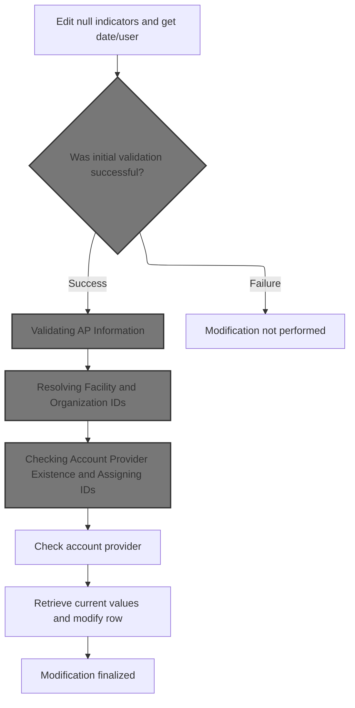
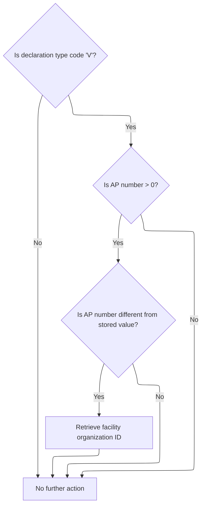
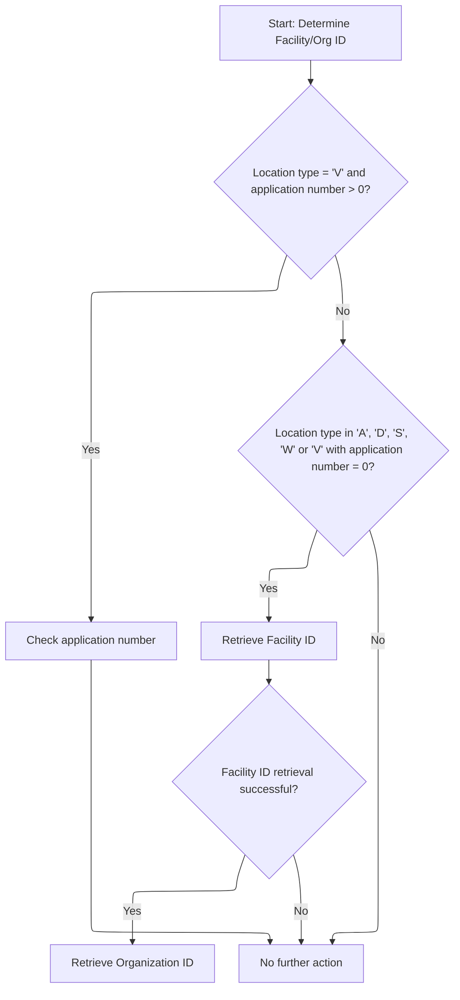
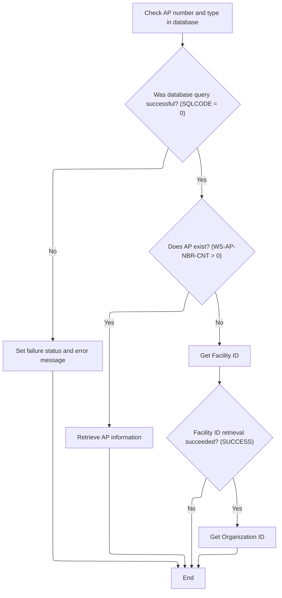
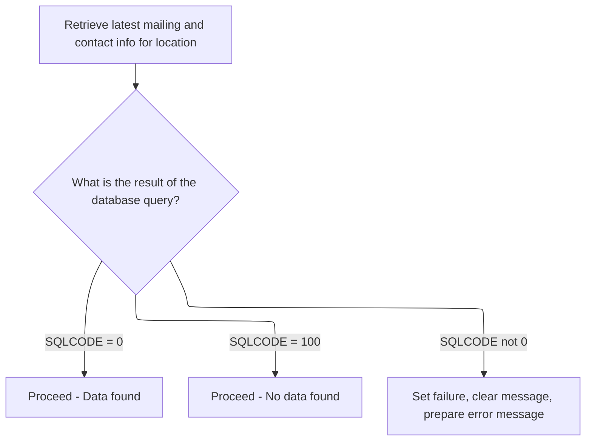

This document describes the process for validating and updating location data. Updates are only applied if all validations succeed, maintaining data integrity for location records. The flow checks for pending events, updates account provider, facility, and organization information, and refreshes mailing and contact details.

# Spec

## Detailed View of the Program's Functionality

# Validating and Updating Location Data

## a. Initial Edit and Preparation

The main update flow for modifying a location row begins by performing a check and edit of null indicators for certain fields, ensuring that any missing or empty values are properly flagged. Immediately after, the current date and user information are retrieved and stored for audit and tracking purposes.

## b. Checking for Pending Events

Before proceeding with any further updates, the system checks if there are any pending events or states that would block updates for the location. This involves:

- Retrieving the account provider number and type from the database if the location type is either 'V' or 'D'.
- If the retrieval is successful, the system validates the activity switch to determine if the location is active, inactive, or deleted, and updates the relevant dates accordingly.
- If the retrieval fails, an error is flagged and the process stops.

## c. Validating AP (Account Provider) Information

If the previous checks succeed, the system then validates the account provider information, but only for locations of type 'V' (vendor). This step checks:

- If the account provider number is greater than zero.
- If the account provider number has changed compared to the previously stored value.
- If it has changed, the system triggers a process to resolve or generate new facility and organization IDs as needed.

## d. Resolving Facility and Organization IDs

Depending on the location type and the presence or absence of an account provider number, the system determines how to assign or generate facility and organization IDs:

- For vendor locations with a valid account provider number, it checks if the account provider exists in the database.
  - If it does not exist, it generates a new facility ID and, if successful, a new organization ID.
  - If it does exist, it retrieves the existing facility and organization IDs.
- For other location types or vendor locations without an account provider number, it generates new IDs as needed.

## e. Checking Account Provider Existence and Assigning IDs

When checking for the existence of an account provider:

- The system queries the database for a matching account provider number and type.
- If the query is successful and the provider does not exist, it generates new facility and organization IDs.
- If the provider exists, it retrieves the current facility and organization IDs.
- Any errors during this process result in a failure flag and an error message.

## f. Fetching and Applying Current Location Values

Before finalizing the modification, the system retrieves the latest mailing and contact information for the location from the database. This ensures that any changes can be compared to the current state, and that updates are based on the most recent data. If the query fails, an error is flagged; otherwise, the process continues.

## g. Finalizing the Modification

If all previous steps succeed:

- The system performs a final check and edit of null indicators.
- The actual modification of the row is performed, updating the database with the new values.
- If the modification is successful, various flags are set to indicate which types of records have been updated, and additional processes may be triggered (such as event issuance or denormalization).
- If the modification fails, an error is flagged and no partial updates are committed.

## h. Handling Failure Cases

At any point, if a failure is detected (such as a failed validation, a blocked event, or a database error), the modification is not performed, and the process exits with an appropriate error message. This ensures that only fully validated and consistent updates are applied to the database, and that no partial or invalid data is saved.

---

This flow ensures that all necessary validations, ID assignments, and data consistency checks are performed before any modification to a location record is finalized, maintaining data integrity and proper audit trails throughout the process.

# Rule Definition

| Paragraph Name                                                                                                                       | Rule ID | Category          | Description                                                                                                                                                                                                                          | Conditions                                              | Remarks                                                                                                                                     |
| ------------------------------------------------------------------------------------------------------------------------------------ | ------- | ----------------- | ------------------------------------------------------------------------------------------------------------------------------------------------------------------------------------------------------------------------------------ | ------------------------------------------------------- | ------------------------------------------------------------------------------------------------------------------------------------------- |
| 100-INITIALIZATION, 110-MOVE-PDA-FIELDS-2-DCL, 1400-EXIT-PUT-MODIFY-ROW, 1500-EXIT-PUT-INSERT-ROW                                    | RL-001  | Data Assignment   | The program must validate and update location data based on the input structure provided via linkage (P-DDDTLO01), which contains all relevant fields for a location record.                                                         | Input structure P-DDDTLO01 is provided via linkage.     | All fields in the input structure are mapped to the internal DCLXXXATION structure. Field types are preserved (e.g., string, number, date). |
| 1800-EDIT-NULL-INDICATORS, 1700-CHECK-NULL-COLUMNS                                                                                   | RL-002  | Conditional Logic | If AP_NBR is zero or AP_TYP_CD is blank, set both null indicators to -1; otherwise, set to 0.                                                                                                                                        | AP_NBR = 0 or AP_TYP_CD is blank (spaces).              | Null indicators are numeric fields. -1 indicates null, 0 indicates not null.                                                                |
| 2040-GET-DATE-AND-USER, 1440-D0-MODIFY-ROW, 1510-D0-INSERT-ROW                                                                       | RL-003  | Data Assignment   | Retrieve and set the current date and user for audit fields (e.g., LST_UPDT_TS, LST_UPDT_USR_ID) during modification or insert.                                                                                                      | A modification or insert operation is performed.        | Audit fields are date (YYYY-MM-DD) and string (user ID).                                                                                    |
| 1411-CHECK-FOR-EVENTS, 1412-GET-AP-NBR, 1414-VALIDATE-ACTIV-SW                                                                       | RL-004  | Conditional Logic | If any blocking event or state is detected for the location, the update must not be performed and a failure status must be returned.                                                                                                 | Blocking event or state is detected for the location.   | Failure status is set and error message is returned.                                                                                        |
| 1420-CHECK-AP-INFO, 1505-GET-FAC-ORG-ID, 1515-CHECK-AP-NBR, 1520-GET-AP-INFO                                                         | RL-005  | Conditional Logic | For locations with LOC_TYP_CD = 'V', if AP_NBR is nonzero and has changed, facility and organization IDs must be updated accordingly.                                                                                                | LOC_TYP_CD = 'V' and AP_NBR > 0 and AP_NBR has changed. | Facility and organization IDs are numeric fields.                                                                                           |
| 1505-GET-FAC-ORG-ID, 1515-CHECK-AP-NBR, 1520-GET-AP-INFO, 1525-EXIT-GET-FAC-ID, 1530-EXIT-GET-ORG-ID                                 | RL-006  | Computation       | For LOC_TYP_CD in ('V', 'D', 'A', 'S', 'W') and AP_NBR > 0, check if the account provider exists and assign or generate IDs as needed.                                                                                               | LOC_TYP_CD in ('V', 'D', 'A', 'S', 'W') and AP_NBR > 0. | Facility and organization IDs are assigned from database or generated by incrementing the highest existing value.                           |
| 1515-CHECK-AP-NBR, 1520-GET-AP-INFO, 1525-EXIT-GET-FAC-ID, 1530-EXIT-GET-ORG-ID                                                      | RL-007  | Conditional Logic | If the provider does not exist, generate new facility and organization IDs by incrementing the highest existing ORG_ID from both XXXATION and STR_DEPT tables.                                                                       | Account provider does not exist in the database.        | ORG_ID is set to max(ORG_ID from XXXATION, ORG_ID from STR_DEPT) + 1.                                                                       |
| 1430-GET-CURRENT-VALUES                                                                                                              | RL-008  | Data Assignment   | Retrieve current mailing and contact information for the location from XXXATION before modification. If no data is found, continue; if a database error occurs, return failure status and error message.                             | Modification operation is being performed.              | Mailing and contact fields are strings and numbers as per schema.                                                                           |
| 1414-VALIDATE-ACTIV-SW                                                                                                               | RL-009  | Conditional Logic | Apply rules for INACTIVE_SW: set INACTIVE_DT and DELETE_DT based on INACTIVE_SW value and current/default date.                                                                                                                      | INACTIVE_SW is set to 'I', 'D', 'A', or other value.    | INACTIVE_SW is a single character; dates are in YYYY-MM-DD format or blank if default.                                                      |
| Throughout, especially 1412-GET-AP-NBR, 1430-GET-CURRENT-VALUES, 1612-FETCH-DEL-CSR1, 1613-EXIT-PURGE-RETL, 1693-FETCH-DEL-CSR, etc. | RL-010  | Conditional Logic | Handle SQLCODE values as follows: 0=Success, 100=No data found (not error), -532/-84=Referential integrity error (return specific message), other negative=return error message with SQLCODE.                                        | After any SQL operation.                                | Error messages include SQLCODE as string. Specific message for -532/-84: 'NNNS0487 - XXXATION in use - it cannot be deleted!'.              |
| 130-MOVE-DCL-2-PDA-FIELDS, 1700-CHECK-NULL-COLUMNS, 120-EXIT-STUFF                                                                   | RL-011  | Data Assignment   | Output all date fields in YYYY-MM-DD format; if equal to default date (K-DEF-DT), output as blank string. Output all timestamp fields in ISO8601 format. Output all string fields as empty strings if blank or NULL in the database. | On output of any record.                                | Date fields: string, 10 chars, YYYY-MM-DD; blank if default. Timestamp: ISO8601 string. Strings: blank if null/empty.                       |
| 130-MOVE-DCL-2-PDA-FIELDS, 120-EXIT-STUFF                                                                                            | RL-012  | Data Assignment   | The program must always return the full updated record in the output, not just changed fields.                                                                                                                                       | On any output operation.                                | All fields in the record are included in the output structure, with appropriate formatting.                                                 |

# User Stories

## User Story 1: Update location record with validation and audit fields

---

### Story Description:

As a system, I want to validate and update location data based on the provided input structure so that all relevant fields are correctly updated, audit fields are set, and the full updated record is returned in the correct format.

---

### Business Rule Mapping:

| Rule ID | Paragraph Name                                                                                    | Rule Description                                                                                                                                                                                                                     |
| ------- | ------------------------------------------------------------------------------------------------- | ------------------------------------------------------------------------------------------------------------------------------------------------------------------------------------------------------------------------------------ |
| RL-008  | 1430-GET-CURRENT-VALUES                                                                           | Retrieve current mailing and contact information for the location from XXXATION before modification. If no data is found, continue; if a database error occurs, return failure status and error message.                             |
| RL-001  | 100-INITIALIZATION, 110-MOVE-PDA-FIELDS-2-DCL, 1400-EXIT-PUT-MODIFY-ROW, 1500-EXIT-PUT-INSERT-ROW | The program must validate and update location data based on the input structure provided via linkage (P-DDDTLO01), which contains all relevant fields for a location record.                                                         |
| RL-003  | 2040-GET-DATE-AND-USER, 1440-D0-MODIFY-ROW, 1510-D0-INSERT-ROW                                    | Retrieve and set the current date and user for audit fields (e.g., LST_UPDT_TS, LST_UPDT_USR_ID) during modification or insert.                                                                                                      |
| RL-011  | 130-MOVE-DCL-2-PDA-FIELDS, 1700-CHECK-NULL-COLUMNS, 120-EXIT-STUFF                                | Output all date fields in YYYY-MM-DD format; if equal to default date (K-DEF-DT), output as blank string. Output all timestamp fields in ISO8601 format. Output all string fields as empty strings if blank or NULL in the database. |
| RL-012  | 130-MOVE-DCL-2-PDA-FIELDS, 120-EXIT-STUFF                                                         | The program must always return the full updated record in the output, not just changed fields.                                                                                                                                       |

---

### Relevant Functionality:

- **1430-GET-CURRENT-VALUES**
  1. **RL-008:**
     - Query XXXATION for current mailing/contact info
     - If found, store in working storage
     - If not found, continue
     - If DB error, set failure and return error message
- **100-INITIALIZATION**
  1. **RL-001:**
     - On initialization, move all fields from input structure to internal structure.
     - Validate and normalize date fields (e.g., set to default if blank).
     - On modification or insert, update internal structure from input.
- **2040-GET-DATE-AND-USER**
  1. **RL-003:**
     - Call date and user retrieval routine
     - Set LST_UPDT_TS to current timestamp
     - Set LST_UPDT_USR_ID to current user
- **130-MOVE-DCL-2-PDA-FIELDS**
  1. **RL-011:**
     - For each date field:
       - If value = default date, output blank
       - Else, output as YYYY-MM-DD
     - For each timestamp field, output as ISO8601 string
     - For each string field, output as blank if null/empty
  2. **RL-012:**
     - On output, move all fields from internal structure to output structure
     - Ensure all fields are present and formatted as per rules

## User Story 2: Manage account provider linkage and AP information

---

### Story Description:

As a system, I want to handle AP_NBR and AP_TYP_CD logic, validate AP information, and assign or generate facility and organization IDs as needed so that account provider linkage is correctly maintained for each location type.

---

### Business Rule Mapping:

| Rule ID | Paragraph Name                                                                                       | Rule Description                                                                                                                                               |
| ------- | ---------------------------------------------------------------------------------------------------- | -------------------------------------------------------------------------------------------------------------------------------------------------------------- |
| RL-005  | 1420-CHECK-AP-INFO, 1505-GET-FAC-ORG-ID, 1515-CHECK-AP-NBR, 1520-GET-AP-INFO                         | For locations with LOC_TYP_CD = 'V', if AP_NBR is nonzero and has changed, facility and organization IDs must be updated accordingly.                          |
| RL-006  | 1505-GET-FAC-ORG-ID, 1515-CHECK-AP-NBR, 1520-GET-AP-INFO, 1525-EXIT-GET-FAC-ID, 1530-EXIT-GET-ORG-ID | For LOC_TYP_CD in ('V', 'D', 'A', 'S', 'W') and AP_NBR > 0, check if the account provider exists and assign or generate IDs as needed.                         |
| RL-007  | 1515-CHECK-AP-NBR, 1520-GET-AP-INFO, 1525-EXIT-GET-FAC-ID, 1530-EXIT-GET-ORG-ID                      | If the provider does not exist, generate new facility and organization IDs by incrementing the highest existing ORG_ID from both XXXATION and STR_DEPT tables. |
| RL-002  | 1800-EDIT-NULL-INDICATORS, 1700-CHECK-NULL-COLUMNS                                                   | If AP_NBR is zero or AP_TYP_CD is blank, set both null indicators to -1; otherwise, set to 0.                                                                  |

---

### Relevant Functionality:

- **1420-CHECK-AP-INFO**
  1. **RL-005:**
     - If location type is 'V' and AP_NBR > 0:
       - If AP_NBR has changed:
         - Update facility and organization IDs
- **1505-GET-FAC-ORG-ID**
  1. **RL-006:**
     - If location type and AP_NBR conditions met:
       - Check if account provider exists
       - If exists, assign IDs from DB
       - If not, generate new IDs by incrementing max value
- **1515-CHECK-AP-NBR**
  1. **RL-007:**
     - If provider not found in DB:
       - Get max FAC_ID from XXXATION, increment by 1
       - Get max ORG_ID from XXXATION and STR_DEPT, increment by 1
       - Assign to new record
- **1800-EDIT-NULL-INDICATORS**
  1. **RL-002:**
     - If AP_TYP_CD is blank or AP_NBR is 0:
       - Set AP_NBR null indicator to -1
       - Set AP_TYP_CD null indicator to -1
     - Else:
       - Set both indicators to 0

## User Story 3: Block updates for pending events and handle INACTIVE_SW logic

---

### Story Description:

As a system, I want to prevent updates when blocking events or states are detected and apply rules for INACTIVE_SW so that location status is managed correctly and invalid updates are avoided.

---

### Business Rule Mapping:

| Rule ID | Paragraph Name                                                 | Rule Description                                                                                                                     |
| ------- | -------------------------------------------------------------- | ------------------------------------------------------------------------------------------------------------------------------------ |
| RL-004  | 1411-CHECK-FOR-EVENTS, 1412-GET-AP-NBR, 1414-VALIDATE-ACTIV-SW | If any blocking event or state is detected for the location, the update must not be performed and a failure status must be returned. |
| RL-009  | 1414-VALIDATE-ACTIV-SW                                         | Apply rules for INACTIVE_SW: set INACTIVE_DT and DELETE_DT based on INACTIVE_SW value and current/default date.                      |

---

### Relevant Functionality:

- **1411-CHECK-FOR-EVENTS**
  1. **RL-004:**
     - Check for events for the location
     - If blocking event/state found:
       - Set failure status
       - Return error message
- **1414-VALIDATE-ACTIV-SW**
  1. **RL-009:**
     - If INACTIVE_SW = 'I' or 'D' and INACTIVE_DT is blank/default, set to current date
     - If INACTIVE_SW = 'D' and DELETE_DT is blank/default, set to current date
     - If INACTIVE_SW = 'A', set INACTIVE_DT and DELETE_DT to default date if blank
     - If INACTIVE_SW is any other value, set failure and return error message

## User Story 4: Handle errors and output formatting consistently

---

### Story Description:

As a system, I want to handle SQLCODE values and format output fields consistently so that errors are reported clearly and output data meets required standards.

---

### Business Rule Mapping:

| Rule ID | Paragraph Name                                                                                                                       | Rule Description                                                                                                                                                                                                                     |
| ------- | ------------------------------------------------------------------------------------------------------------------------------------ | ------------------------------------------------------------------------------------------------------------------------------------------------------------------------------------------------------------------------------------ |
| RL-010  | Throughout, especially 1412-GET-AP-NBR, 1430-GET-CURRENT-VALUES, 1612-FETCH-DEL-CSR1, 1613-EXIT-PURGE-RETL, 1693-FETCH-DEL-CSR, etc. | Handle SQLCODE values as follows: 0=Success, 100=No data found (not error), -532/-84=Referential integrity error (return specific message), other negative=return error message with SQLCODE.                                        |
| RL-011  | 130-MOVE-DCL-2-PDA-FIELDS, 1700-CHECK-NULL-COLUMNS, 120-EXIT-STUFF                                                                   | Output all date fields in YYYY-MM-DD format; if equal to default date (K-DEF-DT), output as blank string. Output all timestamp fields in ISO8601 format. Output all string fields as empty strings if blank or NULL in the database. |

---

### Relevant Functionality:

- **Throughout**
  1. **RL-010:**
     - If SQLCODE = 0, continue
     - If SQLCODE = 100, treat as no error
     - If SQLCODE = -532 or -84, set failure and return specific message
     - If SQLCODE < 0 (other), set failure and return message with SQLCODE
- **130-MOVE-DCL-2-PDA-FIELDS**
  1. **RL-011:**
     - For each date field:
       - If value = default date, output blank
       - Else, output as YYYY-MM-DD
     - For each timestamp field, output as ISO8601 string
     - For each string field, output as blank if null/empty

# Code Walkthrough

## Validating and Updating Location Data



<SwmSnippet path="/base/src/NNNS0487.cbl" line="2304">

---

1400-EXIT-PUT-MODIFY-ROW kicks off the main update flow. It chains together a bunch of validation and update routines: first it flags missing/null fields, grabs the current date/user, then checks if any events need handling (1411-CHECK-FOR-EVENTS). That event check is needed early because if there's a pending event or a state that blocks updates, we want to bail out before doing more work. Only if all these checks pass (SUCCESS stays true), it moves on to AP info, county validation, and finally the actual row modification. The EXIT-PUT-MODIFY-ROW flag is only set if everything checks out, so nothing partial slips through.

```cobol
238100 1400-EXIT-PUT-MODIFY-ROW.                                        00238100
238200     PERFORM 1800-EDIT-NULL-INDICATORS                            00238200
238300     PERFORM 2040-GET-DATE-AND-USER                               00238300
238400                                                                  00238400
238500     IF SUCCESS                                                   00238500
238600       PERFORM 1411-CHECK-FOR-EVENTS                              00238600
238700       IF SUCCESS                                                 00238700
238800         PERFORM 1420-CHECK-AP-INFO                               00238800
238900         IF SUCCESS                                               00238900
239000*          PERFORM 10300-CHECK-FOR-VALID-COUNTY                   00239000
239100           SET EXIT-PUT-MODIFY-ROW  TO TRUE                       00239100
239200           IF SUCCESS                                             00239200
239300             PERFORM 1430-GET-CURRENT-VALUES                      00239300
239400             PERFORM 1800-EDIT-NULL-INDICATORS                    00239400
239500             PERFORM 1440-D0-MODIFY-ROW                           00239500
239600           END-IF                                                 00239600
239700         END-IF                                                   00239700
239800       END-IF                                                     00239800
239900     END-IF                                                       00239900
240000     .                                                            00240000
```

---

</SwmSnippet>

### Checking for Pending Events

<SwmSnippet path="/base/src/NNNS0487.cbl" line="2326">

---

1411-CHECK-FOR-EVENTS is where we check if anything is pending for this location. It first calls 1412-GET-AP-NBR to pull the AP number and type from the database, since those are needed to figure out if any activity switches are set. Only if that retrieval works (SUCCESS), it moves on to validate the activity switch. If the AP number can't be fetched, we skip the rest.

```cobol
240300 1411-CHECK-FOR-EVENTS.                                           00240300
240400     PERFORM 1412-GET-AP-NBR                                      00240400
240500     IF SUCCESS                                                   00240500
240600       PERFORM 1414-VALIDATE-ACTIV-SW                             00240600
240700     END-IF                                                       00240700
240800     .                                                            00240800
```

---

</SwmSnippet>

<SwmSnippet path="/base/src/NNNS0487.cbl" line="2334">

---

1412-GET-AP-NBR checks if the location type is 'V' or 'D' and, if so, runs a SQL SELECT to grab AP number and type from XXXATION. It handles nulls and missing data by initializing the outputs, and on errors, sets a failure flag and error message. The results are then moved to the old AP number/type fields for use in later steps.

```cobol
241100 1412-GET-AP-NBR.                                                 00241100
241200     IF LOC-TYP-CD OF DCLXXXATION = 'V' OR 'D'                    00241200
241300       EXEC SQL                                                   00241300
241400           SELECT AP_NBR,                                         00241400
241500                  AP_TYP_CD                                       00241500
241600           INTO :WS-AP-NUM:WS-AP-NBR-IND,                         00241600
241700                :WS-AP-TYPE:WS-AP-TYP-CD-IND                      00241700
241800           FROM XXXATION                                          00241800
241900           WHERE LOC_TYP_CD = :DCLXXXATION.LOC-TYP-CD             00241900
242000           AND  LOC_NBR = :DCLXXXATION.LOC-NBR                    00242000
242100       END-EXEC                                                   00242100
242200                                                                  00242200
242300       EVALUATE TRUE                                              00242300
242400         WHEN SQLCODE = 0                                         00242400
242500           IF WS-AP-NBR-IND < 0                                   00242500
242600           OR WS-AP-TYP-CD-IND < 0                                00242600
242700             INITIALIZE WS-AP-NUM                                 00242700
242800                        WS-AP-TYPE                                00242800
242900           END-IF                                                 00242900
243000         WHEN SQLCODE = 100                                       00243000
243100           INITIALIZE WS-AP-NUM                                   00243100
243200                      WS-AP-TYPE                                  00243200
243300           MOVE 0 TO SQLCODE                                      00243300
243400        WHEN OTHER                                                00243400
243500         SET FAILURE  TO TRUE                                     00243500
243600         MOVE SPACES  TO IS-RTRN-MSG-TXT                          00243600
243700         MOVE SQLCODE TO WS-SQLCODE                               00243700
243800         STRING 'NNNS0487 - Error in gathering events. SQL '      00243800
243900                WS-SQLCODE '.'                                    00243900
244000         DELIMITED BY SIZE INTO IS-RTRN-MSG-TXT                   00244000
244100       END-EVALUATE                                               00244100
244200       MOVE WS-AP-NUM   TO MMMC0474-OLD-AP-NBR                    00244200
244300       MOVE WS-AP-TYPE  TO MMMC0474-OLD-AP-TYP                    00244300
244400     END-IF                                                       00244400
244500     .                                                            00244500
```

---

</SwmSnippet>

### Validating AP Information



<SwmSnippet path="/base/src/NNNS0487.cbl" line="2404">

---

1420-CHECK-AP-INFO runs only for location type 'V' and when there's a nonzero AP number. If the AP number changed, it calls 1505-GET-FAC-ORG-ID to update facility and organization IDs as needed. If the AP number is the same, it skips the update.

```cobol
248100 1420-CHECK-AP-INFO.                                              00248100
248200     IF LOC-TYP-CD OF DCLXXXATION = 'V'                           00248200
248300       IF AP-NBR OF DCLXXXATION > 0                               00248300
248400         IF AP-NBR OF DCLXXXATION NOT EQUAL TO WS-AP-NUM          00248400
248500           PERFORM 1505-GET-FAC-ORG-ID                            00248500
248600         END-IF                                                   00248600
248700       END-IF                                                     00248700
248800     END-IF                                                       00248800
248900     .                                                            00248900
```

---

</SwmSnippet>

### Resolving Facility and Organization IDs



<SwmSnippet path="/base/src/NNNS0487.cbl" line="2503">

---

1505-GET-FAC-ORG-ID decides how to get or generate facility and organization IDs based on location type and AP number. For type 'V' with a valid AP number, it calls 1515-CHECK-AP-NBR to check if the provider exists and fetch or create IDs. For other types or missing AP number, it generates new IDs. EXIT-GET-ORG-ID is only called if getting the facility ID worked.

```cobol
258000 1505-GET-FAC-ORG-ID.                                             00258000
258100     EVALUATE TRUE                                                00258100
258200       WHEN LOC-TYP-CD OF DCLXXXATION = 'V'                       00258200
258300        AND AP-NBR OF DCLXXXATION > 0                             00258300
258400         PERFORM 1515-CHECK-AP-NBR                                00258400
258500       WHEN (LOC-TYP-CD OF DCLXXXATION = 'A' OR 'D' OR 'S' OR 'W')00258500
258600         OR (LOC-TYP-CD OF DCLXXXATION = 'V'                      00258600
258700        AND AP-NBR OF DCLXXXATION = 0)                            00258700
258800         PERFORM 1525-EXIT-GET-FAC-ID                             00258800
258900         IF SUCCESS                                               00258900
259000           PERFORM 1530-EXIT-GET-ORG-ID                           00259000
259100         END-IF                                                   00259100
259200       WHEN OTHER                                                 00259200
259300         CONTINUE                                                 00259300
259400     END-EVALUATE                                                 00259400
259500     .                                                            00259500
```

---

</SwmSnippet>

### Checking Account Provider Existence and Assigning IDs



<SwmSnippet path="/base/src/NNNS0487.cbl" line="2540">

---

1515-CHECK-AP-NBR checks if the AP number/type exists in the database. If not, it calls 1525-EXIT-GET-FAC-ID to generate a new facility ID, and if that works, 1530-EXIT-GET-ORG-ID to get a new org ID. If the AP exists, it just fetches the current info. Errors set a failure flag and message.

```cobol
261700 1515-CHECK-AP-NBR.                                               00261700
261800     MOVE AP-NBR    OF DCLXXXATION TO WS-AP-NUM                   00261800
261900     MOVE AP-TYP-CD OF DCLXXXATION TO WS-AP-TYPE                  00261900
262000                                                                  00262000
262100     EXEC SQL                                                     00262100
262200         SELECT COUNT(*)                                          00262200
262300         INTO   :WS-AP-NBR-CNT                                    00262300
262400         FROM XXXATION                                            00262400
262500         WHERE AP_TYP_CD = :WS-AP-TYPE                            00262500
262600           AND AP_NBR = :WS-AP-NUM                                00262600
262700     END-EXEC                                                     00262700
262800                                                                  00262800
262900     EVALUATE TRUE                                                00262900
263000       WHEN SQLCODE = 0                                           00263000
263100         IF WS-AP-NBR-CNT = 0                                     00263100
263200           PERFORM 1525-EXIT-GET-FAC-ID                           00263200
263300           IF SUCCESS                                             00263300
263400             PERFORM 1530-EXIT-GET-ORG-ID                         00263400
263500           END-IF                                                 00263500
263600         ELSE                                                     00263600
263700           PERFORM 1520-GET-AP-INFO                               00263700
263800         END-IF                                                   00263800
263900       WHEN OTHER                                                 00263900
264000         SET  FAILURE        TO TRUE                              00264000
264100         MOVE 'NNNS0487 - Error getting AP count!'                00264100
264200           TO IS-RTRN-MSG-TXT                                     00264200
264300     END-EVALUATE                                                 00264300
264400     .                                                            00264400
```

---

</SwmSnippet>

<SwmSnippet path="/base/src/NNNS0487.cbl" line="2614">

---

1530-EXIT-GET-ORG-ID runs a SQL query to get the highest ORG_ID from both XXXATION and STR_DEPT, then bumps it by one for the new assignment. This avoids ID collisions between the two tables. If the query fails, it sets a failure flag and error message.

```cobol
269100 1530-EXIT-GET-ORG-ID.                                            00269100
269200     EXEC SQL                                                     00269200
269300         SELECT GREATEST (MAX (LOC.ORG_ID), MAX (DEPT.ORG_ID))    00269300
269400         INTO   :DCLXXXATION.ORG-ID                               00269400
269500         FROM   XXXATION LOC, STR_DEPT DEPT                       00269500
269600     END-EXEC                                                     00269600
269700                                                                  00269700
269800     EVALUATE TRUE                                                00269800
269900       WHEN SQLCODE = 0                                           00269900
270000         COMPUTE ORG-ID OF DCLXXXATION =                          00270000
270100                 ORG-ID OF DCLXXXATION + 1                        00270100
270200       WHEN OTHER                                                 00270200
270300         SET  FAILURE TO TRUE                                     00270300
270400         MOVE 'NNNS0487 - Error getting ORG_ID!'                  00270400
270500           TO IS-RTRN-MSG-TXT                                     00270500
270600     END-EVALUATE                                                 00270600
270700     .                                                            00270700
```

---

</SwmSnippet>

### Fetching and Applying Current Location Values



<SwmSnippet path="/base/src/NNNS0487.cbl" line="2415">

---

1430-GET-CURRENT-VALUES pulls all the current mailing and contact info for the location from XXXATION using a SQL SELECT. If the query fails, it sets a failure flag and error message. Success or no data just continues, since sometimes a missing record is valid.

```cobol
249200 1430-GET-CURRENT-VALUES.                                         00249200
249300                                                                  00249300
249400     EXEC SQL                                                     00249400
249500         SELECT MAIL_TO_LOC_NM,                                   00249500
249600                MAIL_TO_ADR_1,                                    00249600
249700                MAIL_TO_ADR_2,                                    00249700
249800                MAIL_TO_CITY,                                     00249800
249900                MAIL_TO_STATE_CD,                                 00249900
250000                SEC_CONTACT_NM,                                   00250000
250100                MAIL_TO_ZIP5_CD,                                  00250100
250200                MAIL_TO_ZIP4_CD,                                  00250200
250300                MAIL_TO_PHONE_NBR                                 00250300
250400          INTO  :WS-MAIL-TO-LOC-NM,                               00250400
250500                :WS-MAIL-TO-ADR-1,                                00250500
250600                :WS-MAIL-TO-ADR-2,                                00250600
250700                :WS-MAIL-TO-CITY,                                 00250700
250800                :WS-MAIL-TO-STATE-CD,                             00250800
250900                :WS-SEC-CONTACT-NM,                               00250900
251000                :WS-MAIL-TO-ZIP5-CD,                              00251000
251100                :WS-MAIL-TO-ZIP4-CD,                              00251100
251200                :WS-MAIL-TO-PHONE-NBR                             00251200
251300         FROM   XXXATION                                          00251300
251400         WHERE  LOC_TYP_CD = :DCLXXXATION.LOC-TYP-CD              00251400
251500         AND    LOC_NBR = :DCLXXXATION.LOC-NBR                    00251500
251600     END-EXEC                                                     00251600
251700                                                                  00251700
251800     EVALUATE TRUE                                                00251800
251900       WHEN SQLCODE = 0                                           00251900
252000         CONTINUE                                                 00252000
252100       WHEN SQLCODE = 100                                         00252100
252200         CONTINUE                                                 00252200
252300       WHEN SQLCODE NOT = 0                                       00252300
252400         SET  FAILURE TO TRUE                                     00252400
252500         MOVE SPACES  TO IS-RTRN-MSG-TXT                          00252500
252600         MOVE SQLCODE TO WS-SQLCODE                               00252600
252700         STRING 'NNNS0487 - Error in getting curr values, '       00252700
252800                'RC=' WS-SQLCODE '.'                              00252800
252900                DELIMITED BY SIZE INTO IS-RTRN-MSG-TXT            00252900
253000     END-EVALUATE                                                 00253000
253100     .                                                            00253100
```

---

</SwmSnippet>

&nbsp;

*This is an auto-generated document by Swimm 🌊 and has not yet been verified by a human*

<SwmMeta version="3.0.0" repo-id="Z2l0aHViJTNBJTNBU3dpbW1pby1keW5jYWxsLWRlbW8lM0ElM0FHaXJpLVN3aW1t" repo-name="Swimmio-dyncall-demo"><sup>Powered by [Swimm](https://app.swimm.io/)</sup></SwmMeta>
