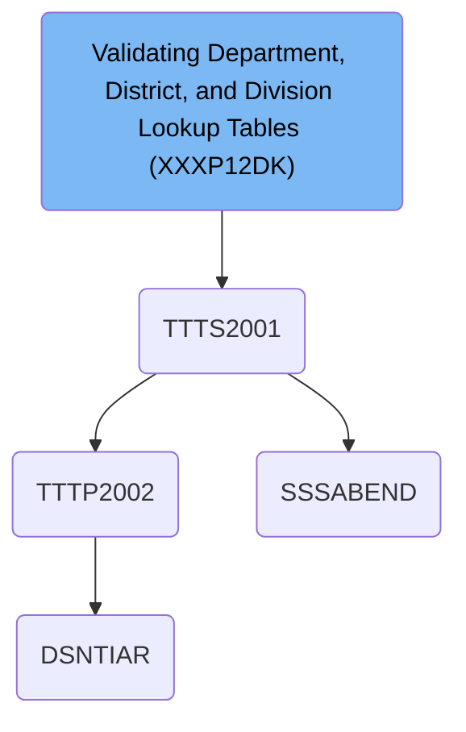

# Dependencies

## Paths

<SwmPath>[base/src/TTTS2001.cbl](base/src/TTTS2001.cbl)</SwmPath>

<SwmPath>[base/src/TTTP2002.cbl](base/src/TTTP2002.cbl)</SwmPath>

<SwmPath>[base/src/TTTN2001.cpy](base/src/TTTN2001.cpy)</SwmPath>

<SwmPath>[base/src/WXXN001A.cpy](base/src/WXXN001A.cpy)</SwmPath>

<SwmPath>[base/src/NNNN0000.cpy](base/src/NNNN0000.cpy)</SwmPath>

<SwmPath>[base/src/YYYN005A.cpy](base/src/YYYN005A.cpy)</SwmPath>

<SwmPath>[base/src/XXXN001A.cpy](base/src/XXXN001A.cpy)</SwmPath>

<SwmPath>[base/src/WWWC0003.cpy](base/src/WWWC0003.cpy)</SwmPath>

<SwmPath>[base/src/WWWC0040.cpy](base/src/WWWC0040.cpy)</SwmPath>

<SwmPath>[base/src/WWWC0100.cpy](base/src/WWWC0100.cpy)</SwmPath>

&nbsp;

*This is an auto-generated document by Swimm 🌊 and has not yet been verified by a human*

<SwmMeta version="3.0.0" repo-id="Z2l0aHViJTNBJTNBU3dpbW1pby1keW5jYWxsLWRlbW8lM0ElM0FHaXJpLVN3aW1t" repo-name="Swimmio-dyncall-demo">Powered by [Swimm](https://app.swimm.io/)</SwmMeta>
