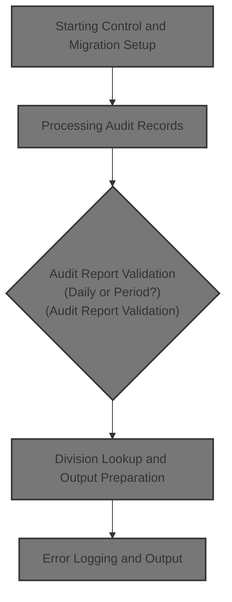

# Overview

This document explains the flow of processing audit records. The flow validates and enriches each audit record with store, department, district, and division information, and logs errors for any invalid or incomplete records.

## Dependencies

### Programs

- XXXP12DK (<SwmPath>[base/src/XXXP12DK.cbl](base/src/XXXP12DK.cbl)</SwmPath>)
- TTTS2001 (<SwmPath>[base/src/TTTS2001.cbl](base/src/TTTS2001.cbl)</SwmPath>)
- TTTP2002 (<SwmPath>[base/src/TTTP2002.cbl](base/src/TTTP2002.cbl)</SwmPath>)
- DSNTIAR
- SSSABEND

### Copybooks

- SQLCA
- T01N2001
- TTTN2001 (<SwmPath>[base/src/TTTN2001.cpy](base/src/TTTN2001.cpy)</SwmPath>)
- WXXN001A (<SwmPath>[base/src/WXXN001A.cpy](base/src/WXXN001A.cpy)</SwmPath>)
- NNNN0000 (<SwmPath>[base/src/NNNN0000.cpy](base/src/NNNN0000.cpy)</SwmPath>)
- YYYN005A (<SwmPath>[base/src/YYYN005A.cpy](base/src/YYYN005A.cpy)</SwmPath>)
- XXXN001A (<SwmPath>[base/src/XXXN001A.cpy](base/src/XXXN001A.cpy)</SwmPath>)
- WWWC0003 (<SwmPath>[base/src/WWWC0003.cpy](base/src/WWWC0003.cpy)</SwmPath>)
- WWWC0040 (<SwmPath>[base/src/WWWC0040.cpy](base/src/WWWC0040.cpy)</SwmPath>)
- WWWC0100 (<SwmPath>[base/src/WWWC0100.cpy](base/src/WWWC0100.cpy)</SwmPath>)
- DDDTFD01
- DDDTDI01

&nbsp;

*This is an auto-generated document by Swimm 🌊 and has not yet been verified by a human*

<SwmMeta version="3.0.0" repo-id="Z2l0aHViJTNBJTNBU3dpbW1pby1keW5jYWxsLWRlbW8lM0ElM0FHaXJpLVN3aW1t" repo-name="Swimmio-dyncall-demo">Powered by [Swimm](https://app.swimm.io/)</SwmMeta>
