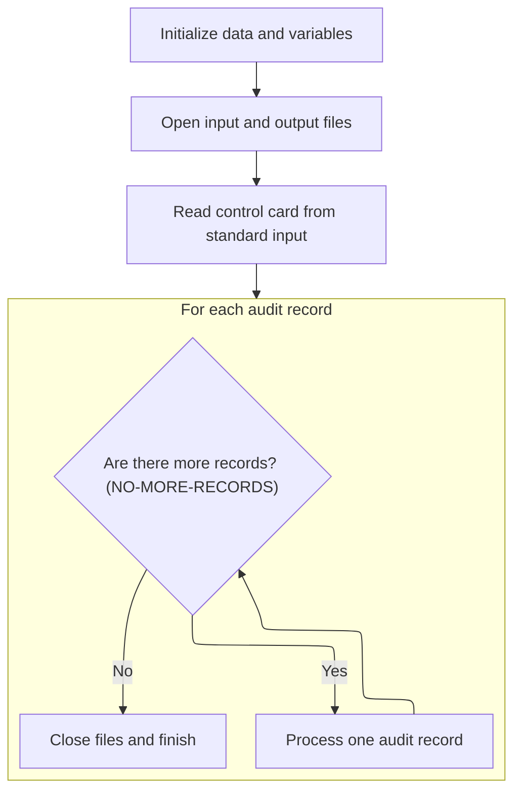
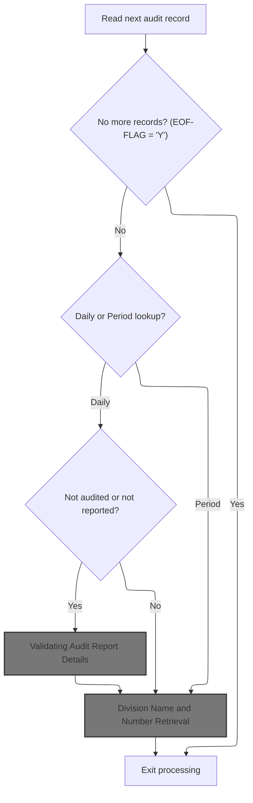
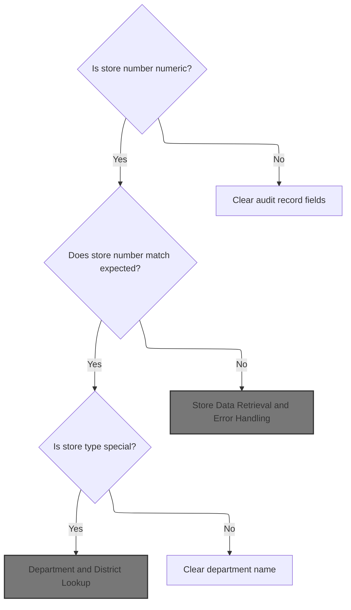
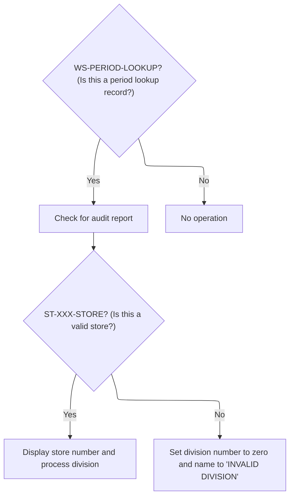
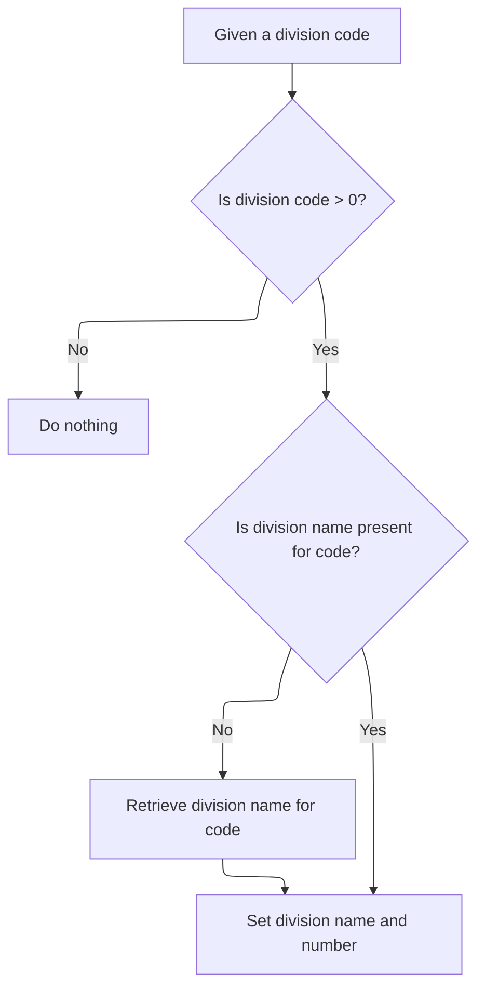
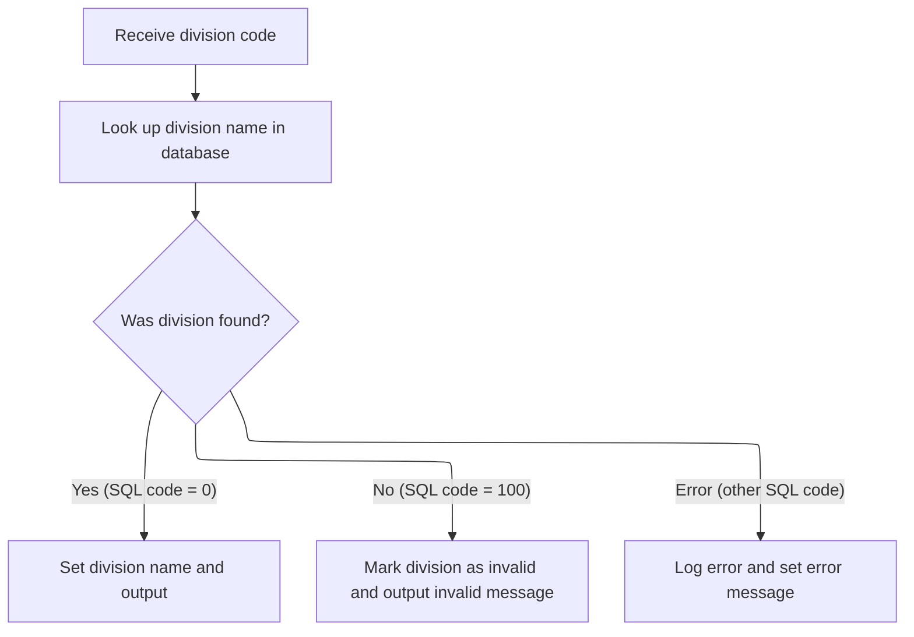

# Overview

This document explains the flow of processing audit records. Audit records are validated and enriched with store, department, district, and division information, ensuring accurate reporting. Invalid or missing data is logged for error tracking.

## Dependencies

### Programs

- <SwmToken path="base/src/XXXP12DK.cbl" pos="2:7:7" line-data="000200 PROGRAM-ID.     XXXP12DK.">`XXXP12DK`</SwmToken> (<SwmPath>[base/src/XXXP12DK.cbl](base/src/XXXP12DK.cbl)</SwmPath>)
- <SwmToken path="base/src/XXXP12DK.cbl" pos="491:5:5" line-data="052730         CALL &#39;TTTS2001&#39; USING SQLCA">`TTTS2001`</SwmToken> (<SwmPath>[base/src/TTTS2001.cbl](base/src/TTTS2001.cbl)</SwmPath>)
- TTTP2002 (<SwmPath>[base/src/TTTP2002.cbl](base/src/TTTP2002.cbl)</SwmPath>)
- DSNTIAR
- SSSABEND

### Copybooks

- SQLCA
- T01N2001
- <SwmToken path="base/src/XXXP12DK.cbl" pos="158:4:4" line-data="021200 COPY TTTN2001.">`TTTN2001`</SwmToken> (<SwmPath>[base/src/TTTN2001.cpy](base/src/TTTN2001.cpy)</SwmPath>)
- <SwmToken path="base/src/XXXP12DK.cbl" pos="156:4:4" line-data="021000 COPY WXXN001A.">`WXXN001A`</SwmToken> (<SwmPath>[base/src/WXXN001A.cpy](base/src/WXXN001A.cpy)</SwmPath>)
- <SwmToken path="base/src/XXXP12DK.cbl" pos="306:2:2" line-data="036500         NNNN0000-PARMS">`NNNN0000`</SwmToken> (<SwmPath>[base/src/NNNN0000.cpy](base/src/NNNN0000.cpy)</SwmPath>)
- <SwmToken path="base/src/XXXP12DK.cbl" pos="300:4:4" line-data="035900     SET YYYN005A-BATCH-ENV            TO  TRUE">`YYYN005A`</SwmToken> (<SwmPath>[base/src/YYYN005A.cpy](base/src/YYYN005A.cpy)</SwmPath>)
- <SwmToken path="base/src/XXXP12DK.cbl" pos="222:4:4" line-data="028000     INITIALIZE XXXN001A">`XXXN001A`</SwmToken> (<SwmPath>[base/src/XXXN001A.cpy](base/src/XXXN001A.cpy)</SwmPath>)
- <SwmToken path="base/src/XXXP12DK.cbl" pos="299:4:4" line-data="035800     INITIALIZE WWWC0003">`WWWC0003`</SwmToken> (<SwmPath>[base/src/WWWC0003.cpy](base/src/WWWC0003.cpy)</SwmPath>)
- <SwmToken path="base/src/XXXP12DK.cbl" pos="163:4:4" line-data="021600 COPY WWWC0040.">`WWWC0040`</SwmToken> (<SwmPath>[base/src/WWWC0040.cpy](base/src/WWWC0040.cpy)</SwmPath>)
- <SwmToken path="base/src/XXXP12DK.cbl" pos="223:2:2" line-data="028100                WWWC0100">`WWWC0100`</SwmToken> (<SwmPath>[base/src/WWWC0100.cpy](base/src/WWWC0100.cpy)</SwmPath>)
- <SwmToken path="base/src/XXXP12DK.cbl" pos="172:4:4" line-data="039490       INCLUDE DDDTFD01">`DDDTFD01`</SwmToken>
- <SwmToken path="base/src/XXXP12DK.cbl" pos="178:4:4" line-data="039490       INCLUDE DDDTDI01">`DDDTDI01`</SwmToken>

## Input and Output Tables/Files used in the Program

| Table / File Name                                                                                                                                    | Type                                                                                                                                                 | Description                                            | Usage Mode | Key Fields / Layout Highlights                                                                                                                         |
| ---------------------------------------------------------------------------------------------------------------------------------------------------- | ---------------------------------------------------------------------------------------------------------------------------------------------------- | ------------------------------------------------------ | ---------- | ------------------------------------------------------------------------------------------------------------------------------------------------------ |
| <SwmToken path="base/src/XXXP12DK.cbl" pos="508:4:6" line-data="059400        WRITE ERROR-REC FROM ERROR-HEAD">`ERROR-REC`</SwmToken>                | <SwmToken path="base/src/XXXP12DK.cbl" pos="198:7:7" line-data="025600************ MIGRATE TO DB2  MFR CHANGES START**************">`DB2`</SwmToken> | Output error messages for failed lookups or processing | Output     | Database table with relational structure                                                                                                               |
| <SwmToken path="base/src/XXXP12DK.cbl" pos="471:3:3" line-data="             FROM XXXANCIAL_DIV">`XXXANCIAL_DIV`</SwmToken>                          | <SwmToken path="base/src/XXXP12DK.cbl" pos="198:7:7" line-data="025600************ MIGRATE TO DB2  MFR CHANGES START**************">`DB2`</SwmToken> | Division master data: division IDs and names           | Input      | <SwmToken path="base/src/XXXP12DK.cbl" pos="470:8:12" line-data="               INTO :DCLXXXANCIAL-DIV.XXXANCIAL-DIV-NM">`XXXANCIAL-DIV-NM`</SwmToken> |
| <SwmToken path="base/src/XXXP12DK.cbl" pos="208:6:10" line-data="026600     OPEN INPUT  XXXP-AUDIT-STRIP">`XXXP-AUDIT-STRIP`</SwmToken>              | <SwmToken path="base/src/XXXP12DK.cbl" pos="198:7:7" line-data="025600************ MIGRATE TO DB2  MFR CHANGES START**************">`DB2`</SwmToken> | Input audit transaction records for processing         | Input      | Database table with relational structure                                                                                                               |
| <SwmToken path="base/src/XXXP12DK.cbl" pos="209:4:8" line-data="026700          OUTPUT XXXP-DAILY-AUDIT">`XXXP-DAILY-AUDIT`</SwmToken>               | <SwmToken path="base/src/XXXP12DK.cbl" pos="198:7:7" line-data="025600************ MIGRATE TO DB2  MFR CHANGES START**************">`DB2`</SwmToken> | Output file for processed daily audit records          | Output     | Database table with relational structure                                                                                                               |
| <SwmToken path="base/src/XXXP12DK.cbl" pos="32:4:8" line-data="008100 01  XXXP-DISTRICT-RECORD        PIC X(276).">`XXXP-DISTRICT-RECORD`</SwmToken> | <SwmToken path="base/src/XXXP12DK.cbl" pos="198:7:7" line-data="025600************ MIGRATE TO DB2  MFR CHANGES START**************">`DB2`</SwmToken> | Output record for district-level audit results         | Output     | Database table with relational structure                                                                                                               |
| XXXT                                                                                                                                                 | <SwmToken path="base/src/XXXP12DK.cbl" pos="198:7:7" line-data="025600************ MIGRATE TO DB2  MFR CHANGES START**************">`DB2`</SwmToken> | District master data: district IDs and names           | Input      | <SwmToken path="base/src/XXXP12DK.cbl" pos="418:6:8" line-data="               INTO :DCLXXXT.DIST-NM">`DIST-NM`</SwmToken>                             |

&nbsp;

## Detailed View of the Program's Functionality

## a. Program Initialization and File Setup

The program begins by defining its identity and the files it will use. Three main files are declared: one for errors, one for input audit records, and one for output audit records. The structure of each file is specified, including the length of each record.

In the working storage section, various fields and tables are defined to hold temporary data, lookup tables for departments, districts, and divisions, error messages, and flags to control the flow and error handling. There are also fields for storing the control card, which determines the processing mode (daily or period lookup).

When the program starts, it initializes key variables and tables to zero or spaces, ensuring a clean state. It then opens the input, output, and error files. The control card is read from standard input to determine the processing mode.

## b. Migration Control Setup

Before processing records, the program performs a migration control setup. This involves initializing certain control structures and setting flags to indicate that a migration is taking place, that the operation is from old to new, and that updates are being made. A control subroutine is called to handle any additional migration logic required.

## c. Main Processing Loop

The core of the program is a loop that processes each audit record one by one:

1. **Read the Next Record:** The program reads the next audit record from the input file into a working area. If there are no more records, it sets a flag and exits the loop.
2. **Reset Error Flags:** Before processing each record, error flags are cleared.
3. **Log Preparation:** Certain fields from the record are moved into log fields for tracking.
4. **Determine Processing Mode:** Based on the control card, the program decides whether to process the record as a daily or period lookup.

## d. Daily Lookup and Audit Validation

If the record is being processed in daily lookup mode and is not audited or reported, the program performs audit report validation:

- **Store Number Validation:** It checks if the store number is numeric and matches the expected value.
- **Store Data Handling:** If the store number matches, store and district information is copied to the output record. If the store is of a special type, department matching is performed; otherwise, the department name is cleared.
- **Store Data Retrieval:** If the store number does not match, a subroutine is called to fetch store details from the database. The store type is determined based on the store number, and a location translation subroutine is called. Depending on the result:
  - If successful and the store is valid, store and district details are copied, and department matching is performed.
  - If not found, output fields are cleared, and an error flag is set.
  - For other errors, an error handling subroutine is called to log the issue.

## e. Department and District Lookup

When department matching is required, the program searches a local table for the department number. If not found, it fetches the department name from the database and updates the table. If the department is not found in the database, an error message is set, and an error flag is raised.

For district matching, the program checks if the district number is valid and looks up the district name in a local table. If not found, it fetches the district name from the database. If the district is not found, an error message is set, and an error flag is raised.

## f. Period Lookup and Division Processing

If the record is being processed in period lookup mode, the program performs audit report validation as above. If the store is valid, it displays the store number and performs division processing:

- **Division Lookup:** The program checks if the division code is valid. If the division name is not already in the local table, it fetches it from the database. The division name and code are then copied to the output record.
- **Invalid Division Handling:** If the store is not valid, the division number is set to zero, and the division name is set to "INVALID DIVISION".

## g. Writing Output Records

After processing, the program writes the processed audit record to the output file.

## h. Error Handling and Logging

If the record is not audited or reported and any error flags are set, the program performs detailed error logging:

- **First Error:** If this is the first error encountered, a header and spacer are written to the error log.
- **Store Error:** If a store error occurred, a specific message is set, and the error is logged.
- **Department Error:** If a department error occurred, a message is set. If a store error also occurred, a combined error record is written; otherwise, the department error is logged.
- **District Error:** If a district error occurred, a message is set. If store or department errors also occurred, a combined error record is written; otherwise, the district error is logged.
- **Division Error:** If a division error occurred, a message is set. If any other errors also occurred, a combined error record is written; otherwise, the division error is logged.
- **Resetting:** After logging, a spacer is written, and error flags are cleared for the next record.

## i. Closing Files and Program Termination

Once all records have been processed, the program closes all open files and terminates cleanly. Any resources are released, and the program signals completion.

# Data Definitions

| Table / Record Name                                                                                                                                  | Type                                                                                                                                                 | Short Description                                      | Usage Mode     |
| ---------------------------------------------------------------------------------------------------------------------------------------------------- | ---------------------------------------------------------------------------------------------------------------------------------------------------- | ------------------------------------------------------ | -------------- |
| <SwmToken path="base/src/XXXP12DK.cbl" pos="508:4:6" line-data="059400        WRITE ERROR-REC FROM ERROR-HEAD">`ERROR-REC`</SwmToken>                | <SwmToken path="base/src/XXXP12DK.cbl" pos="198:7:7" line-data="025600************ MIGRATE TO DB2  MFR CHANGES START**************">`DB2`</SwmToken> | Output error messages for failed lookups or processing | Output         |
| <SwmToken path="base/src/XXXP12DK.cbl" pos="471:3:3" line-data="             FROM XXXANCIAL_DIV">`XXXANCIAL_DIV`</SwmToken>                          | <SwmToken path="base/src/XXXP12DK.cbl" pos="198:7:7" line-data="025600************ MIGRATE TO DB2  MFR CHANGES START**************">`DB2`</SwmToken> | Division master data: division IDs and names           | Input (SELECT) |
| <SwmToken path="base/src/XXXP12DK.cbl" pos="208:6:10" line-data="026600     OPEN INPUT  XXXP-AUDIT-STRIP">`XXXP-AUDIT-STRIP`</SwmToken>              | <SwmToken path="base/src/XXXP12DK.cbl" pos="198:7:7" line-data="025600************ MIGRATE TO DB2  MFR CHANGES START**************">`DB2`</SwmToken> | Input audit transaction records for processing         | Input          |
| <SwmToken path="base/src/XXXP12DK.cbl" pos="209:4:8" line-data="026700          OUTPUT XXXP-DAILY-AUDIT">`XXXP-DAILY-AUDIT`</SwmToken>               | <SwmToken path="base/src/XXXP12DK.cbl" pos="198:7:7" line-data="025600************ MIGRATE TO DB2  MFR CHANGES START**************">`DB2`</SwmToken> | Output file for processed daily audit records          | Output         |
| <SwmToken path="base/src/XXXP12DK.cbl" pos="32:4:8" line-data="008100 01  XXXP-DISTRICT-RECORD        PIC X(276).">`XXXP-DISTRICT-RECORD`</SwmToken> | <SwmToken path="base/src/XXXP12DK.cbl" pos="198:7:7" line-data="025600************ MIGRATE TO DB2  MFR CHANGES START**************">`DB2`</SwmToken> | Output record for district-level audit results         | Output         |
| XXXT                                                                                                                                                 | <SwmToken path="base/src/XXXP12DK.cbl" pos="198:7:7" line-data="025600************ MIGRATE TO DB2  MFR CHANGES START**************">`DB2`</SwmToken> | District master data: district IDs and names           | Input (SELECT) |

&nbsp;

# Rule Definition

| Paragraph Name                                                                                                                                                                                                                                                                                                                                                                                                                                                                                                                                                                                                                                                                                                                                                                                                                                                                                                                                                                                                                                                                                              | Rule ID | Category          | Description                                                                                                                                                                                                                                                                                                               | Conditions                                                                                                                                                                                                                                                                                                                                                                                                                  | Remarks                                                                                                                                                                                                                                                                                                                                                                                                                                               |
| ----------------------------------------------------------------------------------------------------------------------------------------------------------------------------------------------------------------------------------------------------------------------------------------------------------------------------------------------------------------------------------------------------------------------------------------------------------------------------------------------------------------------------------------------------------------------------------------------------------------------------------------------------------------------------------------------------------------------------------------------------------------------------------------------------------------------------------------------------------------------------------------------------------------------------------------------------------------------------------------------------------------------------------------------------------------------------------------------------------- | ------- | ----------------- | ------------------------------------------------------------------------------------------------------------------------------------------------------------------------------------------------------------------------------------------------------------------------------------------------------------------------- | --------------------------------------------------------------------------------------------------------------------------------------------------------------------------------------------------------------------------------------------------------------------------------------------------------------------------------------------------------------------------------------------------------------------------- | ----------------------------------------------------------------------------------------------------------------------------------------------------------------------------------------------------------------------------------------------------------------------------------------------------------------------------------------------------------------------------------------------------------------------------------------------------- |
| <SwmToken path="base/src/XXXP12DK.cbl" pos="197:2:4" line-data="025500 PROCESS-CONTROL.">`PROCESS-CONTROL`</SwmToken>                                                                                                                                                                                                                                                                                                                                                                                                                                                                                                                                                                                                                                                                                                                                                                                                                                                                                                                                                                                       | RL-001  | Data Assignment   | The program opens the audit input file and output files before processing any records.                                                                                                                                                                                                                                    | Files must be available and accessible for opening.                                                                                                                                                                                                                                                                                                                                                                         | Input file: <SwmToken path="base/src/XXXP12DK.cbl" pos="208:6:10" line-data="026600     OPEN INPUT  XXXP-AUDIT-STRIP">`XXXP-AUDIT-STRIP`</SwmToken>. Output files: <SwmToken path="base/src/XXXP12DK.cbl" pos="32:4:8" line-data="008100 01  XXXP-DISTRICT-RECORD        PIC X(276).">`XXXP-DISTRICT-RECORD`</SwmToken>, <SwmToken path="base/src/XXXP12DK.cbl" pos="210:2:4" line-data="026800                 ERROR-FILE.">`ERROR-FILE`</SwmToken>. |
| <SwmToken path="base/src/XXXP12DK.cbl" pos="243:4:6" line-data="030100     PERFORM READ-STRIP.">`READ-STRIP`</SwmToken>, <SwmToken path="base/src/XXXP12DK.cbl" pos="214:4:6" line-data="027200     PERFORM PROCESS-RECORD THRU PROCESS-RECORD-EXIT">`PROCESS-RECORD`</SwmToken>                                                                                                                                                                                                                                                                                                                                                                                                                                                                                                                                                                                                                                                                                                                                                                                                                            | RL-002  | Computation       | For each audit record (150 bytes), the program parses key fields such as store number, department code, district code, division code, audit/report flags, company/account info, and date/time according to the copybook definition.                                                                                       | Audit record must be read from input file. Fields must be present and formatted according to copybook.                                                                                                                                                                                                                                                                                                                      | Audit record size: 150 bytes. Fields parsed according to copybook definition.                                                                                                                                                                                                                                                                                                                                                                         |
| <SwmToken path="base/src/XXXP12DK.cbl" pos="214:4:6" line-data="027200     PERFORM PROCESS-RECORD THRU PROCESS-RECORD-EXIT">`PROCESS-RECORD`</SwmToken>, <SwmToken path="base/src/XXXP12DK.cbl" pos="251:4:10" line-data="030900             PERFORM CHECK-FOR-AUDIT-REPORT.">`CHECK-FOR-AUDIT-REPORT`</SwmToken>                                                                                                                                                                                                                                                                                                                                                                                                                                                                                                                                                                                                                                                                                                                                                                                           | RL-003  | Conditional Logic | Audit/report flags are validated and updated. 'Y' indicates not audited/reported; space indicates audited/reported.                                                                                                                                                                                                       | Audit/report flags must be present in the record.                                                                                                                                                                                                                                                                                                                                                                           | 'Y' = not audited/reported; space = audited/reported.                                                                                                                                                                                                                                                                                                                                                                                                 |
| <SwmToken path="base/src/XXXP12DK.cbl" pos="251:4:10" line-data="030900             PERFORM CHECK-FOR-AUDIT-REPORT.">`CHECK-FOR-AUDIT-REPORT`</SwmToken>, <SwmToken path="base/src/XXXP12DK.cbl" pos="283:4:6" line-data="033700            PERFORM GET-STORE">`GET-STORE`</SwmToken>, <SwmToken path="base/src/XXXP12DK.cbl" pos="278:4:6" line-data="033500               PERFORM DEPT-MATCH">`DEPT-MATCH`</SwmToken>, <SwmToken path="base/src/XXXP12DK.cbl" pos="347:4:6" line-data="040900         PERFORM GET-DEPT.">`GET-DEPT`</SwmToken>, <SwmToken path="base/src/XXXP12DK.cbl" pos="348:4:6" line-data="041000     PERFORM DISTRICT-MATCH.">`DISTRICT-MATCH`</SwmToken>, <SwmToken path="base/src/XXXP12DK.cbl" pos="403:4:6" line-data="047500         PERFORM GET-DISTRICT">`GET-DISTRICT`</SwmToken>, <SwmToken path="base/src/XXXP12DK.cbl" pos="256:4:6" line-data="031400             PERFORM DIVISION-PROCESS">`DIVISION-PROCESS`</SwmToken>, <SwmToken path="base/src/XXXP12DK.cbl" pos="452:4:8" line-data="053000             PERFORM GET-DIVISION-NAME">`GET-DIVISION-NAME`</SwmToken> | RL-004  | Computation       | Lookups for store, department, district, and division information are performed. The program first checks in-memory arrays; if not found, it performs a database call using the respective code as the key and caches the result in memory.                                                                               | Lookup key (store, department, district, division code) must be present. In-memory array must be checked before DB call.                                                                                                                                                                                                                                                                                                    | Store type threshold: 9999. In-memory arrays for department (2000 entries), district (99 entries), division (20 entries).                                                                                                                                                                                                                                                                                                                             |
| <SwmToken path="base/src/XXXP12DK.cbl" pos="283:4:6" line-data="033700            PERFORM GET-STORE">`GET-STORE`</SwmToken>                                                                                                                                                                                                                                                                                                                                                                                                                                                                                                                                                                                                                                                                                                                                                                                                                                                                                                                                                                                 | RL-005  | Conditional Logic | Store type is determined by the store number. If the store number is less than 9999, store type is set to 'S'; otherwise, it is set to 'A'.                                                                                                                                                                               | Store number must be numeric and present.                                                                                                                                                                                                                                                                                                                                                                                   | Store type: 'S' if store number < 9999, 'A' otherwise.                                                                                                                                                                                                                                                                                                                                                                                                |
| <SwmToken path="base/src/XXXP12DK.cbl" pos="283:4:6" line-data="033700            PERFORM GET-STORE">`GET-STORE`</SwmToken>, <SwmToken path="base/src/XXXP12DK.cbl" pos="347:4:6" line-data="040900         PERFORM GET-DEPT.">`GET-DEPT`</SwmToken>, <SwmToken path="base/src/XXXP12DK.cbl" pos="403:4:6" line-data="047500         PERFORM GET-DISTRICT">`GET-DISTRICT`</SwmToken>, <SwmToken path="base/src/XXXP12DK.cbl" pos="452:4:8" line-data="053000             PERFORM GET-DIVISION-NAME">`GET-DIVISION-NAME`</SwmToken>                                                                                                                                                                                                                                                                                                                                                                                                                                                                                                                                                                          | RL-006  | Conditional Logic | <SwmToken path="base/src/XXXP12DK.cbl" pos="312:4:8" line-data="037200       IF DB2-SQL-CODE = 0">`DB2-SQL-CODE`</SwmToken> values are handled as follows: 0 = success, 100 = not found (set error flags and blank fields), other = error (call error handler and log diagnostics).                                       | <SwmToken path="base/src/XXXP12DK.cbl" pos="312:4:8" line-data="037200       IF DB2-SQL-CODE = 0">`DB2-SQL-CODE`</SwmToken> must be set after <SwmToken path="base/src/XXXP12DK.cbl" pos="198:7:7" line-data="025600************ MIGRATE TO DB2  MFR CHANGES START**************">`DB2`</SwmToken> call.                                                                                                                    | <SwmToken path="base/src/XXXP12DK.cbl" pos="312:4:8" line-data="037200       IF DB2-SQL-CODE = 0">`DB2-SQL-CODE`</SwmToken>: 0 (success), 100 (not found), other (error).                                                                                                                                                                                                                                                                             |
| <SwmToken path="base/src/XXXP12DK.cbl" pos="261:4:8" line-data="031900     PERFORM WRITE-OUTPUT-RECORD.">`WRITE-OUTPUT-RECORD`</SwmToken>                                                                                                                                                                                                                                                                                                                                                                                                                                                                                                                                                                                                                                                                                                                                                                                                                                                                                                                                                                   | RL-007  | Data Assignment   | Each processed audit record is written to the output file (<SwmToken path="base/src/XXXP12DK.cbl" pos="32:4:8" line-data="008100 01  XXXP-DISTRICT-RECORD        PIC X(276).">`XXXP-DISTRICT-RECORD`</SwmToken>, 276 bytes), including all key fields and lookup results, formatted according to the copybook definition. | Audit record must be processed and formatted according to copybook.                                                                                                                                                                                                                                                                                                                                                         | Output record size: 276 bytes. Format per copybook. Numeric fields: right-justified, zero-padded. Alphanumeric fields: left-justified, space-padded.                                                                                                                                                                                                                                                                                                  |
| <SwmToken path="base/src/XXXP12DK.cbl" pos="265:4:6" line-data="032300             PERFORM ERROR-PARA.">`ERROR-PARA`</SwmToken>, <SwmToken path="base/src/XXXP12DK.cbl" pos="513:4:6" line-data="059900        PERFORM WRITE-ERROR.">`WRITE-ERROR`</SwmToken>                                                                                                                                                                                                                                                                                                                                                                                                                                                                                                                                                                                                                                                                                                                                                                                                                                               | RL-008  | Conditional Logic | Error records (133 bytes) are written to the error file when errors are detected, including error message, store/dept/district/division numbers, account info, date/time, and other relevant fields, formatted according to the copybook definition.                                                                      | Error flags must be set. Error record must be formatted according to copybook.                                                                                                                                                                                                                                                                                                                                              | Error record size: 133 bytes. Format per copybook. Numeric fields: right-justified, zero-padded. Alphanumeric fields: left-justified, space-padded.                                                                                                                                                                                                                                                                                                   |
| <SwmToken path="base/src/XXXP12DK.cbl" pos="217:4:6" line-data="027500     PERFORM CLOSE-FILES.">`CLOSE-FILES`</SwmToken>                                                                                                                                                                                                                                                                                                                                                                                                                                                                                                                                                                                                                                                                                                                                                                                                                                                                                                                                                                                   | RL-009  | Data Assignment   | All files are closed after processing is complete.                                                                                                                                                                                                                                                                        | Processing must be complete.                                                                                                                                                                                                                                                                                                                                                                                                | Files to close: <SwmToken path="base/src/XXXP12DK.cbl" pos="208:6:10" line-data="026600     OPEN INPUT  XXXP-AUDIT-STRIP">`XXXP-AUDIT-STRIP`</SwmToken>, <SwmToken path="base/src/XXXP12DK.cbl" pos="32:4:8" line-data="008100 01  XXXP-DISTRICT-RECORD        PIC X(276).">`XXXP-DISTRICT-RECORD`</SwmToken>, <SwmToken path="base/src/XXXP12DK.cbl" pos="210:2:4" line-data="026800                 ERROR-FILE.">`ERROR-FILE`</SwmToken>.           |
| <SwmToken path="base/src/XXXP12DK.cbl" pos="197:2:4" line-data="025500 PROCESS-CONTROL.">`PROCESS-CONTROL`</SwmToken>                                                                                                                                                                                                                                                                                                                                                                                                                                                                                                                                                                                                                                                                                                                                                                                                                                                                                                                                                                                       | RL-010  | Conditional Logic | The program reads a control card from standard input, extracting an 8-character value that identifies the processing mode and a 4-digit checkpoint control value. The 8-character value determines whether processing is in daily or period mode.                                                                         | Control card must be present on standard input. The 8-character value must be either <SwmToken path="base/src/XXXP12DK.cbl" pos="88:13:13" line-data="013700         88  WS-DAILY-LOOKUP     VALUE &#39;XXXP10DK&#39;.">`XXXP10DK`</SwmToken> (daily) or <SwmToken path="base/src/XXXP12DK.cbl" pos="89:13:13" line-data="013800         88  WS-PERIOD-LOOKUP    VALUE &#39;XXXP60PK&#39;.">`XXXP60PK`</SwmToken> (period). | Identifiers: <SwmToken path="base/src/XXXP12DK.cbl" pos="88:13:13" line-data="013700         88  WS-DAILY-LOOKUP     VALUE &#39;XXXP10DK&#39;.">`XXXP10DK`</SwmToken> for daily, <SwmToken path="base/src/XXXP12DK.cbl" pos="89:13:13" line-data="013800         88  WS-PERIOD-LOOKUP    VALUE &#39;XXXP60PK&#39;.">`XXXP60PK`</SwmToken> for period. Control card format: 8-character alphanumeric value, 4-digit numeric checkpoint control value.  |

# User Stories

## User Story 1: Program Initialization, Control Card Processing, and File Management

---

### Story Description:

As a system, I want to read the control card from standard input, open all required input and output files before processing, and close them after processing is complete so that the correct operational mode is set and resources are managed reliably.

---

### Business Rule Mapping:

| Rule ID | Paragraph Name                                                                                                            | Rule Description                                                                                                                                                                                                                                  |
| ------- | ------------------------------------------------------------------------------------------------------------------------- | ------------------------------------------------------------------------------------------------------------------------------------------------------------------------------------------------------------------------------------------------- |
| RL-001  | <SwmToken path="base/src/XXXP12DK.cbl" pos="197:2:4" line-data="025500 PROCESS-CONTROL.">`PROCESS-CONTROL`</SwmToken>     | The program opens the audit input file and output files before processing any records.                                                                                                                                                            |
| RL-010  | <SwmToken path="base/src/XXXP12DK.cbl" pos="197:2:4" line-data="025500 PROCESS-CONTROL.">`PROCESS-CONTROL`</SwmToken>     | The program reads a control card from standard input, extracting an 8-character value that identifies the processing mode and a 4-digit checkpoint control value. The 8-character value determines whether processing is in daily or period mode. |
| RL-009  | <SwmToken path="base/src/XXXP12DK.cbl" pos="217:4:6" line-data="027500     PERFORM CLOSE-FILES.">`CLOSE-FILES`</SwmToken> | All files are closed after processing is complete.                                                                                                                                                                                                |

---

### Relevant Functionality:

- <SwmToken path="base/src/XXXP12DK.cbl" pos="197:2:4" line-data="025500 PROCESS-CONTROL.">`PROCESS-CONTROL`</SwmToken>
  1. **RL-001:**
     - Open <SwmToken path="base/src/XXXP12DK.cbl" pos="208:6:10" line-data="026600     OPEN INPUT  XXXP-AUDIT-STRIP">`XXXP-AUDIT-STRIP`</SwmToken> for input
     - Open <SwmToken path="base/src/XXXP12DK.cbl" pos="32:4:8" line-data="008100 01  XXXP-DISTRICT-RECORD        PIC X(276).">`XXXP-DISTRICT-RECORD`</SwmToken> for output
     - Open <SwmToken path="base/src/XXXP12DK.cbl" pos="210:2:4" line-data="026800                 ERROR-FILE.">`ERROR-FILE`</SwmToken> for output
  2. **RL-010:**
     - Accept control card from standard input
     - Extract 8-character value and checkpoint control value
     - If 8-character value is <SwmToken path="base/src/XXXP12DK.cbl" pos="88:13:13" line-data="013700         88  WS-DAILY-LOOKUP     VALUE &#39;XXXP10DK&#39;.">`XXXP10DK`</SwmToken>, set daily mode
     - If 8-character value is <SwmToken path="base/src/XXXP12DK.cbl" pos="89:13:13" line-data="013800         88  WS-PERIOD-LOOKUP    VALUE &#39;XXXP60PK&#39;.">`XXXP60PK`</SwmToken>, set period mode
- <SwmToken path="base/src/XXXP12DK.cbl" pos="217:4:6" line-data="027500     PERFORM CLOSE-FILES.">`CLOSE-FILES`</SwmToken>
  1. **RL-009:**
     - Close <SwmToken path="base/src/XXXP12DK.cbl" pos="208:6:10" line-data="026600     OPEN INPUT  XXXP-AUDIT-STRIP">`XXXP-AUDIT-STRIP`</SwmToken>
     - Close <SwmToken path="base/src/XXXP12DK.cbl" pos="32:4:8" line-data="008100 01  XXXP-DISTRICT-RECORD        PIC X(276).">`XXXP-DISTRICT-RECORD`</SwmToken>
     - Close <SwmToken path="base/src/XXXP12DK.cbl" pos="210:2:4" line-data="026800                 ERROR-FILE.">`ERROR-FILE`</SwmToken>

## User Story 2: Data Lookup and Enrichment for Store, Department, District, and Division

---

### Story Description:

As a system, I want to perform lookups for store, department, district, and division information using in-memory arrays and database calls, caching results as needed, and determining store type based on store number so that each audit record is enriched with accurate reference data.

---

### Business Rule Mapping:

| Rule ID | Paragraph Name                                                                                                                                                                                                                                                                                                                                                                                                                                                                                                                                                                                                                                                                                                                                                                                                                                                                                                                                                                                                                                                                                              | Rule Description                                                                                                                                                                                                                                                                    |
| ------- | ----------------------------------------------------------------------------------------------------------------------------------------------------------------------------------------------------------------------------------------------------------------------------------------------------------------------------------------------------------------------------------------------------------------------------------------------------------------------------------------------------------------------------------------------------------------------------------------------------------------------------------------------------------------------------------------------------------------------------------------------------------------------------------------------------------------------------------------------------------------------------------------------------------------------------------------------------------------------------------------------------------------------------------------------------------------------------------------------------------- | ----------------------------------------------------------------------------------------------------------------------------------------------------------------------------------------------------------------------------------------------------------------------------------- |
| RL-004  | <SwmToken path="base/src/XXXP12DK.cbl" pos="251:4:10" line-data="030900             PERFORM CHECK-FOR-AUDIT-REPORT.">`CHECK-FOR-AUDIT-REPORT`</SwmToken>, <SwmToken path="base/src/XXXP12DK.cbl" pos="283:4:6" line-data="033700            PERFORM GET-STORE">`GET-STORE`</SwmToken>, <SwmToken path="base/src/XXXP12DK.cbl" pos="278:4:6" line-data="033500               PERFORM DEPT-MATCH">`DEPT-MATCH`</SwmToken>, <SwmToken path="base/src/XXXP12DK.cbl" pos="347:4:6" line-data="040900         PERFORM GET-DEPT.">`GET-DEPT`</SwmToken>, <SwmToken path="base/src/XXXP12DK.cbl" pos="348:4:6" line-data="041000     PERFORM DISTRICT-MATCH.">`DISTRICT-MATCH`</SwmToken>, <SwmToken path="base/src/XXXP12DK.cbl" pos="403:4:6" line-data="047500         PERFORM GET-DISTRICT">`GET-DISTRICT`</SwmToken>, <SwmToken path="base/src/XXXP12DK.cbl" pos="256:4:6" line-data="031400             PERFORM DIVISION-PROCESS">`DIVISION-PROCESS`</SwmToken>, <SwmToken path="base/src/XXXP12DK.cbl" pos="452:4:8" line-data="053000             PERFORM GET-DIVISION-NAME">`GET-DIVISION-NAME`</SwmToken> | Lookups for store, department, district, and division information are performed. The program first checks in-memory arrays; if not found, it performs a database call using the respective code as the key and caches the result in memory.                                         |
| RL-005  | <SwmToken path="base/src/XXXP12DK.cbl" pos="283:4:6" line-data="033700            PERFORM GET-STORE">`GET-STORE`</SwmToken>                                                                                                                                                                                                                                                                                                                                                                                                                                                                                                                                                                                                                                                                                                                                                                                                                                                                                                                                                                                 | Store type is determined by the store number. If the store number is less than 9999, store type is set to 'S'; otherwise, it is set to 'A'.                                                                                                                                         |
| RL-006  | <SwmToken path="base/src/XXXP12DK.cbl" pos="283:4:6" line-data="033700            PERFORM GET-STORE">`GET-STORE`</SwmToken>, <SwmToken path="base/src/XXXP12DK.cbl" pos="347:4:6" line-data="040900         PERFORM GET-DEPT.">`GET-DEPT`</SwmToken>, <SwmToken path="base/src/XXXP12DK.cbl" pos="403:4:6" line-data="047500         PERFORM GET-DISTRICT">`GET-DISTRICT`</SwmToken>, <SwmToken path="base/src/XXXP12DK.cbl" pos="452:4:8" line-data="053000             PERFORM GET-DIVISION-NAME">`GET-DIVISION-NAME`</SwmToken>                                                                                                                                                                                                                                                                                                                                                                                                                                                                                                                                                                          | <SwmToken path="base/src/XXXP12DK.cbl" pos="312:4:8" line-data="037200       IF DB2-SQL-CODE = 0">`DB2-SQL-CODE`</SwmToken> values are handled as follows: 0 = success, 100 = not found (set error flags and blank fields), other = error (call error handler and log diagnostics). |

---

### Relevant Functionality:

- <SwmToken path="base/src/XXXP12DK.cbl" pos="251:4:10" line-data="030900             PERFORM CHECK-FOR-AUDIT-REPORT.">`CHECK-FOR-AUDIT-REPORT`</SwmToken>
  1. **RL-004:**
     - For each lookup (store, department, district, division):
       - Check in-memory array for key
       - If not found, perform <SwmToken path="base/src/XXXP12DK.cbl" pos="198:7:7" line-data="025600************ MIGRATE TO DB2  MFR CHANGES START**************">`DB2`</SwmToken> call with key
       - If found in DB, cache result in memory
       - If not found in DB, set error flag and blank fields
- <SwmToken path="base/src/XXXP12DK.cbl" pos="283:4:6" line-data="033700            PERFORM GET-STORE">`GET-STORE`</SwmToken>
  1. **RL-005:**
     - If store number < 9999, set store type to 'S'
     - Else, set store type to 'A'
  2. **RL-006:**
     - After <SwmToken path="base/src/XXXP12DK.cbl" pos="198:7:7" line-data="025600************ MIGRATE TO DB2  MFR CHANGES START**************">`DB2`</SwmToken> call:
       - If <SwmToken path="base/src/XXXP12DK.cbl" pos="312:6:8" line-data="037200       IF DB2-SQL-CODE = 0">`SQL-CODE`</SwmToken> = 0, use returned data
       - If <SwmToken path="base/src/XXXP12DK.cbl" pos="312:6:8" line-data="037200       IF DB2-SQL-CODE = 0">`SQL-CODE`</SwmToken> = 100, set error flag and blank fields
       - If <SwmToken path="base/src/XXXP12DK.cbl" pos="312:6:8" line-data="037200       IF DB2-SQL-CODE = 0">`SQL-CODE`</SwmToken> is other, call error handler and log diagnostics

## User Story 3: Audit Record Parsing, Field Extraction, and Audit/Report Flag Validation

---

### Story Description:

As a system, I want to read and parse each audit record from the input file, extracting key fields and validating/updating audit/report flags according to the copybook definition so that records are processed and their audit/report status is correctly reflected.

---

### Business Rule Mapping:

| Rule ID | Paragraph Name                                                                                                                                                                                                                                                                                                    | Rule Description                                                                                                                                                                                                                    |
| ------- | ----------------------------------------------------------------------------------------------------------------------------------------------------------------------------------------------------------------------------------------------------------------------------------------------------------------- | ----------------------------------------------------------------------------------------------------------------------------------------------------------------------------------------------------------------------------------- |
| RL-003  | <SwmToken path="base/src/XXXP12DK.cbl" pos="214:4:6" line-data="027200     PERFORM PROCESS-RECORD THRU PROCESS-RECORD-EXIT">`PROCESS-RECORD`</SwmToken>, <SwmToken path="base/src/XXXP12DK.cbl" pos="251:4:10" line-data="030900             PERFORM CHECK-FOR-AUDIT-REPORT.">`CHECK-FOR-AUDIT-REPORT`</SwmToken> | Audit/report flags are validated and updated. 'Y' indicates not audited/reported; space indicates audited/reported.                                                                                                                 |
| RL-002  | <SwmToken path="base/src/XXXP12DK.cbl" pos="243:4:6" line-data="030100     PERFORM READ-STRIP.">`READ-STRIP`</SwmToken>, <SwmToken path="base/src/XXXP12DK.cbl" pos="214:4:6" line-data="027200     PERFORM PROCESS-RECORD THRU PROCESS-RECORD-EXIT">`PROCESS-RECORD`</SwmToken>                                  | For each audit record (150 bytes), the program parses key fields such as store number, department code, district code, division code, audit/report flags, company/account info, and date/time according to the copybook definition. |

---

### Relevant Functionality:

- <SwmToken path="base/src/XXXP12DK.cbl" pos="214:4:6" line-data="027200     PERFORM PROCESS-RECORD THRU PROCESS-RECORD-EXIT">`PROCESS-RECORD`</SwmToken>
  1. **RL-003:**
     - If audit/report flag is 'Y', mark as not audited/reported
     - If audit/report flag is space, mark as audited/reported
     - Update flags as necessary
- <SwmToken path="base/src/XXXP12DK.cbl" pos="243:4:6" line-data="030100     PERFORM READ-STRIP.">`READ-STRIP`</SwmToken>
  1. **RL-002:**
     - Read next audit record from input file
     - Parse store number, department code, district code, division code, audit/report flags, company/account info, date/time

## User Story 4: Writing Output and Error Records

---

### Story Description:

As a system, I want to write each processed audit record to the output file and write error records to the error file when errors are detected, including all key fields, lookup results, and error details formatted according to the copybook definition so that output data is consistent, usable, and issues can be tracked.

---

### Business Rule Mapping:

| Rule ID | Paragraph Name                                                                                                                                                                                                                                                | Rule Description                                                                                                                                                                                                                                                                                                          |
| ------- | ------------------------------------------------------------------------------------------------------------------------------------------------------------------------------------------------------------------------------------------------------------- | ------------------------------------------------------------------------------------------------------------------------------------------------------------------------------------------------------------------------------------------------------------------------------------------------------------------------- |
| RL-008  | <SwmToken path="base/src/XXXP12DK.cbl" pos="265:4:6" line-data="032300             PERFORM ERROR-PARA.">`ERROR-PARA`</SwmToken>, <SwmToken path="base/src/XXXP12DK.cbl" pos="513:4:6" line-data="059900        PERFORM WRITE-ERROR.">`WRITE-ERROR`</SwmToken> | Error records (133 bytes) are written to the error file when errors are detected, including error message, store/dept/district/division numbers, account info, date/time, and other relevant fields, formatted according to the copybook definition.                                                                      |
| RL-007  | <SwmToken path="base/src/XXXP12DK.cbl" pos="261:4:8" line-data="031900     PERFORM WRITE-OUTPUT-RECORD.">`WRITE-OUTPUT-RECORD`</SwmToken>                                                                                                                     | Each processed audit record is written to the output file (<SwmToken path="base/src/XXXP12DK.cbl" pos="32:4:8" line-data="008100 01  XXXP-DISTRICT-RECORD        PIC X(276).">`XXXP-DISTRICT-RECORD`</SwmToken>, 276 bytes), including all key fields and lookup results, formatted according to the copybook definition. |

---

### Relevant Functionality:

- <SwmToken path="base/src/XXXP12DK.cbl" pos="265:4:6" line-data="032300             PERFORM ERROR-PARA.">`ERROR-PARA`</SwmToken>
  1. **RL-008:**
     - If error flags are set:
       - Format error record according to copybook
       - Right-justify and zero-pad numeric fields
       - Left-justify and space-pad alphanumeric fields
       - Write error record to <SwmToken path="base/src/XXXP12DK.cbl" pos="210:2:4" line-data="026800                 ERROR-FILE.">`ERROR-FILE`</SwmToken>
- <SwmToken path="base/src/XXXP12DK.cbl" pos="261:4:8" line-data="031900     PERFORM WRITE-OUTPUT-RECORD.">`WRITE-OUTPUT-RECORD`</SwmToken>
  1. **RL-007:**
     - Format output record according to copybook
     - Right-justify and zero-pad numeric fields
     - Left-justify and space-pad alphanumeric fields
     - Write output record to <SwmToken path="base/src/XXXP12DK.cbl" pos="32:4:8" line-data="008100 01  XXXP-DISTRICT-RECORD        PIC X(276).">`XXXP-DISTRICT-RECORD`</SwmToken>

# Workflow

# Starting Control and Migration Setup



This section is responsible for setting up the migration control context, initializing working fields, opening files, and preparing to process audit records. It ensures all prerequisites are met before record processing begins.

| Category        | Rule Name                    | Description                                                                                                                                                                                                                                                                                                                                                              |
| --------------- | ---------------------------- | ------------------------------------------------------------------------------------------------------------------------------------------------------------------------------------------------------------------------------------------------------------------------------------------------------------------------------------------------------------------------ |
| Data validation | Working Field Initialization | All working fields (store number, department counter, lookup tables, department code, district code, division code) must be reset to their initial values before processing begins.                                                                                                                                                                                      |
| Data validation | File Open Requirement        | Input and output files (audit strip, daily audit, error file) must be successfully opened before any records are processed. If any file fails to open, processing must not proceed.                                                                                                                                                                                      |
| Data validation | Control Card Validation      | The control card must be read from standard input before audit record processing begins. If the control card is missing or invalid, processing must not proceed.                                                                                                                                                                                                         |
| Business logic  | Migration Control Flag Setup | Migration control flags must be set to indicate a 'SET' operation, an 'old-to-new' migration, and that updates are made before any audit records are processed.                                                                                                                                                                                                          |
| Business logic  | Audit Record Looping         | Audit record processing must continue in a loop until the <SwmToken path="base/src/XXXP12DK.cbl" pos="215:4:8" line-data="027300         UNTIL NO-MORE-RECORDS.">`NO-MORE-RECORDS`</SwmToken> flag is set (<SwmToken path="base/src/XXXP12DK.cbl" pos="56:4:6" line-data="010500     05  EOF-FLAG                PIC X       VALUE SPACE.">`EOF-FLAG`</SwmToken> = 'Y'). |
| Business logic  | File Closure and Exit        | After all audit records are processed, all open files must be closed and the process must exit cleanly.                                                                                                                                                                                                                                                                  |

<SwmSnippet path="/base/src/XXXP12DK.cbl" line="197">

---

In <SwmToken path="base/src/XXXP12DK.cbl" pos="197:2:4" line-data="025500 PROCESS-CONTROL.">`PROCESS-CONTROL`</SwmToken>, we start by calling <SwmToken path="base/src/XXXP12DK.cbl" pos="199:4:6" line-data="025700     PERFORM CONTROL-SUBR.">`CONTROL-SUBR`</SwmToken> to set up migration control flags and context.

```cobol
025500 PROCESS-CONTROL.
025600************ MIGRATE TO DB2  MFR CHANGES START**************
025700     PERFORM CONTROL-SUBR.
```

---

</SwmSnippet>

<SwmSnippet path="/base/src/XXXP12DK.cbl" line="221">

---

<SwmToken path="base/src/XXXP12DK.cbl" pos="221:2:4" line-data="027900 CONTROL-SUBR.">`CONTROL-SUBR`</SwmToken> sets up the migration flags in <SwmToken path="base/src/XXXP12DK.cbl" pos="223:2:2" line-data="028100                WWWC0100">`WWWC0100`</SwmToken> to indicate a 'SET' operation, an 'old-to-new' migration, and that updates are made. Then it calls <SwmToken path="base/src/XXXP12DK.cbl" pos="229:4:8" line-data="028700     CALL WWWSSS00-CONTROL-SUBR USING">`WWWSSS00-CONTROL-SUBR`</SwmToken>, passing in the control and task structures so the subroutine can execute the migration logic based on those flags.

```cobol
027900 CONTROL-SUBR.
028000     INITIALIZE XXXN001A
028100                WWWC0100
028200
028300     SET WWWC0100-SET-TASK     TO TRUE
028400     SET WWWC0100-OLD-2-NEW    TO TRUE
028500     SET WWWC0100-UPDATES-MADE TO TRUE
028600
028700     CALL WWWSSS00-CONTROL-SUBR USING
028800              XXXN001A
028900              WWWC0100.
```

---

</SwmSnippet>

<SwmSnippet path="/base/src/XXXP12DK.cbl" line="201">

---

After <SwmToken path="base/src/XXXP12DK.cbl" pos="199:4:6" line-data="025700     PERFORM CONTROL-SUBR.">`CONTROL-SUBR`</SwmToken>, <SwmToken path="base/src/XXXP12DK.cbl" pos="197:2:4" line-data="025500 PROCESS-CONTROL.">`PROCESS-CONTROL`</SwmToken> resets working fields and opens files for audit and output.

```cobol
025900     MOVE ZEROS TO WS-ST-STORE-NUMBER.
026000     MOVE ZEROS TO ST-STORE-NUMBER.
026100     MOVE ZERO TO DEPT-CTR.
026200     MOVE SPACES TO LOOK-UP-TABLES.
026300     MOVE SPACES TO DEPT-CODE.
026400     MOVE ZEROS TO DISTRICT-CODE, DIVISION-CODE.
026500     SKIP1
026600     OPEN INPUT  XXXP-AUDIT-STRIP
026700          OUTPUT XXXP-DAILY-AUDIT
026800                 ERROR-FILE.
026900     SKIP1
027000     ACCEPT WS-CONTROL-CARD.
```

---

</SwmSnippet>

<SwmSnippet path="/base/src/XXXP12DK.cbl" line="214">

---

Finally in <SwmToken path="base/src/XXXP12DK.cbl" pos="197:2:4" line-data="025500 PROCESS-CONTROL.">`PROCESS-CONTROL`</SwmToken>, we start looping through <SwmToken path="base/src/XXXP12DK.cbl" pos="214:4:6" line-data="027200     PERFORM PROCESS-RECORD THRU PROCESS-RECORD-EXIT">`PROCESS-RECORD`</SwmToken> to handle each audit record. Once all records are processed, we close the files and exit.

```cobol
027200     PERFORM PROCESS-RECORD THRU PROCESS-RECORD-EXIT
027300         UNTIL NO-MORE-RECORDS.
027400     SKIP1
027500     PERFORM CLOSE-FILES.
027600     GOBACK.
```

---

</SwmSnippet>

# Processing Audit Records



This section governs the processing of audit records, determining whether to validate audit report details or retrieve division information based on the type of lookup and the status of each record.

| Category       | Rule Name                 | Description                                                                                                                                                                                                                                                                                                                                                                                                                                                                                                                                             |
| -------------- | ------------------------- | ------------------------------------------------------------------------------------------------------------------------------------------------------------------------------------------------------------------------------------------------------------------------------------------------------------------------------------------------------------------------------------------------------------------------------------------------------------------------------------------------------------------------------------------------------- |
| Business logic | Daily Audit Validation    | For each audit record, if the lookup type is daily (<SwmToken path="base/src/XXXP12DK.cbl" pos="87:4:8" line-data="013600     03  WS-PROGRAM-ID           PIC X(8).">`WS-PROGRAM-ID`</SwmToken> = <SwmToken path="base/src/XXXP12DK.cbl" pos="88:13:13" line-data="013700         88  WS-DAILY-LOOKUP     VALUE &#39;XXXP10DK&#39;.">`XXXP10DK`</SwmToken>) and the record is not audited (DA-AUDIT-STATUS = '0') or not reported (DA-REPORT-STATUS = '0'), validate and update audit report details using store, department, and district information. |
| Business logic | Period Division Retrieval | For each audit record, if the lookup type is period (<SwmToken path="base/src/XXXP12DK.cbl" pos="87:4:8" line-data="013600     03  WS-PROGRAM-ID           PIC X(8).">`WS-PROGRAM-ID`</SwmToken> = <SwmToken path="base/src/XXXP12DK.cbl" pos="89:13:13" line-data="013800         88  WS-PERIOD-LOOKUP    VALUE &#39;XXXP60PK&#39;.">`XXXP60PK`</SwmToken>), retrieve the division name and number using the division code from the record.                                                                                                            |

<SwmSnippet path="/base/src/XXXP12DK.cbl" line="242">

---

In <SwmToken path="base/src/XXXP12DK.cbl" pos="242:2:4" line-data="030000 PROCESS-RECORD.">`PROCESS-RECORD`</SwmToken>, we begin by reading the next audit record.

```cobol
030000 PROCESS-RECORD.
030100     PERFORM READ-STRIP.
```

---

</SwmSnippet>

<SwmSnippet path="/base/src/XXXP12DK.cbl" line="244">

---

Right after reading, we check for <SwmToken path="base/src/XXXP12DK.cbl" pos="244:4:8" line-data="030200     IF NO-MORE-RECORDS">`NO-MORE-RECORDS`</SwmToken>. If true, we exit <SwmToken path="base/src/XXXP12DK.cbl" pos="245:6:8" line-data="030300         GO TO PROCESS-RECORD-EXIT.">`PROCESS-RECORD`</SwmToken> early and skip the rest of the logic for this record.

```cobol
030200     IF NO-MORE-RECORDS
030300         GO TO PROCESS-RECORD-EXIT.
```

---

</SwmSnippet>

<SwmSnippet path="/base/src/XXXP12DK.cbl" line="246">

---

Next we prep log fields and, if the record needs daily lookup and is not audited or reported, we call <SwmToken path="base/src/XXXP12DK.cbl" pos="251:4:10" line-data="030900             PERFORM CHECK-FOR-AUDIT-REPORT.">`CHECK-FOR-AUDIT-REPORT`</SwmToken> to validate and update audit report details.

```cobol
030400     MOVE DA-1 TO DA-LOG-01.
030500     MOVE DA-2 TO DA-LOG-10.
030600
030700     IF WS-DAILY-LOOKUP
030800         IF DA-NOT-AUDITED OR DA-NOT-REPORTED
030900             PERFORM CHECK-FOR-AUDIT-REPORT.
```

---

</SwmSnippet>

## Validating Audit Report Details



This section ensures that audit report details are valid and consistent by verifying store number, store type, and department information. It guarantees that only correct and complete data is used for further processing or reporting.

| Category        | Rule Name                           | Description                                                                                                                                                       |
| --------------- | ----------------------------------- | ----------------------------------------------------------------------------------------------------------------------------------------------------------------- |
| Data validation | Store Number Match Requirement      | The store number in the audit report must match the expected store number. If it does not match, store data retrieval and error handling are triggered.           |
| Business logic  | Special Store Department Validation | If the store type is classified as 'special' (XXX store), department and district information must be validated and retrieved using the department match process. |

<SwmSnippet path="/base/src/XXXP12DK.cbl" line="270">

---

In <SwmToken path="base/src/XXXP12DK.cbl" pos="270:2:8" line-data="032800 CHECK-FOR-AUDIT-REPORT.">`CHECK-FOR-AUDIT-REPORT`</SwmToken>, we check if the store number matches and, if it's an XXX store, we set store and district info, then call <SwmToken path="base/src/XXXP12DK.cbl" pos="278:4:6" line-data="033500               PERFORM DEPT-MATCH">`DEPT-MATCH`</SwmToken> to validate and fetch department details.

```cobol
032800 CHECK-FOR-AUDIT-REPORT.
032900     IF DA-STORE-NUMBER NUMERIC
033000        IF DA-STORE-NUMBER = ST-STORE-NUMBER
033100            MOVE ST-STORE-NAME TO DA-STORE-NAME
033200            MOVE ST-REPORTING-SEQUENCE-NO TO
033300                 DA-STORE-REPORTING-SEQ-NO
033400            MOVE ST-DISTRICT-CODE TO DA-DISTRICT-NUMBER
                  IF ST-XXX-STORE
033500               PERFORM DEPT-MATCH
                  ELSE
                     MOVE SPACES TO DA-DEPT-NAME
                  END-IF
```

---

</SwmSnippet>

### Department and District Lookup

The main product role of this section is to determine if a department or district match exists in the dataset, and to signal the completion of the search process, including any errors encountered.

| Category        | Rule Name                | Description                                                                                                                                                                                                        |
| --------------- | ------------------------ | ------------------------------------------------------------------------------------------------------------------------------------------------------------------------------------------------------------------ |
| Data validation | Counter Initialization   | The counter CTR must start at zero for each new lookup process.                                                                                                                                                    |
| Business logic  | Search Completion        | The search process must continue until either a match is found or all records have been checked.                                                                                                                   |
| Business logic  | Match Identification     | A match is considered found only when the <SwmToken path="base/src/XXXP12DK.cbl" pos="54:4:6" line-data="010300     05  MATCH-FLAG              PIC X       VALUE SPACE.">`MATCH-FLAG`</SwmToken> is set to 'Y'.   |
| Business logic  | Search Completion Status | The search is considered complete when the <SwmToken path="base/src/XXXP12DK.cbl" pos="52:4:6" line-data="010100     05  SEARCH-FLAG             PIC X       VALUE SPACE.">`SEARCH-FLAG`</SwmToken> is set to 'Y'. |

See <SwmLink doc-title="Department and District Matching Flow">[Department and District Matching Flow](.swm%5Cdepartment-and-district-matching-flow.8b8ydt32.sw.md)</SwmLink>

### Post-Department Validation in Audit Report

<SwmSnippet path="/base/src/XXXP12DK.cbl" line="282">

---

Back in <SwmToken path="base/src/XXXP12DK.cbl" pos="251:4:10" line-data="030900             PERFORM CHECK-FOR-AUDIT-REPORT.">`CHECK-FOR-AUDIT-REPORT`</SwmToken>, if the store number doesn't match, we call <SwmToken path="base/src/XXXP12DK.cbl" pos="283:4:6" line-data="033700            PERFORM GET-STORE">`GET-STORE`</SwmToken> to fetch and populate store details from the database.

```cobol
033600        ELSE
033700            PERFORM GET-STORE
```

---

</SwmSnippet>

### Store Data Retrieval and Error Handling

```mermaid
%%{init: {"flowchart": {"defaultRenderer": "elk"}} }%%
flowchart TD
    node1["Receive store number"]
    click node1 openCode "base/src/XXXP12DK.cbl:292:293"
    node1 --> node2{"Is store number < 9999?"}
    click node2 openCode "base/src/XXXP12DK.cbl:294:297"
    node2 -->|"Yes"| node3["Set store type to 'S'"]
    click node3 openCode "base/src/XXXP12DK.cbl:295:295"
    node2 -->|"No"| node4["Set store type to 'A'"]
    click node4 openCode "base/src/XXXP12DK.cbl:297:297"
    node3 --> node5["Call location transfer"]
    click node5 openCode "base/src/XXXP12DK.cbl:299:309"
    node4 --> node5
    node5 --> node6{"Result: Success, Failure, or Other?"}
    click node6 openCode "base/src/XXXP12DK.cbl:310:310"
    node6 -->|"Success"| node7{"DB2-SQL-CODE = 0?"}
    click node7 openCode "base/src/XXXP12DK.cbl:312:312"
    node7 -->|"Yes"| node8{"Is store valid? (ST-XXX-STORE)"}
    click node8 openCode "base/src/XXXP12DK.cbl:313:318"
    node8 -->|"Yes"| node9["Update output fields and match department"]
    click node9 openCode "base/src/XXXP12DK.cbl:314:318"
    node8 -->|"No"| node10["Clear output fields"]
    click node10 openCode "base/src/XXXP12DK.cbl:320:323"
    node7 -->|"No"| node10
    node6 -->|"Failure"| node11{"DB2-SQL-CODE = +100?"}
    click node11 openCode "base/src/XXXP12DK.cbl:327:327"
    node11 -->|"Yes"| node12["Clear output fields, set STORE-FLAG to 'Y'"]
    click node12 openCode "base/src/XXXP12DK.cbl:328:335"
    node6 -->|"Other"| node13["Handle store error"]
    click node13 openCode "base/src/XXXP12DK.cbl:337:337"

classDef HeadingStyle fill:#777777,stroke:#333,stroke-width:2px;

%% Swimm:
%% %%{init: {"flowchart": {"defaultRenderer": "elk"}} }%%
%% flowchart TD
%%     node1["Receive store number"]
%%     click node1 openCode "<SwmPath>[base/src/XXXP12DK.cbl](base/src/XXXP12DK.cbl)</SwmPath>:292:293"
%%     node1 --> node2{"Is store number < 9999?"}
%%     click node2 openCode "<SwmPath>[base/src/XXXP12DK.cbl](base/src/XXXP12DK.cbl)</SwmPath>:294:297"
%%     node2 -->|"Yes"| node3["Set store type to 'S'"]
%%     click node3 openCode "<SwmPath>[base/src/XXXP12DK.cbl](base/src/XXXP12DK.cbl)</SwmPath>:295:295"
%%     node2 -->|"No"| node4["Set store type to 'A'"]
%%     click node4 openCode "<SwmPath>[base/src/XXXP12DK.cbl](base/src/XXXP12DK.cbl)</SwmPath>:297:297"
%%     node3 --> node5["Call location transfer"]
%%     click node5 openCode "<SwmPath>[base/src/XXXP12DK.cbl](base/src/XXXP12DK.cbl)</SwmPath>:299:309"
%%     node4 --> node5
%%     node5 --> node6{"Result: Success, Failure, or Other?"}
%%     click node6 openCode "<SwmPath>[base/src/XXXP12DK.cbl](base/src/XXXP12DK.cbl)</SwmPath>:310:310"
%%     node6 -->|"Success"| node7{"<SwmToken path="base/src/XXXP12DK.cbl" pos="312:4:8" line-data="037200       IF DB2-SQL-CODE = 0">`DB2-SQL-CODE`</SwmToken> = 0?"}
%%     click node7 openCode "<SwmPath>[base/src/XXXP12DK.cbl](base/src/XXXP12DK.cbl)</SwmPath>:312:312"
%%     node7 -->|"Yes"| node8{"Is store valid? (<SwmToken path="base/src/XXXP12DK.cbl" pos="254:4:8" line-data="031200         IF ST-XXX-STORE">`ST-XXX-STORE`</SwmToken>)"}
%%     click node8 openCode "<SwmPath>[base/src/XXXP12DK.cbl](base/src/XXXP12DK.cbl)</SwmPath>:313:318"
%%     node8 -->|"Yes"| node9["Update output fields and match department"]
%%     click node9 openCode "<SwmPath>[base/src/XXXP12DK.cbl](base/src/XXXP12DK.cbl)</SwmPath>:314:318"
%%     node8 -->|"No"| node10["Clear output fields"]
%%     click node10 openCode "<SwmPath>[base/src/XXXP12DK.cbl](base/src/XXXP12DK.cbl)</SwmPath>:320:323"
%%     node7 -->|"No"| node10
%%     node6 -->|"Failure"| node11{"<SwmToken path="base/src/XXXP12DK.cbl" pos="312:4:8" line-data="037200       IF DB2-SQL-CODE = 0">`DB2-SQL-CODE`</SwmToken> = +100?"}
%%     click node11 openCode "<SwmPath>[base/src/XXXP12DK.cbl](base/src/XXXP12DK.cbl)</SwmPath>:327:327"
%%     node11 -->|"Yes"| node12["Clear output fields, set <SwmToken path="base/src/XXXP12DK.cbl" pos="334:10:12" line-data="039500          MOVE &#39;Y&#39; TO STORE-FLAG">`STORE-FLAG`</SwmToken> to 'Y'"]
%%     click node12 openCode "<SwmPath>[base/src/XXXP12DK.cbl](base/src/XXXP12DK.cbl)</SwmPath>:328:335"
%%     node6 -->|"Other"| node13["Handle store error"]
%%     click node13 openCode "<SwmPath>[base/src/XXXP12DK.cbl](base/src/XXXP12DK.cbl)</SwmPath>:337:337"
%% 
%% classDef HeadingStyle fill:#777777,stroke:#333,stroke-width:2px;
```



This section governs how store data is retrieved and how errors are handled during the process. It ensures that store information is accurately populated or cleared based on the retrieval result, and that errors are flagged and reported appropriately.

| Category       | Rule Name                      | Description                                                                                                                                                                                                   |
| -------------- | ------------------------------ | ------------------------------------------------------------------------------------------------------------------------------------------------------------------------------------------------------------- |
| Business logic | Store type assignment          | If the store number is less than 9999, the store type must be set to 'S'. Otherwise, the store type must be set to 'A'.                                                                                       |
| Business logic | Successful store retrieval     | If the location transfer call returns a success and the store is valid, the output fields for store name, reporting sequence number, and district number must be updated, and the department must be matched. |
| Business logic | Clear fields for invalid store | If the location transfer call returns a success but the store is not valid, all output fields must be cleared (set to spaces or zero).                                                                        |

<SwmSnippet path="/base/src/XXXP12DK.cbl" line="292">

---

In <SwmToken path="base/src/XXXP12DK.cbl" pos="292:2:4" line-data="034600 GET-STORE.">`GET-STORE`</SwmToken>, we set the store number and type based on whether it's below 9999, then prep the environment and call <SwmToken path="base/src/XXXP12DK.cbl" pos="303:4:8" line-data="036200     CALL WWWS0003-LOCATION-TRANSI USING">`WWWS0003-LOCATION-TRANSI`</SwmToken> to fetch store data. The store type affects how the rest of the retrieval logic runs.

```cobol
034600 GET-STORE.
035200     MOVE DA-STORE-NUMBER TO ST-STORE-NUMBER
035300     IF DA-STORE-NUMBER  < 9999
035400        MOVE 'S' TO ST-STORE-TYPE
035500     ELSE
035600        MOVE 'A' TO ST-STORE-TYPE
035700     END-IF
```

---

</SwmSnippet>

<SwmSnippet path="/base/src/XXXP12DK.cbl" line="299">

---

Next in <SwmToken path="base/src/XXXP12DK.cbl" pos="283:4:6" line-data="033700            PERFORM GET-STORE">`GET-STORE`</SwmToken>, we initialize repository-specific structures and set batch flags before calling <SwmToken path="base/src/XXXP12DK.cbl" pos="303:4:8" line-data="036200     CALL WWWS0003-LOCATION-TRANSI USING">`WWWS0003-LOCATION-TRANSI`</SwmToken> to fetch store info. These flags make sure the subroutine runs in the right context.

```cobol
035800     INITIALIZE WWWC0003
035900     SET YYYN005A-BATCH-ENV            TO  TRUE
036000     SET WWWC0003-DDDTRL01-NOT-CURRENT TO  TRUE
036100     SET EXIT-GET-UNIQUE-ROW  TO  TRUE
036200     CALL WWWS0003-LOCATION-TRANSI USING
036300         XXXN001A
036400         YYYN005A
036500         NNNN0000-PARMS
036600         WWWC0003
036700         STORE-I-O-AREA
036800         PPPTRL01-DUMMY
```

---

</SwmSnippet>

<SwmSnippet path="/base/src/XXXP12DK.cbl" line="310">

---

After calling the location translation, we check <SwmToken path="base/src/XXXP12DK.cbl" pos="312:4:8" line-data="037200       IF DB2-SQL-CODE = 0">`DB2-SQL-CODE`</SwmToken>. If the store is found and flagged as XXX, we copy store details and call <SwmToken path="base/src/XXXP12DK.cbl" pos="318:4:6" line-data="037800           PERFORM DEPT-MATCH">`DEPT-MATCH`</SwmToken> to get department info. If not, we blank out the fields.

```cobol
037000     EVALUATE TRUE
037100     WHEN SUCCESS
037200       IF DB2-SQL-CODE = 0
037300        IF ST-XXX-STORE
037400           MOVE ST-STORE-NAME TO DA-STORE-NAME
037500           MOVE ST-REPORTING-SEQUENCE-NO TO
037600                          DA-STORE-REPORTING-SEQ-NO
037700           MOVE ST-DISTRICT-CODE TO DA-DISTRICT-NUMBER
037800           PERFORM DEPT-MATCH
037900        ELSE
038000           MOVE SPACES TO DA-STORE-NAME
038100           MOVE SPACES TO DA-STORE-REPORTING-SEQ-NO
038200           MOVE 0 TO DA-DISTRICT-NUMBER
038300           MOVE SPACES TO DA-DEPT-NAME
038400        END-IF
038500       END-IF
```

---

</SwmSnippet>

<SwmSnippet path="/base/src/XXXP12DK.cbl" line="326">

---

After <SwmToken path="base/src/XXXP12DK.cbl" pos="278:4:6" line-data="033500               PERFORM DEPT-MATCH">`DEPT-MATCH`</SwmToken>, if the store isn't found or another error occurs in <SwmToken path="base/src/XXXP12DK.cbl" pos="337:4:6" line-data="039900             PERFORM GET-STORE-ERROR.">`GET-STORE`</SwmToken>, we blank out fields and call <SwmToken path="base/src/XXXP12DK.cbl" pos="337:4:8" line-data="039900             PERFORM GET-STORE-ERROR.">`GET-STORE-ERROR`</SwmToken> to log and report the issue.

```cobol
038600     WHEN FAILURE
038700       IF DB2-SQL-CODE = +100
038800          MOVE ZEROES TO ST-STORE-NUMBER
039000          MOVE SPACES TO DA-STORE-NAME
039100                         DA-STORE-REPORTING-SEQ-NO
039200                         DA-DEPT-NAME
039300                         DA-DISTRICT-NAME
039400          MOVE 0 TO      DA-DISTRICT-NUMBER
039500          MOVE 'Y' TO STORE-FLAG
039700       END-IF
039800     WHEN OTHER
039900             PERFORM GET-STORE-ERROR.
```

---

</SwmSnippet>

<SwmSnippet path="/base/src/XXXP12DK.cbl" line="499">

---

<SwmToken path="base/src/XXXP12DK.cbl" pos="499:2:6" line-data="058500 GET-STORE-ERROR.">`GET-STORE-ERROR`</SwmToken> sets the error context to 'GET STO ', enables print-and-dump diagnostics, and calls <SwmToken path="base/src/XXXP12DK.cbl" pos="502:5:5" line-data="052730     CALL &#39;TTTS2001&#39; USING SQLCA">`TTTS2001`</SwmToken> to handle error reporting using SQLCA and <SwmToken path="base/src/XXXP12DK.cbl" pos="503:2:6" line-data="052740                                 DB2121-MESSAGE-AREA.">`DB2121-MESSAGE-AREA`</SwmToken>.

```cobol
058500 GET-STORE-ERROR.
058600     MOVE 'GET STO ' TO DB2-ERROR-PARAGRAPH.
052720     SET DB2121-PRINT-AND-DUMP TO TRUE
052730     CALL 'TTTS2001' USING SQLCA
052740                                 DB2121-MESSAGE-AREA.
```

---

</SwmSnippet>

### Post-Store Validation in Audit Report

<SwmSnippet path="/base/src/XXXP12DK.cbl" line="284">

---

Back in <SwmToken path="base/src/XXXP12DK.cbl" pos="251:4:10" line-data="030900             PERFORM CHECK-FOR-AUDIT-REPORT.">`CHECK-FOR-AUDIT-REPORT`</SwmToken>, after returning from <SwmToken path="base/src/XXXP12DK.cbl" pos="283:4:6" line-data="033700            PERFORM GET-STORE">`GET-STORE`</SwmToken>, we blank out store, reporting sequence, district, and department fields if the store wasn't found.

```cobol
033800     ELSE
033900        MOVE SPACES TO DA-STORE-NAME
034000        MOVE SPACES TO DA-STORE-REPORTING-SEQ-NO
034100        MOVE 0      TO DA-DISTRICT-NUMBER
034200        MOVE SPACES TO DA-DEPT-NAME
034300                       DA-DISTRICT-NAME.
```

---

</SwmSnippet>

## Division Lookup and Output Preparation



<SwmSnippet path="/base/src/XXXP12DK.cbl" line="252">

---

Back in <SwmToken path="base/src/XXXP12DK.cbl" pos="214:4:6" line-data="027200     PERFORM PROCESS-RECORD THRU PROCESS-RECORD-EXIT">`PROCESS-RECORD`</SwmToken>, after <SwmToken path="base/src/XXXP12DK.cbl" pos="253:4:10" line-data="031100         PERFORM CHECK-FOR-AUDIT-REPORT">`CHECK-FOR-AUDIT-REPORT`</SwmToken>, we call <SwmToken path="base/src/XXXP12DK.cbl" pos="256:4:6" line-data="031400             PERFORM DIVISION-PROCESS">`DIVISION-PROCESS`</SwmToken> to fetch and set division info for the audit record, or mark it invalid if not found.

```cobol
031000     IF WS-PERIOD-LOOKUP
031100         PERFORM CHECK-FOR-AUDIT-REPORT
031200         IF ST-XXX-STORE
031300D            DISPLAY 'STORE NUMBER ' DA-STORE-NUMBER
031400             PERFORM DIVISION-PROCESS
031500         ELSE
031600             MOVE ZEROES TO DA-DIVISION-NUMBER
031700             MOVE 'INVALID DIVISION' TO DA-DIVISION-NAME.
```

---

</SwmSnippet>

## Division Name and Number Retrieval



This section governs the retrieval and assignment of division name and number based on a provided division code. It ensures that only valid division codes are processed and that the division name is accurately retrieved and assigned.

| Category        | Rule Name                       | Description                                                                                                                                           |
| --------------- | ------------------------------- | ----------------------------------------------------------------------------------------------------------------------------------------------------- |
| Data validation | Division code validation        | If the division code provided is less than or equal to zero, no division name or number should be retrieved or set.                                   |
| Data validation | Division code range enforcement | Division codes must be within the allowed range, specifically greater than zero and less than or equal to the maximum number of divisions (20).       |
| Business logic  | Division name retrieval         | If the division name for the given division code is not already present, the system must retrieve the division name before setting the output fields. |
| Business logic  | Output assignment condition     | The division name and division number must be set in the output fields only if the division code is valid and a division name exists for that code.   |

<SwmSnippet path="/base/src/XXXP12DK.cbl" line="447">

---

<SwmToken path="base/src/XXXP12DK.cbl" pos="447:2:4" line-data="052500 DIVISION-PROCESS.">`DIVISION-PROCESS`</SwmToken> checks if the division code is valid, uses it as an index, and calls <SwmToken path="base/src/XXXP12DK.cbl" pos="452:4:8" line-data="053000             PERFORM GET-DIVISION-NAME">`GET-DIVISION-NAME`</SwmToken> if the name isn't already set. Then it moves the division name and code to the output fields.

```cobol
052500 DIVISION-PROCESS.
052600D    DISPLAY 'GETTING DIVISION FOR ' FN-DIVISION-CD.
052700     IF FN-DIVISION-CD GREATER THAN ZERO
052800         MOVE FN-DIVISION-CD TO SUB-DIV
052900         IF DIVISION-NAME (SUB-DIV) EQUAL SPACE
053000             PERFORM GET-DIVISION-NAME
053100         END-IF
053200         MOVE DIVISION-NAME (SUB-DIV) TO DA-DIVISION-NAME
053300         MOVE FN-DIVISION-CD TO DA-DIVISION-NUMBER.
```

---

</SwmSnippet>

## Division Table Lookup and Error Reporting



This section governs how division codes are validated and translated into division names, and how errors are reported when a division code is not found or when a technical error occurs during lookup.

| Category       | Rule Name             | Description                                                                                                           |
| -------------- | --------------------- | --------------------------------------------------------------------------------------------------------------------- |
| Business logic | Valid division output | If the division code is found in the database (SQL code = 0), the corresponding division name must be set for output. |

<SwmSnippet path="/base/src/XXXP12DK.cbl" line="459">

---

In <SwmToken path="base/src/XXXP12DK.cbl" pos="459:2:6" line-data="053700 GET-DIVISION-NAME.">`GET-DIVISION-NAME`</SwmToken>, we set up the division code and use '203' as a key part for the SQL SELECT to fetch the division name from the table. This constant is specific to how division records are stored.

```cobol
053700 GET-DIVISION-NAME.
053800D    DISPLAY 'GETTING DIVISION NAME FOR ' FN-DIVISION-CD.
054000     MOVE SUB-DIV TO DIVISION-CODE.
054700     MOVE '203' TO CT-DIVISION-SEQUENCE
054800     MOVE DIVISION-KEY TO DIVISION-I-O-AREA(1:10)
           MOVE DIVISION-CODE   TO XXXANCIAL-DIV-ID OF DCLXXXANCIAL-DIV
054900     SET YYYN005A-BATCH-ENV    TO  TRUE
055800D    DISPLAY 'WS-STC-SCTB0000 ' WS-STC-SCTB0000.

           EXEC SQL
             SELECT XXXANCIAL_DIV_NM
               INTO :DCLXXXANCIAL-DIV.XXXANCIAL-DIV-NM
             FROM XXXANCIAL_DIV
             WHERE XXXANCIAL_DIV_ID = :DCLXXXANCIAL-DIV.XXXANCIAL-DIV-ID
           END-EXEC
```

---

</SwmSnippet>

<SwmSnippet path="/base/src/XXXP12DK.cbl" line="475">

---

After the SQL SELECT in <SwmToken path="base/src/XXXP12DK.cbl" pos="452:4:8" line-data="053000             PERFORM GET-DIVISION-NAME">`GET-DIVISION-NAME`</SwmToken>, if the division name is found, we store it; if not, we set an error flag and message. For other errors, we set the error context and call <SwmToken path="base/src/XXXP12DK.cbl" pos="491:5:5" line-data="052730         CALL &#39;TTTS2001&#39; USING SQLCA">`TTTS2001`</SwmToken> to handle diagnostics.

```cobol
056000     MOVE SQLCODE TO DB2-SQL-CODE
056000     EVALUATE TRUE
056100     WHEN SUCCESS
056200       IF DB2-SQL-CODE = 0
               MOVE XXXANCIAL-DIV-NM OF DCLXXXANCIAL-DIV                
                 TO CT-DIVISION-NAME                                    
056300         MOVE CT-DIVISION-NAME TO DIVISION-NAME (SUB-DIV)
056600       ELSE IF DB2-SQL-CODE = 100
056700            MOVE 'Y' TO DIVISION-FLAG
056800            MOVE INVALID-DIV-MSG TO
056900               DIVISION-NAME (SUB-DIV)
057100         END-IF
057200         END-IF
057300     WHEN OTHER
057400         MOVE 'GET DIV ' TO DB2-ERROR-PARAGRAPH
052720         SET DB2121-PRINT-AND-DUMP TO TRUE
052730         CALL 'TTTS2001' USING SQLCA
052740                                 DB2121-MESSAGE-AREA.
```

---

</SwmSnippet>

## Writing Output and Error Handling

<SwmSnippet path="/base/src/XXXP12DK.cbl" line="261">

---

Back in <SwmToken path="base/src/XXXP12DK.cbl" pos="214:4:6" line-data="027200     PERFORM PROCESS-RECORD THRU PROCESS-RECORD-EXIT">`PROCESS-RECORD`</SwmToken>, after <SwmToken path="base/src/XXXP12DK.cbl" pos="256:4:6" line-data="031400             PERFORM DIVISION-PROCESS">`DIVISION-PROCESS`</SwmToken>, we write the processed audit record to the output file.

```cobol
031900     PERFORM WRITE-OUTPUT-RECORD.
```

---

</SwmSnippet>

<SwmSnippet path="/base/src/XXXP12DK.cbl" line="263">

---

Finally in <SwmToken path="base/src/XXXP12DK.cbl" pos="214:4:6" line-data="027200     PERFORM PROCESS-RECORD THRU PROCESS-RECORD-EXIT">`PROCESS-RECORD`</SwmToken>, if the record isn't audited or reported and error flags are set, we call <SwmToken path="base/src/XXXP12DK.cbl" pos="265:4:6" line-data="032300             PERFORM ERROR-PARA.">`ERROR-PARA`</SwmToken> to log the issues.

```cobol
032100     IF DA-NOT-AUDITED AND DA-NOT-REPORTED
032200         IF ERROR-FLAGS NOT = SPACES
032300             PERFORM ERROR-PARA.
```

---

</SwmSnippet>

# Error Logging and Reporting

```mermaid
%%{init: {"flowchart": {"defaultRenderer": "elk"}} }%%
flowchart TD
    node1{"Is this the first error?"}
    click node1 openCode "base/src/XXXP12DK.cbl:506:509"
    node1 -->|"Yes"| node2["Write error header and blank record"]
    click node2 openCode "base/src/XXXP12DK.cbl:507:509"
    node1 -->|"No"| node3
    node2 --> node3
    node3{"Store error?"}
    click node3 openCode "base/src/XXXP12DK.cbl:510:513"
    node3 -->|"Yes"| node4["Set message: Store not found
Log error"]
    click node4 openCode "base/src/XXXP12DK.cbl:511:513"
    node3 -->|"No"| node5
    node4 --> node5
    node5{"Department error?"}
    click node5 openCode "base/src/XXXP12DK.cbl:514:520"
    node5 -->|"Yes"| node6["Set message: Dept not found
If store error: Write error record
Else: Log error"]
    click node6 openCode "base/src/XXXP12DK.cbl:515:520"
    node5 -->|"No"| node7
    node6 --> node7
    node7{"District error?"}
    click node7 openCode "base/src/XXXP12DK.cbl:521:527"
    node7 -->|"Yes"| node8["Set message: District not found
If store or dept error: Write error record
Else: Log error"]
    click node8 openCode "base/src/XXXP12DK.cbl:522:527"
    node7 -->|"No"| node9
    node8 --> node9
    node9{"Division error?"}
    click node9 openCode "base/src/XXXP12DK.cbl:528:534"
    node9 -->|"Yes"| node10["Set message: Division not found
If store, dept, or district error: Write error record
Else: Log error"]
    click node10 openCode "base/src/XXXP12DK.cbl:529:534"
    node9 -->|"No"| node11["Write blank error record
Reset error flags"]
    click node11 openCode "base/src/XXXP12DK.cbl:535:536"
    node10 --> node11
classDef HeadingStyle fill:#777777,stroke:#333,stroke-width:2px;

%% Swimm:
%% %%{init: {"flowchart": {"defaultRenderer": "elk"}} }%%
%% flowchart TD
%%     node1{"Is this the first error?"}
%%     click node1 openCode "<SwmPath>[base/src/XXXP12DK.cbl](base/src/XXXP12DK.cbl)</SwmPath>:506:509"
%%     node1 -->|"Yes"| node2["Write error header and blank record"]
%%     click node2 openCode "<SwmPath>[base/src/XXXP12DK.cbl](base/src/XXXP12DK.cbl)</SwmPath>:507:509"
%%     node1 -->|"No"| node3
%%     node2 --> node3
%%     node3{"Store error?"}
%%     click node3 openCode "<SwmPath>[base/src/XXXP12DK.cbl](base/src/XXXP12DK.cbl)</SwmPath>:510:513"
%%     node3 -->|"Yes"| node4["Set message: Store not found
%% Log error"]
%%     click node4 openCode "<SwmPath>[base/src/XXXP12DK.cbl](base/src/XXXP12DK.cbl)</SwmPath>:511:513"
%%     node3 -->|"No"| node5
%%     node4 --> node5
%%     node5{"Department error?"}
%%     click node5 openCode "<SwmPath>[base/src/XXXP12DK.cbl](base/src/XXXP12DK.cbl)</SwmPath>:514:520"
%%     node5 -->|"Yes"| node6["Set message: Dept not found
%% If store error: Write error record
%% Else: Log error"]
%%     click node6 openCode "<SwmPath>[base/src/XXXP12DK.cbl](base/src/XXXP12DK.cbl)</SwmPath>:515:520"
%%     node5 -->|"No"| node7
%%     node6 --> node7
%%     node7{"District error?"}
%%     click node7 openCode "<SwmPath>[base/src/XXXP12DK.cbl](base/src/XXXP12DK.cbl)</SwmPath>:521:527"
%%     node7 -->|"Yes"| node8["Set message: District not found
%% If store or dept error: Write error record
%% Else: Log error"]
%%     click node8 openCode "<SwmPath>[base/src/XXXP12DK.cbl](base/src/XXXP12DK.cbl)</SwmPath>:522:527"
%%     node7 -->|"No"| node9
%%     node8 --> node9
%%     node9{"Division error?"}
%%     click node9 openCode "<SwmPath>[base/src/XXXP12DK.cbl](base/src/XXXP12DK.cbl)</SwmPath>:528:534"
%%     node9 -->|"Yes"| node10["Set message: Division not found
%% If store, dept, or district error: Write error record
%% Else: Log error"]
%%     click node10 openCode "<SwmPath>[base/src/XXXP12DK.cbl](base/src/XXXP12DK.cbl)</SwmPath>:529:534"
%%     node9 -->|"No"| node11["Write blank error record
%% Reset error flags"]
%%     click node11 openCode "<SwmPath>[base/src/XXXP12DK.cbl](base/src/XXXP12DK.cbl)</SwmPath>:535:536"
%%     node10 --> node11
%% classDef HeadingStyle fill:#777777,stroke:#333,stroke-width:2px;
```



The main product role of this section is to ensure that all relevant errors encountered during transaction processing are accurately logged and reported, with appropriate messaging and record formatting for each error type and combination.

| Category       | Rule Name                         | Description                                                                                                                                                                                                                                                                                                             |
| -------------- | --------------------------------- | ----------------------------------------------------------------------------------------------------------------------------------------------------------------------------------------------------------------------------------------------------------------------------------------------------------------------- |
| Business logic | First Error Header                | If this is the first error encountered in the current session, an error header and a blank spacer record must be written to the error log before any error details are recorded.                                                                                                                                        |
| Business logic | Store Error Logging               | If a store error is detected, a 'Store not found' message must be set and the error must be logged in the error log.                                                                                                                                                                                                    |
| Business logic | Department Error Handling         | If a department error is detected, a 'Department not found' message must be set. If a store error is also present, a combined error record must be written; otherwise, the department error is logged separately.                                                                                                       |
| Business logic | District Error Handling           | If a district error is detected, a 'District not found' message must be set. If store or department errors are also present, a combined error record must be written; otherwise, the district error is logged separately.                                                                                               |
| Business logic | Division Error Handling and Reset | If a division error is detected, a 'Division not found' message must be set. If store, department, or district errors are also present, a combined error record must be written; otherwise, the division error is logged separately. After processing, a blank spacer record must be written and all error flags reset. |
| Business logic | No Error Reset                    | If no errors are detected after all checks, a blank error record must be written and all error flags reset to prepare for the next transaction.                                                                                                                                                                         |

<SwmSnippet path="/base/src/XXXP12DK.cbl" line="505">

---

In <SwmToken path="base/src/XXXP12DK.cbl" pos="505:2:4" line-data="059100 ERROR-PARA.">`ERROR-PARA`</SwmToken>, if it's the first error, we write a header and spacer to the error log to mark the start of error reporting.

```cobol
059100 ERROR-PARA.
059200     IF FIRST-TIME
059300        MOVE 'Y' TO HEAD-FLAG
059400        WRITE ERROR-REC FROM ERROR-HEAD
059500        WRITE ERROR-REC FROM SPACED-OUT.
```

---

</SwmSnippet>

<SwmSnippet path="/base/src/XXXP12DK.cbl" line="510">

---

If <SwmToken path="base/src/XXXP12DK.cbl" pos="510:4:6" line-data="059600     IF STORE-ERROR">`STORE-ERROR`</SwmToken> is set, we log a store-not-found message and call <SwmToken path="base/src/XXXP12DK.cbl" pos="513:4:6" line-data="059900        PERFORM WRITE-ERROR.">`WRITE-ERROR`</SwmToken> to record the error details.

```cobol
059600     IF STORE-ERROR
059700        MOVE 'STORE NUMBER NOT FOUND ON STORE DATA BASE' TO
059800          ERROR-MSG
059900        PERFORM WRITE-ERROR.
```

---

</SwmSnippet>

<SwmSnippet path="/base/src/XXXP12DK.cbl" line="514">

---

For <SwmToken path="base/src/XXXP12DK.cbl" pos="514:4:6" line-data="060000     IF DEPT-ERROR">`DEPT-ERROR`</SwmToken>, we log a department-not-found message and either write a combined error record if <SwmToken path="base/src/XXXP12DK.cbl" pos="517:4:6" line-data="060300        IF STORE-ERROR">`STORE-ERROR`</SwmToken> is also set, or call <SwmToken path="base/src/XXXP12DK.cbl" pos="520:4:6" line-data="060600           PERFORM WRITE-ERROR.">`WRITE-ERROR`</SwmToken> for department errors.

```cobol
060000     IF DEPT-ERROR
060100        MOVE 'DEPT NUMBER NOT FOUND ON CONTROL DATA BASE' TO
060200          ERROR-MSG
060300        IF STORE-ERROR
060400           WRITE ERROR-REC FROM ERROR-OUT
060500        ELSE
060600           PERFORM WRITE-ERROR.
```

---

</SwmSnippet>

<SwmSnippet path="/base/src/XXXP12DK.cbl" line="521">

---

For <SwmToken path="base/src/XXXP12DK.cbl" pos="521:4:6" line-data="060700     IF DISTRICT-ERROR">`DISTRICT-ERROR`</SwmToken>, we log a district-not-found message and write a combined error record if store or department errors are also set, or call <SwmToken path="base/src/XXXP12DK.cbl" pos="527:4:6" line-data="061300           PERFORM WRITE-ERROR.">`WRITE-ERROR`</SwmToken> for district errors.

```cobol
060700     IF DISTRICT-ERROR
060800        MOVE 'DISTRICT NUMBER NOT FOUND ON CONTROL DATA BASE' TO
060900          ERROR-MSG
061000        IF STORE-ERROR OR DEPT-ERROR
061100           WRITE ERROR-REC FROM ERROR-OUT
061200        ELSE
061300           PERFORM WRITE-ERROR.
```

---

</SwmSnippet>

<SwmSnippet path="/base/src/XXXP12DK.cbl" line="528">

---

For <SwmToken path="base/src/XXXP12DK.cbl" pos="528:4:6" line-data="061400     IF DIVISION-ERROR">`DIVISION-ERROR`</SwmToken>, we log a division-not-found message, write combined error records if other errors are present, or call <SwmToken path="base/src/XXXP12DK.cbl" pos="534:4:6" line-data="062000           PERFORM WRITE-ERROR.">`WRITE-ERROR`</SwmToken>. Then we write a spacer and clear error flags for the next record.

```cobol
061400     IF DIVISION-ERROR
061500        MOVE 'DIVISION NUMBER NOT FOUND ON CONTROL DATA BASE' TO
061600          ERROR-MSG
061700        IF STORE-ERROR OR DEPT-ERROR OR DISTRICT-ERROR
061800           WRITE ERROR-REC FROM ERROR-OUT
061900        ELSE
062000           PERFORM WRITE-ERROR.
062100     WRITE ERROR-REC FROM SPACED-OUT.
062200     MOVE SPACES TO ERROR-FLAGS.
```

---

</SwmSnippet>

&nbsp;

*This is an auto-generated document by Swimm 🌊 and has not yet been verified by a human*

<SwmMeta version="3.0.0" repo-id="Z2l0aHViJTNBJTNBU3dpbW1pby1keW5jYWxsLWRlbW8lM0ElM0FHaXJpLVN3aW1t" repo-name="Swimmio-dyncall-demo"><sup>Powered by [Swimm](https://app.swimm.io/)</sup></SwmMeta>
