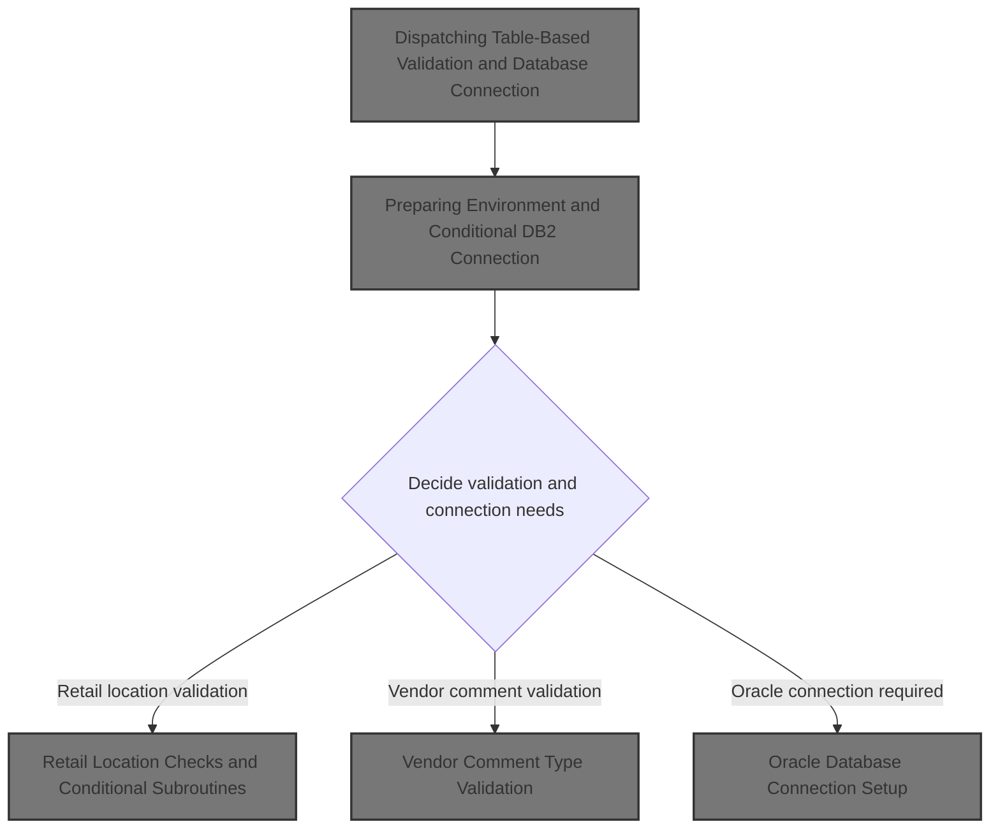
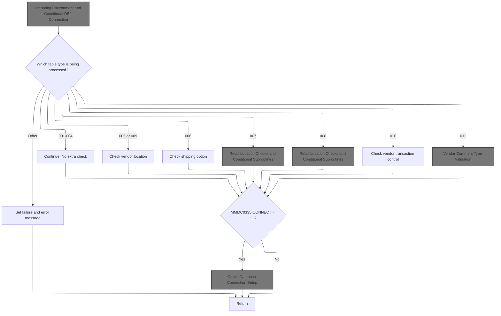
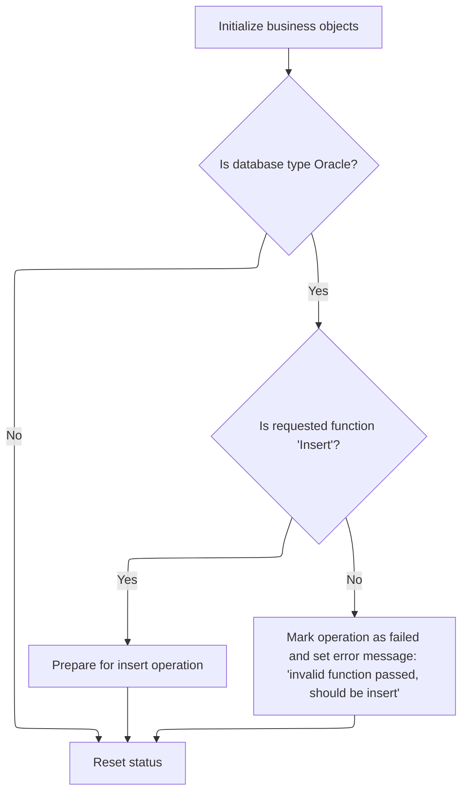
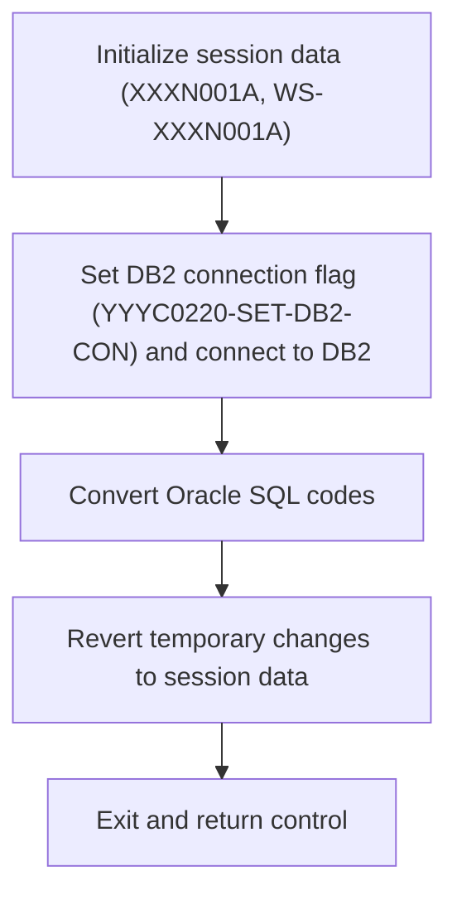
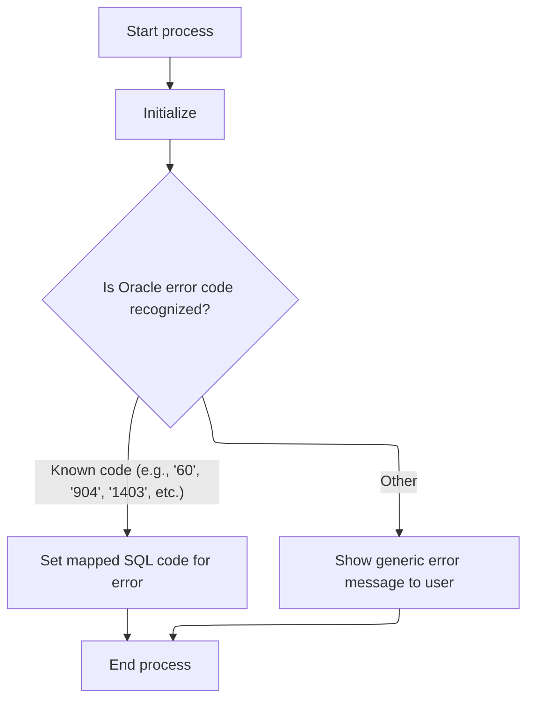
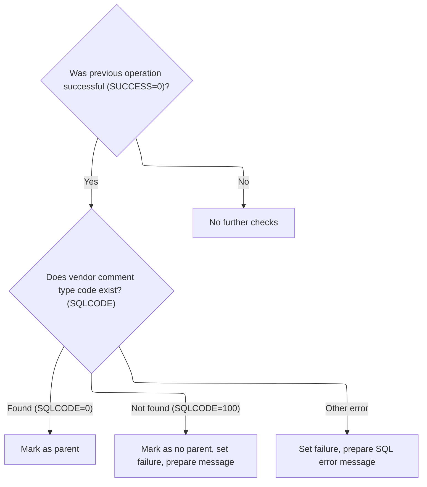

This document describes how table-based requests are validated and how database connections are managed. The flow receives a table type code and connection flags, determines which business validation to apply, and sets up the required database connection. The outcome is a validated request and any necessary error messages for the user.



# Spec

## Detailed View of the Program's Functionality

## Main Program Flow and Table-Based Dispatch

The main program begins by initializing its environment and then uses a dispatching mechanism to determine which validation or check routine to run, based on a numeric table code provided as input. The steps are as follows:

1. **Initialization**:\
   The program first resets key data areas and, if the database type is Oracle, checks that the requested function is an insert. If not, it marks the operation as failed and sets an error message. If the function is valid, it switches the database context to DB2 by calling an external connection manager.

2. **Table-Based Dispatch**:\
   The program examines the table code and, depending on its value, performs one of several possible checks:

   - For codes 001–004: No extra check is performed.
   - For codes 005 or 009: A vendor location check is performed.
   - For code 006: A shipping option check is performed.
   - For codes 007 or 008: Retail location checks and possibly additional subroutines are performed.
   - For code 010: A vendor transaction control check is performed.
   - For code 011: Vendor comment type validation is performed.
   - For any other code: The program marks the operation as failed and sets an error message indicating an invalid table code.

3. **Oracle Connection Handling**:\
   After the table-specific check, if the Oracle flag is set, the program saves the current state of key variables, calls a subroutine to establish an Oracle connection, and then restores the saved variables. This ensures that the database context is correctly set for subsequent operations.

4. **Program Exit**:\
   The program then returns control to the caller.

---

## Environment Preparation and Conditional DB2 Connection

During initialization, the program performs the following actions:

1. **Resetting Data Areas**:\
   It clears the main business record, a working storage copy of that record, and the SQL communication area.

2. **Oracle-Specific Logic**:\
   If the database type is Oracle:

   - It checks if the requested function is an insert. If so, it switches to DB2 by calling an external connection manager.
   - If the function is not an insert, it marks the operation as failed and sets an error message indicating that only insert operations are allowed.

3. **Status Reset**:\
   Regardless of database type, it clears the status field to ensure a clean state for the operation.

---

## Switching to DB2 via Connection Manager

When a switch to DB2 is required, the program:

1. **Calls an External Connection Manager**:\
   It invokes an external routine, passing the business record and SQL communication area, to handle the details of connecting to DB2. This keeps the connection logic modular and separate from the main program flow.

---

## DB2 Connection, Error Conversion, and Data Restoration

The external connection manager for DB2 performs several steps:

1. **Session Data Initialization**:\
   It saves the current business record to a working storage area and clears the main record area, preparing for the connection switch.

2. **DB2 Connection Setup**:\
   It sets a flag indicating that a DB2 connection is required and calls another external manager to perform the actual connection and update any related statistics.

3. **Oracle Error Code Conversion**:\
   If a specific Oracle error code is detected after the connection, it calls another subroutine to convert this Oracle error code into an internal format that the rest of the program can understand.

4. **Data Restoration**:\
   After all connection and error handling steps, it restores the original business record from working storage.

5. **Return Control**:\
   The routine then returns control to the caller.

---

## Oracle Error Code Conversion

The Oracle error code conversion subroutine works as follows:

1. **Initialization**:\
   It clears all working storage fields used for error messages and Oracle error codes.

2. **Error Code Extraction and Mapping**:\
   It splits the Oracle error message string into components, extracting the Oracle error code (assumed to be the last part of the string). It then uses a switch-case structure to map known Oracle error codes to corresponding internal SQL codes. For example:

   - Oracle code '60' maps to SQL code -911.
   - Oracle code '904' or '310' maps to SQL code -206.
   - Oracle code '1403' maps to SQL code -100.
   - And so on for a range of known codes.

3. **Unknown Code Handling**:\
   If the Oracle code is not recognized, it constructs a generic error message indicating an unknown Oracle code.

4. **Cleanup**:\
   It clears the Oracle error message field to prevent residual errors from affecting subsequent operations.

---

## Retail Location Checks and Conditional Subroutines

For certain table codes (007 and 008), the program performs chained checks based on the success of previous operations and the state of a "parent" flag:

1. **Retail Location Check**:\
   If the previous operation was successful, it may perform an e-commerce market area check. If that is also successful and the parent flag is set, it may perform a computer type check.

2. **Retail Location Class and Zone Check**:\
   Similarly, for another table code, it may check the item class, and if successful and the parent flag is set, check advertising zones.

Each of these checks involves querying the database for the existence of a code and setting flags or error messages based on the result.

---

## Vendor Comment Type Validation

For table code 011, the program validates the vendor comment type as follows:

1. **Success Check**:\
   The validation only proceeds if the previous operation was successful.

2. **Database Query**:\
   It moves the comment type code into a host variable and queries the database to check if it exists.

3. **Result Handling**:

   - If the code is found, it marks the record as having a parent.
   - If not found, it marks the record as having no parent, sets failure, and prepares an error message.
   - For any other SQL error, it sets failure and prepares a generic SQL error message.

---

## Oracle Database Connection Setup

When an Oracle connection is required, the program:

1. **Calls an External Oracle Connection Manager**:\
   It invokes an external routine, passing the business record and SQL communication area, to set up system variables and establish the Oracle connection. This keeps the Oracle connection logic separate from the main validation flow.

# Rule Definition

| Paragraph Name                                                                                                                                                                                                                                                                                                                       | Rule ID | Category          | Description                                                                                                                                                                                                                                                                                                                                                                                                                                                                                | Conditions                                                                                                                                      | Remarks                                                                                                                                                                                                                           |
| ------------------------------------------------------------------------------------------------------------------------------------------------------------------------------------------------------------------------------------------------------------------------------------------------------------------------------------ | ------- | ----------------- | ------------------------------------------------------------------------------------------------------------------------------------------------------------------------------------------------------------------------------------------------------------------------------------------------------------------------------------------------------------------------------------------------------------------------------------------------------------------------------------------ | ----------------------------------------------------------------------------------------------------------------------------------------------- | --------------------------------------------------------------------------------------------------------------------------------------------------------------------------------------------------------------------------------- |
| 000-MAIN-LINE                                                                                                                                                                                                                                                                                                                        | RL-001  | Conditional Logic | The dispatcher examines the value of MMMC0335-TABLE and selects the appropriate validation or check routine. For table codes 001-004, it continues without extra validation. For 005/009, it performs a vendor location check. For 006, a shipping option check. For 007/008, retail location checks and conditional subroutines. For 010, a vendor transaction control check. For 011, vendor comment type validation. For any other value, it sets failure and returns an error message. | MMMC0335-TABLE must be present and numeric. The dispatcher must handle all specified codes and default to error handling for unsupported codes. | Table codes: 001, 002, 003, 004, 005, 006, 007, 008, 009, 010, 011. Error message for invalid table: 'MMMS0335 - invalid table passed'. MMMC0335-TABLE is a 3-digit numeric field.                                                |
| 500-CHK-XXX-VEND-LOC, 505-CHK-XXX, 600-CHK-LOC-SHPNG-OPT, 605-CHK-CUST-SHPNG-METH, 700-CHK-RETAIL-LOC, 705-CHK-ECOMM-MKT-AREA, 800-CHK-RETL-LOC-CLS-AD-ZN, 805-CHK-ITM-CLS, 810-CHK-AA-ZONES, 900-CHK-XXX-VEND-LOC, 905-CHK-XXX, 1000-CHK-VEND-TRXAL-CNTL, 1005-CHK-BUSINESS-FUNCTION, 1100-CHK-VENDOR-COMMENTS, 1105-CHK-CMT-TYP-CD | RL-002  | Conditional Logic | Each validation routine checks for the existence of a referenced value. If found, sets MMMC0335-PARENT to true, MMMC0335-NO-PARENT to false, FAILURE to false, and clears IS-RTRN-MSG-TXT. If not found, sets MMMC0335-NO-PARENT to true, MMMC0335-PARENT to false, FAILURE to true, and sets IS-RTRN-MSG-TXT to a descriptive error message. For other errors, sets FAILURE to true and IS-RTRN-MSG-TXT to a SQL error message.                                                           | Validation routine is invoked for the relevant table code. Database call (stubbed) returns found, not found, or error.                          | MMMC0335-PARENT and MMMC0335-NO-PARENT are 1-character flags. FAILURE is a boolean flag. IS-RTRN-MSG-TXT is a string (at least 40 chars). Error messages are descriptive and may include SQLCODE.                                 |
| 000-MAIN-LINE, 020-CONNECT-TO-ORACLE                                                                                                                                                                                                                                                                                                 | RL-003  | Conditional Logic | After validation, if MMMC0335-ORACLE is set to 'O', the dispatcher must invoke Oracle connection logic before returning.                                                                                                                                                                                                                                                                                                                                                                   | MMMC0335-ORACLE is present and equals 'O'.                                                                                                      | MMMC0335-ORACLE is a 1-character field. Oracle connection logic is stubbed for testing.                                                                                                                                           |
| 300-CNV-ORACLE-SQLCODE (YYYS0211), 200-FORMAT-USER-MSG-TXT (YYYS0212)                                                                                                                                                                                                                                                                | RL-004  | Computation       | If Oracle error code conversion is required, IS-RTRN-MSG2-TXT must be set with the mapped or generic error message. Specific Oracle codes are mapped to DB2 SQLCODEs, and for unmapped codes, a generic error message is set.                                                                                                                                                                                                                                                              | Oracle error code is present and conversion is required (e.g., SQLCODE = -84).                                                                  | IS-RTRN-MSG2-TXT is a string field. Oracle error codes (e.g., '60', '904', etc.) are mapped to DB2 SQLCODEs (e.g., -911, -206, etc.). For unmapped codes, IS-RTRN-MSG2-TXT contains a generic error message with the Oracle code. |
| 000-MAIN-LINE, all validation routines                                                                                                                                                                                                                                                                                               | RL-005  | Data Assignment   | The dispatcher and validation routines must not return explicit values; all results must be reflected by mutating the MMMC0335 record fields.                                                                                                                                                                                                                                                                                                                                              | Any result or status must be communicated to the caller.                                                                                        | All output fields are part of MMMC0335. No explicit return values are used.                                                                                                                                                       |
| All validation routines, 020-CONNECT-TO-ORACLE, 015-CONNECT-TO-DB2                                                                                                                                                                                                                                                                   | RL-006  | Computation       | All database and system calls must be represented as stub functions that simulate success, not found, or error conditions as needed for testing.                                                                                                                                                                                                                                                                                                                                           | Any external call to a database or system.                                                                                                      | Stub functions simulate database/system behavior for testing. No real database or system is called.                                                                                                                               |

# User Stories

## User Story 1: Dispatcher routes and validates input records

---

### Story Description:

As a system, I want to accept business object and control/parameter records, route them based on the table code, and perform the appropriate validation or check routine so that the correct business logic is applied and errors are handled consistently.

---

### Business Rule Mapping:

| Rule ID | Paragraph Name                                                                                                                                                                                                                                                                                                                       | Rule Description                                                                                                                                                                                                                                                                                                                                                                                                                                                                           |
| ------- | ------------------------------------------------------------------------------------------------------------------------------------------------------------------------------------------------------------------------------------------------------------------------------------------------------------------------------------ | ------------------------------------------------------------------------------------------------------------------------------------------------------------------------------------------------------------------------------------------------------------------------------------------------------------------------------------------------------------------------------------------------------------------------------------------------------------------------------------------ |
| RL-001  | 000-MAIN-LINE                                                                                                                                                                                                                                                                                                                        | The dispatcher examines the value of MMMC0335-TABLE and selects the appropriate validation or check routine. For table codes 001-004, it continues without extra validation. For 005/009, it performs a vendor location check. For 006, a shipping option check. For 007/008, retail location checks and conditional subroutines. For 010, a vendor transaction control check. For 011, vendor comment type validation. For any other value, it sets failure and returns an error message. |
| RL-005  | 000-MAIN-LINE, all validation routines                                                                                                                                                                                                                                                                                               | The dispatcher and validation routines must not return explicit values; all results must be reflected by mutating the MMMC0335 record fields.                                                                                                                                                                                                                                                                                                                                              |
| RL-002  | 500-CHK-XXX-VEND-LOC, 505-CHK-XXX, 600-CHK-LOC-SHPNG-OPT, 605-CHK-CUST-SHPNG-METH, 700-CHK-RETAIL-LOC, 705-CHK-ECOMM-MKT-AREA, 800-CHK-RETL-LOC-CLS-AD-ZN, 805-CHK-ITM-CLS, 810-CHK-AA-ZONES, 900-CHK-XXX-VEND-LOC, 905-CHK-XXX, 1000-CHK-VEND-TRXAL-CNTL, 1005-CHK-BUSINESS-FUNCTION, 1100-CHK-VENDOR-COMMENTS, 1105-CHK-CMT-TYP-CD | Each validation routine checks for the existence of a referenced value. If found, sets MMMC0335-PARENT to true, MMMC0335-NO-PARENT to false, FAILURE to false, and clears IS-RTRN-MSG-TXT. If not found, sets MMMC0335-NO-PARENT to true, MMMC0335-PARENT to false, FAILURE to true, and sets IS-RTRN-MSG-TXT to a descriptive error message. For other errors, sets FAILURE to true and IS-RTRN-MSG-TXT to a SQL error message.                                                           |

---

### Relevant Functionality:

- **000-MAIN-LINE**
  1. **RL-001:**
     - On entry, examine MMMC0335-TABLE
       - If 001-004: continue
       - If 005 or 009: perform vendor location check
       - If 006: perform shipping option check
       - If 007: perform retail location checks and subroutines
       - If 008: perform retail location class/address/zone checks
       - If 010: perform vendor transaction control check
       - If 011: perform vendor comment type validation
       - Else: set FAILURE to true, set IS-RTRN-MSG-TXT to error message, set MMMC0335-PARENT and MMMC0335-NO-PARENT to false, clear MMMC0335-STATUS
  2. **RL-005:**
     - For all routines, set output fields in MMMC0335 as needed
       - Do not return values explicitly
- **500-CHK-XXX-VEND-LOC**
  1. **RL-002:**
     - Perform database check (stubbed)
       - If found: set MMMC0335-PARENT true, MMMC0335-NO-PARENT false, FAILURE false, clear IS-RTRN-MSG-TXT
       - If not found: set MMMC0335-NO-PARENT true, MMMC0335-PARENT false, FAILURE true, set IS-RTRN-MSG-TXT to missing value message
       - If error: set FAILURE true, set IS-RTRN-MSG-TXT to SQL error message

## User Story 2: Oracle connection and error handling

---

### Story Description:

As a system, I want to invoke Oracle connection logic after validation when required, and convert Oracle error codes to mapped or generic messages so that users receive meaningful feedback and all results are reflected in the MMMC0335 record.

---

### Business Rule Mapping:

| Rule ID | Paragraph Name                                                        | Rule Description                                                                                                                                                                                                              |
| ------- | --------------------------------------------------------------------- | ----------------------------------------------------------------------------------------------------------------------------------------------------------------------------------------------------------------------------- |
| RL-003  | 000-MAIN-LINE, 020-CONNECT-TO-ORACLE                                  | After validation, if MMMC0335-ORACLE is set to 'O', the dispatcher must invoke Oracle connection logic before returning.                                                                                                      |
| RL-005  | 000-MAIN-LINE, all validation routines                                | The dispatcher and validation routines must not return explicit values; all results must be reflected by mutating the MMMC0335 record fields.                                                                                 |
| RL-004  | 300-CNV-ORACLE-SQLCODE (YYYS0211), 200-FORMAT-USER-MSG-TXT (YYYS0212) | If Oracle error code conversion is required, IS-RTRN-MSG2-TXT must be set with the mapped or generic error message. Specific Oracle codes are mapped to DB2 SQLCODEs, and for unmapped codes, a generic error message is set. |

---

### Relevant Functionality:

- **000-MAIN-LINE**
  1. **RL-003:**
     - After validation, check MMMC0335-ORACLE
       - If 'O': invoke Oracle connection stub
       - Else: do not invoke
  2. **RL-005:**
     - For all routines, set output fields in MMMC0335 as needed
       - Do not return values explicitly
- **300-CNV-ORACLE-SQLCODE (YYYS0211)**
  1. **RL-004:**
     - If Oracle error code conversion is needed:
       - Unstring SQLERRMC to extract Oracle code
       - Map known Oracle codes to DB2 SQLCODEs
       - For unknown codes, set IS-RTRN-MSG2-TXT to generic error message with code

## User Story 3: Stubbed database and system calls for testing

---

### Story Description:

As a system, I want all database and system calls to be represented as stub functions that simulate success, not found, or error conditions so that the system can be tested without relying on external dependencies.

---

### Business Rule Mapping:

| Rule ID | Paragraph Name                                                                                                                                                                                                                                                                                                                       | Rule Description                                                                                                                                                                                                                                                                                                                                                                                                                 |
| ------- | ------------------------------------------------------------------------------------------------------------------------------------------------------------------------------------------------------------------------------------------------------------------------------------------------------------------------------------ | -------------------------------------------------------------------------------------------------------------------------------------------------------------------------------------------------------------------------------------------------------------------------------------------------------------------------------------------------------------------------------------------------------------------------------- |
| RL-003  | 000-MAIN-LINE, 020-CONNECT-TO-ORACLE                                                                                                                                                                                                                                                                                                 | After validation, if MMMC0335-ORACLE is set to 'O', the dispatcher must invoke Oracle connection logic before returning.                                                                                                                                                                                                                                                                                                         |
| RL-006  | All validation routines, 020-CONNECT-TO-ORACLE, 015-CONNECT-TO-DB2                                                                                                                                                                                                                                                                   | All database and system calls must be represented as stub functions that simulate success, not found, or error conditions as needed for testing.                                                                                                                                                                                                                                                                                 |
| RL-002  | 500-CHK-XXX-VEND-LOC, 505-CHK-XXX, 600-CHK-LOC-SHPNG-OPT, 605-CHK-CUST-SHPNG-METH, 700-CHK-RETAIL-LOC, 705-CHK-ECOMM-MKT-AREA, 800-CHK-RETL-LOC-CLS-AD-ZN, 805-CHK-ITM-CLS, 810-CHK-AA-ZONES, 900-CHK-XXX-VEND-LOC, 905-CHK-XXX, 1000-CHK-VEND-TRXAL-CNTL, 1005-CHK-BUSINESS-FUNCTION, 1100-CHK-VENDOR-COMMENTS, 1105-CHK-CMT-TYP-CD | Each validation routine checks for the existence of a referenced value. If found, sets MMMC0335-PARENT to true, MMMC0335-NO-PARENT to false, FAILURE to false, and clears IS-RTRN-MSG-TXT. If not found, sets MMMC0335-NO-PARENT to true, MMMC0335-PARENT to false, FAILURE to true, and sets IS-RTRN-MSG-TXT to a descriptive error message. For other errors, sets FAILURE to true and IS-RTRN-MSG-TXT to a SQL error message. |

---

### Relevant Functionality:

- **000-MAIN-LINE**
  1. **RL-003:**
     - After validation, check MMMC0335-ORACLE
       - If 'O': invoke Oracle connection stub
       - Else: do not invoke
- **All validation routines**
  1. **RL-006:**
     - Replace actual database/system calls with stub functions
       - Stub returns simulated results (success, not found, error) as needed
- **500-CHK-XXX-VEND-LOC**
  1. **RL-002:**
     - Perform database check (stubbed)
       - If found: set MMMC0335-PARENT true, MMMC0335-NO-PARENT false, FAILURE false, clear IS-RTRN-MSG-TXT
       - If not found: set MMMC0335-NO-PARENT true, MMMC0335-PARENT false, FAILURE true, set IS-RTRN-MSG-TXT to missing value message
       - If error: set FAILURE true, set IS-RTRN-MSG-TXT to SQL error message

# Code Walkthrough

## Dispatching Table-Based Validation and Database Connection



<SwmSnippet path="/base/src/MMMS0335.cbl" line="86">

---

000-MAIN-LINE kicks off the flow by running 010-INITIALIZE to set up the environment. It then uses EVALUATE on MMMC0335-TABLE to pick which validation or check subroutine to run, based on the numeric code. If the code is outside 001-011, it flags failure and sets an error message. If the Oracle flag is set, it handles variable moves and calls 020-CONNECT-TO-ORACLE to set up the Oracle connection, then restores the variables. This structure lets the program flexibly dispatch different checks and handle database connections as needed.

```cobol
010600 000-MAIN-LINE.                                                   00010600
010700     PERFORM 010-INITIALIZE                                       00010700
010800     EVALUATE MMMC0335-TABLE                                      00010800
010900       WHEN 001                                                   00010900
011100       WHEN 002                                                   00011100
011300       WHEN 003                                                   00011300
011500       WHEN 004                                                   00011500
011600         CONTINUE                                                 00011600
011700       WHEN 005                                                   00011700
011800         PERFORM 500-CHK-XXX-VEND-LOC                             00011800
011900       WHEN 006                                                   00011900
012000         PERFORM 600-CHK-LOC-SHPNG-OPT                            00012000
012100       WHEN 007                                                   00012100
012200         PERFORM 700-CHK-RETAIL-LOC                               00012200
012300       WHEN 008                                                   00012300
012400         PERFORM 800-CHK-RETL-LOC-CLS-AD-ZN                       00012400
012500       WHEN 009                                                   00012500
012600         PERFORM 900-CHK-XXX-VEND-LOC                             00012600
012700       WHEN 010                                                   00012700
012800         PERFORM 1000-CHK-VEND-TRXAL-CNTL                         00012800
012900       WHEN 011                                                   00012900
013000         PERFORM 1100-CHK-VENDOR-COMMENTS                         00013000
013100       WHEN OTHER                                                 00013100
013200         SET FAILURE   TO TRUE                                    00013200
013300         MOVE SPACES  TO IS-RTRN-MSG-TXT                          00013300
013400         STRING 'MMMS0335 - invalid table passed '                00013400
013500                DELIMITED BY SIZE INTO IS-RTRN-MSG-TXT            00013500
013600     END-EVALUATE                                                 00013600
013700     IF MMMC0335-ORACLE                                           00013700
013800       MOVE XXXN001A   TO  WS-XXXN001A                            00013800
013900       MOVE SQLCA      TO  WS-SQLCA                               00013900
014000       PERFORM 020-CONNECT-TO-ORACLE                              00014000
014100       MOVE WS-XXXN001A  TO XXXN001A                              00014100
014200       MOVE WS-SQLCA     TO SQLCA                                 00014200
014300     END-IF                                                       00014300
014400                                                                  00014400
014500     GOBACK                                                       00014500
014600     .                                                            00014600
```

---

</SwmSnippet>

### Preparing Environment and Conditional DB2 Connection



<SwmSnippet path="/base/src/MMMS0335.cbl" line="129">

---

010-INITIALIZE checks for Oracle and insert, then calls 015-CONNECT-TO-DB2 to switch DB context if needed, otherwise it blocks invalid operations.

```cobol
015200 010-INITIALIZE.                                                  00015200
015300     INITIALIZE XXXN001A                                          00015300
015400                WS-XXXN001A                                       00015400
015500                WS-SQLCA                                          00015500
015600                                                                  00015600
015700     IF MMMC0335-ORACLE                                           00015700
015800       IF MMMC0335-FUNC  = 'I'                                    00015800
015900         PERFORM 015-CONNECT-TO-DB2                               00015900
016000       ELSE                                                       00016000
016100         SET FAILURE TO TRUE                                      00016100
016200         MOVE SPACES  TO IS-RTRN-MSG-TXT                          00016200
016300         STRING 'MMMS0335 - invalid function passed '             00016300
016400                'function should be insert'                       00016400
016500                DELIMITED BY SIZE INTO IS-RTRN-MSG-TXT            00016500
016600       END-IF                                                     00016600
016700     END-IF                                                       00016700
016800                                                                  00016800
016900     MOVE SPACES   TO MMMC0335-STATUS                             00016900
017000     .                                                            00017000
```

---

</SwmSnippet>

### Switching to DB2 via Connection Manager

<SwmSnippet path="/base/src/MMMS0335.cbl" line="153">

---

015-CONNECT-TO-DB2 calls YYYS0211 (Z-DB2-CONNECT) to handle the DB2 connection switch and related error handling. This keeps the connection logic separate and lets the external program manage the details.

```cobol
017600 015-CONNECT-TO-DB2.                                              00017600
017700     CALL Z-DB2-CONNECT         USING XXXN001A                    00017700
017800                                      SQLCA                       00017800
017900     .                                                            00017900
```

---

</SwmSnippet>

### DB2 Connection, Error Conversion, and Data Restoration



<SwmSnippet path="/base/src/YYYS0211.cbl" line="32">

---

0000-EXIT-DISPATCHER runs initialization, switches to DB2, converts Oracle error codes if needed, and restores the business record. This bundles all connection and error handling steps before returning control.

```cobol
004700 0000-EXIT-DISPATCHER.                                            00004700
004800     PERFORM 100-INITIALIZATION                                   00004800
004900     PERFORM 200-CONNECT-TO-DB2                                   00004900
005000     PERFORM 300-CNV-ORACLE-SQLCODE                               00005000
005100     PERFORM 400-REVERT-SAVED-XXXN001A                            00005100
005300     GOBACK                                                       00005300
005400     .                                                            00005400
```

---

</SwmSnippet>

<SwmSnippet path="/base/src/YYYS0211.cbl" line="44">

---

100-INITIALIZATION saves the current business record to working storage, then clears the main record area. This lets later steps restore the original data if needed.

```cobol
006000 100-INITIALIZATION.                                              00006000
006100     MOVE XXXN001A TO WS-XXXN001A                                 00006100
006200     INITIALIZE XXXN001A                                          00006200
006400     .                                                            00006400
```

---

</SwmSnippet>

<SwmSnippet path="/base/src/YYYS0211.cbl" line="53">

---

200-CONNECT-TO-DB2 sets the DB2 connection flag in YYYC0220 and calls YYYS0220-DBMS-CON-MGR to actually switch the connection and update stats. This keeps connection logic out of the main flow.

```cobol
007300 200-CONNECT-TO-DB2.                                              00007300
007400     SET YYYC0220-SET-DB2-CON TO TRUE                             00007400
007500     CALL YYYS0220-DBMS-CON-MGR USING                             00007500
007600         XXXN001A                                                 00007600
007700         YYYC0220                                                 00007700
008100     .                                                            00008100
```

---

</SwmSnippet>

### Oracle Error Code Conversion

<SwmSnippet path="/base/src/YYYS0211.cbl" line="65">

---

300-CNV-ORACLE-SQLCODE checks for a specific Oracle error code (-84) and calls YYYS0212 to convert it to an internal format. This keeps error mapping logic out of the main flow.

```cobol
009500 300-CNV-ORACLE-SQLCODE.                                          00009500
009600     IF  SUCCESS                                                  00009600
009610     AND SQLCODE = -84                                            00009610
009720       CALL Z-ORA-ERR-CONVERSION USING                            00009720
009730           XXXN001A                                               00009730
009740           SQLCA                                                  00009740
009750     END-IF                                                       00009750
010200     .                                                            00010200
```

---

</SwmSnippet>

### Error Message Initialization and Oracle Code Mapping



<SwmSnippet path="/base/src/YYYS0212.cbl" line="29">

---

000-MAIN-PROCESS clears error message fields, then runs the formatting logic to parse and map Oracle error codes to internal codes and messages. This standardizes error handling for the rest of the flow.

```cobol
003800 000-MAIN-PROCESS.                                                00003800
003900     PERFORM 100-INITIALIZE                                       00003900
004000     PERFORM 200-FORMAT-USER-MSG-TXT                              00004000
004100     GOBACK                                                       00004100
004200     .                                                            00004200
```

---

</SwmSnippet>

<SwmSnippet path="/base/src/YYYS0212.cbl" line="50">

---

200-FORMAT-USER-MSG-TXT splits the error message string to extract the Oracle code, then maps it to an internal SQLCODE using a switch-case. Unknown codes get a generic error message. The logic assumes the code is always last in the string.

```cobol
005900 200-FORMAT-USER-MSG-TXT.                                         00005900
006000     UNSTRING SQLERRMC  DELIMITED BY SPACE INTO                   00006000
006100                        WS-ERR-MSG1                               00006100
006200                        WS-ERR-MSG2                               00006200
006300                        WS-ERR-MSG3                               00006300
006400                        WS-ERR-ORA-CODE                           00006400
006500     EVALUATE WS-ERR-ORA-CODE                                     00006500
006510       WHEN  '60   '                                              00006510
006520         MOVE  -911                             TO SQLCODE        00006520
006600       WHEN  '904  '                                              00006600
006700       WHEN  '310  '                                              00006700
006800         MOVE  -206                             TO SQLCODE        00006800
006900       WHEN  '615  '                                              00006900
007000       WHEN  '616  '                                              00007000
007100         MOVE  -420                             TO SQLCODE        00007100
007200       WHEN  '942  '                                              00007200
007300         MOVE  -204                             TO SQLCODE        00007300
007400       WHEN  '1403 '                                              00007400
007500         MOVE  -100                             TO SQLCODE        00007500
007600       WHEN  '1001 '                                              00007600
007700         MOVE  -501                             TO SQLCODE        00007700
007800       WHEN  '1438 '                                              00007800
007900         MOVE  -413                             TO SQLCODE        00007900
008000       WHEN  '2112 '                                              00008000
008100       WHEN  '1422 '                                              00008100
008200         MOVE  -811                             TO SQLCODE        00008200
008300       WHEN  '2049 '                                              00008300
008400         MOVE  -913                             TO SQLCODE        00008400
008500       WHEN  '2291 '                                              00008500
008600         MOVE  -530                             TO SQLCODE        00008600
008700       WHEN  '2292 '                                              00008700
008800         MOVE  -532                             TO SQLCODE        00008800
008900       WHEN  '6502 '                                              00008900
009000         MOVE  -304                             TO SQLCODE        00009000
009100       WHEN  '6508 '                                              00009100
009200         MOVE  -440                             TO SQLCODE        00009200
009300       WHEN  '6511 '                                              00009300
009400         MOVE  -502                             TO SQLCODE        00009400
009500       WHEN  '6550 '                                              00009500
009600       WHEN  '6553 '                                              00009600
009700         MOVE  -440                             TO SQLCODE        00009700
009800       WHEN  '14028'                                              00009800
009900         MOVE  -538                             TO SQLCODE        00009900
010000       WHEN  '30006'                                              00010000
010100         MOVE  -904                             TO SQLCODE        00010100
010200       WHEN OTHER                                                 00010200
010300         STRING 'Error in YYYS0212. Oracle code:'                 00010300
010300                 WS-ERR-ORA-CODE                                  00010320
010300         DELIMITED BY SIZE INTO IS-RTRN-MSG2-TXT                  00010330
010500     END-EVALUATE                                                 00010500
010600     MOVE SPACES                                TO SQLERRMC       00010600
010700     .                                                            00010700
```

---

</SwmSnippet>

### Retail Location Checks and Conditional Subroutines

<SwmSnippet path="/base/src/MMMS0335.cbl" line="260">

---

700-CHK-RETAIL-LOC checks for a successful previous operation, then runs 705-CHK-ECOMM-MKT-AREA. If still successful and the parent flag is set, it runs 710-CHK-CMPTR-TYP. This chains checks based on flags, not just the function name.

```cobol
046200 700-CHK-RETAIL-LOC.                                              00046200
046300      IF SUCCESS                                                  00046300
046400*       PERFORM 705-CHK-ECOMM-MKT-AREA                            00046400
046500*       IF SUCCESS AND MMMC0335-PARENT                            00046500
046600*         PERFORM 710-CHK-CMPTR-TYP                               00046600
046700*       END-IF                                                    00046700
046800        CONTINUE                                                  00046800
046900      END-IF                                                      00046900
047000      .                                                           00047000
```

---

</SwmSnippet>

<SwmSnippet path="/base/src/MMMS0335.cbl" line="308">

---

800-CHK-RETL-LOC-CLS-AD-ZN runs 805-CHK-ITM-CLS if the previous step succeeded, then 810-CHK-AA-ZONES if still successful and the parent flag is set. This chains checks based on flags, not just the function name.

```cobol
054700 800-CHK-RETL-LOC-CLS-AD-ZN.                                      00054700
054800      IF SUCCESS                                                  00054800
054900*       PERFORM 805-CHK-ITM-CLS                                   00054900
055000*       IF SUCCESS AND MMMC0335-PARENT                            00055000
055100*         PERFORM 810-CHK-AA-ZONES                                00055100
055200*       END-IF                                                    00055200
055300        CONTINUE                                                  00055300
055400      END-IF                                                      00055400
055500      .                                                           00055500
```

---

</SwmSnippet>

### Vendor Comment Type Validation



<SwmSnippet path="/base/src/MMMS0335.cbl" line="484">

---

1100-CHK-VENDOR-COMMENTS only runs 1105-CHK-CMT-TYP-CD if the previous step succeeded. That subroutine checks if the comment type code exists in the database and sets flags or error messages based on the result.

```cobol
072300 1100-CHK-VENDOR-COMMENTS.                                        00072300
072400      IF SUCCESS                                                  00072400
072500        PERFORM 1105-CHK-CMT-TYP-CD                               00072500
072600      END-IF                                                      00072600
072700      .                                                           00072700
```

---

</SwmSnippet>

<SwmSnippet path="/base/src/MMMS0335.cbl" line="491">

---

1105-CHK-CMT-TYP-CD moves the comment type code to a host variable, runs a SELECT against XXX_TYP_CD, and sets flags based on the result. If not found, it marks failure and builds an error message.

```cobol
073000 1105-CHK-CMT-TYP-CD.                                             00073000
073100     MOVE MMMC0335-CMT-TYP-CD                                     00073100
073200       TO CMT-TYP-CD             OF DCLCMT-TYP-CD                 00073200
073300                                                                  00073300
073400     EXEC SQL                                                     00073400
073500        SELECT XXX_TYP_CD                                         00073500
073600         INTO : DCLCMT-TYP-CD.CMT-TYP-CD                          00073600
073700        FROM XXX_TYP_CD                                           00073700
073800        WHERE XXX_TYP_CD                                          00073800
073900                      = :DCLCMT-TYP-CD.CMT-TYP-CD                 00073900
074000        FETCH FIRST 1 ROWS ONLY                                   00074000
074100     END-EXEC                                                     00074100
074200                                                                  00074200
074300     EVALUATE TRUE                                                00074300
074400       WHEN SQLCODE = 0                                           00074400
074500         SET MMMC0335-PARENT     TO  TRUE                         00074500
074600       WHEN SQLCODE = 100                                         00074600
074700         SET  MMMC0335-NO-PARENT TO TRUE                          00074700
074800         SET FAILURE             TO TRUE                          00074800
074900         MOVE SQLCODE            TO WS-SQLCODE                    00074900
075000         MOVE SPACE              TO IS-RTRN-MSG-TXT               00075000
075100         STRING 'MMMS0335 - XXX_TYP_CD'                           00075100
075200                 ' should be in XXX_TYP_CD,'                      00075200
075300                 ' rule = MDVCMDCT '                              00075300
075400         DELIMITED BY SIZE INTO IS-RTRN-MSG-TXT                   00075400
075500       WHEN OTHER                                                 00075500
075600         SET FAILURE             TO TRUE                          00075600
075700         MOVE SQLCODE            TO WS-SQLCODE                    00075700
075800         MOVE SPACE              TO IS-RTRN-MSG-TXT               00075800
075900         STRING 'MMMS0335 - SQL error on table '                  00075900
076000                'XXX_TYP_CD, '                                    00076000
076100                 'Sqlcode = ' WS-SQLCODE                          00076100
076200         DELIMITED BY SIZE INTO IS-RTRN-MSG-TXT                   00076200
076300     END-EVALUATE                                                 00076300
076400     .                                                            00076400
```

---

</SwmSnippet>

### Oracle Database Connection Setup

<SwmSnippet path="/base/src/MMMS0335.cbl" line="162">

---

020-CONNECT-TO-ORACLE calls XXXS0210 to set up system variables and establish the Oracle connection. This keeps connection setup logic out of the main validation flow.

```cobol
018500 020-CONNECT-TO-ORACLE.                                           00018500
018600     CALL Z-ORA-CONNECT USING XXXN001A                            00018600
018700                              SQLCA                               00018700
018800     .                                                            00018800
```

---

</SwmSnippet>

&nbsp;

*This is an auto-generated document by Swimm 🌊 and has not yet been verified by a human*

<SwmMeta version="3.0.0" repo-id="Z2l0aHViJTNBJTNBU3dpbW1pby1keW5jYWxsLWRlbW8lM0ElM0FHaXJpLVN3aW1t" repo-name="Swimmio-dyncall-demo"><sup>Powered by [Swimm](https://app.swimm.io/)</sup></SwmMeta>
