# Overview

This document describes the flow for validating Direct Store Vendor (DSV) status for vendors and entities. The process validates input, establishes a database connection, and determines DSV classification based on business rules and database records.

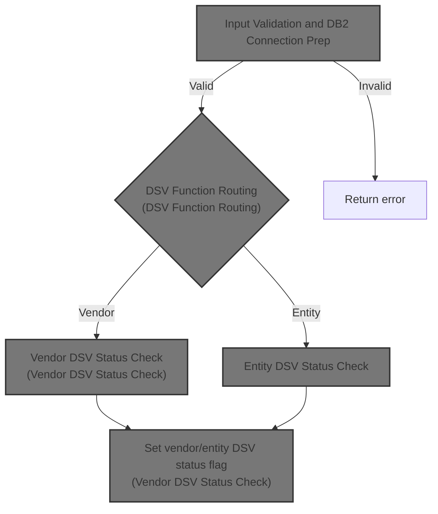

## Dependencies

### Programs

- <SwmToken path="base/src/MMMS0711.cbl" pos="96:10:10" line-data="010701*    DISPLAY &#39;IM IN MMMS0711&#39;                                     00011000">`MMMS0711`</SwmToken> (<SwmPath>[base/src/MMMS0711.cbl](base/src/MMMS0711.cbl)</SwmPath>)
- YYYS0210 (<SwmPath>[base/src/XXXS0210.cbl](base/src/XXXS0210.cbl)</SwmPath>)
- <SwmToken path="base/src/YYYS0211.cbl" pos="55:4:4" line-data="007500     CALL YYYS0220-DBMS-CON-MGR USING                             00007500">`YYYS0220`</SwmToken> (<SwmPath>[base/src/YYYS0220.cbl](base/src/YYYS0220.cbl)</SwmPath>)
- <SwmToken path="base/src/YYYS0211.cbl" pos="2:7:7" line-data="000200 PROGRAM-ID.    YYYS0211.                                         00000200">`YYYS0211`</SwmToken> (<SwmPath>[base/src/YYYS0211.cbl](base/src/YYYS0211.cbl)</SwmPath>)
- <SwmToken path="base/src/YYYS0212.cbl" pos="96:9:9" line-data="010300         STRING &#39;Error in YYYS0212. Oracle code:&#39;                 00010300">`YYYS0212`</SwmToken> (<SwmPath>[base/src/YYYS0212.cbl](base/src/YYYS0212.cbl)</SwmPath>)
- <SwmToken path="base/src/MMMS0711.cbl" pos="385:4:4" line-data="039300     CALL WWWS0099-CONTROL-SUBR USING                             00039900">`WWWS0099`</SwmToken>

### Copybooks

- SQLCA
- <SwmToken path="base/src/MMMS0711.cbl" pos="97:4:4" line-data="010800     INITIALIZE XXXN001A                                          00011100">`XXXN001A`</SwmToken> (<SwmPath>[base/src/XXXN001A.cpy](base/src/XXXN001A.cpy)</SwmPath>)
- <SwmToken path="base/src/YYYS0211.cbl" pos="54:4:4" line-data="007400     SET YYYC0220-SET-DB2-CON TO TRUE                             00007400">`YYYC0220`</SwmToken> (<SwmPath>[base/src/YYYC0220.cpy](base/src/YYYC0220.cpy)</SwmPath>)
- <SwmToken path="base/src/MMMS0711.cbl" pos="22:4:4" line-data="003400  COPY YYYN000A.                                                  00003600">`YYYN000A`</SwmToken> (<SwmPath>[base/src/YYYN000A.cpy](base/src/YYYN000A.cpy)</SwmPath>)
- <SwmToken path="base/src/MMMS0711.cbl" pos="133:9:9" line-data="014400*       IF SUCCESS AND WWWC0099-ORACLE                            00014700">`WWWC0099`</SwmToken>
- <SwmToken path="base/src/MMMS0711.cbl" pos="85:5:5" line-data="009700*    IF YYYN005A-ORACLE                                           00009900">`YYYN005A`</SwmToken> (<SwmPath>[base/src/YYYN005A.cpy](base/src/YYYN005A.cpy)</SwmPath>)
- <SwmToken path="base/src/MMMS0711.cbl" pos="34:4:4" line-data="004600       INCLUDE DDDTLS01                                           00004800">`DDDTLS01`</SwmToken>
- <SwmToken path="base/src/MMMS0711.cbl" pos="38:4:4" line-data="005000       INCLUDE DDDTPT01                                           00005200">`DDDTPT01`</SwmToken>
- <SwmToken path="base/src/MMMS0711.cbl" pos="42:4:4" line-data="005400       INCLUDE DDDTVI01                                           00005600">`DDDTVI01`</SwmToken>
- <SwmToken path="base/src/MMMS0711.cbl" pos="46:4:4" line-data="005800       INCLUDE DDDTSI01                                           00006000">`DDDTSI01`</SwmToken>
- <SwmToken path="base/src/MMMS0711.cbl" pos="50:4:4" line-data="006200       INCLUDE DDDTLO01                                           00006400">`DDDTLO01`</SwmToken> (<SwmPath>[base/src/DDDTLO01.cpy](base/src/DDDTLO01.cpy)</SwmPath>)
- <SwmToken path="base/src/MMMS0711.cbl" pos="74:4:4" line-data="008600       WHEN MMMC0711-IS-DSV-FUNC                                  00008800">`MMMC0711`</SwmToken> (<SwmPath>[base/src/MMMC0711.cpy](base/src/MMMC0711.cpy)</SwmPath>)

# Where is this program used?

This program is used once, as represented in the following diagram:

```mermaid
graph TD
  cbkyl("Managing Location Data (NNNS0487)") --> pde3c("Validating Vendor and Entity Classification (MMMS0711)"):::currentEntity
click cbkyl openCode "base/src/NNNS0487.cbl:1"
  
  
click pde3c openCode "base/src/MMMS0711.cbl:1"
    classDef currentEntity color:#000000,fill:#7CB9F4

%% Swimm:
%% graph TD
%%   cbkyl("Managing Location Data (NNNS0487)") --> pde3c("Validating Vendor and Entity Classification (<SwmToken path="base/src/MMMS0711.cbl" pos="96:10:10" line-data="010701*    DISPLAY &#39;IM IN MMMS0711&#39;                                     00011000">`MMMS0711`</SwmToken>)"):::currentEntity
%% click cbkyl openCode "<SwmPath>[base/src/NNNS0487.cbl](base/src/NNNS0487.cbl)</SwmPath>:1"
%%   
%%   
%% click pde3c openCode "<SwmPath>[base/src/MMMS0711.cbl](base/src/MMMS0711.cbl)</SwmPath>:1"
%%     classDef currentEntity color:#000000,fill:#7CB9F4
```

## Detailed View of the Program's Functionality

# Entry Point and Initialization

The main program begins by setting up the environment and validating the input data. It initializes business data structures and resets output flags to a default state. The vendor type code is set to a default value if not already provided. This ensures that all subsequent logic operates on a clean and predictable set of data.

After initialization, the program checks the type of function requested (such as vendor or entity checks). Based on the function code, it routes the flow to the appropriate validation and database connection logic. If the input is invalid or the function code is not recognized, it sets an error status and prepares an error message for the user.

# Input Validation and <SwmToken path="base/src/MMMS0711.cbl" pos="86:11:11" line-data="009800*      PERFORM 125-CONNECT-TO-DB2                                 00010000">`DB2`</SwmToken> Connection Preparation

During initialization, the program performs several checks:

- It ensures the vendor type code is set to a default value if missing.
- It validates the input based on the requested function:
  - For vendor checks, it verifies that both the vendor number and type code are present.
  - For entity checks, it ensures the entity ID and type are provided.
  - For any other function, it marks the input as invalid and sets an error message.

If all validations pass, the program proceeds to establish a connection to the <SwmToken path="base/src/MMMS0711.cbl" pos="86:11:11" line-data="009800*      PERFORM 125-CONNECT-TO-DB2                                 00010000">`DB2`</SwmToken> database. If any validation fails, it halts further processing and returns an error.

# <SwmToken path="base/src/MMMS0711.cbl" pos="86:11:11" line-data="009800*      PERFORM 125-CONNECT-TO-DB2                                 00010000">`DB2`</SwmToken> Connection Dispatch

The program delegates the actual <SwmToken path="base/src/MMMS0711.cbl" pos="86:11:11" line-data="009800*      PERFORM 125-CONNECT-TO-DB2                                 00010000">`DB2`</SwmToken> connection logic to a dedicated routine. This routine calls an external module responsible for switching to the <SwmToken path="base/src/MMMS0711.cbl" pos="86:11:11" line-data="009800*      PERFORM 125-CONNECT-TO-DB2                                 00010000">`DB2`</SwmToken> environment, handling any errors, and restoring backup records if necessary. This separation keeps the main program logic clean and focused on business rules.

# <SwmToken path="base/src/MMMS0711.cbl" pos="86:11:11" line-data="009800*      PERFORM 125-CONNECT-TO-DB2                                 00010000">`DB2`</SwmToken> Connection and Error Handling Dispatcher

The dispatcher routine orchestrates a controlled shutdown or transition:

- It prepares the environment for exit.
- Ensures the database connection is properly closed.
- Converts any SQL error codes for compatibility.
- Restores the previous state of business data.
- Completes the shutdown sequence.

This ensures that resources are managed correctly and any errors are consistently handled.

# Connection Manager Request

When a connection change is needed, the program sets a flag indicating the desired database (<SwmToken path="base/src/MMMS0711.cbl" pos="86:11:11" line-data="009800*      PERFORM 125-CONNECT-TO-DB2                                 00010000">`DB2`</SwmToken> or Oracle) and calls the connection manager. This manager centralizes all connection logic, allowing for tracking of statistics and handling of overrides.

# Connection Manager Dispatcher

The connection manager evaluates the requested function and routes it to the appropriate handler:

- It can switch connections, retrieve or reset statistics, or handle overrides.
- If the function code is not recognized, it sets an error status and prepares an error message.

This design keeps all connection-related logic in one place, simplifying maintenance and troubleshooting.

## Switch to <SwmToken path="base/src/MMMS0711.cbl" pos="86:11:11" line-data="009800*      PERFORM 125-CONNECT-TO-DB2                                 00010000">`DB2`</SwmToken> and Track Stats

When switching to <SwmToken path="base/src/MMMS0711.cbl" pos="86:11:11" line-data="009800*      PERFORM 125-CONNECT-TO-DB2                                 00010000">`DB2`</SwmToken>:

- The program increments counters for total requests and DB2-specific requests.
- If the current connection is Oracle or default, it performs the switch and increments the switch counter.
- It determines the environment (production or test) and connects to the appropriate <SwmToken path="base/src/MMMS0711.cbl" pos="86:11:11" line-data="009800*      PERFORM 125-CONNECT-TO-DB2                                 00010000">`DB2`</SwmToken> instance.
- After attempting the connection, it checks for success:
  - If successful, it updates the current connection status.
  - If unsuccessful, it sets an error status and prepares a detailed error message.

## Switch to Oracle and Track Stats

When switching to Oracle:

- The program increments counters for total requests and Oracle-specific requests.
- If not already connected to Oracle, it performs the switch and increments the switch counter.
- It determines the environment and connects to the appropriate Oracle instance using a hardcoded connection string.
- After attempting the connection, it checks for success:
  - If successful, it updates the current connection status.
  - If unsuccessful, it sets an error status and prepares a detailed error message.

## Stats Reset and Override Handling

For internal tracking, the program can reset all statistics counters related to requests, switches, and overrides. When handling overrides:

- It increments the override request counter.
- Checks if the override is for <SwmToken path="base/src/MMMS0711.cbl" pos="86:11:11" line-data="009800*      PERFORM 125-CONNECT-TO-DB2                                 00010000">`DB2`</SwmToken> or Oracle and sets the appropriate flags and counters.
- If the override request is invalid, it sets an error status and prepares an error message.

# Oracle Error Code Conversion

After a database operation, if a specific Oracle error code is detected, the program calls an external module to convert it to an internal business error code. This ensures that error handling remains consistent across different database systems.

# Oracle Error Mapping and Formatting

The error conversion module:

- Initializes error fields.
- Splits the Oracle error string into its components.
- Maps recognized Oracle error codes to corresponding internal codes and prepares user-friendly messages.
- If the error code is not recognized, it creates a generic error message for debugging.

This approach ensures that users and support staff receive clear and actionable error information.

# DSV Function Routing

After initialization, the main program evaluates the requested business function:

- If the function is a vendor check, it performs a vendor DSV status check.
- If the function is an entity check, it performs an entity DSV status check.
- For any other function, it sets an error status and prepares an error message.

This routing keeps the logic focused and ensures that only valid functions are processed.

# Vendor DSV Status Check

For vendor checks:

- The program prepares the vendor number and type code.
- It runs a database query to count matching records for the DSV subtype.
- If a match is found, it sets the vendor as DSV; otherwise, it sets the vendor as not DSV.
- If no data is found, it continues without error.
- Any other database error sets an error status and prepares a detailed error message.

# Entity DSV Status Check

For entity checks:

- The program branches based on the entity type.
- For certain types (DSD or UPC), it performs a UPC/vendor association check.
- For product types, it performs a product/vendor association check.

This ensures that the correct logic is applied based on the nature of the entity.

# UPC/Vendor Association Check

When checking UPC/vendor associations:

- The program prepares the entity and vendor data.
- It checks if the UPC is associated with a DSV vendor.
- If successful, it performs a vendor DSV status check.
- If unsuccessful, it skips further vendor checks.

This step ensures that both the UPC and vendor are properly validated as DSV.

# Product/Vendor Association Check

When checking product/vendor associations:

- The program prepares the product and vendor information.
- It branches based on whether a vendor number is provided:
  - If provided, it runs a detailed query joining several tables and filtering by a specific subtype code.
  - If not provided, it runs a simpler query with a different constant.
- After the query, it checks for matches:
  - If a match is found, it sets the entity as DSV.
  - If no match is found, it sets the entity as not DSV.
  - Any database error sets an error status and prepares a detailed error message.

This logic ensures that product/vendor relationships are accurately validated for DSV status.

# Rule Definition

| Paragraph Name                                                                                                                                                                                                                                                                                                                                                                                                                                                                                                                                                                                                                                                                                                                                                                                                          | Rule ID | Category          | Description                                                                                                                                                                                                                                                                                                     | Conditions                                                                                                                                                                                                                                                 | Remarks                                                                                                                                                                                                                                                                                                                                                                                                                                                                                                                                                                                                                                                                                                                                                                                                                                                           |
| ----------------------------------------------------------------------------------------------------------------------------------------------------------------------------------------------------------------------------------------------------------------------------------------------------------------------------------------------------------------------------------------------------------------------------------------------------------------------------------------------------------------------------------------------------------------------------------------------------------------------------------------------------------------------------------------------------------------------------------------------------------------------------------------------------------------------- | ------- | ----------------- | --------------------------------------------------------------------------------------------------------------------------------------------------------------------------------------------------------------------------------------------------------------------------------------------------------------- | ---------------------------------------------------------------------------------------------------------------------------------------------------------------------------------------------------------------------------------------------------------- | ----------------------------------------------------------------------------------------------------------------------------------------------------------------------------------------------------------------------------------------------------------------------------------------------------------------------------------------------------------------------------------------------------------------------------------------------------------------------------------------------------------------------------------------------------------------------------------------------------------------------------------------------------------------------------------------------------------------------------------------------------------------------------------------------------------------------------------------------------------------- |
| <SwmToken path="base/src/MMMS0711.cbl" pos="70:2:4" line-data="008200 000-MAIN.                                                        00008400">`000-MAIN`</SwmToken>, <SwmToken path="base/src/MMMS0711.cbl" pos="71:4:6" line-data="008300     PERFORM 100-INITIALIZE                                       00008500">`100-INITIALIZE`</SwmToken> (<SwmPath>[base/src/MMMS0711.cbl](base/src/MMMS0711.cbl)</SwmPath>)                                                                                                                                                                                                                                                                                                                                                                                                | RL-001  | Conditional Logic | The system must accept only two function codes: 'DSV ' and 'DSVI'. Any other function code must be rejected.                                                                                                                                                                                                    | Function code must be either 'DSV ' or 'DSVI'.                                                                                                                                                                                                             | If invalid, FAILURE is set to true and <SwmToken path="base/src/MMMS0711.cbl" pos="81:4:10" line-data="009300           TO IS-RTRN-MSG-TXT                                     00009500">`IS-RTRN-MSG-TXT`</SwmToken> is set to '<SwmToken path="base/src/MMMS0711.cbl" pos="80:5:5" line-data="009200         MOVE &#39;ZZZS0033 - Invalid MMMC0711-FUNC passed.&#39;          00009400">`ZZZS0033`</SwmToken> - Invalid <SwmToken path="base/src/MMMS0711.cbl" pos="80:11:13" line-data="009200         MOVE &#39;ZZZS0033 - Invalid MMMC0711-FUNC passed.&#39;          00009400">`MMMC0711-FUNC`</SwmToken> passed.' Function code is a string, 5 bytes, left-aligned, padded with spaces.                                                                                                                                                                    |
| <SwmToken path="base/src/MMMS0711.cbl" pos="71:4:6" line-data="008300     PERFORM 100-INITIALIZE                                       00008500">`100-INITIALIZE`</SwmToken> (<SwmPath>[base/src/MMMS0711.cbl](base/src/MMMS0711.cbl)</SwmPath>)                                                                                                                                                                                                                                                                                                                                                                                                                                                                                                                                                                        | RL-002  | Conditional Logic | The system must accept only three entity types: 'DSD', 'UPC', and 'PRD'. Any other entity type must be rejected.                                                                                                                                                                                                | Entity type must be 'DSD', 'UPC', or 'PRD'.                                                                                                                                                                                                                | If invalid, FAILURE is set to true and <SwmToken path="base/src/MMMS0711.cbl" pos="81:4:10" line-data="009300           TO IS-RTRN-MSG-TXT                                     00009500">`IS-RTRN-MSG-TXT`</SwmToken> is set to '<SwmToken path="base/src/MMMS0711.cbl" pos="96:10:10" line-data="010701*    DISPLAY &#39;IM IN MMMS0711&#39;                                     00011000">`MMMS0711`</SwmToken> - Invalid Entity type!'. Entity type is a string, 3 bytes, left-aligned, padded with spaces.                                                                                                                                                                                                                                                                                                                                                    |
| <SwmToken path="base/src/MMMS0711.cbl" pos="71:4:6" line-data="008300     PERFORM 100-INITIALIZE                                       00008500">`100-INITIALIZE`</SwmToken> (<SwmPath>[base/src/MMMS0711.cbl](base/src/MMMS0711.cbl)</SwmPath>)                                                                                                                                                                                                                                                                                                                                                                                                                                                                                                                                                                        | RL-003  | Conditional Logic | For function code 'DSV ', the system must require vendor number and vendor type code to be present and non-blank/non-zero.                                                                                                                                                                                      | Function code is 'DSV '. Vendor number is not zero. Vendor type code is not blank.                                                                                                                                                                         | If missing, FAILURE is set to true and <SwmToken path="base/src/MMMS0711.cbl" pos="81:4:10" line-data="009300           TO IS-RTRN-MSG-TXT                                     00009500">`IS-RTRN-MSG-TXT`</SwmToken> is set to '<SwmToken path="base/src/MMMS0711.cbl" pos="96:10:10" line-data="010701*    DISPLAY &#39;IM IN MMMS0711&#39;                                     00011000">`MMMS0711`</SwmToken> - Invalid Vendor Number or Type!'. Vendor number is numeric, vendor type code is a string, 2 bytes.                                                                                                                                                                                                                                                                                                                                             |
| <SwmToken path="base/src/MMMS0711.cbl" pos="71:4:6" line-data="008300     PERFORM 100-INITIALIZE                                       00008500">`100-INITIALIZE`</SwmToken> (<SwmPath>[base/src/MMMS0711.cbl](base/src/MMMS0711.cbl)</SwmPath>)                                                                                                                                                                                                                                                                                                                                                                                                                                                                                                                                                                        | RL-004  | Conditional Logic | For function code 'DSVI', the system must require entity ID and entity type to be present and non-blank/non-zero.                                                                                                                                                                                               | Function code is 'DSVI'. Entity ID is not zero. Entity type is not blank.                                                                                                                                                                                  | If missing, FAILURE is set to true and <SwmToken path="base/src/MMMS0711.cbl" pos="81:4:10" line-data="009300           TO IS-RTRN-MSG-TXT                                     00009500">`IS-RTRN-MSG-TXT`</SwmToken> is set to '<SwmToken path="base/src/MMMS0711.cbl" pos="96:10:10" line-data="010701*    DISPLAY &#39;IM IN MMMS0711&#39;                                     00011000">`MMMS0711`</SwmToken> - Invalid Enty <SwmToken path="base/src/MMMS0711.cbl" pos="122:13:15" line-data="013300         MOVE &#39;MMMS0711 - Invalid Enty id/Enty Type!&#39;             00013600">`id/Enty`</SwmToken> Type!'. Entity ID is numeric, entity type is a string, 3 bytes.                                                                                                                                                                                 |
| <SwmToken path="base/src/MMMS0711.cbl" pos="71:4:6" line-data="008300     PERFORM 100-INITIALIZE                                       00008500">`100-INITIALIZE`</SwmToken> (<SwmPath>[base/src/MMMS0711.cbl](base/src/MMMS0711.cbl)</SwmPath>)                                                                                                                                                                                                                                                                                                                                                                                                                                                                                                                                                                        | RL-005  | Data Assignment   | The system must reset all output flags and message fields at the start of each request.                                                                                                                                                                                                                         | At the start of each request.                                                                                                                                                                                                                              | Output flags (e.g., <SwmToken path="base/src/MMMS0711.cbl" pos="99:4:10" line-data="011000     SET ENTY-IS-NOT-DSV TO TRUE                                  00011300">`ENTY-IS-NOT-DSV`</SwmToken>, <SwmToken path="base/src/MMMS0711.cbl" pos="100:4:10" line-data="011100     SET VEND-IS-NOT-DSV TO TRUE                                  00011400">`VEND-IS-NOT-DSV`</SwmToken>, <SwmToken path="base/src/MMMS0711.cbl" pos="101:4:6" line-data="011200     SET ENTY-EXISTS     TO TRUE                                  00011500">`ENTY-EXISTS`</SwmToken>) are set to their default values. Message fields are initialized to spaces.                                                                                                                                                                                                                       |
| <SwmToken path="base/src/MMMS0711.cbl" pos="86:5:11" line-data="009800*      PERFORM 125-CONNECT-TO-DB2                                 00010000">`125-CONNECT-TO-DB2`</SwmToken> (<SwmPath>[base/src/MMMS0711.cbl](base/src/MMMS0711.cbl)</SwmPath>), <SwmToken path="base/src/YYYS0220.cbl" pos="111:4:12" line-data="012000       PERFORM 310-DO-SET-DB2-CON                                 00012000">`310-DO-SET-DB2-CON`</SwmToken> (<SwmPath>[base/src/YYYS0220.cbl](base/src/YYYS0220.cbl)</SwmPath>)                                                                                                                                                                                                                                                                                                           | RL-006  | Conditional Logic | On successful validation, the system must attempt to connect to <SwmToken path="base/src/MMMS0711.cbl" pos="86:11:11" line-data="009800*      PERFORM 125-CONNECT-TO-DB2                                 00010000">`DB2`</SwmToken>. If the connection fails, set FAILURE to true and provide an error message. | After successful validation, attempt <SwmToken path="base/src/MMMS0711.cbl" pos="86:11:11" line-data="009800*      PERFORM 125-CONNECT-TO-DB2                                 00010000">`DB2`</SwmToken> connection. If SQLCODE is not zero, handle error. | Error message: '<SwmToken path="base/src/YYYS0211.cbl" pos="55:4:4" line-data="007500     CALL YYYS0220-DBMS-CON-MGR USING                             00007500">`YYYS0220`</SwmToken> - Failure connecting to <SwmToken path="base/src/MMMS0711.cbl" pos="86:11:11" line-data="009800*      PERFORM 125-CONNECT-TO-DB2                                 00010000">`DB2`</SwmToken>, SQL=<SQLCODE>'. SQLCODE is numeric, included in message.                                                                                                                                                                                                                                                                                                                                                                                                                      |
| <SwmToken path="base/src/MMMS0711.cbl" pos="135:5:11" line-data="014600*          PERFORM 115-CONNECT-TO-ORACLE                          00014900">`115-CONNECT-TO-ORACLE`</SwmToken> (<SwmPath>[base/src/MMMS0711.cbl](base/src/MMMS0711.cbl)</SwmPath>), <SwmToken path="base/src/YYYS0220.cbl" pos="155:4:12" line-data="016400       PERFORM 410-DO-SET-ORACLE-CON                              00016400">`410-DO-SET-ORACLE-CON`</SwmToken> (<SwmPath>[base/src/YYYS0220.cbl](base/src/YYYS0220.cbl)</SwmPath>)                                                                                                                                                                                                                                                                                                    | RL-007  | Conditional Logic | For Oracle connection attempts, if the connection fails, set FAILURE to true and provide an error message.                                                                                                                                                                                                      | Attempt Oracle connection. If SQLCODE is not zero, handle error.                                                                                                                                                                                           | Error message: '<SwmToken path="base/src/YYYS0211.cbl" pos="55:4:4" line-data="007500     CALL YYYS0220-DBMS-CON-MGR USING                             00007500">`YYYS0220`</SwmToken> - Failure connecting to Oracle, SQL=<SQLCODE>'. SQLCODE is numeric, included in message.                                                                                                                                                                                                                                                                                                                                                                                                                                                                                                                                                                                   |
| <SwmToken path="base/src/YYYS0212.cbl" pos="31:4:12" line-data="004000     PERFORM 200-FORMAT-USER-MSG-TXT                              00004000">`200-FORMAT-USER-MSG-TXT`</SwmToken> (<SwmPath>[base/src/YYYS0212.cbl](base/src/YYYS0212.cbl)</SwmPath>), <SwmToken path="base/src/YYYS0211.cbl" pos="35:4:10" line-data="005000     PERFORM 300-CNV-ORACLE-SQLCODE                               00005000">`300-CNV-ORACLE-SQLCODE`</SwmToken> (<SwmPath>[base/src/YYYS0211.cbl](base/src/YYYS0211.cbl)</SwmPath>)                                                                                                                                                                                                                                                                                                   | RL-008  | Computation       | If an Oracle error occurs and SQLCODE is -84, map known Oracle error codes to internal SQLCODEs and set a user-friendly message. Unknown codes result in a generic error message.                                                                                                                               | Oracle error occurs and SQLCODE is -84.                                                                                                                                                                                                                    | Known Oracle codes are mapped to specific SQLCODEs (e.g., '60   ' to -911, '904  ' to -206, etc.). Unknown codes result in 'Error in <SwmToken path="base/src/YYYS0212.cbl" pos="96:9:9" line-data="010300         STRING &#39;Error in YYYS0212. Oracle code:&#39;                 00010300">`YYYS0212`</SwmToken>. Oracle code: <code>'.                                                                                                                                                                                                                                                                                                                                                                                                                                                                                                                        |
| <SwmToken path="base/src/MMMS0711.cbl" pos="75:4:12" line-data="008700         PERFORM 200-CHECK-VEND-IS-DSV                            00008900">`200-CHECK-VEND-IS-DSV`</SwmToken> (<SwmPath>[base/src/MMMS0711.cbl](base/src/MMMS0711.cbl)</SwmPath>)                                                                                                                                                                                                                                                                                                                                                                                                                                                                                                                                                                | RL-009  | Computation       | Query vendor location and subtype tables, filtering by vendor number, vendor type code, and subtype code 'DSV  '. Set status flags based on count.                                                                                                                                                              | Vendor number, vendor type code, and subtype code 'DSV  ' are provided.                                                                                                                                                                                    | If count > 0, set <SwmToken path="base/src/MMMS0711.cbl" pos="75:8:12" line-data="008700         PERFORM 200-CHECK-VEND-IS-DSV                            00008900">`VEND-IS-DSV`</SwmToken> to true. If count == 0, set <SwmToken path="base/src/MMMS0711.cbl" pos="100:4:10" line-data="011100     SET VEND-IS-NOT-DSV TO TRUE                                  00011400">`VEND-IS-NOT-DSV`</SwmToken> to true. If SQLCODE is not zero, set FAILURE to true and <SwmToken path="base/src/MMMS0711.cbl" pos="81:4:10" line-data="009300           TO IS-RTRN-MSG-TXT                                     00009500">`IS-RTRN-MSG-TXT`</SwmToken> to '<SwmToken path="base/src/MMMS0711.cbl" pos="96:10:10" line-data="010701*    DISPLAY &#39;IM IN MMMS0711&#39;                                     00011000">`MMMS0711`</SwmToken> - DB error, SQL=<SQLCODE>'. |
| <SwmToken path="base/src/MMMS0711.cbl" pos="77:4:12" line-data="008900         PERFORM 300-CHECK-ENTY-IS-DSV                            00009100">`300-CHECK-ENTY-IS-DSV`</SwmToken>, <SwmToken path="base/src/MMMS0711.cbl" pos="210:4:10" line-data="021800          PERFORM 310-CHECK-UPC-VEND                              00022400">`310-CHECK-UPC-VEND`</SwmToken>, <SwmToken path="base/src/MMMS0711.cbl" pos="225:4:12" line-data="023300     PERFORM 315-CHECK-UPC-IS-DSV                                 00023900">`315-CHECK-UPC-IS-DSV`</SwmToken>, <SwmToken path="base/src/MMMS0711.cbl" pos="213:4:10" line-data="022100          PERFORM 320-CHECK-PROD-VEND                             00022700">`320-CHECK-PROD-VEND`</SwmToken> (<SwmPath>[base/src/MMMS0711.cbl](base/src/MMMS0711.cbl)</SwmPath>) | RL-010  | Computation       | Route based on entity type: for 'DSD' or 'UPC', check UPC/vendor association; for 'PRD', check product/vendor association. Use appropriate tables and constants.                                                                                                                                                | Entity type is 'DSD', 'UPC', or 'PRD'.                                                                                                                                                                                                                     | If count > 0, set <SwmToken path="base/src/MMMS0711.cbl" pos="77:8:12" line-data="008900         PERFORM 300-CHECK-ENTY-IS-DSV                            00009100">`ENTY-IS-DSV`</SwmToken> to true. If count == 0, set <SwmToken path="base/src/MMMS0711.cbl" pos="99:4:10" line-data="011000     SET ENTY-IS-NOT-DSV TO TRUE                                  00011300">`ENTY-IS-NOT-DSV`</SwmToken> to true. If SQLCODE is not zero, set FAILURE to true and <SwmToken path="base/src/MMMS0711.cbl" pos="81:4:10" line-data="009300           TO IS-RTRN-MSG-TXT                                     00009500">`IS-RTRN-MSG-TXT`</SwmToken> to '<SwmToken path="base/src/MMMS0711.cbl" pos="96:10:10" line-data="010701*    DISPLAY &#39;IM IN MMMS0711&#39;                                     00011000">`MMMS0711`</SwmToken> - DB error, SQL=<SQLCODE>'.  |
| Statistics section, connection and override handling paragraphs (<SwmPath>[base/src/YYYS0220.cbl](base/src/YYYS0220.cbl)</SwmPath>)                                                                                                                                                                                                                                                                                                                                                                                                                                                                                                                                                                                                                                                                                     | RL-011  | Computation       | The system must track statistics for <SwmToken path="base/src/MMMS0711.cbl" pos="86:11:11" line-data="009800*      PERFORM 125-CONNECT-TO-DB2                                 00010000">`DB2`</SwmToken> and Oracle connection requests and switches, and for override requests.                                | On each connection or override request.                                                                                                                                                                                                                    | Statistics are maintained as numeric counters for: total requests, <SwmToken path="base/src/MMMS0711.cbl" pos="86:11:11" line-data="009800*      PERFORM 125-CONNECT-TO-DB2                                 00010000">`DB2`</SwmToken> requests, Oracle requests, override requests, connection switches, and override switches. These counters are provided in output fields as numbers, suitable for reporting and monitoring.                                                                                                                                                                                                                                                                                                                                                                                                                                  |

# User Stories

## User Story 1: Input Validation and Initialization

---

### Story Description:

As a system user, I want the system to validate function codes, entity types, and required fields for each request, and reset all output flags and message fields at the start, so that only valid requests are processed and the system state is consistent.

---

### Business Rule Mapping:

| Rule ID | Paragraph Name                                                                                                                                                                                                                                                                                                                                                                                                           | Rule Description                                                                                                           |
| ------- | ------------------------------------------------------------------------------------------------------------------------------------------------------------------------------------------------------------------------------------------------------------------------------------------------------------------------------------------------------------------------------------------------------------------------ | -------------------------------------------------------------------------------------------------------------------------- |
| RL-001  | <SwmToken path="base/src/MMMS0711.cbl" pos="70:2:4" line-data="008200 000-MAIN.                                                        00008400">`000-MAIN`</SwmToken>, <SwmToken path="base/src/MMMS0711.cbl" pos="71:4:6" line-data="008300     PERFORM 100-INITIALIZE                                       00008500">`100-INITIALIZE`</SwmToken> (<SwmPath>[base/src/MMMS0711.cbl](base/src/MMMS0711.cbl)</SwmPath>) | The system must accept only two function codes: 'DSV ' and 'DSVI'. Any other function code must be rejected.               |
| RL-002  | <SwmToken path="base/src/MMMS0711.cbl" pos="71:4:6" line-data="008300     PERFORM 100-INITIALIZE                                       00008500">`100-INITIALIZE`</SwmToken> (<SwmPath>[base/src/MMMS0711.cbl](base/src/MMMS0711.cbl)</SwmPath>)                                                                                                                                                                         | The system must accept only three entity types: 'DSD', 'UPC', and 'PRD'. Any other entity type must be rejected.           |
| RL-003  | <SwmToken path="base/src/MMMS0711.cbl" pos="71:4:6" line-data="008300     PERFORM 100-INITIALIZE                                       00008500">`100-INITIALIZE`</SwmToken> (<SwmPath>[base/src/MMMS0711.cbl](base/src/MMMS0711.cbl)</SwmPath>)                                                                                                                                                                         | For function code 'DSV ', the system must require vendor number and vendor type code to be present and non-blank/non-zero. |
| RL-004  | <SwmToken path="base/src/MMMS0711.cbl" pos="71:4:6" line-data="008300     PERFORM 100-INITIALIZE                                       00008500">`100-INITIALIZE`</SwmToken> (<SwmPath>[base/src/MMMS0711.cbl](base/src/MMMS0711.cbl)</SwmPath>)                                                                                                                                                                         | For function code 'DSVI', the system must require entity ID and entity type to be present and non-blank/non-zero.          |
| RL-005  | <SwmToken path="base/src/MMMS0711.cbl" pos="71:4:6" line-data="008300     PERFORM 100-INITIALIZE                                       00008500">`100-INITIALIZE`</SwmToken> (<SwmPath>[base/src/MMMS0711.cbl](base/src/MMMS0711.cbl)</SwmPath>)                                                                                                                                                                         | The system must reset all output flags and message fields at the start of each request.                                    |

---

### Relevant Functionality:

- <SwmToken path="base/src/MMMS0711.cbl" pos="70:2:4" line-data="008200 000-MAIN.                                                        00008400">`000-MAIN`</SwmToken>
  1. **RL-001:**
     - At program entry, check the function code.
       - If function code is not 'DSV ' or 'DSVI':
         - Set FAILURE to true.
         - Set <SwmToken path="base/src/MMMS0711.cbl" pos="81:4:10" line-data="009300           TO IS-RTRN-MSG-TXT                                     00009500">`IS-RTRN-MSG-TXT`</SwmToken> to '<SwmToken path="base/src/MMMS0711.cbl" pos="80:5:5" line-data="009200         MOVE &#39;ZZZS0033 - Invalid MMMC0711-FUNC passed.&#39;          00009400">`ZZZS0033`</SwmToken> - Invalid <SwmToken path="base/src/MMMS0711.cbl" pos="80:11:13" line-data="009200         MOVE &#39;ZZZS0033 - Invalid MMMC0711-FUNC passed.&#39;          00009400">`MMMC0711-FUNC`</SwmToken> passed.'
       - Otherwise, continue processing.
- <SwmToken path="base/src/MMMS0711.cbl" pos="71:4:6" line-data="008300     PERFORM 100-INITIALIZE                                       00008500">`100-INITIALIZE`</SwmToken> **(**<SwmPath>[base/src/MMMS0711.cbl](base/src/MMMS0711.cbl)</SwmPath>**)**
  1. **RL-002:**
     - During initialization, check the entity type.
       - If entity type is not 'DSD', 'UPC', or 'PRD':
         - Set FAILURE to true.
         - Set <SwmToken path="base/src/MMMS0711.cbl" pos="81:4:10" line-data="009300           TO IS-RTRN-MSG-TXT                                     00009500">`IS-RTRN-MSG-TXT`</SwmToken> to '<SwmToken path="base/src/MMMS0711.cbl" pos="96:10:10" line-data="010701*    DISPLAY &#39;IM IN MMMS0711&#39;                                     00011000">`MMMS0711`</SwmToken> - Invalid Entity type!'
       - Otherwise, continue processing.
  2. **RL-003:**
     - If function code is 'DSV ':
       - Check if vendor number is zero or vendor type code is blank.
         - If so, set FAILURE to true.
         - Set <SwmToken path="base/src/MMMS0711.cbl" pos="81:4:10" line-data="009300           TO IS-RTRN-MSG-TXT                                     00009500">`IS-RTRN-MSG-TXT`</SwmToken> to '<SwmToken path="base/src/MMMS0711.cbl" pos="96:10:10" line-data="010701*    DISPLAY &#39;IM IN MMMS0711&#39;                                     00011000">`MMMS0711`</SwmToken> - Invalid Vendor Number or Type!'
  3. **RL-004:**
     - If function code is 'DSVI':
       - Check if entity ID is zero or entity type is blank.
         - If so, set FAILURE to true.
         - Set <SwmToken path="base/src/MMMS0711.cbl" pos="81:4:10" line-data="009300           TO IS-RTRN-MSG-TXT                                     00009500">`IS-RTRN-MSG-TXT`</SwmToken> to '<SwmToken path="base/src/MMMS0711.cbl" pos="96:10:10" line-data="010701*    DISPLAY &#39;IM IN MMMS0711&#39;                                     00011000">`MMMS0711`</SwmToken> - Invalid Enty <SwmToken path="base/src/MMMS0711.cbl" pos="122:13:15" line-data="013300         MOVE &#39;MMMS0711 - Invalid Enty id/Enty Type!&#39;             00013600">`id/Enty`</SwmToken> Type!'
  4. **RL-005:**
     - At initialization:
       - Set <SwmToken path="base/src/MMMS0711.cbl" pos="99:4:10" line-data="011000     SET ENTY-IS-NOT-DSV TO TRUE                                  00011300">`ENTY-IS-NOT-DSV`</SwmToken> to true.
       - Set <SwmToken path="base/src/MMMS0711.cbl" pos="100:4:10" line-data="011100     SET VEND-IS-NOT-DSV TO TRUE                                  00011400">`VEND-IS-NOT-DSV`</SwmToken> to true.
       - Set <SwmToken path="base/src/MMMS0711.cbl" pos="101:4:6" line-data="011200     SET ENTY-EXISTS     TO TRUE                                  00011500">`ENTY-EXISTS`</SwmToken> to true.
       - Initialize output message fields to spaces.

## User Story 2: Database Connectivity, Error Handling, and Statistics Tracking

---

### Story Description:

As a system user, I want the system to connect to <SwmToken path="base/src/MMMS0711.cbl" pos="86:11:11" line-data="009800*      PERFORM 125-CONNECT-TO-DB2                                 00010000">`DB2`</SwmToken> and Oracle databases after successful validation, handle connection failures with clear error messages, map Oracle error codes to user-friendly messages, and track statistics for connection and override requests, so that I am informed of any connectivity issues, can understand error causes, and can monitor system usage and performance.

---

### Business Rule Mapping:

| Rule ID | Paragraph Name                                                                                                                                                                                                                                                                                                                                                                                                                                                                                                        | Rule Description                                                                                                                                                                                                                                                                                                |
| ------- | --------------------------------------------------------------------------------------------------------------------------------------------------------------------------------------------------------------------------------------------------------------------------------------------------------------------------------------------------------------------------------------------------------------------------------------------------------------------------------------------------------------------- | --------------------------------------------------------------------------------------------------------------------------------------------------------------------------------------------------------------------------------------------------------------------------------------------------------------- |
| RL-006  | <SwmToken path="base/src/MMMS0711.cbl" pos="86:5:11" line-data="009800*      PERFORM 125-CONNECT-TO-DB2                                 00010000">`125-CONNECT-TO-DB2`</SwmToken> (<SwmPath>[base/src/MMMS0711.cbl](base/src/MMMS0711.cbl)</SwmPath>), <SwmToken path="base/src/YYYS0220.cbl" pos="111:4:12" line-data="012000       PERFORM 310-DO-SET-DB2-CON                                 00012000">`310-DO-SET-DB2-CON`</SwmToken> (<SwmPath>[base/src/YYYS0220.cbl](base/src/YYYS0220.cbl)</SwmPath>)         | On successful validation, the system must attempt to connect to <SwmToken path="base/src/MMMS0711.cbl" pos="86:11:11" line-data="009800*      PERFORM 125-CONNECT-TO-DB2                                 00010000">`DB2`</SwmToken>. If the connection fails, set FAILURE to true and provide an error message. |
| RL-007  | <SwmToken path="base/src/MMMS0711.cbl" pos="135:5:11" line-data="014600*          PERFORM 115-CONNECT-TO-ORACLE                          00014900">`115-CONNECT-TO-ORACLE`</SwmToken> (<SwmPath>[base/src/MMMS0711.cbl](base/src/MMMS0711.cbl)</SwmPath>), <SwmToken path="base/src/YYYS0220.cbl" pos="155:4:12" line-data="016400       PERFORM 410-DO-SET-ORACLE-CON                              00016400">`410-DO-SET-ORACLE-CON`</SwmToken> (<SwmPath>[base/src/YYYS0220.cbl](base/src/YYYS0220.cbl)</SwmPath>)  | For Oracle connection attempts, if the connection fails, set FAILURE to true and provide an error message.                                                                                                                                                                                                      |
| RL-008  | <SwmToken path="base/src/YYYS0212.cbl" pos="31:4:12" line-data="004000     PERFORM 200-FORMAT-USER-MSG-TXT                              00004000">`200-FORMAT-USER-MSG-TXT`</SwmToken> (<SwmPath>[base/src/YYYS0212.cbl](base/src/YYYS0212.cbl)</SwmPath>), <SwmToken path="base/src/YYYS0211.cbl" pos="35:4:10" line-data="005000     PERFORM 300-CNV-ORACLE-SQLCODE                               00005000">`300-CNV-ORACLE-SQLCODE`</SwmToken> (<SwmPath>[base/src/YYYS0211.cbl](base/src/YYYS0211.cbl)</SwmPath>) | If an Oracle error occurs and SQLCODE is -84, map known Oracle error codes to internal SQLCODEs and set a user-friendly message. Unknown codes result in a generic error message.                                                                                                                               |
| RL-011  | Statistics section, connection and override handling paragraphs (<SwmPath>[base/src/YYYS0220.cbl](base/src/YYYS0220.cbl)</SwmPath>)                                                                                                                                                                                                                                                                                                                                                                                   | The system must track statistics for <SwmToken path="base/src/MMMS0711.cbl" pos="86:11:11" line-data="009800*      PERFORM 125-CONNECT-TO-DB2                                 00010000">`DB2`</SwmToken> and Oracle connection requests and switches, and for override requests.                                |

---

### Relevant Functionality:

- <SwmToken path="base/src/MMMS0711.cbl" pos="86:5:11" line-data="009800*      PERFORM 125-CONNECT-TO-DB2                                 00010000">`125-CONNECT-TO-DB2`</SwmToken> **(**<SwmPath>[base/src/MMMS0711.cbl](base/src/MMMS0711.cbl)</SwmPath>**)**
  1. **RL-006:**
     - Attempt to connect to <SwmToken path="base/src/MMMS0711.cbl" pos="86:11:11" line-data="009800*      PERFORM 125-CONNECT-TO-DB2                                 00010000">`DB2`</SwmToken>.
       - If SQLCODE is not zero:
         - Set FAILURE to true.
         - Set <SwmToken path="base/src/MMMS0711.cbl" pos="81:4:10" line-data="009300           TO IS-RTRN-MSG-TXT                                     00009500">`IS-RTRN-MSG-TXT`</SwmToken> to '<SwmToken path="base/src/YYYS0211.cbl" pos="55:4:4" line-data="007500     CALL YYYS0220-DBMS-CON-MGR USING                             00007500">`YYYS0220`</SwmToken> - Failure connecting to <SwmToken path="base/src/MMMS0711.cbl" pos="86:11:11" line-data="009800*      PERFORM 125-CONNECT-TO-DB2                                 00010000">`DB2`</SwmToken>, SQL=<SQLCODE>'.
- <SwmToken path="base/src/MMMS0711.cbl" pos="135:5:11" line-data="014600*          PERFORM 115-CONNECT-TO-ORACLE                          00014900">`115-CONNECT-TO-ORACLE`</SwmToken> **(**<SwmPath>[base/src/MMMS0711.cbl](base/src/MMMS0711.cbl)</SwmPath>**)**
  1. **RL-007:**
     - Attempt to connect to Oracle.
       - If SQLCODE is not zero:
         - Set FAILURE to true.
         - Set <SwmToken path="base/src/MMMS0711.cbl" pos="81:4:10" line-data="009300           TO IS-RTRN-MSG-TXT                                     00009500">`IS-RTRN-MSG-TXT`</SwmToken> to '<SwmToken path="base/src/YYYS0211.cbl" pos="55:4:4" line-data="007500     CALL YYYS0220-DBMS-CON-MGR USING                             00007500">`YYYS0220`</SwmToken> - Failure connecting to Oracle, SQL=<SQLCODE>'.
- <SwmToken path="base/src/YYYS0212.cbl" pos="31:4:12" line-data="004000     PERFORM 200-FORMAT-USER-MSG-TXT                              00004000">`200-FORMAT-USER-MSG-TXT`</SwmToken> **(**<SwmPath>[base/src/YYYS0212.cbl](base/src/YYYS0212.cbl)</SwmPath>**)**
  1. **RL-008:**
     - If SQLCODE is -84:
       - Unstring SQLERRMC to extract Oracle error code.
       - Map known Oracle error codes to internal SQLCODEs.
       - If code is unknown:
         - Set <SwmToken path="base/src/MMMS0711.cbl" pos="81:4:10" line-data="009300           TO IS-RTRN-MSG-TXT                                     00009500">`IS-RTRN-MSG-TXT`</SwmToken> to 'Error in <SwmToken path="base/src/YYYS0212.cbl" pos="96:9:9" line-data="010300         STRING &#39;Error in YYYS0212. Oracle code:&#39;                 00010300">`YYYS0212`</SwmToken>. Oracle code: <code>'.
- **Statistics section**
  1. **RL-011:**
     - On each request to connect to <SwmToken path="base/src/MMMS0711.cbl" pos="86:11:11" line-data="009800*      PERFORM 125-CONNECT-TO-DB2                                 00010000">`DB2`</SwmToken> or Oracle, increment the corresponding request counter.
     - On each switch between <SwmToken path="base/src/MMMS0711.cbl" pos="86:11:11" line-data="009800*      PERFORM 125-CONNECT-TO-DB2                                 00010000">`DB2`</SwmToken> and Oracle connections, increment the connection switch counter.
     - On each override request, increment the override request counter and, if a switch occurs, increment the override switch counter.
     - When statistics are requested, output all counters in the response.
     - When a reset is requested, set all counters to zero.

## User Story 3: DSV Status Determination and Error Handling

---

### Story Description:

As a system user, I want the system to determine DSV status for vendors and entities by querying the appropriate tables and routing based on entity type, and handle database errors with clear messages, so that I can reliably know the DSV status and be informed of any issues during processing.

---

### Business Rule Mapping:

| Rule ID | Paragraph Name                                                                                                                                                                                                                                                                                                                                                                                                                                                                                                                                                                                                                                                                                                                                                                                                          | Rule Description                                                                                                                                                 |
| ------- | ----------------------------------------------------------------------------------------------------------------------------------------------------------------------------------------------------------------------------------------------------------------------------------------------------------------------------------------------------------------------------------------------------------------------------------------------------------------------------------------------------------------------------------------------------------------------------------------------------------------------------------------------------------------------------------------------------------------------------------------------------------------------------------------------------------------------- | ---------------------------------------------------------------------------------------------------------------------------------------------------------------- |
| RL-010  | <SwmToken path="base/src/MMMS0711.cbl" pos="77:4:12" line-data="008900         PERFORM 300-CHECK-ENTY-IS-DSV                            00009100">`300-CHECK-ENTY-IS-DSV`</SwmToken>, <SwmToken path="base/src/MMMS0711.cbl" pos="210:4:10" line-data="021800          PERFORM 310-CHECK-UPC-VEND                              00022400">`310-CHECK-UPC-VEND`</SwmToken>, <SwmToken path="base/src/MMMS0711.cbl" pos="225:4:12" line-data="023300     PERFORM 315-CHECK-UPC-IS-DSV                                 00023900">`315-CHECK-UPC-IS-DSV`</SwmToken>, <SwmToken path="base/src/MMMS0711.cbl" pos="213:4:10" line-data="022100          PERFORM 320-CHECK-PROD-VEND                             00022700">`320-CHECK-PROD-VEND`</SwmToken> (<SwmPath>[base/src/MMMS0711.cbl](base/src/MMMS0711.cbl)</SwmPath>) | Route based on entity type: for 'DSD' or 'UPC', check UPC/vendor association; for 'PRD', check product/vendor association. Use appropriate tables and constants. |
| RL-009  | <SwmToken path="base/src/MMMS0711.cbl" pos="75:4:12" line-data="008700         PERFORM 200-CHECK-VEND-IS-DSV                            00008900">`200-CHECK-VEND-IS-DSV`</SwmToken> (<SwmPath>[base/src/MMMS0711.cbl](base/src/MMMS0711.cbl)</SwmPath>)                                                                                                                                                                                                                                                                                                                                                                                                                                                                                                                                                                | Query vendor location and subtype tables, filtering by vendor number, vendor type code, and subtype code 'DSV  '. Set status flags based on count.               |

---

### Relevant Functionality:

- <SwmToken path="base/src/MMMS0711.cbl" pos="77:4:12" line-data="008900         PERFORM 300-CHECK-ENTY-IS-DSV                            00009100">`300-CHECK-ENTY-IS-DSV`</SwmToken>
  1. **RL-010:**
     - For entity type 'DSD' or 'UPC':
       - Check UPC/vendor association.
     - For entity type 'PRD':
       - Check product/vendor association.
     - If SQLCODE = 0:
       - If count > 0, set <SwmToken path="base/src/MMMS0711.cbl" pos="77:8:12" line-data="008900         PERFORM 300-CHECK-ENTY-IS-DSV                            00009100">`ENTY-IS-DSV`</SwmToken> to true.
       - If count == 0, set <SwmToken path="base/src/MMMS0711.cbl" pos="99:4:10" line-data="011000     SET ENTY-IS-NOT-DSV TO TRUE                                  00011300">`ENTY-IS-NOT-DSV`</SwmToken> to true.
     - If SQLCODE not zero:
       - Set FAILURE to true.
       - Set <SwmToken path="base/src/MMMS0711.cbl" pos="81:4:10" line-data="009300           TO IS-RTRN-MSG-TXT                                     00009500">`IS-RTRN-MSG-TXT`</SwmToken> to '<SwmToken path="base/src/MMMS0711.cbl" pos="96:10:10" line-data="010701*    DISPLAY &#39;IM IN MMMS0711&#39;                                     00011000">`MMMS0711`</SwmToken> - DB error, SQL=<SQLCODE>'.
- <SwmToken path="base/src/MMMS0711.cbl" pos="75:4:12" line-data="008700         PERFORM 200-CHECK-VEND-IS-DSV                            00008900">`200-CHECK-VEND-IS-DSV`</SwmToken> **(**<SwmPath>[base/src/MMMS0711.cbl](base/src/MMMS0711.cbl)</SwmPath>**)**
  1. **RL-009:**
     - Query vendor location and subtype tables with filters.
       - If SQLCODE = 0:
         - If count > 0, set <SwmToken path="base/src/MMMS0711.cbl" pos="75:8:12" line-data="008700         PERFORM 200-CHECK-VEND-IS-DSV                            00008900">`VEND-IS-DSV`</SwmToken> to true.
         - If count == 0, set <SwmToken path="base/src/MMMS0711.cbl" pos="100:4:10" line-data="011100     SET VEND-IS-NOT-DSV TO TRUE                                  00011400">`VEND-IS-NOT-DSV`</SwmToken> to true.
       - If SQLCODE not zero:
         - Set FAILURE to true.
         - Set <SwmToken path="base/src/MMMS0711.cbl" pos="81:4:10" line-data="009300           TO IS-RTRN-MSG-TXT                                     00009500">`IS-RTRN-MSG-TXT`</SwmToken> to '<SwmToken path="base/src/MMMS0711.cbl" pos="96:10:10" line-data="010701*    DISPLAY &#39;IM IN MMMS0711&#39;                                     00011000">`MMMS0711`</SwmToken> - DB error, SQL=<SQLCODE>'.

# Workflow

# Entry Point and Initialization

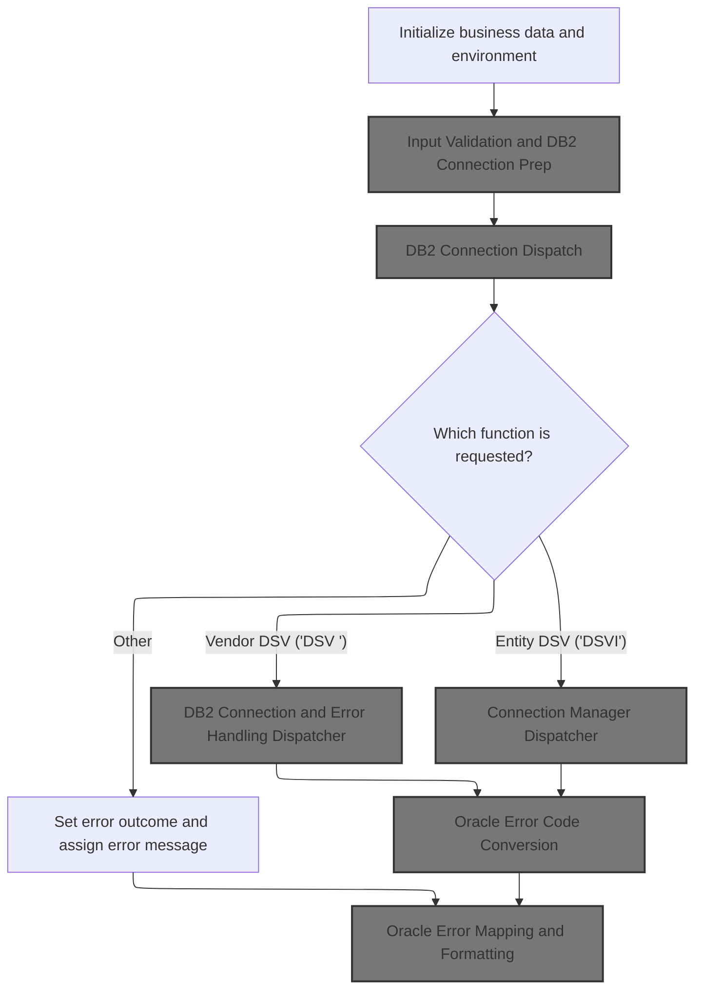

This section serves as the entry point for the process, ensuring that all required business data is initialized and validated before any database operations are attempted. It determines the requested function, validates input, and prepares the environment for downstream processing, including database connection setup and error handling.

| Category        | Rule Name                        | Description                                                                                                                                                                                                                                                                              |
| --------------- | -------------------------------- | ---------------------------------------------------------------------------------------------------------------------------------------------------------------------------------------------------------------------------------------------------------------------------------------- |
| Data validation | Input validation required        | If the vendor or entity input data is missing or invalid, an error message must be set and no database connection should be attempted.                                                                                                                                                   |
| Business logic  | Function code dispatch           | If the requested function code is 'DSV ', the system must dispatch the request to the Vendor DSV handler; if it is 'DSVI', it must dispatch to the Entity DSV handler; otherwise, an error outcome and message must be set.                                                              |
| Business logic  | Database connection prerequisite | If input validation succeeds, a connection to the <SwmToken path="base/src/MMMS0711.cbl" pos="86:11:11" line-data="009800*      PERFORM 125-CONNECT-TO-DB2                                 00010000">`DB2`</SwmToken> database must be established before any further processing occurs. |

<SwmSnippet path="/base/src/MMMS0711.cbl" line="70">

---

In <SwmToken path="base/src/MMMS0711.cbl" pos="70:2:4" line-data="008200 000-MAIN.                                                        00008400">`000-MAIN`</SwmToken> we're just kicking off the flow. The first thing it does is call <SwmToken path="base/src/MMMS0711.cbl" pos="71:4:6" line-data="008300     PERFORM 100-INITIALIZE                                       00008500">`100-INITIALIZE`</SwmToken> to validate the vendor/entity input and set up the <SwmToken path="base/src/MMMS0711.cbl" pos="86:11:11" line-data="009800*      PERFORM 125-CONNECT-TO-DB2                                 00010000">`DB2`</SwmToken> connection if the input checks out. Without this, nothing downstream would have valid data or a database connection to work with.

```cobol
008200 000-MAIN.                                                        00008400
008300     PERFORM 100-INITIALIZE                                       00008500
```

---

</SwmSnippet>

## Input Validation and <SwmToken path="base/src/MMMS0711.cbl" pos="86:11:11" line-data="009800*      PERFORM 125-CONNECT-TO-DB2                                 00010000">`DB2`</SwmToken> Connection Prep

```mermaid
%%{init: {"flowchart": {"defaultRenderer": "elk"}} }%%
flowchart TD
    node1["Start: Initialize business data and set default statuses for entity and vendor"]
    click node1 openCode "base/src/MMMS0711.cbl:95:102"
    node1 --> node2{"Is vendor type code 'D'?"}
    click node2 openCode "base/src/MMMS0711.cbl:103:105"
    node2 -->|"No"| node3["Set vendor type code to 'D'"]
    click node3 openCode "base/src/MMMS0711.cbl:104:104"
    node2 -->|"Yes"| node4
    node3 --> node4
    node4{"Function type"}
    click node4 openCode "base/src/MMMS0711.cbl:107:130"
    node4 -->|"DSV"| node5{"Vendor number = 0 or Vendor type code = blank?"}
    click node5 openCode "base/src/MMMS0711.cbl:111:116"
    node4 -->|"DSVI"| node6{"Entity ID = 0 or Entity type = blank?"}
    click node6 openCode "base/src/MMMS0711.cbl:118:123"
    node4 -->|"Other"| node7["Fail: Invalid entity type
'MMMS0711 - Invalid Entity type!'"]
    click node7 openCode "base/src/MMMS0711.cbl:126:129"
    node5 -->|"Yes"| node8["Fail: Invalid Vendor Number or Type
'MMMS0711 - Invalid Vendor Number or Type!'"]
    click node8 openCode "base/src/MMMS0711.cbl:114:116"
    node5 -->|"No"| node10["Initialization successful"]
    node6 -->|"Yes"| node9["Fail: Invalid Entity ID/Type
'MMMS0711 - Invalid Enty id/Enty Type!'"]
    click node9 openCode "base/src/MMMS0711.cbl:121:123"
    node6 -->|"No"| node10
    node7 --> node11["End"]
    node8 --> node11
    node9 --> node11
    node10 --> node12{"Initialization successful?"}
    click node12 openCode "base/src/MMMS0711.cbl:131:140"
    node12 -->|"Yes"| node13["Connect to DB2"]
    click node13 openCode "base/src/MMMS0711.cbl:138:139"
    node12 -->|"No"| node11["End"]
    node13 --> node11["End"]
    click node11 openCode "base/src/MMMS0711.cbl:140:140"
classDef HeadingStyle fill:#777777,stroke:#333,stroke-width:2px;

%% Swimm:
%% %%{init: {"flowchart": {"defaultRenderer": "elk"}} }%%
%% flowchart TD
%%     node1["Start: Initialize business data and set default statuses for entity and vendor"]
%%     click node1 openCode "<SwmPath>[base/src/MMMS0711.cbl](base/src/MMMS0711.cbl)</SwmPath>:95:102"
%%     node1 --> node2{"Is vendor type code 'D'?"}
%%     click node2 openCode "<SwmPath>[base/src/MMMS0711.cbl](base/src/MMMS0711.cbl)</SwmPath>:103:105"
%%     node2 -->|"No"| node3["Set vendor type code to 'D'"]
%%     click node3 openCode "<SwmPath>[base/src/MMMS0711.cbl](base/src/MMMS0711.cbl)</SwmPath>:104:104"
%%     node2 -->|"Yes"| node4
%%     node3 --> node4
%%     node4{"Function type"}
%%     click node4 openCode "<SwmPath>[base/src/MMMS0711.cbl](base/src/MMMS0711.cbl)</SwmPath>:107:130"
%%     node4 -->|"DSV"| node5{"Vendor number = 0 or Vendor type code = blank?"}
%%     click node5 openCode "<SwmPath>[base/src/MMMS0711.cbl](base/src/MMMS0711.cbl)</SwmPath>:111:116"
%%     node4 -->|"DSVI"| node6{"Entity ID = 0 or Entity type = blank?"}
%%     click node6 openCode "<SwmPath>[base/src/MMMS0711.cbl](base/src/MMMS0711.cbl)</SwmPath>:118:123"
%%     node4 -->|"Other"| node7["Fail: Invalid entity type
%% '<SwmToken path="base/src/MMMS0711.cbl" pos="96:10:10" line-data="010701*    DISPLAY &#39;IM IN MMMS0711&#39;                                     00011000">`MMMS0711`</SwmToken> - Invalid Entity type!'"]
%%     click node7 openCode "<SwmPath>[base/src/MMMS0711.cbl](base/src/MMMS0711.cbl)</SwmPath>:126:129"
%%     node5 -->|"Yes"| node8["Fail: Invalid Vendor Number or Type
%% '<SwmToken path="base/src/MMMS0711.cbl" pos="96:10:10" line-data="010701*    DISPLAY &#39;IM IN MMMS0711&#39;                                     00011000">`MMMS0711`</SwmToken> - Invalid Vendor Number or Type!'"]
%%     click node8 openCode "<SwmPath>[base/src/MMMS0711.cbl](base/src/MMMS0711.cbl)</SwmPath>:114:116"
%%     node5 -->|"No"| node10["Initialization successful"]
%%     node6 -->|"Yes"| node9["Fail: Invalid Entity ID/Type
%% '<SwmToken path="base/src/MMMS0711.cbl" pos="96:10:10" line-data="010701*    DISPLAY &#39;IM IN MMMS0711&#39;                                     00011000">`MMMS0711`</SwmToken> - Invalid Enty <SwmToken path="base/src/MMMS0711.cbl" pos="122:13:15" line-data="013300         MOVE &#39;MMMS0711 - Invalid Enty id/Enty Type!&#39;             00013600">`id/Enty`</SwmToken> Type!'"]
%%     click node9 openCode "<SwmPath>[base/src/MMMS0711.cbl](base/src/MMMS0711.cbl)</SwmPath>:121:123"
%%     node6 -->|"No"| node10
%%     node7 --> node11["End"]
%%     node8 --> node11
%%     node9 --> node11
%%     node10 --> node12{"Initialization successful?"}
%%     click node12 openCode "<SwmPath>[base/src/MMMS0711.cbl](base/src/MMMS0711.cbl)</SwmPath>:131:140"
%%     node12 -->|"Yes"| node13["Connect to <SwmToken path="base/src/MMMS0711.cbl" pos="86:11:11" line-data="009800*      PERFORM 125-CONNECT-TO-DB2                                 00010000">`DB2`</SwmToken>"]
%%     click node13 openCode "<SwmPath>[base/src/MMMS0711.cbl](base/src/MMMS0711.cbl)</SwmPath>:138:139"
%%     node12 -->|"No"| node11["End"]
%%     node13 --> node11["End"]
%%     click node11 openCode "<SwmPath>[base/src/MMMS0711.cbl](base/src/MMMS0711.cbl)</SwmPath>:140:140"
%% classDef HeadingStyle fill:#777777,stroke:#333,stroke-width:2px;
```

This section is responsible for validating the input data for entity and vendor operations, ensuring all required fields are present and correctly formatted before attempting to connect to the <SwmToken path="base/src/MMMS0711.cbl" pos="86:11:11" line-data="009800*      PERFORM 125-CONNECT-TO-DB2                                 00010000">`DB2`</SwmToken> database. It sets up the initial state, enforces business validation rules, and determines whether to proceed or halt based on the input's validity.

| Category        | Rule Name                                                                                                                                                                                  | Description                                                                                                                                                                                                                                                                                                                       |
| --------------- | ------------------------------------------------------------------------------------------------------------------------------------------------------------------------------------------ | --------------------------------------------------------------------------------------------------------------------------------------------------------------------------------------------------------------------------------------------------------------------------------------------------------------------------------- |
| Data validation | DSV Vendor Input Validation                                                                                                                                                                | If the function type is 'DSV', the vendor number must not be zero and the vendor type code must not be blank. If either is invalid, processing must stop and an error message must be returned.                                                                                                                                   |
| Data validation | DSVI Entity Input Validation                                                                                                                                                               | If the function type is 'DSVI', the entity ID must not be zero and the entity type must not be blank. If either is invalid, processing must stop and an error message must be returned.                                                                                                                                           |
| Business logic  | Default Vendor Type Code                                                                                                                                                                   | If the vendor type code is not 'D', it must be set to 'D' before proceeding with further validation.                                                                                                                                                                                                                              |
| Business logic  | Conditional <SwmToken path="base/src/MMMS0711.cbl" pos="86:11:11" line-data="009800*      PERFORM 125-CONNECT-TO-DB2                                 00010000">`DB2`</SwmToken> Connection | If all validations pass and the status is SUCCESS, the system must proceed to connect to the <SwmToken path="base/src/MMMS0711.cbl" pos="86:11:11" line-data="009800*      PERFORM 125-CONNECT-TO-DB2                                 00010000">`DB2`</SwmToken> database. If not, no database connection attempt should be made. |

<SwmSnippet path="/base/src/MMMS0711.cbl" line="95">

---

In <SwmToken path="base/src/MMMS0711.cbl" pos="95:2:4" line-data="010700 100-INITIALIZE.                                                  00010900">`100-INITIALIZE`</SwmToken>, we reset the output structures and flags, and make sure the vendor type code is set to 'D' if it's not already. This sets up a clean state for validation and DB connection logic that follows.

```cobol
010700 100-INITIALIZE.                                                  00010900
010701*    DISPLAY 'IM IN MMMS0711'                                     00011000
010800     INITIALIZE XXXN001A                                          00011100
010900                MMMC0711-OUTPUTS                                  00011200
011000     SET ENTY-IS-NOT-DSV TO TRUE                                  00011300
011100     SET VEND-IS-NOT-DSV TO TRUE                                  00011400
011200     SET ENTY-EXISTS     TO TRUE                                  00011500
011300                                                                  00011600
011400     IF  MMMC0711-I-VEND-TYP-CD NOT EQUAL 'D'                     00011700
011500       MOVE 'D' TO MMMC0711-I-VEND-TYP-CD                         00011800
011600     END-IF                                                       00011900
```

---

</SwmSnippet>

<SwmSnippet path="/base/src/MMMS0711.cbl" line="107">

---

After setting up the initial state, this EVALUATE block checks for the SUCCESS case and just continues if everything is fine. It's basically a no-op for the happy path before moving on to error checks.

```cobol
011800     EVALUATE TRUE                                                00012100
011900       WHEN SUCCESS                                               00012200
012000         CONTINUE                                                 00012300
```

---

</SwmSnippet>

<SwmSnippet path="/base/src/MMMS0711.cbl" line="111">

---

Here we check if we're in a DSV function and the vendor number or type code is missing. If so, we set FAILURE and prep an error message. This stops the flow early if the vendor input is bad.

```cobol
012200       WHEN MMMC0711-IS-DSV-FUNC                                  00012500
012300        AND ( MMMC0711-I-VEND-NBR = 0                             00012600
012400         OR   MMMC0711-I-VEND-TYP-CD = SPACES)                    00012700
012500         SET  FAILURE TO TRUE                                     00012800
012600         MOVE 'MMMS0711 - Invalid Vendor Number or Type!'         00012900
012700           TO IS-RTRN-MSG-TXT                                     00013000
```

---

</SwmSnippet>

<SwmSnippet path="/base/src/MMMS0711.cbl" line="118">

---

This part checks for missing entity ID or type when handling a DSV item function. If either is missing, it sets FAILURE and an error message, blocking the flow for bad entity input.

```cobol
012900       WHEN MMMC0711-IS-DSV-ITEM-FUNC                             00013200
013000        AND ( MMMC0711-I-ENTY-ID  = 0                             00013300
013100         OR   MMMC0711-I-ENTY-TYP = SPACES)                       00013400
013200         SET  FAILURE TO TRUE                                     00013500
013300         MOVE 'MMMS0711 - Invalid Enty id/Enty Type!'             00013600
013400           TO IS-RTRN-MSG-TXT                                     00013700
```

---

</SwmSnippet>

<SwmSnippet path="/base/src/MMMS0711.cbl" line="126">

---

This is the catch-all for any other invalid input. If the previous checks didn't match, we set FAILURE and a generic error message for the user.

```cobol
013700       WHEN OTHER                                                 00014000
013800         SET  FAILURE TO TRUE                                     00014100
013900         MOVE 'MMMS0711 - Invalid Entity type!'                   00014200
014000           TO IS-RTRN-MSG-TXT                                     00014300
014100     END-EVALUATE                                                 00014400
```

---

</SwmSnippet>

<SwmSnippet path="/base/src/MMMS0711.cbl" line="131">

---

After all the validation, if SUCCESS is still set, we call <SwmToken path="base/src/MMMS0711.cbl" pos="138:4:10" line-data="014600           PERFORM 125-CONNECT-TO-DB2                             00015200">`125-CONNECT-TO-DB2`</SwmToken> to actually open the <SwmToken path="base/src/MMMS0711.cbl" pos="138:10:10" line-data="014600           PERFORM 125-CONNECT-TO-DB2                             00015200">`DB2`</SwmToken> connection. No point in connecting if the input was bad.

```cobol
014200     IF SUCCESS                                                   00014500
014300*       PERFORM 900-GET-TASK                                      00014600
014400*       IF SUCCESS AND WWWC0099-ORACLE                            00014700
014500*          SET YYYN005A-ORACLE  TO TRUE                           00014800
014600*          PERFORM 115-CONNECT-TO-ORACLE                          00014900
014700*       END-IF                                                    00015000
 14400*       IF SUCCESS                                                00015100
014600           PERFORM 125-CONNECT-TO-DB2                             00015200
014700*       END-IF                                                    00015300
014800     END-IF                                                       00015400
```

---

</SwmSnippet>

## <SwmToken path="base/src/MMMS0711.cbl" pos="86:11:11" line-data="009800*      PERFORM 125-CONNECT-TO-DB2                                 00010000">`DB2`</SwmToken> Connection Dispatch

The main product role of this section is to manage the transition from the application to the <SwmToken path="base/src/MMMS0711.cbl" pos="86:11:11" line-data="009800*      PERFORM 125-CONNECT-TO-DB2                                 00010000">`DB2`</SwmToken> database environment, ensuring that all necessary connection steps, error handling, and backup record restoration are handled in a centralized and consistent manner.

| Category        | Rule Name                                                                                                                                                                                  | Description                                                                                                                                                                                                                                                                                           |
| --------------- | ------------------------------------------------------------------------------------------------------------------------------------------------------------------------------------------ | ----------------------------------------------------------------------------------------------------------------------------------------------------------------------------------------------------------------------------------------------------------------------------------------------------- |
| Data validation | <SwmToken path="base/src/MMMS0711.cbl" pos="86:11:11" line-data="009800*      PERFORM 125-CONNECT-TO-DB2                                 00010000">`DB2`</SwmToken> Connection Requirement | A connection to the <SwmToken path="base/src/MMMS0711.cbl" pos="86:11:11" line-data="009800*      PERFORM 125-CONNECT-TO-DB2                                 00010000">`DB2`</SwmToken> database must be established before any database operations can be performed.                                 |
| Business logic  | Backup Record Restoration                                                                                                                                                                  | Any backup records that were in use prior to the <SwmToken path="base/src/MMMS0711.cbl" pos="86:11:11" line-data="009800*      PERFORM 125-CONNECT-TO-DB2                                 00010000">`DB2`</SwmToken> connection attempt must be restored to ensure continuity of business operations. |

<SwmSnippet path="/base/src/MMMS0711.cbl" line="163">

---

<SwmToken path="base/src/MMMS0711.cbl" pos="163:2:8" line-data="017100 125-CONNECT-TO-DB2.                                              00017700">`125-CONNECT-TO-DB2`</SwmToken> just calls out to <SwmToken path="base/src/MMMS0711.cbl" pos="164:4:8" line-data="017200     CALL Z-DB2-CONNECT         USING XXXN001A                    00017800">`Z-DB2-CONNECT`</SwmToken> (<SwmToken path="base/src/YYYS0211.cbl" pos="2:7:7" line-data="000200 PROGRAM-ID.    YYYS0211.                                         00000200">`YYYS0211`</SwmToken>), which handles switching to <SwmToken path="base/src/MMMS0711.cbl" pos="163:8:8" line-data="017100 125-CONNECT-TO-DB2.                                              00017700">`DB2`</SwmToken>, error handling, and restoring any backup records. This keeps the main flow clean and offloads the connection logic.

```cobol
017100 125-CONNECT-TO-DB2.                                              00017700
017200     CALL Z-DB2-CONNECT         USING XXXN001A                    00017800
017300                                      SQLCA                       00017900
017400     .                                                            00018000
```

---

</SwmSnippet>

## <SwmToken path="base/src/MMMS0711.cbl" pos="86:11:11" line-data="009800*      PERFORM 125-CONNECT-TO-DB2                                 00010000">`DB2`</SwmToken> Connection and Error Handling Dispatcher

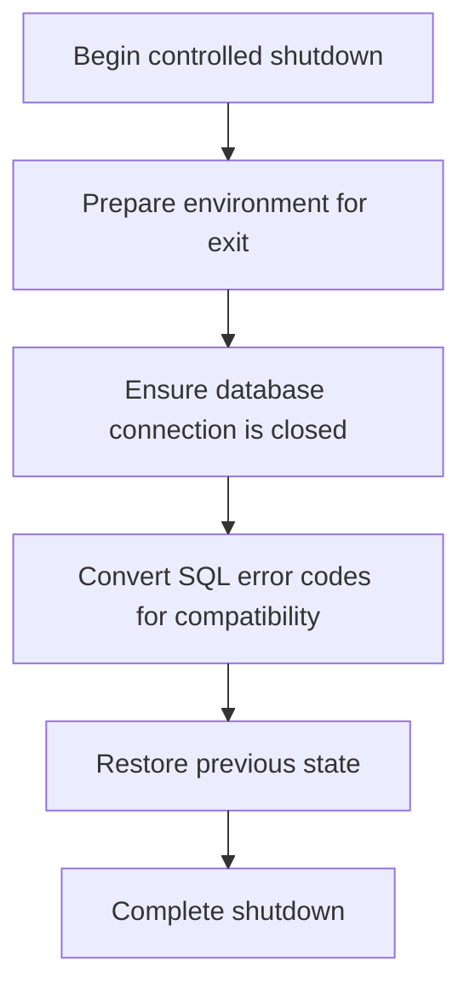

This section ensures that when the system is shutting down, all database connections are properly closed, any SQL errors are converted for compatibility, and the previous state is restored to maintain data integrity and system stability.

| Category       | Rule Name                                                                                                                                                                             | Description                                                                                                                                                                                                                                                                        |
| -------------- | ------------------------------------------------------------------------------------------------------------------------------------------------------------------------------------- | ---------------------------------------------------------------------------------------------------------------------------------------------------------------------------------------------------------------------------------------------------------------------------------- |
| Business logic | Close <SwmToken path="base/src/MMMS0711.cbl" pos="86:11:11" line-data="009800*      PERFORM 125-CONNECT-TO-DB2                                 00010000">`DB2`</SwmToken> Connections | The system must ensure that all active <SwmToken path="base/src/MMMS0711.cbl" pos="86:11:11" line-data="009800*      PERFORM 125-CONNECT-TO-DB2                                 00010000">`DB2`</SwmToken> database connections are closed before completing the shutdown process. |
| Business logic | Standardize SQL Error Codes                                                                                                                                                           | Any SQL error codes generated during the shutdown process must be converted to a standardized format compatible with Oracle systems.                                                                                                                                               |
| Business logic | Restore Previous State                                                                                                                                                                | The system must restore any previously saved data states before completing the shutdown to ensure no data is lost or left in an inconsistent state.                                                                                                                                |
| Business logic | Prepare Environment First                                                                                                                                                             | The shutdown process must always begin with environment preparation to ensure all subsequent steps operate in a controlled and predictable context.                                                                                                                                |

<SwmSnippet path="/base/src/YYYS0211.cbl" line="32">

---

<SwmToken path="base/src/YYYS0211.cbl" pos="32:2:6" line-data="004700 0000-EXIT-DISPATCHER.                                            00004700">`0000-EXIT-DISPATCHER`</SwmToken> runs the sequence: init, connect to <SwmToken path="base/src/YYYS0211.cbl" pos="34:10:10" line-data="004900     PERFORM 200-CONNECT-TO-DB2                                   00004900">`DB2`</SwmToken>, convert Oracle errors if needed, and restore backup data. Each step is needed to keep the connection and error state consistent.

```cobol
004700 0000-EXIT-DISPATCHER.                                            00004700
004800     PERFORM 100-INITIALIZATION                                   00004800
004900     PERFORM 200-CONNECT-TO-DB2                                   00004900
005000     PERFORM 300-CNV-ORACLE-SQLCODE                               00005000
005100     PERFORM 400-REVERT-SAVED-XXXN001A                            00005100
005300     GOBACK                                                       00005300
005400     .                                                            00005400
```

---

</SwmSnippet>

## Connection Manager Request

The main product role of this section is to standardize and centralize the process of switching to a <SwmToken path="base/src/MMMS0711.cbl" pos="86:11:11" line-data="009800*      PERFORM 125-CONNECT-TO-DB2                                 00010000">`DB2`</SwmToken> database connection, ensuring that all connection changes are tracked and managed through a single connection manager component.

| Category       | Rule Name                                                                                                                                                                                   | Description                                                                                                                                                                                                                                                                                                                                                                                                                                               |
| -------------- | ------------------------------------------------------------------------------------------------------------------------------------------------------------------------------------------- | --------------------------------------------------------------------------------------------------------------------------------------------------------------------------------------------------------------------------------------------------------------------------------------------------------------------------------------------------------------------------------------------------------------------------------------------------------- |
| Business logic | <SwmToken path="base/src/MMMS0711.cbl" pos="86:11:11" line-data="009800*      PERFORM 125-CONNECT-TO-DB2                                 00010000">`DB2`</SwmToken> Connection Request Code | When a request to switch to <SwmToken path="base/src/MMMS0711.cbl" pos="86:11:11" line-data="009800*      PERFORM 125-CONNECT-TO-DB2                                 00010000">`DB2`</SwmToken> is initiated, the function code must be set to 'SD' to indicate a <SwmToken path="base/src/MMMS0711.cbl" pos="86:11:11" line-data="009800*      PERFORM 125-CONNECT-TO-DB2                                 00010000">`DB2`</SwmToken> connection request. |
| Business logic | Centralized Connection Management                                                                                                                                                           | All requests to change the database connection must be routed through the centralized connection manager to ensure consistent handling, tracking, and application of overrides.                                                                                                                                                                                                                                                                           |
| Business logic | Connection Request Statistics Tracking                                                                                                                                                      | The system must track statistics for all connection requests, including total requests, <SwmToken path="base/src/MMMS0711.cbl" pos="86:11:11" line-data="009800*      PERFORM 125-CONNECT-TO-DB2                                 00010000">`DB2`</SwmToken> requests, Oracle requests, connection switches, override requests, and override switches.                                                                                                     |
| Business logic | Centralized Override Handling                                                                                                                                                               | If an override is required for a connection request, the override logic must be applied centrally by the connection manager, not by the requesting component.                                                                                                                                                                                                                                                                                             |

<SwmSnippet path="/base/src/YYYS0211.cbl" line="53">

---

<SwmToken path="base/src/YYYS0211.cbl" pos="53:2:8" line-data="007300 200-CONNECT-TO-DB2.                                              00007300">`200-CONNECT-TO-DB2`</SwmToken> sets up the request to switch to <SwmToken path="base/src/YYYS0211.cbl" pos="53:8:8" line-data="007300 200-CONNECT-TO-DB2.                                              00007300">`DB2`</SwmToken> and calls the connection manager (<SwmToken path="base/src/YYYS0211.cbl" pos="55:4:4" line-data="007500     CALL YYYS0220-DBMS-CON-MGR USING                             00007500">`YYYS0220`</SwmToken>). This keeps all connection logic in one place and lets us track stats or handle overrides centrally.

```cobol
007300 200-CONNECT-TO-DB2.                                              00007300
007400     SET YYYC0220-SET-DB2-CON TO TRUE                             00007400
007500     CALL YYYS0220-DBMS-CON-MGR USING                             00007500
007600         XXXN001A                                                 00007600
007700         YYYC0220                                                 00007700
008100     .                                                            00008100
```

---

</SwmSnippet>

## Connection Manager Dispatcher

This section acts as the central dispatcher for all connection and statistics management requests. It ensures that each request is routed to the correct handler based on the provided function code, maintaining a single point of control for these operations and enforcing consistent error handling for unrecognized requests.

| Category        | Rule Name                          | Description                                                                                                                                                                                                                                                                                                                                                                                       |
| --------------- | ---------------------------------- | ------------------------------------------------------------------------------------------------------------------------------------------------------------------------------------------------------------------------------------------------------------------------------------------------------------------------------------------------------------------------------------------------- |
| Data validation | Function code required             | Each incoming request must include a valid function code that specifies the desired operation (e.g., get current connection, set <SwmToken path="base/src/MMMS0711.cbl" pos="86:11:11" line-data="009800*      PERFORM 125-CONNECT-TO-DB2                                 00010000">`DB2`</SwmToken> connection, set Oracle connection, get statistics, set statistics, set override connection). |
| Business logic  | Supported operation routing        | If the function code matches a supported operation, the dispatcher must route the request to the corresponding handler to perform the requested action.                                                                                                                                                                                                                                           |
| Business logic  | Centralized management enforcement | The dispatcher must centralize all connection and statistics management logic, ensuring that no connection or statistics operation is performed outside of this section.                                                                                                                                                                                                                          |
| Business logic  | Output state consistency           | The dispatcher must ensure that the output of each operation includes updated connection state and statistics as appropriate for the requested action.                                                                                                                                                                                                                                            |

<SwmSnippet path="/base/src/YYYS0220.cbl" line="56">

---

<SwmToken path="base/src/YYYS0220.cbl" pos="56:2:6" line-data="006500 0000-EXIT-DISPATCHER.                                            00006500">`0000-EXIT-DISPATCHER`</SwmToken> in <SwmToken path="base/src/YYYS0220.cbl" pos="74:5:5" line-data="008300         MOVE &#39;YYYS0220 - Function not recognized!&#39;               00008300">`YYYS0220`</SwmToken> routes the request to the right handler based on the function code. If it doesn't recognize the code, it sets FAILURE and an error message. This keeps all connection and stats logic in one place.

```cobol
006500 0000-EXIT-DISPATCHER.                                            00006500
006600     PERFORM 100-INITIALIZATION                                   00006600
006700                                                                  00006700
006800     EVALUATE TRUE                                                00006800
006900       WHEN YYYC0220-GET-CURR-CON                                 00006900
007000         PERFORM 200-GET-CURR-CON                                 00007000
007100       WHEN YYYC0220-SET-DB2-CON                                  00007100
007200         PERFORM 300-SET-DB2-CON                                  00007200
007300       WHEN YYYC0220-SET-ORACLE-CON                               00007300
007400         PERFORM 400-SET-ORACLE-CON                               00007400
007500       WHEN YYYC0220-GET-STATS                                    00007500
007600         PERFORM 500-GET-STATS                                    00007600
007700       WHEN YYYC0220-SET-STATS                                    00007700
007800         PERFORM 600-SET-STATS                                    00007800
007900       WHEN YYYC0220-SET-OVERRIDE-CON                             00007900
008000         PERFORM 700-SET-OVERRIDE-CON                             00008000
008100       WHEN OTHER                                                 00008100
008200         SET  FAILURE TO TRUE                                     00008200
008300         MOVE 'YYYS0220 - Function not recognized!'               00008300
008400           TO IS-RTRN-MSG-TXT                                     00008400
008500     END-EVALUATE                                                 00008500
008600                                                                  00008600
008700     GOBACK                                                       00008700
008800     .                                                            00008800
```

---

</SwmSnippet>

### Switch to <SwmToken path="base/src/MMMS0711.cbl" pos="86:11:11" line-data="009800*      PERFORM 125-CONNECT-TO-DB2                                 00010000">`DB2`</SwmToken> and Track Stats

```mermaid
%%{init: {"flowchart": {"defaultRenderer": "elk"}} }%%
flowchart TD
    node1["Increment total and DB2 request counters"]
    click node1 openCode "base/src/YYYS0220.cbl:115:116"
    node1 --> node2{"Is connection type Oracle or Default?"}
    click node2 openCode "base/src/YYYS0220.cbl:118:119"
    node2 -->|"Yes"| node3["Increment connection switches and perform DB2 connection"]
    click node3 openCode "base/src/YYYS0220.cbl:129:132"
    node2 -->|"No"| node5["Set DB2 connection active"]
    click node5 openCode "base/src/YYYS0220.cbl:123:123"
    node3 --> node4{"Is environment Production?"}
    click node4 openCode "base/src/YYYS0220.cbl:132:132"
    node4 -->|"Yes"| node6["Connect to DB2 Production"]
    click node6 openCode "base/src/YYYS0220.cbl:134:135"
    node4 -->|"No"| node7["Connect to DB2 Test"]
    click node7 openCode "base/src/YYYS0220.cbl:138:139"
    node6 --> node8{"Was connection successful?"}
    node7 --> node8
    click node8 openCode "base/src/YYYS0220.cbl:143:146"
    node8 -->|"Yes"| node5
    node8 -->|"No"| node9["Set failure status and prepare error message"]
    click node9 openCode "base/src/YYYS0220.cbl:147:151"
    node5 --> node10["Update current connection status"]
    node9 --> node10
    click node10 openCode "base/src/YYYS0220.cbl:124:124"
classDef HeadingStyle fill:#777777,stroke:#333,stroke-width:2px;

%% Swimm:
%% %%{init: {"flowchart": {"defaultRenderer": "elk"}} }%%
%% flowchart TD
%%     node1["Increment total and <SwmToken path="base/src/MMMS0711.cbl" pos="86:11:11" line-data="009800*      PERFORM 125-CONNECT-TO-DB2                                 00010000">`DB2`</SwmToken> request counters"]
%%     click node1 openCode "<SwmPath>[base/src/YYYS0220.cbl](base/src/YYYS0220.cbl)</SwmPath>:115:116"
%%     node1 --> node2{"Is connection type Oracle or Default?"}
%%     click node2 openCode "<SwmPath>[base/src/YYYS0220.cbl](base/src/YYYS0220.cbl)</SwmPath>:118:119"
%%     node2 -->|"Yes"| node3["Increment connection switches and perform <SwmToken path="base/src/MMMS0711.cbl" pos="86:11:11" line-data="009800*      PERFORM 125-CONNECT-TO-DB2                                 00010000">`DB2`</SwmToken> connection"]
%%     click node3 openCode "<SwmPath>[base/src/YYYS0220.cbl](base/src/YYYS0220.cbl)</SwmPath>:129:132"
%%     node2 -->|"No"| node5["Set <SwmToken path="base/src/MMMS0711.cbl" pos="86:11:11" line-data="009800*      PERFORM 125-CONNECT-TO-DB2                                 00010000">`DB2`</SwmToken> connection active"]
%%     click node5 openCode "<SwmPath>[base/src/YYYS0220.cbl](base/src/YYYS0220.cbl)</SwmPath>:123:123"
%%     node3 --> node4{"Is environment Production?"}
%%     click node4 openCode "<SwmPath>[base/src/YYYS0220.cbl](base/src/YYYS0220.cbl)</SwmPath>:132:132"
%%     node4 -->|"Yes"| node6["Connect to <SwmToken path="base/src/MMMS0711.cbl" pos="86:11:11" line-data="009800*      PERFORM 125-CONNECT-TO-DB2                                 00010000">`DB2`</SwmToken> Production"]
%%     click node6 openCode "<SwmPath>[base/src/YYYS0220.cbl](base/src/YYYS0220.cbl)</SwmPath>:134:135"
%%     node4 -->|"No"| node7["Connect to <SwmToken path="base/src/MMMS0711.cbl" pos="86:11:11" line-data="009800*      PERFORM 125-CONNECT-TO-DB2                                 00010000">`DB2`</SwmToken> Test"]
%%     click node7 openCode "<SwmPath>[base/src/YYYS0220.cbl](base/src/YYYS0220.cbl)</SwmPath>:138:139"
%%     node6 --> node8{"Was connection successful?"}
%%     node7 --> node8
%%     click node8 openCode "<SwmPath>[base/src/YYYS0220.cbl](base/src/YYYS0220.cbl)</SwmPath>:143:146"
%%     node8 -->|"Yes"| node5
%%     node8 -->|"No"| node9["Set failure status and prepare error message"]
%%     click node9 openCode "<SwmPath>[base/src/YYYS0220.cbl](base/src/YYYS0220.cbl)</SwmPath>:147:151"
%%     node5 --> node10["Update current connection status"]
%%     node9 --> node10
%%     click node10 openCode "<SwmPath>[base/src/YYYS0220.cbl](base/src/YYYS0220.cbl)</SwmPath>:124:124"
%% classDef HeadingStyle fill:#777777,stroke:#333,stroke-width:2px;
```

This section is responsible for managing the transition to a <SwmToken path="base/src/MMMS0711.cbl" pos="86:11:11" line-data="009800*      PERFORM 125-CONNECT-TO-DB2                                 00010000">`DB2`</SwmToken> database connection, ensuring that statistics are tracked, the correct environment is selected, and errors are handled appropriately.

| Category       | Rule Name                   | Description                                                                                                                                                                                                                                                                                                                                                                                                                                                                                                                                                                                                                                            |
| -------------- | --------------------------- | ------------------------------------------------------------------------------------------------------------------------------------------------------------------------------------------------------------------------------------------------------------------------------------------------------------------------------------------------------------------------------------------------------------------------------------------------------------------------------------------------------------------------------------------------------------------------------------------------------------------------------------------------------ |
| Business logic | Request Counting            | Each time a request to switch to <SwmToken path="base/src/MMMS0711.cbl" pos="86:11:11" line-data="009800*      PERFORM 125-CONNECT-TO-DB2                                 00010000">`DB2`</SwmToken> is processed, increment both the total request counter and the <SwmToken path="base/src/MMMS0711.cbl" pos="86:11:11" line-data="009800*      PERFORM 125-CONNECT-TO-DB2                                 00010000">`DB2`</SwmToken> request counter by 1.                                                                                                                                                                                          |
| Business logic | Connection Switch Trigger   | If the current connection type is Oracle or Default, increment the connection switch counter and initiate a connection to <SwmToken path="base/src/MMMS0711.cbl" pos="86:11:11" line-data="009800*      PERFORM 125-CONNECT-TO-DB2                                 00010000">`DB2`</SwmToken>.                                                                                                                                                                                                                                                                                                                                                         |
| Business logic | Environment Selection       | When switching to <SwmToken path="base/src/MMMS0711.cbl" pos="86:11:11" line-data="009800*      PERFORM 125-CONNECT-TO-DB2                                 00010000">`DB2`</SwmToken>, select the environment based on the production flag: connect to <SwmToken path="base/src/MMMS0711.cbl" pos="86:11:11" line-data="009800*      PERFORM 125-CONNECT-TO-DB2                                 00010000">`DB2`</SwmToken> Production if in production, otherwise connect to <SwmToken path="base/src/MMMS0711.cbl" pos="86:11:11" line-data="009800*      PERFORM 125-CONNECT-TO-DB2                                 00010000">`DB2`</SwmToken> Test. |
| Business logic | Connection Status Reporting | After switching to <SwmToken path="base/src/MMMS0711.cbl" pos="86:11:11" line-data="009800*      PERFORM 125-CONNECT-TO-DB2                                 00010000">`DB2`</SwmToken> or handling a connection error, update the current connection status for reporting purposes.                                                                                                                                                                                                                                                                                                                                                                    |

<SwmSnippet path="/base/src/YYYS0220.cbl" line="105">

---

<SwmToken path="base/src/YYYS0220.cbl" pos="105:2:8" line-data="011400 300-SET-DB2-CON.                                                 00011400">`300-SET-DB2-CON`</SwmToken> bumps the stats for total and <SwmToken path="base/src/YYYS0220.cbl" pos="105:6:6" line-data="011400 300-SET-DB2-CON.                                                 00011400">`DB2`</SwmToken> requests, then switches to <SwmToken path="base/src/YYYS0220.cbl" pos="105:6:6" line-data="011400 300-SET-DB2-CON.                                                 00011400">`DB2`</SwmToken> if we're not already there. After switching, it always fetches the current connection type for reporting.

```cobol
011400 300-SET-DB2-CON.                                                 00011400
011500     ADD 1 TO WS-TOT-REQS                                         00011500
011600     ADD 1 TO WS-DB2-REQS                                         00011600
011700                                                                  00011700
011800     IF WS-ORACLE-CON                                             00011800
011900     OR WS-DEFAULT-CON                                            00011900
012000       PERFORM 310-DO-SET-DB2-CON                                 00012000
012100     END-IF                                                       00012100
012200                                                                  00012200
012300     SET WS-DB2-CON TO TRUE                                       00012300
012400     PERFORM 200-GET-CURR-CON                                     00012400
012500     .                                                            00012500
```

---

</SwmSnippet>

<SwmSnippet path="/base/src/YYYS0220.cbl" line="119">

---

<SwmToken path="base/src/YYYS0220.cbl" pos="119:2:10" line-data="012800 310-DO-SET-DB2-CON.                                              00012800">`310-DO-SET-DB2-CON`</SwmToken> increments the switch counter, then checks if we're in prod or test and connects to the right <SwmToken path="base/src/YYYS0220.cbl" pos="119:8:8" line-data="012800 310-DO-SET-DB2-CON.                                              00012800">`DB2`</SwmToken> instance. After the attempt, it checks SQLCODE—if it's not zero, it sets FAILURE and builds a repo-specific error message with the code and SQLCODE.

```cobol
012800 310-DO-SET-DB2-CON.                                              00012800
012900     ADD 1 TO WS-CON-SWITCHES                                     00012900
013000                                                                  00013000
013100     EVALUATE TRUE                                                00013100
013200       WHEN WS-PROD                                               00013200
013300         EXEC SQL                                                 00013300
013400           CONNECT TO DB2P                                        00013400
013500         END-EXEC                                                 00013500
013600       WHEN OTHER                                                 00013600
013700         EXEC SQL                                                 00013700
013800           CONNECT TO DB2T                                        00013800
013900         END-EXEC                                                 00013900
014000     END-EVALUATE                                                 00014000
014100                                                                  00014100
014200     EVALUATE TRUE                                                00014200
014300       WHEN SQLCODE = 0                                           00014300
014400         CONTINUE                                                 00014400
014500                                                                  00014500
014600       WHEN OTHER                                                 00014600
014700         SET  FAILURE TO TRUE                                     00014700
014800         MOVE SQLCODE TO WS-SQLCODE                               00014800
014900         STRING 'YYYS0220 - Failure connecting to DB2, SQL='      00014900
015000                WS-SQLCODE                                        00015000
015100             DELIMITED BY SIZE INTO IS-RTRN-MSG-TXT               00015100
015200     END-EVALUATE                                                 00015200
015300     .                                                            00015300
```

---

</SwmSnippet>

### Switch to Oracle and Track Stats

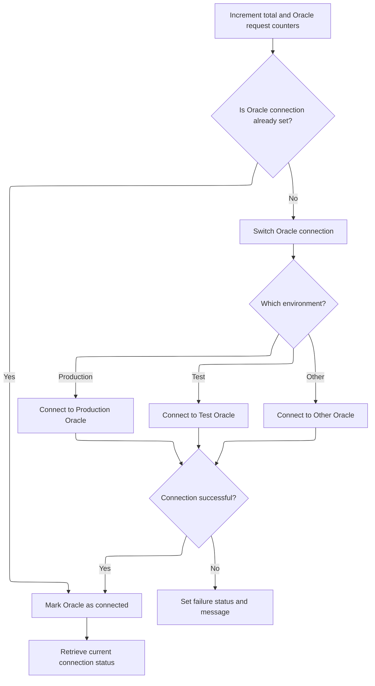

This section ensures that all Oracle-related requests are tracked, the correct Oracle environment is connected to as needed, and any connection issues are properly reported. It maintains accurate statistics for monitoring and auditing purposes.

| Category        | Rule Name                          | Description                                                                                                                                                 |
| --------------- | ---------------------------------- | ----------------------------------------------------------------------------------------------------------------------------------------------------------- |
| Data validation | Oracle connection enforcement      | If the current connection is not already set to Oracle, the system must switch to the appropriate Oracle environment before proceeding.                     |
| Business logic  | Increment request counters         | Each time this section is executed, the total requests counter and the Oracle requests counter must be incremented by one, regardless of connection status. |
| Business logic  | Environment-based Oracle selection | When switching to Oracle, the system must select the correct Oracle environment (Production, Test, or Other) based on the current environment variable.     |
| Business logic  | Connection status reporting        | After any connection attempt (successful or not), the system must retrieve and record the current connection status for reporting and downstream logic.     |
| Business logic  | Track connection switches          | Each time a connection switch is performed, the connection switches counter must be incremented by one.                                                     |

<SwmSnippet path="/base/src/YYYS0220.cbl" line="150">

---

<SwmToken path="base/src/YYYS0220.cbl" pos="150:2:8" line-data="015900 400-SET-ORACLE-CON.                                              00015900">`400-SET-ORACLE-CON`</SwmToken> bumps the stats for total and Oracle requests, then switches to Oracle if we're not already there. After switching, it always fetches the current connection type for reporting.

```cobol
015900 400-SET-ORACLE-CON.                                              00015900
016000     ADD 1 TO WS-TOT-REQS                                         00016000
016100     ADD 1 TO WS-OCL-REQS                                         00016100
016200                                                                  00016200
016300     IF NOT WS-ORACLE-CON                                         00016300
016400       PERFORM 410-DO-SET-ORACLE-CON                              00016400
016500     END-IF                                                       00016500
016600                                                                  00016600
016700     SET WS-ORACLE-CON TO TRUE                                    00016700
016800     PERFORM 200-GET-CURR-CON                                     00016800
016900     .                                                            00016900
```

---

</SwmSnippet>

<SwmSnippet path="/base/src/YYYS0220.cbl" line="163">

---

<SwmToken path="base/src/YYYS0220.cbl" pos="163:2:10" line-data="017200 410-DO-SET-ORACLE-CON.                                           00017200">`410-DO-SET-ORACLE-CON`</SwmToken> bumps the switch counter, checks which environment we're in, and connects to the right Oracle DB using a hardcoded connection string. After the connect, it checks SQLCODE—if it's not zero, it sets FAILURE and builds a repo-specific error message with the code and SQLCODE.

```cobol
017200 410-DO-SET-ORACLE-CON.                                           00017200
017300     ADD 1 TO WS-CON-SWITCHES                                     00017300
017400                                                                  00017400
017500     EVALUATE TRUE                                                00017500
017600       WHEN WS-PROD                                               00017600
017700         EXEC SQL                                                 00017700
017800           CONNECT TO DRDAASP1                                    00017800
017900         END-EXEC                                                 00017900
018000                                                                  00018000
018100       WHEN WS-TEST                                               00018100
018200         EXEC SQL                                                 00018200
018300           CONNECT TO DRDAASC7                                    00018300
018400         END-EXEC                                                 00018400
018500                                                                  00018500
018600       WHEN WS-TST6                                               00018600
018700         EXEC SQL                                                 00018700
018800           CONNECT TO DRDAASC6                                    00018800
018900         END-EXEC                                                 00018900
019000                                                                  00019000
019100       WHEN WS-TST5                                               00019100
019200         EXEC SQL                                                 00019200
019300           CONNECT TO DRDAASC5                                    00019300
019400         END-EXEC                                                 00019400
019500                                                                  00019500
019600       WHEN WS-TST4                                               00019600
019700         EXEC SQL                                                 00019700
019800           CONNECT TO DRDAASD1                                    00019800
019900         END-EXEC                                                 00019900
020000                                                                  00020000
020100       WHEN WS-TST3                                               00020100
020200         EXEC SQL                                                 00020200
020300           CONNECT TO DRDAASC1                                    00020300
020400         END-EXEC                                                 00020400
020500     END-EVALUATE                                                 00020500
020600                                                                  00020600
020700     EVALUATE TRUE                                                00020700
020800       WHEN SQLCODE = 0                                           00020800
020900         CONTINUE                                                 00020900
021000                                                                  00021000
021100       WHEN OTHER                                                 00021100
021200         SET  FAILURE TO TRUE                                     00021200
021300         MOVE SQLCODE TO WS-SQLCODE                               00021300
021400         STRING 'YYYS0220 - Failure connecting to Oracle, SQL='   00021400
021500                WS-SQLCODE                                        00021500
021600             DELIMITED BY SIZE INTO IS-RTRN-MSG-TXT               00021600
021700     END-EVALUATE                                                 00021700
021800     .                                                            00021800
```

---

</SwmSnippet>

### Stats Reset and Override Handling

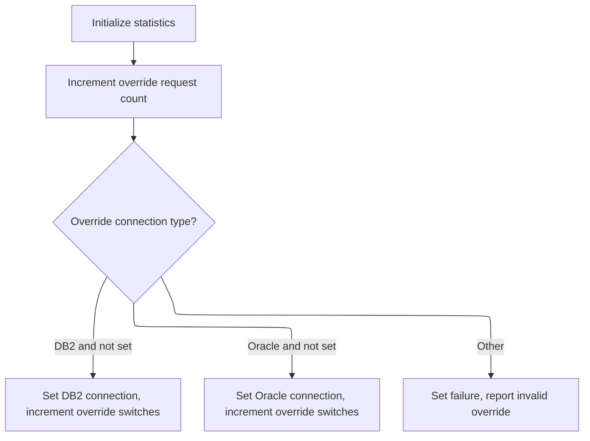

<SwmSnippet path="/base/src/YYYS0220.cbl" line="230">

---

<SwmToken path="base/src/YYYS0220.cbl" pos="230:2:6" line-data="023900 600-SET-STATS.                                                   00023900">`600-SET-STATS`</SwmToken> just resets all the stats counters for requests, switches, and overrides. It's for internal tracking, not something users see.

```cobol
023900 600-SET-STATS.                                                   00023900
024000     INITIALIZE WS-STATS                                          00024000
024100                YYYC0220-STATS                                    00024100
024200     .                                                            00024200
```

---

</SwmSnippet>

<SwmSnippet path="/base/src/YYYS0220.cbl" line="239">

---

<SwmToken path="base/src/YYYS0220.cbl" pos="239:2:8" line-data="024800 700-SET-OVERRIDE-CON.                                            00024800">`700-SET-OVERRIDE-CON`</SwmToken> bumps the override request counter, checks if we're switching to <SwmToken path="base/src/YYYS0220.cbl" pos="243:6:6" line-data="025200       WHEN YYYC0220-DB2-CON                                      00025200">`DB2`</SwmToken> or Oracle, and sets the right flag and counter. If the request is invalid, it sets FAILURE and an error message.

```cobol
024800 700-SET-OVERRIDE-CON.                                            00024800
024900     ADD 1 TO WS-OVR-REQS                                         00024900
025000                                                                  00025000
025100     EVALUATE TRUE                                                00025100
025200       WHEN YYYC0220-DB2-CON                                      00025200
025300       AND  NOT WS-DB2-CON                                        00025300
025400         SET WS-DB2-CON    TO TRUE                                00025400
025500         ADD 1             TO WS-OVR-SWITCHES                     00025500
025600                                                                  00025600
025700       WHEN YYYC0220-ORACLE-CON                                   00025700
025800       AND NOT WS-ORACLE-CON                                      00025800
025900         SET WS-ORACLE-CON TO TRUE                                00025900
026000         ADD 1             TO WS-OVR-SWITCHES                     00026000
026100                                                                  00026100
026200       WHEN OTHER                                                 00026200
026300         SET FAILURE TO TRUE                                      00026300
026400         MOVE 'YYYS0220 - Invalid over-ride connection!'          00026400
026500           TO IS-RTRN-MSG-TXT                                     00026500
026600     END-EVALUATE                                                 00026600
026700     .                                                            00026700
```

---

</SwmSnippet>

## Oracle Error Code Conversion

The main product role of this section is to ensure that Oracle database error codes, specifically SQLCODE -84, are consistently mapped to internal error codes for standardized error handling throughout the application.

| Category       | Rule Name                 | Description                                                                                                                                                                              |
| -------------- | ------------------------- | ---------------------------------------------------------------------------------------------------------------------------------------------------------------------------------------- |
| Business logic | Centralized error mapping | The error code conversion process must use the designated conversion program to ensure that all mappings from Oracle error codes to internal codes are consistent and centrally managed. |

<SwmSnippet path="/base/src/YYYS0211.cbl" line="65">

---

<SwmToken path="base/src/YYYS0211.cbl" pos="65:2:8" line-data="009500 300-CNV-ORACLE-SQLCODE.                                          00009500">`300-CNV-ORACLE-SQLCODE`</SwmToken> checks for SQLCODE -84 after a DB operation and, if found, calls the Oracle error conversion program (<SwmToken path="base/src/YYYS0212.cbl" pos="96:9:9" line-data="010300         STRING &#39;Error in YYYS0212. Oracle code:&#39;                 00010300">`YYYS0212`</SwmToken>) to map it to an internal code. This keeps error handling consistent.

```cobol
009500 300-CNV-ORACLE-SQLCODE.                                          00009500
009600     IF  SUCCESS                                                  00009600
009610     AND SQLCODE = -84                                            00009610
009720       CALL Z-ORA-ERR-CONVERSION USING                            00009720
009730           XXXN001A                                               00009730
009740           SQLCA                                                  00009740
009750     END-IF                                                       00009750
010200     .                                                            00010200
```

---

</SwmSnippet>

## Oracle Error Mapping and Formatting

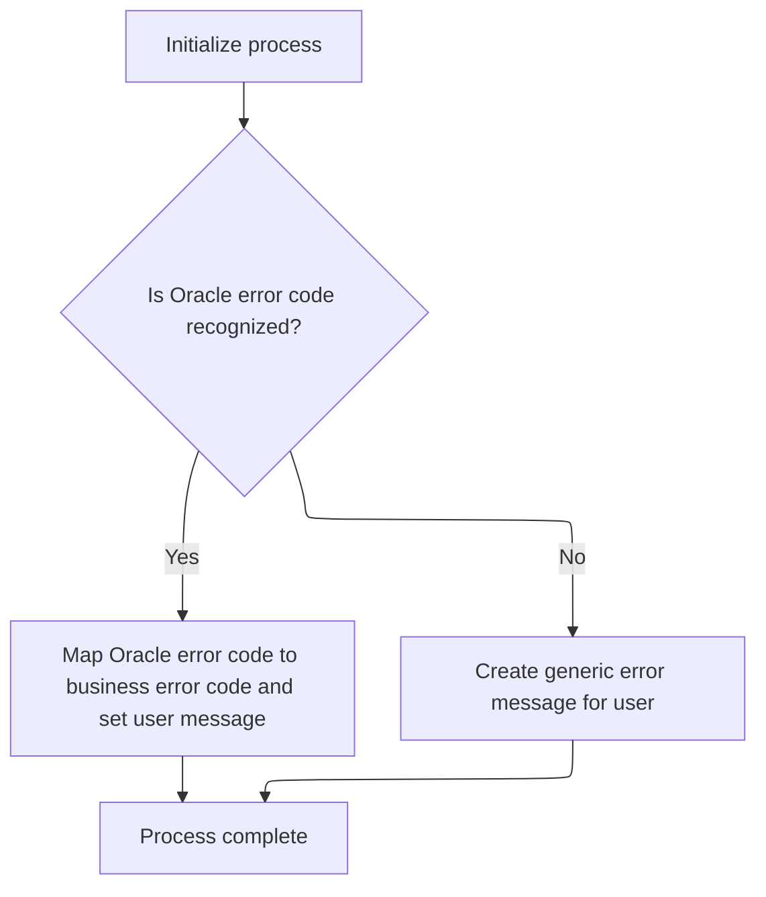

This section standardizes error handling by mapping Oracle error codes to internal business error codes and formatting user-facing error messages. It ensures that users and support receive clear, consistent, and actionable error information regardless of the underlying Oracle error.

| Category       | Rule Name                              | Description                                                                                                                                                                                    |
| -------------- | -------------------------------------- | ---------------------------------------------------------------------------------------------------------------------------------------------------------------------------------------------- |
| Business logic | Oracle error code mapping              | If the Oracle error code is recognized, it must be mapped to a specific internal business error code (SQLCODE) according to the predefined mapping table.                                      |
| Business logic | User-friendly error message formatting | The output error message must be user-friendly and suitable for both end users and support staff, providing enough detail for troubleshooting without exposing sensitive internal information. |

<SwmSnippet path="/base/src/YYYS0212.cbl" line="29">

---

<SwmToken path="base/src/YYYS0212.cbl" pos="29:2:6" line-data="003800 000-MAIN-PROCESS.                                                00003800">`000-MAIN-PROCESS`</SwmToken> resets the error fields, then formats the Oracle error into a user-friendly message and internal code. This makes sure errors are clear and consistent for users and support.

```cobol
003800 000-MAIN-PROCESS.                                                00003800
003900     PERFORM 100-INITIALIZE                                       00003900
004000     PERFORM 200-FORMAT-USER-MSG-TXT                              00004000
004100     GOBACK                                                       00004100
004200     .                                                            00004200
```

---

</SwmSnippet>

<SwmSnippet path="/base/src/YYYS0212.cbl" line="50">

---

<SwmToken path="base/src/YYYS0212.cbl" pos="50:2:10" line-data="005900 200-FORMAT-USER-MSG-TXT.                                         00005900">`200-FORMAT-USER-MSG-TXT`</SwmToken> splits the Oracle error string into parts, maps known Oracle codes to SQLCODEs, and if it doesn't recognize the code, it builds a custom error message for debugging. This keeps error handling predictable and debuggable.

```cobol
005900 200-FORMAT-USER-MSG-TXT.                                         00005900
006000     UNSTRING SQLERRMC  DELIMITED BY SPACE INTO                   00006000
006100                        WS-ERR-MSG1                               00006100
006200                        WS-ERR-MSG2                               00006200
006300                        WS-ERR-MSG3                               00006300
006400                        WS-ERR-ORA-CODE                           00006400
006500     EVALUATE WS-ERR-ORA-CODE                                     00006500
006510       WHEN  '60   '                                              00006510
006520         MOVE  -911                             TO SQLCODE        00006520
006600       WHEN  '904  '                                              00006600
006700       WHEN  '310  '                                              00006700
006800         MOVE  -206                             TO SQLCODE        00006800
006900       WHEN  '615  '                                              00006900
007000       WHEN  '616  '                                              00007000
007100         MOVE  -420                             TO SQLCODE        00007100
007200       WHEN  '942  '                                              00007200
007300         MOVE  -204                             TO SQLCODE        00007300
007400       WHEN  '1403 '                                              00007400
007500         MOVE  -100                             TO SQLCODE        00007500
007600       WHEN  '1001 '                                              00007600
007700         MOVE  -501                             TO SQLCODE        00007700
007800       WHEN  '1438 '                                              00007800
007900         MOVE  -413                             TO SQLCODE        00007900
008000       WHEN  '2112 '                                              00008000
008100       WHEN  '1422 '                                              00008100
008200         MOVE  -811                             TO SQLCODE        00008200
008300       WHEN  '2049 '                                              00008300
008400         MOVE  -913                             TO SQLCODE        00008400
008500       WHEN  '2291 '                                              00008500
008600         MOVE  -530                             TO SQLCODE        00008600
008700       WHEN  '2292 '                                              00008700
008800         MOVE  -532                             TO SQLCODE        00008800
008900       WHEN  '6502 '                                              00008900
009000         MOVE  -304                             TO SQLCODE        00009000
009100       WHEN  '6508 '                                              00009100
009200         MOVE  -440                             TO SQLCODE        00009200
009300       WHEN  '6511 '                                              00009300
009400         MOVE  -502                             TO SQLCODE        00009400
009500       WHEN  '6550 '                                              00009500
009600       WHEN  '6553 '                                              00009600
009700         MOVE  -440                             TO SQLCODE        00009700
009800       WHEN  '14028'                                              00009800
009900         MOVE  -538                             TO SQLCODE        00009900
010000       WHEN  '30006'                                              00010000
010100         MOVE  -904                             TO SQLCODE        00010100
010200       WHEN OTHER                                                 00010200
010300         STRING 'Error in YYYS0212. Oracle code:'                 00010300
010300                 WS-ERR-ORA-CODE                                  00010320
010300         DELIMITED BY SIZE INTO IS-RTRN-MSG2-TXT                  00010330
010500     END-EVALUATE                                                 00010500
010600     MOVE SPACES                                TO SQLERRMC       00010600
010700     .                                                            00010700
```

---

</SwmSnippet>

## DSV Function Routing

```mermaid
%%{init: {"flowchart": {"defaultRenderer": "elk"}} }%%
flowchart TD
    node1{"Which business function code was provided?"}
    click node1 openCode "base/src/MMMS0711.cbl:87:96"
    node1 -->|"DSV "| node2["Check if vendor is Direct Store Vendor"]
    click node2 openCode "base/src/MMMS0711.cbl:89:89"
    node1 -->|"DSVI"| node3["Check if entity is Direct Store Vendor"]
    click node3 openCode "base/src/MMMS0711.cbl:91:91"
    node1 -->|"Other"| node4["Set FAILURE to 1 and error message to 'ZZZS0033 - Invalid MMMC0711-FUNC passed.'"]
    click node4 openCode "base/src/MMMS0711.cbl:93:95"
    node2 --> node5["Return result"]
    node3 --> node5
    node4 --> node5
    click node5 openCode "base/src/MMMS0711.cbl:102:102"

classDef HeadingStyle fill:#777777,stroke:#333,stroke-width:2px;

%% Swimm:
%% %%{init: {"flowchart": {"defaultRenderer": "elk"}} }%%
%% flowchart TD
%%     node1{"Which business function code was provided?"}
%%     click node1 openCode "<SwmPath>[base/src/MMMS0711.cbl](base/src/MMMS0711.cbl)</SwmPath>:87:96"
%%     node1 -->|"DSV "| node2["Check if vendor is Direct Store Vendor"]
%%     click node2 openCode "<SwmPath>[base/src/MMMS0711.cbl](base/src/MMMS0711.cbl)</SwmPath>:89:89"
%%     node1 -->|"DSVI"| node3["Check if entity is Direct Store Vendor"]
%%     click node3 openCode "<SwmPath>[base/src/MMMS0711.cbl](base/src/MMMS0711.cbl)</SwmPath>:91:91"
%%     node1 -->|"Other"| node4["Set FAILURE to 1 and error message to '<SwmToken path="base/src/MMMS0711.cbl" pos="80:5:5" line-data="009200         MOVE &#39;ZZZS0033 - Invalid MMMC0711-FUNC passed.&#39;          00009400">`ZZZS0033`</SwmToken> - Invalid <SwmToken path="base/src/MMMS0711.cbl" pos="80:11:13" line-data="009200         MOVE &#39;ZZZS0033 - Invalid MMMC0711-FUNC passed.&#39;          00009400">`MMMC0711-FUNC`</SwmToken> passed.'"]
%%     click node4 openCode "<SwmPath>[base/src/MMMS0711.cbl](base/src/MMMS0711.cbl)</SwmPath>:93:95"
%%     node2 --> node5["Return result"]
%%     node3 --> node5
%%     node4 --> node5
%%     click node5 openCode "<SwmPath>[base/src/MMMS0711.cbl](base/src/MMMS0711.cbl)</SwmPath>:102:102"
%% 
%% classDef HeadingStyle fill:#777777,stroke:#333,stroke-width:2px;
```

<SwmSnippet path="/base/src/MMMS0711.cbl" line="73">

---

Back in <SwmToken path="base/src/MMMS0711.cbl" pos="70:2:4" line-data="008200 000-MAIN.                                                        00008400">`000-MAIN`</SwmToken>, after returning from <SwmToken path="base/src/MMMS0711.cbl" pos="71:4:6" line-data="008300     PERFORM 100-INITIALIZE                                       00008500">`100-INITIALIZE`</SwmToken>, we branch based on the function code. If it's a DSV function, we check the vendor; if it's a DSV item function, we check the entity. This keeps the logic focused on the right validation.

```cobol
008500     EVALUATE TRUE                                                00008700
008600       WHEN MMMC0711-IS-DSV-FUNC                                  00008800
008700         PERFORM 200-CHECK-VEND-IS-DSV                            00008900
008800       WHEN MMMC0711-IS-DSV-ITEM-FUNC                             00009000
008900         PERFORM 300-CHECK-ENTY-IS-DSV                            00009100
009000       WHEN OTHER                                                 00009200
009100         SET FAILURE TO TRUE                                      00009300
009200         MOVE 'ZZZS0033 - Invalid MMMC0711-FUNC passed.'          00009400
009300           TO IS-RTRN-MSG-TXT                                     00009500
009400     END-EVALUATE                                                 00009600
009500                                                                  00009700
009600                                                                  00009800
009700*    IF YYYN005A-ORACLE                                           00009900
009800*      PERFORM 125-CONNECT-TO-DB2                                 00010000
009900*    END-IF                                                       00010100
010000     GOBACK                                                       00010200
010100     .                                                            00010300
```

---

</SwmSnippet>

# Vendor DSV Status Check

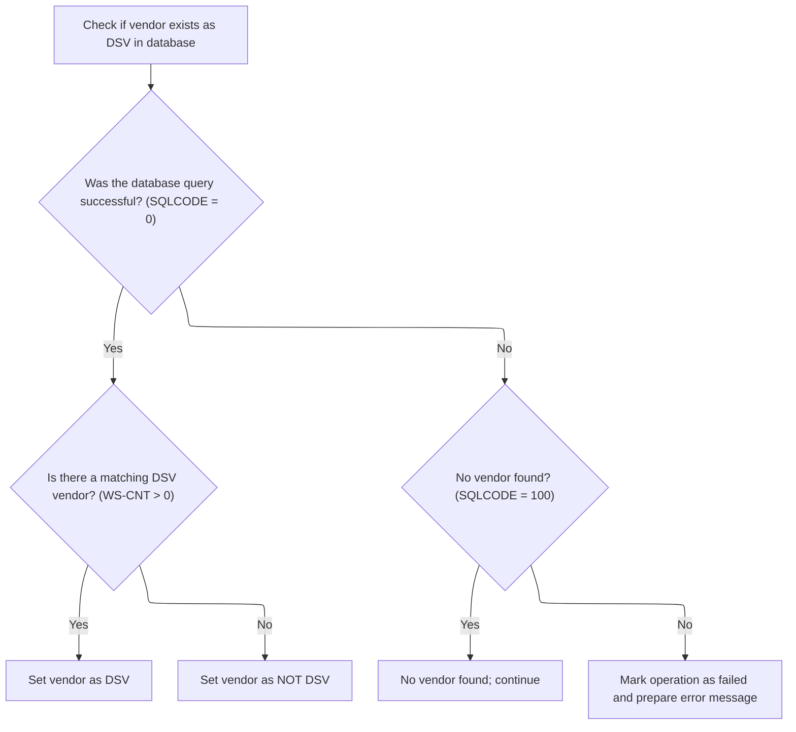

This section determines the DSV status of a vendor by checking the database for a matching record. It sets the vendor's DSV status flag based on the query result and handles cases where the vendor is not found or an error occurs.

| Category       | Rule Name              | Description                                                                                                                                                                                                                                                                                                                |
| -------------- | ---------------------- | -------------------------------------------------------------------------------------------------------------------------------------------------------------------------------------------------------------------------------------------------------------------------------------------------------------------------- |
| Business logic | Mark Vendor as DSV     | If the database query returns a successful code (SQLCODE = 0) and the count of matching vendors (<SwmToken path="base/src/MMMS0711.cbl" pos="177:5:7" line-data="018500           INTO :WS-CNT                                           00019100">`WS-CNT`</SwmToken>) is greater than zero, the vendor is marked as DSV. |
| Business logic | Mark Vendor as NOT DSV | If the database query returns a successful code (SQLCODE = 0) and the count of matching vendors (<SwmToken path="base/src/MMMS0711.cbl" pos="177:5:7" line-data="018500           INTO :WS-CNT                                           00019100">`WS-CNT`</SwmToken>) is zero, the vendor is marked as NOT DSV.          |

<SwmSnippet path="/base/src/MMMS0711.cbl" line="172">

---

In <SwmToken path="base/src/MMMS0711.cbl" pos="172:2:10" line-data="018000 200-CHECK-VEND-IS-DSV.                                           00018600">`200-CHECK-VEND-IS-DSV`</SwmToken>, we prep the vendor number and type code, then run a SQL COUNT to see if the vendor matches the DSV subtype. The result sets the DSV status flag for the vendor.

```cobol
018000 200-CHECK-VEND-IS-DSV.                                           00018600
018100     MOVE MMMC0711-I-VEND-NBR     TO LOC-NBR        OF DCLXXXATION00018700
018200     MOVE MMMC0711-I-VEND-TYP-CD  TO LOC-TYP-CD     OF DCLXXXATION00018800
018300     EXEC SQL                                                     00018900
018400         SELECT COALESCE(COUNT (*),0)                             00019000
018500           INTO :WS-CNT                                           00019100
018600           FROM XXXATION LOC,                                     00019200
018700                AP_XXX_SUB_TYP SUB                                00019300
018800         WHERE LOC.LOC_NBR         = :DCLXXXATION.LOC-NBR         00019400
018900           AND LOC.LOC_TYP_CD      = :DCLXXXATION.LOC-TYP-CD      00019500
019000           AND SUB.AP_NBR          = LOC.AP_NBR                   00019600
019100           AND SUB.AP_TYP_CD       = LOC.AP_TYP_CD                00019700
019200           AND SUB.AP_SUB_TYP_CD   = :K-DSV-LOC-SUB-TYP-CD        00019800
019300     END-EXEC                                                     00019900
```

---

</SwmSnippet>

<SwmSnippet path="/base/src/MMMS0711.cbl" line="186">

---

After the query, if the count is positive, we set <SwmToken path="base/src/MMMS0711.cbl" pos="189:4:8" line-data="019700           SET VEND-IS-DSV TO TRUE                                00020300">`VEND-IS-DSV`</SwmToken>. If it's zero or no data, we set <SwmToken path="base/src/MMMS0711.cbl" pos="191:4:10" line-data="019900           SET VEND-IS-NOT-DSV TO TRUE                            00020500">`VEND-IS-NOT-DSV`</SwmToken>. Any other SQL error sets FAILURE and an error message.

```cobol
019400     EVALUATE TRUE                                                00020000
019500       WHEN SQLCODE = 0                                           00020100
019600         IF WS-CNT > 0                                            00020200
019700           SET VEND-IS-DSV TO TRUE                                00020300
019800         ELSE                                                     00020400
019900           SET VEND-IS-NOT-DSV TO TRUE                            00020500
020000         END-IF                                                   00020600
020100       WHEN SQLCODE = 100                                         00020700
020200         MOVE 0 TO SQLCODE                                        00020800
020300       WHEN SQLCODE NOT = 0                                       00020900
020400         SET  FAILURE TO TRUE                                     00021000
020500         MOVE SPACES  TO IS-RTRN-MSG-TXT                          00021100
020600         MOVE SQLCODE TO WS-SQLCODE                               00021200
020700         STRING 'MMMS0711 - Error checking SUB/VLI, '             00021300
020800                'RC=' WS-SQLCODE '.'                              00021400
020900                DELIMITED BY SIZE INTO IS-RTRN-MSG-TXT            00021500
021000     END-EVALUATE                                                 00021600
```

---

</SwmSnippet>

# Entity DSV Status Check

This section is responsible for determining the correct vendor association check based on the type of entity provided. It ensures that only relevant checks are performed for each entity type, and sets output flags accordingly.

| Category        | Rule Name                     | Description                                                                                                                                                           |
| --------------- | ----------------------------- | --------------------------------------------------------------------------------------------------------------------------------------------------------------------- |
| Data validation | Valid Entity Type Enforcement | The entity type must be one of the following valid values: 'DSD  ', 'UPC  ', or 'PROD '. Any other value is considered invalid and should not trigger a vendor check. |
| Business logic  | UPC Vendor Check for DSD/UPC  | If the entity type is DSD or UPC, the system must perform a vendor check using the UPC vendor association logic.                                                      |
| Business logic  | Product Vendor Check for PROD | If the entity type is PROD, the system must perform a vendor check using the product vendor association logic.                                                        |

<SwmSnippet path="/base/src/MMMS0711.cbl" line="207">

---

<SwmToken path="base/src/MMMS0711.cbl" pos="207:2:10" line-data="021500 300-CHECK-ENTY-IS-DSV.                                           00022100">`300-CHECK-ENTY-IS-DSV`</SwmToken> branches based on the entity type. If it's DSD or UPC, we call <SwmToken path="base/src/MMMS0711.cbl" pos="210:4:10" line-data="021800          PERFORM 310-CHECK-UPC-VEND                              00022400">`310-CHECK-UPC-VEND`</SwmToken>; if it's product, we call <SwmToken path="base/src/MMMS0711.cbl" pos="213:4:10" line-data="022100          PERFORM 320-CHECK-PROD-VEND                             00022700">`320-CHECK-PROD-VEND`</SwmToken>. This keeps the checks focused on the right association.

```cobol
021500 300-CHECK-ENTY-IS-DSV.                                           00022100
021600      EVALUATE TRUE                                               00022200
021700        WHEN ( DSD-ITEM-KEY-CD OR UPC-ITEM-KEY-CD )               00022300
021800          PERFORM 310-CHECK-UPC-VEND                              00022400
021900                                                                  00022500
022000        WHEN PRD-ITEM-KEY-CD                                      00022600
022100          PERFORM 320-CHECK-PROD-VEND                             00022700
022200      END-EVALUATE                                                00022800
```

---

</SwmSnippet>

# UPC/Vendor Association Check

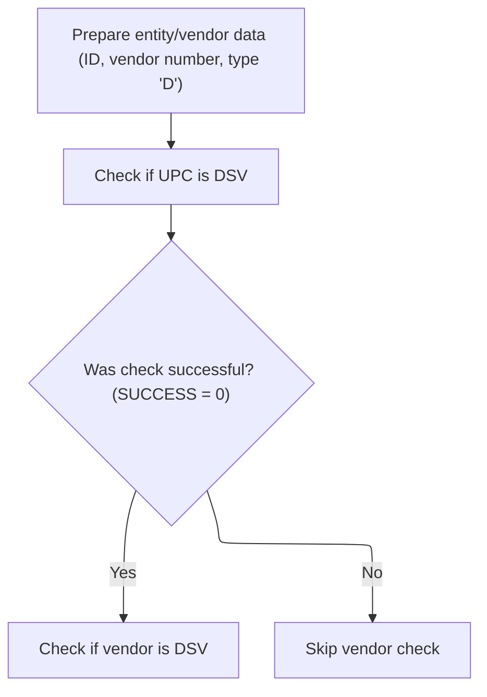

This section governs the business logic for verifying if a UPC and vendor are associated as DSV, and ensures that both the item and vendor meet DSV requirements before proceeding with DSV-specific processing.

| Category        | Rule Name                    | Description                                                                                                                                                         |
| --------------- | ---------------------------- | ------------------------------------------------------------------------------------------------------------------------------------------------------------------- |
| Data validation | Input Data Validation        | The UPC/vendor DSV check must only be performed when both entity ID and vendor number are provided and valid.                                                       |
| Data validation | Vendor Type Code Requirement | The vendor type code must be set to 'D' to qualify for DSV association checks.                                                                                      |
| Business logic  | Vendor DSV Status Validation | If the UPC and vendor combination is classified as DSV, the vendor's DSV status must be validated at the vendor level before any DSV-specific processing can occur. |

<SwmSnippet path="/base/src/MMMS0711.cbl" line="219">

---

In <SwmToken path="base/src/MMMS0711.cbl" pos="219:2:8" line-data="022700 310-CHECK-UPC-VEND.                                              00023300">`310-CHECK-UPC-VEND`</SwmToken>, we prep the item and vendor info, then call <SwmToken path="base/src/MMMS0711.cbl" pos="225:4:12" line-data="023300     PERFORM 315-CHECK-UPC-IS-DSV                                 00023900">`315-CHECK-UPC-IS-DSV`</SwmToken> to see if this UPC/vendor combo is a DSV. This is where the actual check happens.

```cobol
022700 310-CHECK-UPC-VEND.                                              00023300
022800     MOVE MMMC0711-I-ENTY-ID      TO ITM-ID     OF DCLXXXD-LOC-ITM00023400
022900     MOVE MMMC0711-I-VEND-NBR     TO LOC-NBR    OF DCLXXXATION    00023500
023000     MOVE MMMC0711-I-VEND-TYP-CD                                  00023600
023100                                  TO LOC-TYP-CD OF DCLXXXATION    00023700
023200                                                                  00023800
023300     PERFORM 315-CHECK-UPC-IS-DSV                                 00023900
```

---

</SwmSnippet>

<SwmSnippet path="/base/src/MMMS0711.cbl" line="226">

---

After finishing <SwmToken path="base/src/MMMS0711.cbl" pos="210:4:10" line-data="021800          PERFORM 310-CHECK-UPC-VEND                              00022400">`310-CHECK-UPC-VEND`</SwmToken>, we call <SwmToken path="base/src/MMMS0711.cbl" pos="227:4:12" line-data="023500       PERFORM 200-CHECK-VEND-IS-DSV                              00024100">`200-CHECK-VEND-IS-DSV`</SwmToken> if everything is still successful. This step checks the vendor's DSV status at the vendor level, not just for the specific UPC. It makes sure the vendor is actually recognized as DSV in the database, which is needed for downstream logic that depends on the vendor's classification.

```cobol
023400     IF SUCCESS                                                   00024000
023500       PERFORM 200-CHECK-VEND-IS-DSV                              00024100
023600     END-IF                                                       00024200
```

---

</SwmSnippet>

# Product/Vendor Association Check

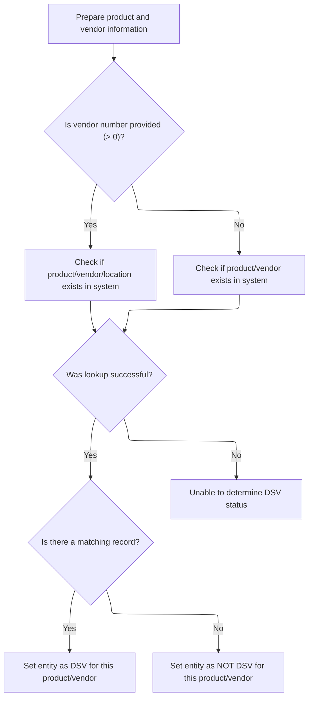

This section determines whether a given entity is a Direct Store Vendor (DSV) for a specific product and vendor combination. It uses the provided entity ID, vendor number, and vendor type code to check for an association in the system, and sets the DSV status accordingly. If the association cannot be determined due to a system error, an error status and message are returned.

| Category       | Rule Name                          | Description                                                                                                                                                                                                                        |
| -------------- | ---------------------------------- | ---------------------------------------------------------------------------------------------------------------------------------------------------------------------------------------------------------------------------------- |
| Business logic | Vendor Number Association Check    | If a vendor number is provided and greater than zero, the system must check for a product/vendor/location association using the DSV location subtype code constant. Only associations matching this constant are considered valid. |
| Business logic | No Vendor Number Association Check | If no vendor number is provided (zero or less), the system must check for a product/vendor association using the DSD vendor location type code constant. Only associations matching this constant are considered valid.            |
| Business logic | Positive Association is DSV        | If the association lookup returns a positive count, the entity must be marked as a DSV for the product/vendor combination.                                                                                                         |
| Business logic | No Association is Not DSV          | If the association lookup returns zero, the entity must be marked as NOT a DSV for the product/vendor combination.                                                                                                                 |

<SwmSnippet path="/base/src/MMMS0711.cbl" line="324">

---

In <SwmToken path="base/src/MMMS0711.cbl" pos="324:2:8" line-data="033200 320-CHECK-PROD-VEND.                                             00033800">`320-CHECK-PROD-VEND`</SwmToken>, we start by moving the input entity ID, vendor number, and vendor type code into the local query structures. The function assumes these fields are already set up correctly, since they're used as-is in the SQL that follows. If they're not valid, the SQL won't work as expected.

```cobol
033200 320-CHECK-PROD-VEND.                                             00033800
033300     MOVE MMMC0711-I-ENTY-ID  TO PROD-ID    OF DCLPROD-ITEM       00033900
033400     MOVE MMMC0711-I-VEND-NBR TO LOC-NBR    OF DCLXXXATION        00034000
033500                                 AP-NBR     OF DCLAP-XXX-SUB-TYP  00034100
033600     MOVE MMMC0711-I-VEND-TYP-CD                                  00034200
033700                              TO LOC-TYP-CD OF DCLXXXATION        00034300
```

---

</SwmSnippet>

<SwmSnippet path="/base/src/MMMS0711.cbl" line="331">

---

Here we branch based on whether the vendor number is greater than zero. If it is, we run a SQL query joining several tables and filtering with <SwmToken path="base/src/MMMS0711.cbl" pos="339:11:21" line-data="034700           WHERE SUB.AP_SUB_TYP_CD   = :K-DSV-LOC-SUB-TYP-CD      00035300">`K-DSV-LOC-SUB-TYP-CD`</SwmToken>. If not, we use a different query and the <SwmToken path="base/src/MMMS0711.cbl" pos="359:11:21" line-data="036700             AND VLI.VEND_LOC_TYP_CD = :K-DSD-VEND-LOC-TYP-CD     00037300">`K-DSD-VEND-LOC-TYP-CD`</SwmToken> constant. These constants are baked into the logic and control which records count as a match.

```cobol
033900     IF MMMC0711-I-VEND-NBR > 0                                   00034500
034000       EXEC SQL                                                   00034600
034100           SELECT COUNT (*)                                       00034700
034200             INTO :WS-CNT                                         00034800
034300             FROM AP_XXX_SUB_TYP SUB ,                            00034900
034400                  XXXD_LOC_ITM VLI,                               00035000
034500                  XXXATION LOC,                                   00035100
034600                  PROD_ITEM PI                                    00035200
034700           WHERE SUB.AP_SUB_TYP_CD   = :K-DSV-LOC-SUB-TYP-CD      00035300
034800             AND SUB.AP_NBR          = LOC.AP_NBR                 00035400
034900             AND SUB.AP_TYP_CD       = LOC.AP_TYP_CD              00035500
035000             AND VLI.VEND_LOC_NBR    = LOC.LOC_NBR                00035600
035100             AND VLI.VEND_LOC_TYP_CD = LOC.LOC_TYP_CD             00035700
035200             AND LOC.LOC_NBR         = :DCLXXXATION.LOC-NBR       00035800
035300             AND LOC.LOC_TYP_CD      = :DCLXXXATION.LOC-TYP-CD    00035900
035400             AND VLI.ITM_ID          = PI.ITM_ID                  00036000
035500             AND VLI.ITM_KEY_TYP_CD  = PI.ITM_KEY_TYP_CD          00036100
035600             AND PI.PROD_ID          = :DCLPROD-ITEM.PROD-ID      00036200
035700       END-EXEC                                                   00036300
```

---

</SwmSnippet>

<SwmSnippet path="/base/src/MMMS0711.cbl" line="350">

---

If the vendor number is zero or less, we run a different SQL query with fewer joins and a different constant. This changes what counts as a match in the database, so the outcome can be different depending on the input and which constant is used.

```cobol
035800     ELSE                                                         00036400
035900       EXEC SQL                                                   00036500
036000           SELECT COUNT (*)                                       00036600
036100             INTO :WS-CNT                                         00036700
036200             FROM AP_XXX_SUB_TYP SUB ,                            00036800
036300                  XXXD_LOC_ITM VLI,                               00036900
036400                  PROD_ITEM PI                                    00037000
036500           WHERE SUB.AP_SUB_TYP_CD   = :K-DSV-LOC-SUB-TYP-CD      00037100
036600             AND VLI.VEND_LOC_NBR    = SUB.AP_NBR                 00037200
036700             AND VLI.VEND_LOC_TYP_CD = :K-DSD-VEND-LOC-TYP-CD     00037300
036800             AND VLI.ITM_ID          = PI.ITM_ID                  00037400
036900             AND VLI.ITM_KEY_TYP_CD  = PI.ITM_KEY_TYP_CD          00037500
037000             AND PI.PROD_ID          = :DCLPROD-ITEM.PROD-ID      00037600
037100       END-EXEC                                                   00037700
037200     END-IF                                                       00037800
```

---

</SwmSnippet>

<SwmSnippet path="/base/src/MMMS0711.cbl" line="366">

---

After running the SQL, we check the count. If it's positive, we set <SwmToken path="base/src/MMMS0711.cbl" pos="369:4:8" line-data="037700           SET ENTY-IS-DSV TO TRUE                                00038300">`ENTY-IS-DSV`</SwmToken>; if not, <SwmToken path="base/src/MMMS0711.cbl" pos="371:4:10" line-data="037900           SET ENTY-IS-NOT-DSV TO TRUE                            00038500">`ENTY-IS-NOT-DSV`</SwmToken>. If the SQL fails, we set FAILURE and build an error message for the user.

```cobol
037400     EVALUATE TRUE                                                00038000
037500       WHEN SQLCODE = 0                                           00038100
037600         IF WS-CNT > 0                                            00038200
037700           SET ENTY-IS-DSV TO TRUE                                00038300
037800         ELSE                                                     00038400
037900           SET ENTY-IS-NOT-DSV TO TRUE                            00038500
038000         END-IF                                                   00038600
038100       WHEN SQLCODE NOT = 0                                       00038700
038200         SET  FAILURE TO TRUE                                     00038800
038300         MOVE SPACES  TO IS-RTRN-MSG-TXT                          00038900
038400         MOVE SQLCODE TO WS-SQLCODE                               00039000
038500         STRING 'MMMS0711 - Error checking SUB/VLI, '             00039100
038600                'RC=' WS-SQLCODE '.'                              00039200
038700                DELIMITED BY SIZE INTO IS-RTRN-MSG-TXT            00039300
038800     END-EVALUATE                                                 00039400
```

---

</SwmSnippet>

&nbsp;

*This is an auto-generated document by Swimm 🌊 and has not yet been verified by a human*

<SwmMeta version="3.0.0" repo-id="Z2l0aHViJTNBJTNBU3dpbW1pby1keW5jYWxsLWRlbW8lM0ElM0FHaXJpLVN3aW1t" repo-name="Swimmio-dyncall-demo"><sup>Powered by [Swimm](https://app.swimm.io/)</sup></SwmMeta>
