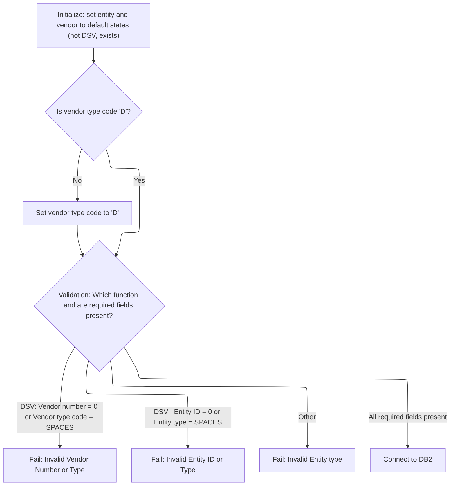
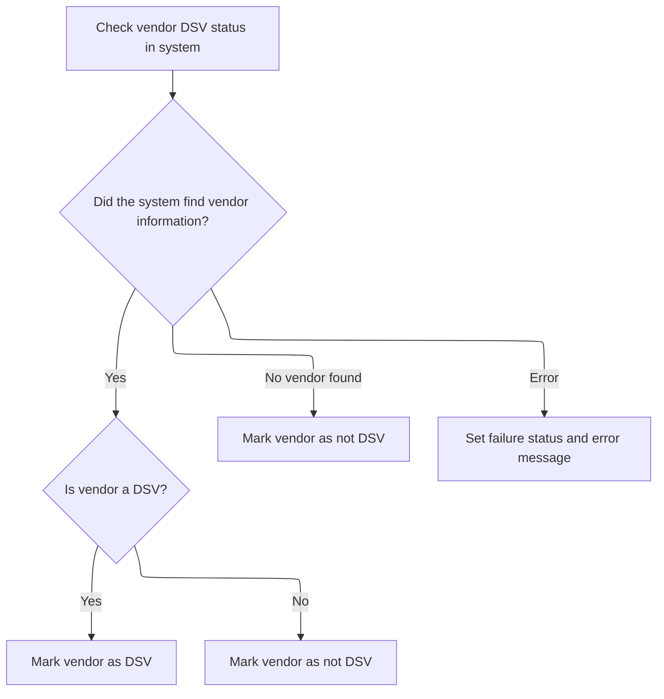

This document outlines the flow for validating vendor or entity information and determining DSV status. The process begins by routing the request based on the function code, followed by input validation. If the input is valid, the system connects to the database and checks DSV status, ensuring only valid data is processed.

# Spec

## Detailed View of the Program's Functionality

# Program Entry and Routing

The program begins execution in its main section. The first action is to perform initialization, which prepares the working environment and validates the input. After initialization, the program determines which type of check to perform based on the function code provided in the input. There are two main branches:

- If the function code indicates a vendor DSV check, the program performs the vendor DSV validation.
- If the function code indicates an entity DSV check, the program performs the entity DSV validation.
- If the function code does not match either expected value, the program sets an error status and message, then exits.

After the appropriate branch is executed, the program completes and returns control to the caller.

# Initialization and Input Validation

During initialization, the program:

- Resets the main data structures and output fields to their default states.
- Sets flags indicating that the entity and vendor are not DSVs and that the entity exists.
- Ensures the vendor type code is set to a default value if not already provided.
- Validates the input fields based on the requested function:
  - For a vendor DSV check, it verifies that the vendor number and type code are present and valid.
  - For an entity DSV check, it verifies that the entity ID and type are present and valid.
  - If the input does not match expected patterns, it sets an error status and message.
- If all validations pass, the program establishes a connection to the database (DB2) to prepare for further checks.

# Database Connection

The database connection logic is encapsulated in a dedicated section. When called, this section invokes a separate routine responsible for switching the database context to DB2, handling any error codes, and restoring backup records if necessary. This separation ensures that database-specific logic and error handling are managed consistently and do not clutter the main program flow.

# Vendor DSV Validation

When performing a vendor DSV check, the program:

- Prepares the necessary fields for the database query using the input vendor number and type code.
- Executes a query to count matching records in the relevant tables, using a hardcoded subtype constant to identify DSV vendors.
- Evaluates the result:
  - If the query is successful and finds one or more matching records, the vendor is marked as a DSV.
  - If no matching records are found, the vendor is marked as not a DSV.
  - If the query returns no data, the SQL code is reset.
  - If an error occurs during the query, the program sets an error status and constructs an error message containing the SQL code.

# Entity DSV Validation

When performing an entity DSV check, the program:

- Determines which type of entity check to perform based on the input key code (UPC or product).
- For UPC checks:
  - Prepares the necessary fields for the database query.
  - Executes a query to count matching records for UPC entities.
  - If the vendor number is present, the query includes vendor-specific criteria; otherwise, it uses default values.
  - Evaluates the result:
    - If matching records are found, the entity is marked as a DSV.
    - If no matching records are found, the entity is marked as not a DSV.
    - Performs an additional check to verify if the UPC exists.
    - Handles SQL errors by setting error status and constructing an error message.
- For product checks:
  - Prepares the necessary fields for the database query.
  - Executes a query to count matching records for product entities.
  - If the vendor number is present, the query includes vendor-specific criteria; otherwise, it uses default values.
  - Evaluates the result:
    - If matching records are found, the entity is marked as a DSV.
    - If no matching records are found, the entity is marked as not a DSV.
    - Handles SQL errors by setting error status and constructing an error message.

# Additional Entity Existence Check

After a UPC entity DSV check, the program performs an additional query to verify whether the UPC exists in the system. The result of this query sets a flag indicating whether the entity exists or does not exist. SQL errors are handled similarly, with error status and messages set as needed.

# Error Handling

Throughout the program, error handling is consistent:

- If any validation or database operation fails, the program sets a failure status.
- Error messages are constructed to include relevant details, such as the SQL code returned by the database.
- The program ensures that no further processing occurs if a failure is detected, preventing unnecessary database operations or logic execution.

# Task Management

There is a section dedicated to task management, which is called during initialization if certain conditions are met. This section sets a flag and invokes a control subroutine, passing the necessary data structures. This logic is currently commented out but is available for future use or extension.

# Summary

The program is structured to:

- Validate input and prepare the environment.
- Route processing based on the requested function.
- Perform vendor or entity DSV checks using database queries.
- Handle errors and construct informative messages.
- Manage database connections and task control in dedicated sections for clarity and maintainability.

# Rule Definition

| Paragraph Name                                                                       | Rule ID | Category          | Description                                                                                                                                                                                                                                                                                   | Conditions                                                                    | Remarks                                                                                                                                                                                                                                      |
| ------------------------------------------------------------------------------------ | ------- | ----------------- | --------------------------------------------------------------------------------------------------------------------------------------------------------------------------------------------------------------------------------------------------------------------------------------------- | ----------------------------------------------------------------------------- | -------------------------------------------------------------------------------------------------------------------------------------------------------------------------------------------------------------------------------------------- |
| 100-INITIALIZE, 000-MAIN                                                             | RL-001  | Data Assignment   | The program must accept a structured input record with vendor number, vendor type code, entity ID, entity type, and function flags. All output flags and message fields must be initialized to their default states before processing begins.                                                 | On program start, before any processing occurs.                               | Output flags (SUCCESS, FAILURE, VEND-IS-DSV, VEND-IS-NOT-DSV, ENTY-IS-DSV, ENTY-IS-NOT-DSV, ENTY-EXISTS, ENTY-DOES-NOT-EXIST) are boolean/flag fields. Message text is a string. SQL code is a number. All are part of the output structure. |
| 100-INITIALIZE                                                                       | RL-002  | Data Assignment   | If the vendor type code is not provided, it must be set to 'D' by default.                                                                                                                                                                                                                    | Vendor type code is blank or not provided in the input structure.             | Constant value: 'D' (string, length 1 or 2, right-padded if needed).                                                                                                                                                                         |
| 100-INITIALIZE                                                                       | RL-003  | Conditional Logic | If the DSV vendor function flag is set, the program must validate that the vendor number is not zero and the vendor type code is not blank. If either is invalid, set FAILURE, clear SUCCESS, set return message to 'MMMS0711 - Invalid Vendor Number or Type!', and skip further processing. | DSV vendor function flag is TRUE.                                             | FAILURE and SUCCESS are boolean/flag fields. Message text: 'MMMS0711 - Invalid Vendor Number or Type!' (string).                                                                                                                             |
| 100-INITIALIZE                                                                       | RL-004  | Conditional Logic | If the DSV entity function flag is set, the program must validate that the entity ID is not zero and the entity type is not blank. If either is invalid, set FAILURE, clear SUCCESS, set return message to 'MMMS0711 - Invalid Enty id/Enty Type!', and skip further processing.              | DSV entity function flag is TRUE.                                             | FAILURE and SUCCESS are boolean/flag fields. Message text: 'MMMS0711 - Invalid Enty id/Enty Type!' (string).                                                                                                                                 |
| 000-MAIN, 100-INITIALIZE                                                             | RL-005  | Conditional Logic | If neither DSV vendor nor DSV entity function flags are set, the program must set FAILURE, clear SUCCESS, set return message to 'MMMS0711 - Invalid Entity type!', and skip further processing.                                                                                               | Neither DSV vendor nor DSV entity function flags are TRUE.                    | FAILURE and SUCCESS are boolean/flag fields. Message text: 'MMMS0711 - Invalid Entity type!' (string).                                                                                                                                       |
| 100-INITIALIZE, 125-CONNECT-TO-DB2                                                   | RL-006  | Computation       | If all required fields are present and validation passes, the program must establish a DB2 connection using the input structure and SQLCA.                                                                                                                                                    | All input validation passes (SUCCESS is TRUE).                                | DB2 connection is established using input structure and SQLCA. No output fields are set by this rule unless an error occurs.                                                                                                                 |
| 200-CHECK-VEND-IS-DSV                                                                | RL-007  | Computation       | For DSV vendor checks, the program queries DB2 tables to count rows matching vendor number, vendor type code, and subtype 'DSV  '. If count > 0, set VEND-IS-DSV and clear VEND-IS-NOT-DSV. If count = 0, set VEND-IS-NOT-DSV and clear VEND-IS-DSV.                                          | DSV vendor function flag is TRUE and input validation passed.                 | Constant: 'DSV  ' (string, length 5, right-padded). VEND-IS-DSV and VEND-IS-NOT-DSV are boolean/flag fields.                                                                                                                                 |
| 300-CHECK-ENTY-IS-DSV, 310-CHECK-UPC-VEND, 315-CHECK-UPC-IS-DSV, 320-CHECK-PROD-VEND | RL-008  | Computation       | For DSV entity checks, the program queries DB2 tables to count rows matching entity ID, entity type, and subtype as required. If count > 0, set ENTY-IS-DSV and clear ENTY-IS-NOT-DSV. If count = 0, set ENTY-IS-NOT-DSV and clear ENTY-IS-DSV.                                               | DSV entity function flag is TRUE and input validation passed.                 | Constant: 'DSV  ' (string, length 5, right-padded). ENTY-IS-DSV and ENTY-IS-NOT-DSV are boolean/flag fields.                                                                                                                                 |
| 200-CHECK-VEND-IS-DSV, 315-CHECK-UPC-IS-DSV, 320-CHECK-PROD-VEND                     | RL-009  | Conditional Logic | If a DB2 error occurs during any query, set FAILURE, clear SUCCESS, set return message to the error message, and set the SQL code field to the SQL error code.                                                                                                                                | SQLCODE is not 0 (or is 100, which is treated as not found).                  | FAILURE and SUCCESS are boolean/flag fields. Message text is a string containing the error message and SQL code. SQL code is a number field in the output structure.                                                                         |
| End of mainline and after all checks                                                 | RL-010  | Data Assignment   | If all validations and DB2 checks pass without error, set SUCCESS and clear FAILURE.                                                                                                                                                                                                          | All validations and DB2 checks pass (no errors, all required fields present). | SUCCESS and FAILURE are boolean/flag fields.                                                                                                                                                                                                 |
| End of mainline and after all checks                                                 | RL-011  | Data Assignment   | The program must return all output flags, message text, and SQL code in the output structure.                                                                                                                                                                                                 | At the end of processing, regardless of outcome.                              | Output structure contains all flags (SUCCESS, FAILURE, VEND-IS-DSV, VEND-IS-NOT-DSV, ENTY-IS-DSV, ENTY-IS-NOT-DSV, ENTY-EXISTS, ENTY-DOES-NOT-EXIST), message text (string), and SQL code (number).                                          |

# User Stories

## User Story 1: Input acceptance and initialization

---

### Story Description:

As a system, I want to accept a structured input record and initialize all output flags and message fields to their default states so that the program starts with a known state and can process requests reliably.

---

### Business Rule Mapping:

| Rule ID | Paragraph Name           | Rule Description                                                                                                                                                                                                                              |
| ------- | ------------------------ | --------------------------------------------------------------------------------------------------------------------------------------------------------------------------------------------------------------------------------------------- |
| RL-001  | 100-INITIALIZE, 000-MAIN | The program must accept a structured input record with vendor number, vendor type code, entity ID, entity type, and function flags. All output flags and message fields must be initialized to their default states before processing begins. |
| RL-002  | 100-INITIALIZE           | If the vendor type code is not provided, it must be set to 'D' by default.                                                                                                                                                                    |

---

### Relevant Functionality:

- **100-INITIALIZE**
  1. **RL-001:**
     - On entry, initialize all output fields to default values (e.g., flags to FALSE, message text to blank, SQL code to 0).
     - Accept input structure with required fields.
  2. **RL-002:**
     - If vendor type code is blank, assign 'D' to vendor type code field.

## User Story 2: Input validation and error handling

---

### Story Description:

As a system, I want to validate the input fields and function flags, and handle any invalid or missing data by setting appropriate error flags and messages so that only valid requests are processed and users are informed of input errors.

---

### Business Rule Mapping:

| Rule ID | Paragraph Name           | Rule Description                                                                                                                                                                                                                                                                              |
| ------- | ------------------------ | --------------------------------------------------------------------------------------------------------------------------------------------------------------------------------------------------------------------------------------------------------------------------------------------- |
| RL-005  | 000-MAIN, 100-INITIALIZE | If neither DSV vendor nor DSV entity function flags are set, the program must set FAILURE, clear SUCCESS, set return message to 'MMMS0711 - Invalid Entity type!', and skip further processing.                                                                                               |
| RL-003  | 100-INITIALIZE           | If the DSV vendor function flag is set, the program must validate that the vendor number is not zero and the vendor type code is not blank. If either is invalid, set FAILURE, clear SUCCESS, set return message to 'MMMS0711 - Invalid Vendor Number or Type!', and skip further processing. |
| RL-004  | 100-INITIALIZE           | If the DSV entity function flag is set, the program must validate that the entity ID is not zero and the entity type is not blank. If either is invalid, set FAILURE, clear SUCCESS, set return message to 'MMMS0711 - Invalid Enty id/Enty Type!', and skip further processing.              |

---

### Relevant Functionality:

- **000-MAIN**
  1. **RL-005:**
     - If neither DSV vendor nor DSV entity function flags are set:
       - Set FAILURE to TRUE
       - Set SUCCESS to FALSE
       - Set message text to 'MMMS0711 - Invalid Entity type!'
       - Skip further processing.
- **100-INITIALIZE**
  1. **RL-003:**
     - If DSV vendor function flag is set:
       - If vendor number is 0 or vendor type code is blank:
         - Set FAILURE to TRUE
         - Set SUCCESS to FALSE
         - Set message text to 'MMMS0711 - Invalid Vendor Number or Type!'
         - Skip further processing.
  2. **RL-004:**
     - If DSV entity function flag is set:
       - If entity ID is 0 or entity type is blank:
         - Set FAILURE to TRUE
         - Set SUCCESS to FALSE
         - Set message text to 'MMMS0711 - Invalid Enty id/Enty Type!'
         - Skip further processing.

## User Story 3: DB2 connection and query processing

---

### Story Description:

As a system, I want to establish a DB2 connection and perform vendor and entity DSV checks, handling any DB2 errors, so that I can determine DSV status and communicate any database issues to the user.

---

### Business Rule Mapping:

| Rule ID | Paragraph Name                                                                       | Rule Description                                                                                                                                                                                                                                     |
| ------- | ------------------------------------------------------------------------------------ | ---------------------------------------------------------------------------------------------------------------------------------------------------------------------------------------------------------------------------------------------------- |
| RL-006  | 100-INITIALIZE, 125-CONNECT-TO-DB2                                                   | If all required fields are present and validation passes, the program must establish a DB2 connection using the input structure and SQLCA.                                                                                                           |
| RL-007  | 200-CHECK-VEND-IS-DSV                                                                | For DSV vendor checks, the program queries DB2 tables to count rows matching vendor number, vendor type code, and subtype 'DSV  '. If count > 0, set VEND-IS-DSV and clear VEND-IS-NOT-DSV. If count = 0, set VEND-IS-NOT-DSV and clear VEND-IS-DSV. |
| RL-009  | 200-CHECK-VEND-IS-DSV, 315-CHECK-UPC-IS-DSV, 320-CHECK-PROD-VEND                     | If a DB2 error occurs during any query, set FAILURE, clear SUCCESS, set return message to the error message, and set the SQL code field to the SQL error code.                                                                                       |
| RL-008  | 300-CHECK-ENTY-IS-DSV, 310-CHECK-UPC-VEND, 315-CHECK-UPC-IS-DSV, 320-CHECK-PROD-VEND | For DSV entity checks, the program queries DB2 tables to count rows matching entity ID, entity type, and subtype as required. If count > 0, set ENTY-IS-DSV and clear ENTY-IS-NOT-DSV. If count = 0, set ENTY-IS-NOT-DSV and clear ENTY-IS-DSV.      |

---

### Relevant Functionality:

- **100-INITIALIZE**
  1. **RL-006:**
     - If SUCCESS is TRUE after validation:
       - Call DB2 connection routine with input structure and SQLCA.
- **200-CHECK-VEND-IS-DSV**
  1. **RL-007:**
     - Query DB2 for count of rows matching vendor number, vendor type code, and subtype 'DSV  '.
     - If count > 0:
       - Set VEND-IS-DSV to TRUE
       - Set VEND-IS-NOT-DSV to FALSE
     - Else:
       - Set VEND-IS-NOT-DSV to TRUE
       - Set VEND-IS-DSV to FALSE
  2. **RL-009:**
     - If SQLCODE is not 0 (or is 100):
       - Set FAILURE to TRUE
       - Set SUCCESS to FALSE
       - Set message text to error message including SQL code
       - Set SQL code field to SQLCODE
- **300-CHECK-ENTY-IS-DSV**
  1. **RL-008:**
     - Query DB2 for count of rows matching entity ID, entity type, and subtype 'DSV  '.
     - If count > 0:
       - Set ENTY-IS-DSV to TRUE
       - Set ENTY-IS-NOT-DSV to FALSE
     - Else:
       - Set ENTY-IS-NOT-DSV to TRUE
       - Set ENTY-IS-DSV to FALSE

## User Story 4: Final output population

---

### Story Description:

As a system, I want to set the final SUCCESS or FAILURE flags and return all output flags, message text, and SQL code in the output structure so that the user receives a complete and accurate response for each request.

---

### Business Rule Mapping:

| Rule ID | Paragraph Name                       | Rule Description                                                                              |
| ------- | ------------------------------------ | --------------------------------------------------------------------------------------------- |
| RL-010  | End of mainline and after all checks | If all validations and DB2 checks pass without error, set SUCCESS and clear FAILURE.          |
| RL-011  | End of mainline and after all checks | The program must return all output flags, message text, and SQL code in the output structure. |

---

### Relevant Functionality:

- **End of mainline and after all checks**
  1. **RL-010:**
     - If all validations and DB2 checks pass:
       - Set SUCCESS to TRUE
       - Set FAILURE to FALSE
  2. **RL-011:**
     - Assign all output fields to the output structure before returning.

# Code Walkthrough

## Entry and Routing Logic

<SwmSnippet path="/base/src/MMMS0711.cbl" line="70">

---

`000-MAIN` starts the flow, calls 100-INITIALIZE to prep everything, then branches to vendor or entity validation based on the function code. If the input doesn't match, it sets an error and exits.

```cobol
008200 000-MAIN.                                                        00008400
008300     PERFORM 100-INITIALIZE                                       00008500
008400                                                                  00008600
008500     EVALUATE TRUE                                                00008700
008600       WHEN MMMC0711-IS-DSV-FUNC                                  00008800
008700         PERFORM 200-CHECK-VEND-IS-DSV                            00008900
008800       WHEN MMMC0711-IS-DSV-ITEM-FUNC                             00009000
008900         PERFORM 300-CHECK-ENTY-IS-DSV                            00009100
009000       WHEN OTHER                                                 00009200
009100         SET FAILURE TO TRUE                                      00009300
009200         MOVE 'ZZZS0033 - Invalid MMMC0711-FUNC passed.'          00009400
009300           TO IS-RTRN-MSG-TXT                                     00009500
009400     END-EVALUATE                                                 00009600
009500                                                                  00009700
009600                                                                  00009800
009700*    IF YYYN005A-ORACLE                                           00009900
009800*      PERFORM 125-CONNECT-TO-DB2                                 00010000
009900*    END-IF                                                       00010100
010000     GOBACK                                                       00010200
010100     .                                                            00010300
```

---

</SwmSnippet>

### Input Validation and DB2 Setup



<SwmSnippet path="/base/src/MMMS0711.cbl" line="95">

---

`100-INITIALIZE` handles all the input validation and sets up the flags for vendor/entity DSV checks. It sets default values for the vendor type code and flags, then uses an EVALUATE block to check for missing or invalid input fields. If everything checks out, it calls 125-CONNECT-TO-DB2 to set up the DB connection, but only if validation passes. This keeps DB calls from happening when the input is already bad.

```cobol
010700 100-INITIALIZE.                                                  00010900
010701*    DISPLAY 'IM IN MMMS0711'                                     00011000
010800     INITIALIZE XXXN001A                                          00011100
010900                MMMC0711-OUTPUTS                                  00011200
011000     SET ENTY-IS-NOT-DSV TO TRUE                                  00011300
011100     SET VEND-IS-NOT-DSV TO TRUE                                  00011400
011200     SET ENTY-EXISTS     TO TRUE                                  00011500
011300                                                                  00011600
011400     IF  MMMC0711-I-VEND-TYP-CD NOT EQUAL 'D'                     00011700
011500       MOVE 'D' TO MMMC0711-I-VEND-TYP-CD                         00011800
011600     END-IF                                                       00011900
011700                                                                  00012000
011800     EVALUATE TRUE                                                00012100
011900       WHEN SUCCESS                                               00012200
012000         CONTINUE                                                 00012300
012100                                                                  00012400
012200       WHEN MMMC0711-IS-DSV-FUNC                                  00012500
012300        AND ( MMMC0711-I-VEND-NBR = 0                             00012600
012400         OR   MMMC0711-I-VEND-TYP-CD = SPACES)                    00012700
012500         SET  FAILURE TO TRUE                                     00012800
012600         MOVE 'MMMS0711 - Invalid Vendor Number or Type!'         00012900
012700           TO IS-RTRN-MSG-TXT                                     00013000
012800                                                                  00013100
012900       WHEN MMMC0711-IS-DSV-ITEM-FUNC                             00013200
013000        AND ( MMMC0711-I-ENTY-ID  = 0                             00013300
013100         OR   MMMC0711-I-ENTY-TYP = SPACES)                       00013400
013200         SET  FAILURE TO TRUE                                     00013500
013300         MOVE 'MMMS0711 - Invalid Enty id/Enty Type!'             00013600
013400           TO IS-RTRN-MSG-TXT                                     00013700
013500                                                                  00013800
013600                                                                  00013900
013700       WHEN OTHER                                                 00014000
013800         SET  FAILURE TO TRUE                                     00014100
013900         MOVE 'MMMS0711 - Invalid Entity type!'                   00014200
014000           TO IS-RTRN-MSG-TXT                                     00014300
014100     END-EVALUATE                                                 00014400
014200     IF SUCCESS                                                   00014500
014300*       PERFORM 900-GET-TASK                                      00014600
014400*       IF SUCCESS AND WWWC0099-ORACLE                            00014700
014500*          SET YYYN005A-ORACLE  TO TRUE                           00014800
014600*          PERFORM 115-CONNECT-TO-ORACLE                          00014900
014700*       END-IF                                                    00015000
 14400*       IF SUCCESS                                                00015100
014600           PERFORM 125-CONNECT-TO-DB2                             00015200
014700*       END-IF                                                    00015300
014800     END-IF                                                       00015400
014900     .                                                            00015500
```

---

</SwmSnippet>

<SwmSnippet path="/base/src/MMMS0711.cbl" line="163">

---

`125-CONNECT-TO-DB2` just calls Z-DB2-CONNECT, which is actually YYYS0211. That program switches the DB connection to DB2, handles any error code translation, and restores backup records if needed. This keeps all the DB-specific logic out of the main flow and makes error handling consistent.

```cobol
017100 125-CONNECT-TO-DB2.                                              00017700
017200     CALL Z-DB2-CONNECT         USING XXXN001A                    00017800
017300                                      SQLCA                       00017900
017400     .                                                            00018000
```

---

</SwmSnippet>

### Vendor and Entity DSV Checks



<SwmSnippet path="/base/src/MMMS0711.cbl" line="172">

---

`200-CHECK-VEND-IS-DSV` checks if the vendor is a DSV by running a count query with the vendor number, type code, and a hardcoded subtype constant. If the count is positive, it sets the DSV flag; if not, it sets the non-DSV flag. SQL errors or no data are handled by setting error messages or resetting SQLCODE as needed. No DB updates happen here, just a read and flag set.

```cobol
018000 200-CHECK-VEND-IS-DSV.                                           00018600
018100     MOVE MMMC0711-I-VEND-NBR     TO LOC-NBR        OF DCLXXXATION00018700
018200     MOVE MMMC0711-I-VEND-TYP-CD  TO LOC-TYP-CD     OF DCLXXXATION00018800
018300     EXEC SQL                                                     00018900
018400         SELECT COALESCE(COUNT (*),0)                             00019000
018500           INTO :WS-CNT                                           00019100
018600           FROM XXXATION LOC,                                     00019200
018700                AP_XXX_SUB_TYP SUB                                00019300
018800         WHERE LOC.LOC_NBR         = :DCLXXXATION.LOC-NBR         00019400
018900           AND LOC.LOC_TYP_CD      = :DCLXXXATION.LOC-TYP-CD      00019500
019000           AND SUB.AP_NBR          = LOC.AP_NBR                   00019600
019100           AND SUB.AP_TYP_CD       = LOC.AP_TYP_CD                00019700
019200           AND SUB.AP_SUB_TYP_CD   = :K-DSV-LOC-SUB-TYP-CD        00019800
019300     END-EXEC                                                     00019900
019400     EVALUATE TRUE                                                00020000
019500       WHEN SQLCODE = 0                                           00020100
019600         IF WS-CNT > 0                                            00020200
019700           SET VEND-IS-DSV TO TRUE                                00020300
019800         ELSE                                                     00020400
019900           SET VEND-IS-NOT-DSV TO TRUE                            00020500
020000         END-IF                                                   00020600
020100       WHEN SQLCODE = 100                                         00020700
020200         MOVE 0 TO SQLCODE                                        00020800
020300       WHEN SQLCODE NOT = 0                                       00020900
020400         SET  FAILURE TO TRUE                                     00021000
020500         MOVE SPACES  TO IS-RTRN-MSG-TXT                          00021100
020600         MOVE SQLCODE TO WS-SQLCODE                               00021200
020700         STRING 'MMMS0711 - Error checking SUB/VLI, '             00021300
020800                'RC=' WS-SQLCODE '.'                              00021400
020900                DELIMITED BY SIZE INTO IS-RTRN-MSG-TXT            00021500
021000     END-EVALUATE                                                 00021600
021100      .                                                           00021700
```

---

</SwmSnippet>

&nbsp;

*This is an auto-generated document by Swimm 🌊 and has not yet been verified by a human*

<SwmMeta version="3.0.0" repo-id="Z2l0aHViJTNBJTNBU3dpbW1pby1keW5jYWxsLWRlbW8lM0ElM0FHaXJpLVN3aW1t" repo-name="Swimmio-dyncall-demo"><sup>Powered by [Swimm](https://app.swimm.io/)</sup></SwmMeta>
