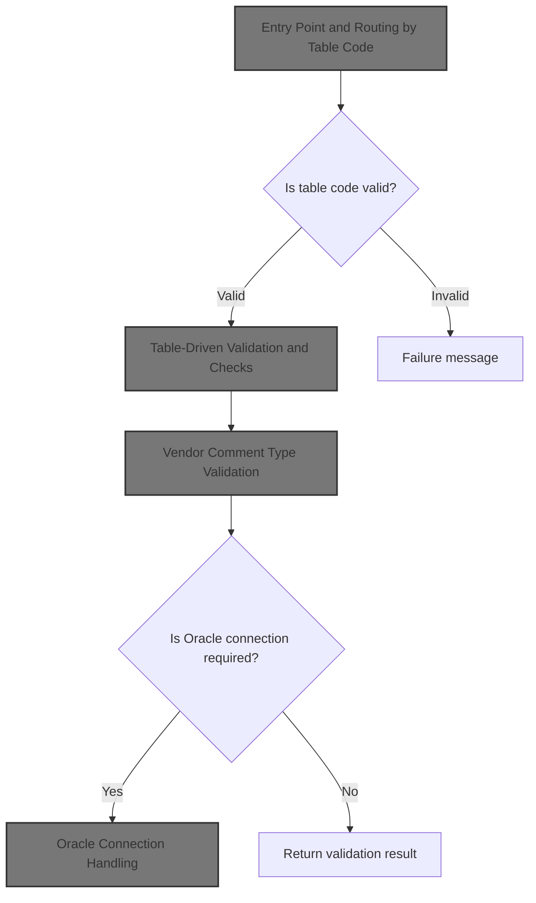
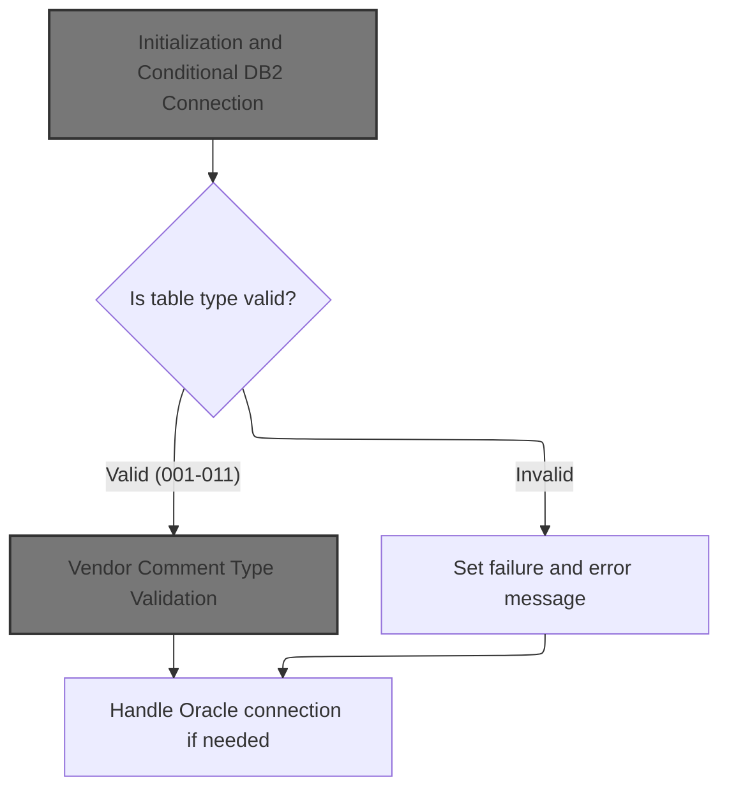
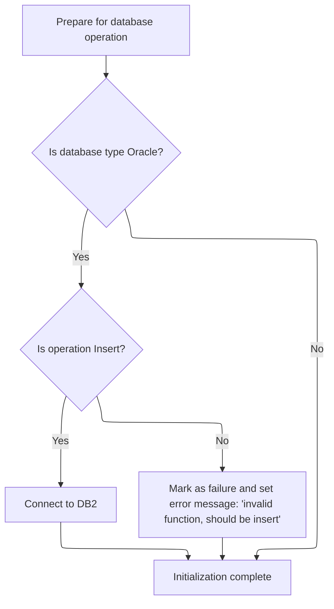
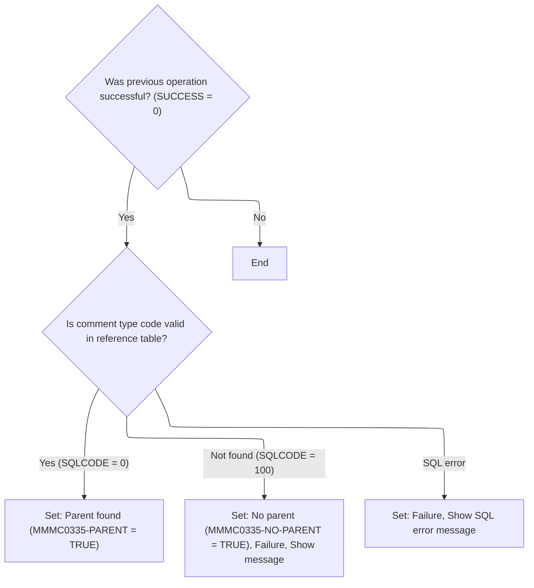

This document describes the main flow for validating vendor, location, and comment data using a table-driven approach. The process starts by preparing the environment, then routes requests to the appropriate validation logic based on the table code. Valid codes trigger specific business checks, while invalid codes result in a failure message. The flow also manages database connections, including Oracle, when needed.



# Spec

## Detailed View of the Program's Functionality

## Entry Point and Routing by Table Code

The program begins execution in its main routine. The first action is to prepare the environment and working storage by calling an initialization routine. After initialization, the program examines a specific code that determines which type of table or validation is being requested.

- If the code matches one of the valid cases (001 through 011), the program routes execution to a corresponding validation or check subroutine. Each code represents a different type of vendor or location check, such as vendor location, shipping option, retail location, etc.
- If the code does not match any of the valid cases, the program sets a failure flag and constructs an error message indicating that an invalid table code was provided.
- After the table code routing, if a flag indicates that Oracle database operations are required, the program prepares for an Oracle connection by saving relevant state, calls a routine to connect to Oracle, and then restores the saved state.
- Finally, the program exits.

This structure ensures that only valid table codes are processed, and that any required database connections are handled after all validations and checks.

---

## Initialization and Conditional DB2 Connection

The initialization routine is responsible for setting up the working storage areas and preparing the environment for further operations.

- It clears out and resets key data structures used for database operations.
- If the Oracle mode flag is set, the routine checks if the requested function is an insert operation. If it is, it calls a separate routine to connect to the DB2 database. If the function is not an insert, it sets a failure flag and constructs an error message indicating that only insert operations are valid in this context.
- Regardless of the database type, the routine clears the status field to ensure a clean state for subsequent operations.

The DB2 connection routine itself simply delegates the actual connection logic to an external program, keeping the main program decoupled from the details of DB2 connectivity.

---

## Table-Driven Validation and Checks

For each valid table code, the program performs a specific validation or check. These routines typically follow a pattern:

- They first check if the previous operation was successful.
- If so, they may perform one or more additional checks, sometimes chaining them together based on the results of earlier checks or the presence of certain flags.
- For example, the retail location check first validates the e-commerce market area. If that passes and a parent flag is set, it then checks the computer type. This allows for complex, conditional validation flows based on both data and prior results.

Each check is modular, focusing on a specific aspect of the data, and only proceeds if all prior checks have succeeded.

---

## Vendor Comment Type Validation

The vendor comment type validation is a specific example of the table-driven checks:

- The routine first checks if the previous operation was successful.
- If so, it performs a check to see if the provided comment type code exists in a reference table.
- The check is performed by copying the code into a structure and executing a database query to look for a matching entry.
- If the code is found, a flag is set to indicate that a parent was found.
- If the code is not found, a different flag is set, the operation is marked as a failure, and a descriptive error message is constructed.
- If any other database error occurs, the operation is also marked as a failure, and a different error message is constructed that includes the database error code.

This approach ensures that only valid comment type codes are accepted, and provides clear feedback in case of errors.

---

## Oracle Connection Handling

When an Oracle database connection is required, the program calls a dedicated routine to handle the connection. This routine delegates the actual connection logic to an external program, which is responsible for setting up the Oracle environment and establishing the connection.

By isolating the database connection logic in separate routines and external programs, the main program remains focused on validation and business logic, while database-specific details are handled elsewhere.

---

## Summary

- The program starts by initializing its environment and routing execution based on a table code.
- It performs table-driven validations, each tailored to a specific type of data or business rule.
- Initialization includes conditional logic for connecting to DB2 or handling Oracle-specific requirements.
- Each validation routine is modular and only runs if prior checks have succeeded.
- Vendor comment type validation is a concrete example, involving a database lookup and detailed error handling.
- Database connections (DB2 and Oracle) are handled by external programs, keeping the main logic clean and focused.

# Rule Definition

| Paragraph Name                                                                                                                                                        | Rule ID | Category          | Description                                                                                                                                                                                                                                                                                           | Conditions                                             | Remarks                                                                                                                                                                             |
| --------------------------------------------------------------------------------------------------------------------------------------------------------------------- | ------- | ----------------- | ----------------------------------------------------------------------------------------------------------------------------------------------------------------------------------------------------------------------------------------------------------------------------------------------------- | ------------------------------------------------------ | ----------------------------------------------------------------------------------------------------------------------------------------------------------------------------------- |
| 000-MAIN-LINE                                                                                                                                                         | RL-001  | Conditional Logic | The program checks the value of MMMC0335-TABLE and routes to the appropriate validation or check routine for codes 001 through 011. If the value is not in this range, it sets FAILURE to 'Y' and populates IS-RTRN-MSG-TXT with an error message.                                                    | MMMC0335-TABLE is present in input structure.          | Valid codes are 001-011. Error message format: 'MMMS0335 - invalid table passed'. IS-RTRN-MSG-TXT is a string field.                                                                |
| 010-INITIALIZE                                                                                                                                                        | RL-002  | Conditional Logic | If MMMC0335-ORACLE is 'Y', and MMMC0335-FUNC is not 'I', set FAILURE to 'Y' and IS-RTRN-MSG-TXT to 'invalid function, should be insert'. If MMMC0335-ORACLE is 'Y' and MMMC0335-FUNC is 'I', initiate a DB2 connection using XXXN001A.                                                                | MMMC0335-ORACLE is 'Y'.                                | Error message: 'MMMS0335 - invalid function passed function should be insert'.                                                                                                      |
| 010-INITIALIZE                                                                                                                                                        | RL-003  | Data Assignment   | After initialization, MMMC0335-STATUS must be cleared.                                                                                                                                                                                                                                                | After all initialization steps.                        | MMMC0335-STATUS is a string field, set to spaces.                                                                                                                                   |
| 500-CHK-XXX-VEND-LOC, 600-CHK-LOC-SHPNG-OPT, 700-CHK-RETAIL-LOC, 800-CHK-RETL-LOC-CLS-AD-ZN, 900-CHK-XXX-VEND-LOC, 1000-CHK-VEND-TRXAL-CNTL, 1100-CHK-VENDOR-COMMENTS | RL-004  | Conditional Logic | Each validation routine checks if the previous operation was successful (SUCCESS = 'Y'). If not, no further validation is performed.                                                                                                                                                                  | Entry to any validation routine.                       | SUCCESS is a flag field, expected value is 'Y'.                                                                                                                                     |
| 1105-CHK-CMT-TYP-CD                                                                                                                                                   | RL-005  | Conditional Logic | Checks if MMMC0335-CMT-TYP-CD exists in the reference table. If found, sets MMMC0335-PARENT to 'Y'. If not found, sets MMMC0335-NO-PARENT to 'Y', FAILURE to 'Y', and IS-RTRN-MSG-TXT to an appropriate message. For any SQL error, sets FAILURE to 'Y' and IS-RTRN-MSG-TXT to the SQL error message. | Vendor comment type validation routine is invoked.     | Error message format: 'MMMS0335 - XXX_TYP_CD should be in XXX_TYP_CD, rule = MDVCMDCT'. SQL error message includes SQLCODE value.                                                   |
| Throughout all validation routines and main logic                                                                                                                     | RL-006  | Data Assignment   | The program must update the MMMC0335 structure in-place with all flags, codes, and message/status fields reflecting the result of the operation.                                                                                                                                                      | After any validation or check routine.                 | MMMC0335 contains flags (PARENT, NO-PARENT, FAILURE), codes, and message/status fields. All updates are performed in-place.                                                         |
| 015-CONNECT-TO-DB2, 020-CONNECT-TO-ORACLE                                                                                                                             | RL-007  | Computation       | The program must call external routines for DB2 or Oracle connection as required, passing XXXN001A as the parameter.                                                                                                                                                                                  | When a database connection is needed.                  | DB2 connection routine name: 'YYYS0211'. Oracle connection routine name: 'YYYS0210'. XXXN001A is passed as a 265-byte structure.                                                    |
| 010-INITIALIZE                                                                                                                                                        | RL-008  | Data Assignment   | Before any business logic is executed, all fields used for temporary data storage and all status indicators must be set to their default values (e.g., cleared or set to spaces).                                                                                                                     | Program start, before any validation or routing logic. | The database context structure is 265 bytes and is initialized to spaces. All temporary storage areas and status indicators are also initialized to spaces or their default values. |

# User Stories

## User Story 1: Program Initialization and Setup

---

### Story Description:

As a system, I want all working storage, status fields, and database context to be initialized before any business logic is executed so that the program starts in a known, error-free state.

---

### Business Rule Mapping:

| Rule ID | Paragraph Name | Rule Description                                                                                                                                                                  |
| ------- | -------------- | --------------------------------------------------------------------------------------------------------------------------------------------------------------------------------- |
| RL-003  | 010-INITIALIZE | After initialization, MMMC0335-STATUS must be cleared.                                                                                                                            |
| RL-008  | 010-INITIALIZE | Before any business logic is executed, all fields used for temporary data storage and all status indicators must be set to their default values (e.g., cleared or set to spaces). |

---

### Relevant Functionality:

- **010-INITIALIZE**
  1. **RL-003:**
     - Set MMMC0335-STATUS to spaces
  2. **RL-008:**
     - Set the database context structure to spaces
     - Set all temporary storage areas to spaces
     - Clear the status indicator in the main control structure

## User Story 2: Input Routing and Validation

---

### Story Description:

As a system, I want to route input to the correct validation routine based on the table code, validate vendor comment types, and handle errors so that only valid operations are performed and users receive clear feedback on invalid input.

---

### Business Rule Mapping:

| Rule ID | Paragraph Name                                                                                                                                                        | Rule Description                                                                                                                                                                                                                                                                                      |
| ------- | --------------------------------------------------------------------------------------------------------------------------------------------------------------------- | ----------------------------------------------------------------------------------------------------------------------------------------------------------------------------------------------------------------------------------------------------------------------------------------------------- |
| RL-001  | 000-MAIN-LINE                                                                                                                                                         | The program checks the value of MMMC0335-TABLE and routes to the appropriate validation or check routine for codes 001 through 011. If the value is not in this range, it sets FAILURE to 'Y' and populates IS-RTRN-MSG-TXT with an error message.                                                    |
| RL-005  | 1105-CHK-CMT-TYP-CD                                                                                                                                                   | Checks if MMMC0335-CMT-TYP-CD exists in the reference table. If found, sets MMMC0335-PARENT to 'Y'. If not found, sets MMMC0335-NO-PARENT to 'Y', FAILURE to 'Y', and IS-RTRN-MSG-TXT to an appropriate message. For any SQL error, sets FAILURE to 'Y' and IS-RTRN-MSG-TXT to the SQL error message. |
| RL-004  | 500-CHK-XXX-VEND-LOC, 600-CHK-LOC-SHPNG-OPT, 700-CHK-RETAIL-LOC, 800-CHK-RETL-LOC-CLS-AD-ZN, 900-CHK-XXX-VEND-LOC, 1000-CHK-VEND-TRXAL-CNTL, 1100-CHK-VENDOR-COMMENTS | Each validation routine checks if the previous operation was successful (SUCCESS = 'Y'). If not, no further validation is performed.                                                                                                                                                                  |

---

### Relevant Functionality:

- **000-MAIN-LINE**
  1. **RL-001:**
     - Evaluate MMMC0335-TABLE
       - If 001: (no operation)
       - If 002: (no operation)
       - If 003: (no operation)
       - If 004: (no operation)
       - If 005: Perform vendor location check
       - If 006: Perform location shipping option check
       - If 007: Perform retail location check
       - If 008: Perform retail location class/ad zone check
       - If 009: Perform vendor location check
       - If 010: Perform vendor transaction control check
       - If 011: Perform vendor comments check
       - Else: Set FAILURE to 'Y', clear IS-RTRN-MSG-TXT, set error message
- **1105-CHK-CMT-TYP-CD**
  1. **RL-005:**
     - Query reference table for MMMC0335-CMT-TYP-CD
     - If SQLCODE = 0: Set MMMC0335-PARENT to 'Y'
     - If SQLCODE = 100: Set MMMC0335-NO-PARENT to 'Y', FAILURE to 'Y', set error message
     - Else: Set FAILURE to 'Y', set SQL error message
- **500-CHK-XXX-VEND-LOC**
  1. **RL-004:**
     - If SUCCESS = 'Y':
       - Perform next validation step
     - Else: Skip further validation

## User Story 3: Operation Execution and Result Reflection

---

### Story Description:

As a system, I want to execute database operations, update the main control/data structure in-place with all relevant flags and messages, and call external routines for DB2 or Oracle connections as needed so that the results of all operations are accurately reflected and necessary integrations are performed.

---

### Business Rule Mapping:

| Rule ID | Paragraph Name                                    | Rule Description                                                                                                                                                                                                                       |
| ------- | ------------------------------------------------- | -------------------------------------------------------------------------------------------------------------------------------------------------------------------------------------------------------------------------------------- |
| RL-002  | 010-INITIALIZE                                    | If MMMC0335-ORACLE is 'Y', and MMMC0335-FUNC is not 'I', set FAILURE to 'Y' and IS-RTRN-MSG-TXT to 'invalid function, should be insert'. If MMMC0335-ORACLE is 'Y' and MMMC0335-FUNC is 'I', initiate a DB2 connection using XXXN001A. |
| RL-007  | 015-CONNECT-TO-DB2, 020-CONNECT-TO-ORACLE         | The program must call external routines for DB2 or Oracle connection as required, passing XXXN001A as the parameter.                                                                                                                   |
| RL-006  | Throughout all validation routines and main logic | The program must update the MMMC0335 structure in-place with all flags, codes, and message/status fields reflecting the result of the operation.                                                                                       |

---

### Relevant Functionality:

- **010-INITIALIZE**
  1. **RL-002:**
     - If MMMC0335-ORACLE is 'Y':
       - If MMMC0335-FUNC = 'I': Perform DB2 connection
       - Else: Set FAILURE to 'Y', clear IS-RTRN-MSG-TXT, set error message
- **015-CONNECT-TO-DB2**
  1. **RL-007:**
     - For DB2 connection: Call external routine with XXXN001A and SQLCA
     - For Oracle connection: Call external routine with XXXN001A and SQLCA
- **Throughout all validation routines and main logic**
  1. **RL-006:**
     - After each validation/check:
       - Set flags (PARENT, NO-PARENT, FAILURE) as appropriate
       - Set message/status fields as appropriate

# Code Walkthrough

## Entry Point and Routing by Table Code



<SwmSnippet path="/base/src/MMMS0335.cbl" line="86">

---

000-MAIN-LINE kicks off the flow by calling 010-INITIALIZE to prep the environment and working storage. It then uses MMMC0335-TABLE to decide which check or validation subroutine to run, covering cases 001-011 for different vendor location checks. If the table code is invalid, it sets a failure flag and builds an error message. If the Oracle flag is set, it handles the Oracle DB connection before exiting. Initialization comes first to make sure all the required state is set up before any branching or DB work happens.

```cobol
010600 000-MAIN-LINE.                                                   00010600
010700     PERFORM 010-INITIALIZE                                       00010700
010800     EVALUATE MMMC0335-TABLE                                      00010800
010900       WHEN 001                                                   00010900
011100       WHEN 002                                                   00011100
011300       WHEN 003                                                   00011300
011500       WHEN 004                                                   00011500
011600         CONTINUE                                                 00011600
011700       WHEN 005                                                   00011700
011800         PERFORM 500-CHK-XXX-VEND-LOC                             00011800
011900       WHEN 006                                                   00011900
012000         PERFORM 600-CHK-LOC-SHPNG-OPT                            00012000
012100       WHEN 007                                                   00012100
012200         PERFORM 700-CHK-RETAIL-LOC                               00012200
012300       WHEN 008                                                   00012300
012400         PERFORM 800-CHK-RETL-LOC-CLS-AD-ZN                       00012400
012500       WHEN 009                                                   00012500
012600         PERFORM 900-CHK-XXX-VEND-LOC                             00012600
012700       WHEN 010                                                   00012700
012800         PERFORM 1000-CHK-VEND-TRXAL-CNTL                         00012800
012900       WHEN 011                                                   00012900
013000         PERFORM 1100-CHK-VENDOR-COMMENTS                         00013000
013100       WHEN OTHER                                                 00013100
013200         SET FAILURE   TO TRUE                                    00013200
013300         MOVE SPACES  TO IS-RTRN-MSG-TXT                          00013300
013400         STRING 'MMMS0335 - invalid table passed '                00013400
013500                DELIMITED BY SIZE INTO IS-RTRN-MSG-TXT            00013500
013600     END-EVALUATE                                                 00013600
013700     IF MMMC0335-ORACLE                                           00013700
013800       MOVE XXXN001A   TO  WS-XXXN001A                            00013800
013900       MOVE SQLCA      TO  WS-SQLCA                               00013900
014000       PERFORM 020-CONNECT-TO-ORACLE                              00014000
014100       MOVE WS-XXXN001A  TO XXXN001A                              00014100
014200       MOVE WS-SQLCA     TO SQLCA                                 00014200
014300     END-IF                                                       00014300
014400                                                                  00014400
014500     GOBACK                                                       00014500
014600     .                                                            00014600
```

---

</SwmSnippet>

### Initialization and Conditional DB2 Connection



<SwmSnippet path="/base/src/MMMS0335.cbl" line="129">

---

010-INITIALIZE sets up working storage and checks if we're in Oracle mode and doing an insert. If so, it calls 015-CONNECT-TO-DB2 to handle the DB2 connection. If the function code isn't 'I', it flags failure and sets an error message. It also clears the status field at the end to reset state.

```cobol
015200 010-INITIALIZE.                                                  00015200
015300     INITIALIZE XXXN001A                                          00015300
015400                WS-XXXN001A                                       00015400
015500                WS-SQLCA                                          00015500
015600                                                                  00015600
015700     IF MMMC0335-ORACLE                                           00015700
015800       IF MMMC0335-FUNC  = 'I'                                    00015800
015900         PERFORM 015-CONNECT-TO-DB2                               00015900
016000       ELSE                                                       00016000
016100         SET FAILURE TO TRUE                                      00016100
016200         MOVE SPACES  TO IS-RTRN-MSG-TXT                          00016200
016300         STRING 'MMMS0335 - invalid function passed '             00016300
016400                'function should be insert'                       00016400
016500                DELIMITED BY SIZE INTO IS-RTRN-MSG-TXT            00016500
016600       END-IF                                                     00016600
016700     END-IF                                                       00016700
016800                                                                  00016800
016900     MOVE SPACES   TO MMMC0335-STATUS                             00016900
017000     .                                                            00017000
```

---

</SwmSnippet>

<SwmSnippet path="/base/src/MMMS0335.cbl" line="153">

---

015-CONNECT-TO-DB2 just calls out to YYYS0211.cbl to handle the DB2 connection. That program sets up the DB2 environment, translates Oracle errors if needed, and restores any saved business record. This keeps the DB2 connection logic isolated from the main flow.

```cobol
017600 015-CONNECT-TO-DB2.                                              00017600
017700     CALL Z-DB2-CONNECT         USING XXXN001A                    00017700
017800                                      SQLCA                       00017800
017900     .                                                            00017900
```

---

</SwmSnippet>

### Table-Driven Validation and Checks

<SwmSnippet path="/base/src/MMMS0335.cbl" line="260">

---

700-CHK-RETAIL-LOC checks for SUCCESS, then runs 705-CHK-ECOMM-MKT-AREA. If that passes and MMMC0335-PARENT is set, it also runs 710-CHK-CMPTR-TYP. So, it's chaining checks based on both result and a flag, not just doing a single validation.

```cobol
046200 700-CHK-RETAIL-LOC.                                              00046200
046300      IF SUCCESS                                                  00046300
046400*       PERFORM 705-CHK-ECOMM-MKT-AREA                            00046400
046500*       IF SUCCESS AND MMMC0335-PARENT                            00046500
046600*         PERFORM 710-CHK-CMPTR-TYP                               00046600
046700*       END-IF                                                    00046700
046800        CONTINUE                                                  00046800
046900      END-IF                                                      00046900
047000      .                                                           00047000
```

---

</SwmSnippet>

### Vendor Comment Type Validation



<SwmSnippet path="/base/src/MMMS0335.cbl" line="484">

---

1100-CHK-VENDOR-COMMENTS only runs 1105-CHK-CMT-TYP-CD if SUCCESS is set, so it doesn't bother checking the comment type code if something already failed earlier. It's just a conditional pass-through to the next validation.

```cobol
072300 1100-CHK-VENDOR-COMMENTS.                                        00072300
072400      IF SUCCESS                                                  00072400
072500        PERFORM 1105-CHK-CMT-TYP-CD                               00072500
072600      END-IF                                                      00072600
072700      .                                                           00072700
```

---

</SwmSnippet>

<SwmSnippet path="/base/src/MMMS0335.cbl" line="491">

---

1105-CHK-CMT-TYP-CD copies the comment type code into the structure for the SQL query, runs a SELECT to see if it exists in XXX_TYP_CD, and then checks SQLCODE. If found, it sets the parent flag; if not, it sets failure and builds an error message. Any other SQL error also triggers failure with a different message.

```cobol
073000 1105-CHK-CMT-TYP-CD.                                             00073000
073100     MOVE MMMC0335-CMT-TYP-CD                                     00073100
073200       TO CMT-TYP-CD             OF DCLCMT-TYP-CD                 00073200
073300                                                                  00073300
073400     EXEC SQL                                                     00073400
073500        SELECT XXX_TYP_CD                                         00073500
073600         INTO : DCLCMT-TYP-CD.CMT-TYP-CD                          00073600
073700        FROM XXX_TYP_CD                                           00073700
073800        WHERE XXX_TYP_CD                                          00073800
073900                      = :DCLCMT-TYP-CD.CMT-TYP-CD                 00073900
074000        FETCH FIRST 1 ROWS ONLY                                   00074000
074100     END-EXEC                                                     00074100
074200                                                                  00074200
074300     EVALUATE TRUE                                                00074300
074400       WHEN SQLCODE = 0                                           00074400
074500         SET MMMC0335-PARENT     TO  TRUE                         00074500
074600       WHEN SQLCODE = 100                                         00074600
074700         SET  MMMC0335-NO-PARENT TO TRUE                          00074700
074800         SET FAILURE             TO TRUE                          00074800
074900         MOVE SQLCODE            TO WS-SQLCODE                    00074900
075000         MOVE SPACE              TO IS-RTRN-MSG-TXT               00075000
075100         STRING 'MMMS0335 - XXX_TYP_CD'                           00075100
075200                 ' should be in XXX_TYP_CD,'                      00075200
075300                 ' rule = MDVCMDCT '                              00075300
075400         DELIMITED BY SIZE INTO IS-RTRN-MSG-TXT                   00075400
075500       WHEN OTHER                                                 00075500
075600         SET FAILURE             TO TRUE                          00075600
075700         MOVE SQLCODE            TO WS-SQLCODE                    00075700
075800         MOVE SPACE              TO IS-RTRN-MSG-TXT               00075800
075900         STRING 'MMMS0335 - SQL error on table '                  00075900
076000                'XXX_TYP_CD, '                                    00076000
076100                 'Sqlcode = ' WS-SQLCODE                          00076100
076200         DELIMITED BY SIZE INTO IS-RTRN-MSG-TXT                   00076200
076300     END-EVALUATE                                                 00076300
076400     .                                                            00076400
```

---

</SwmSnippet>

### Oracle Connection Handling

<SwmSnippet path="/base/src/MMMS0335.cbl" line="162">

---

020-CONNECT-TO-ORACLE just calls XXXS0210.cbl to set up the Oracle DB connection. That program handles all the prep and connection logic so the main flow doesn't have to deal with the details.

```cobol
018500 020-CONNECT-TO-ORACLE.                                           00018500
018600     CALL Z-ORA-CONNECT USING XXXN001A                            00018600
018700                              SQLCA                               00018700
018800     .                                                            00018800
```

---

</SwmSnippet>

&nbsp;

*This is an auto-generated document by Swimm 🌊 and has not yet been verified by a human*

<SwmMeta version="3.0.0" repo-id="Z2l0aHViJTNBJTNBU3dpbW1pby1keW5jYWxsLWRlbW8lM0ElM0FHaXJpLVN3aW1t" repo-name="Swimmio-dyncall-demo"><sup>Powered by [Swimm](https://app.swimm.io/)</sup></SwmMeta>
