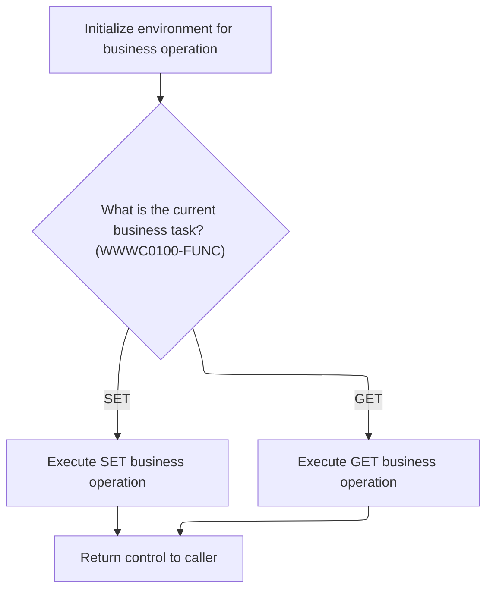

The denormalization and workflow synchronization process prepares the environment, retrieves the current workflow state, and, if conditions are met, synchronizes location data and issues events. This ensures workflow and location data remain current for subsequent business operations.

# Spec

## Detailed View of the Program's Functionality

# Starting the Denormalization and Workflow Sync

The main denormalization process begins by preparing the environment for subsequent operations. This involves copying system environment data from one structure to another to ensure consistency. Immediately after, the process calls a control subroutine to retrieve the current workflow state. This retrieval is crucial because the following steps—synchronization and event issuing—depend on having the latest workflow information.

Once the workflow state is successfully retrieved and certain flags indicate that normalization tasks are required, the process proceeds to synchronize location data between databases. If all steps up to this point are successful, the process then issues relevant events to notify other systems or components about the changes.

# Retrieving and Managing Workflow State

To manage the workflow state, a dedicated subroutine is invoked. This subroutine sets a flag indicating that the current workflow task should be retrieved. It then calls an external control routine, passing along necessary data structures. The purpose of this call is to either fetch or update the workflow state from an external source, ensuring that the main process has the correct context for its operations.

# Initializing and Handling Workflow Task State

The control routine responsible for workflow state management starts by initializing its internal data structures, resetting them to a clean state. After initialization, the routine evaluates which operation to perform based on the flags provided:

- If the flag indicates a "set" operation, the routine updates its internal state to reflect the new workflow task details.
- If the flag indicates a "get" operation, the routine retrieves the current workflow task details from its internal state and makes them available to the caller.

This logic ensures that the workflow state remains synchronized and accurate, supporting the needs of the main denormalization process.

# Synchronizing Location Data Between Databases

When synchronization is required, the process sets several control flags to indicate the context of the operation (such as marking the call as the last one, specifying the use of a particular database, and confirming the current state of the location data). It then calls a dedicated synchronization routine, passing all relevant data structures. This routine is responsible for ensuring that location data is consistent across different databases, reflecting any recent changes or updates.

# Event Issuing (from context)

After successful synchronization and workflow state management, the process may issue events to notify other systems about the changes. This involves preparing event data, setting appropriate flags, and calling an event manager routine. The event manager handles the actual dispatching of events, ensuring that all interested parties are informed of the updates.

# Summary

- The process starts by preparing the environment and retrieving the current workflow state.
- It manages workflow state by either setting or getting task details, depending on the flags.
- If required, it synchronizes location data between databases.
- Upon successful completion of these steps, it issues events to notify other systems.
- Each step is dependent on the success of the previous one, ensuring a controlled and reliable flow.

# Rule Definition

| Paragraph Name                                                                         | Rule ID | Category          | Description                                                                                                                                                                                                                                                                                                | Conditions                                                                                                                                                               | Remarks                                                                                                                                                                                                                                                                                                                                |
| -------------------------------------------------------------------------------------- | ------- | ----------------- | ---------------------------------------------------------------------------------------------------------------------------------------------------------------------------------------------------------------------------------------------------------------------------------------------------------- | ------------------------------------------------------------------------------------------------------------------------------------------------------------------------ | -------------------------------------------------------------------------------------------------------------------------------------------------------------------------------------------------------------------------------------------------------------------------------------------------------------------------------------- |
| 100-INITIALIZATION, 0000-EXIT-DISPATCHER                                               | RL-001  | Data Assignment   | The system must initialize the environment and all relevant data areas before performing any workflow state retrieval, denormalization, or sync operations.                                                                                                                                                | This rule applies at the start of the main program execution, before any workflow or sync logic is invoked.                                                              | Initialization includes setting working storage variables, clearing status fields, and preparing data structures as defined in the copybooks. All fields must be set to their default values (e.g., spaces or zeros) as specified in the data division.                                                                                |
| 2000-DENORM-PROCESS, 2010-CALL-CONTROL-SUBR, 300-GET-TASK, 200-SET-TASK                | RL-002  | Conditional Logic | The system must retrieve the current workflow state by calling the workflow control subroutine with the GET-TASK flag set. The subroutine must update the workflow control structure in place to reflect the current state. It must also support setting the workflow state when the SET-TASK flag is set. | This rule applies whenever the denormalization process is triggered and workflow state information is required. The GET-TASK or SET-TASK flags determine the operation.  | The workflow state includes the fields: TASK (string, 4 bytes), SUBTASK (string, 4 bytes), UPDATE-STATUS (string, 1 byte), EVENT-FLAG (string, 1 byte), SCAN-EVENT-FLAG (string, 1 byte). The control structure must be updated in place. The subroutine must support both get and set operations, determined by the respective flags. |
| 2000-DENORM-PROCESS, 2010-CALL-CONTROL-SUBR, 2020-CALL-SYNC-SUBR                       | RL-003  | Conditional Logic | The denormalization and sync logic must only proceed if the workflow state retrieval is successful and the relevant task flags (e.g., NORM-TASK) are set in the workflow control structure.                                                                                                                | This rule applies after the workflow state has been retrieved. The SUCCESS status and the presence of the NORM-TASK flag in the workflow control structure are required. | The NORM-TASK flag is a boolean indicator within the workflow control structure. SUCCESS is determined by the result of the control subroutine call. No denormalization or sync is performed unless both conditions are met.                                                                                                           |
| 2020-CALL-SYNC-SUBR                                                                    | RL-004  | Computation       | The system must synchronize location data between databases by calling the sync subroutine with the appropriate environment, control, and location data structures. The sync subroutine uses control flags to determine the type of synchronization and updates the location data structure in place.      | This rule applies when denormalization is allowed to proceed (i.e., after successful workflow state retrieval and task flag check).                                      | Control flags include LAST-CALL, ORACLE, ADD, UPD, DEL (all boolean indicators). The location data structure (P-DDDTCZ01) is updated in place. The sync subroutine may also update status or control fields in the environment and sync control structures as needed.                                                                  |
| 2030-ISSUE-EVENTS                                                                      | RL-005  | Conditional Logic | After successful synchronization, the system must issue events or trigger downstream processes if the EVENT-FLAG is set in the workflow control structure.                                                                                                                                                 | This rule applies after a successful sync operation and if the EVENT-FLAG is set in the workflow control structure.                                                      | EVENT-FLAG is a boolean indicator in the workflow control structure. Event data must be populated according to the required field names and lengths (e.g., TRX-ID, PROGRAM, USER, etc.).                                                                                                                                               |
| Throughout data movement and subroutine calls (e.g., MOVE statements, PERFORMs, CALLs) | RL-006  | Data Assignment   | All input and output data exchanged between modules must conform to the specified field names and lengths for each structure.                                                                                                                                                                              | This rule applies to all data movement and subroutine calls involving shared structures.                                                                                 | Field names and lengths are defined in the copybooks and DCLGEN includes. For example, TASK (4 bytes), SUBTASK (4 bytes), UPDATE-STATUS (1 byte), EVENT-FLAG (1 byte), SCAN-EVENT-FLAG (1 byte), and all fields in the location and event data structures. No truncation or overflow is allowed.                                       |

# User Stories

## User Story 1: System initialization before workflow and sync operations

---

### Story Description:

As a system, I want to initialize the environment and all relevant data areas before performing any workflow state retrieval, denormalization, or sync operations so that all processes start with a clean and valid state.

---

### Business Rule Mapping:

| Rule ID | Paragraph Name                                                                         | Rule Description                                                                                                                                            |
| ------- | -------------------------------------------------------------------------------------- | ----------------------------------------------------------------------------------------------------------------------------------------------------------- |
| RL-001  | 100-INITIALIZATION, 0000-EXIT-DISPATCHER                                               | The system must initialize the environment and all relevant data areas before performing any workflow state retrieval, denormalization, or sync operations. |
| RL-006  | Throughout data movement and subroutine calls (e.g., MOVE statements, PERFORMs, CALLs) | All input and output data exchanged between modules must conform to the specified field names and lengths for each structure.                               |

---

### Relevant Functionality:

- **100-INITIALIZATION**
  1. **RL-001:**
     - On program start:
       - Initialize all parameter and working storage areas.
       - Set checkpoint and status fields to zero or spaces.
       - Prepare all structures for subsequent operations.
- **Throughout data movement and subroutine calls (e.g.**
  1. **RL-006:**
     - When moving or copying data between structures, ensure field names and lengths match the specification.
     - When calling subroutines, pass structures with the correct format.
     - Validate data before and after subroutine calls to ensure compliance.

## User Story 2: Workflow state management and validation

---

### Story Description:

As a system, I want to retrieve and update the workflow state using the workflow control subroutine, supporting both get and set operations, so that the current workflow state is accurately reflected and validated before proceeding with denormalization or sync operations.

---

### Business Rule Mapping:

| Rule ID | Paragraph Name                                                                         | Rule Description                                                                                                                                                                                                                                                                                           |
| ------- | -------------------------------------------------------------------------------------- | ---------------------------------------------------------------------------------------------------------------------------------------------------------------------------------------------------------------------------------------------------------------------------------------------------------- |
| RL-002  | 2000-DENORM-PROCESS, 2010-CALL-CONTROL-SUBR, 300-GET-TASK, 200-SET-TASK                | The system must retrieve the current workflow state by calling the workflow control subroutine with the GET-TASK flag set. The subroutine must update the workflow control structure in place to reflect the current state. It must also support setting the workflow state when the SET-TASK flag is set. |
| RL-003  | 2000-DENORM-PROCESS, 2010-CALL-CONTROL-SUBR, 2020-CALL-SYNC-SUBR                       | The denormalization and sync logic must only proceed if the workflow state retrieval is successful and the relevant task flags (e.g., NORM-TASK) are set in the workflow control structure.                                                                                                                |
| RL-006  | Throughout data movement and subroutine calls (e.g., MOVE statements, PERFORMs, CALLs) | All input and output data exchanged between modules must conform to the specified field names and lengths for each structure.                                                                                                                                                                              |

---

### Relevant Functionality:

- **2000-DENORM-PROCESS**
  1. **RL-002:**
     - Before denormalization or sync:
       - Set GET-TASK flag in the workflow control structure.
       - Call the workflow control subroutine with the control structure.
       - If SET-TASK is required, set the flag and call the subroutine to update the state.
       - The subroutine updates the control structure fields in place.
  2. **RL-003:**
     - After retrieving workflow state:
       - Check if the operation was successful.
       - Check if NORM-TASK flag is set in the workflow control structure.
       - If both are true, proceed to call the sync subroutine.
- **Throughout data movement and subroutine calls (e.g.**
  1. **RL-006:**
     - When moving or copying data between structures, ensure field names and lengths match the specification.
     - When calling subroutines, pass structures with the correct format.
     - Validate data before and after subroutine calls to ensure compliance.

## User Story 3: Location data synchronization between databases

---

### Story Description:

As a system, I want to synchronize location data between databases by calling the sync subroutine with the appropriate structures and control flags so that the location data is kept consistent and up-to-date across systems.

---

### Business Rule Mapping:

| Rule ID | Paragraph Name                                                                         | Rule Description                                                                                                                                                                                                                                                                                      |
| ------- | -------------------------------------------------------------------------------------- | ----------------------------------------------------------------------------------------------------------------------------------------------------------------------------------------------------------------------------------------------------------------------------------------------------- |
| RL-004  | 2020-CALL-SYNC-SUBR                                                                    | The system must synchronize location data between databases by calling the sync subroutine with the appropriate environment, control, and location data structures. The sync subroutine uses control flags to determine the type of synchronization and updates the location data structure in place. |
| RL-006  | Throughout data movement and subroutine calls (e.g., MOVE statements, PERFORMs, CALLs) | All input and output data exchanged between modules must conform to the specified field names and lengths for each structure.                                                                                                                                                                         |

---

### Relevant Functionality:

- **2020-CALL-SYNC-SUBR**
  1. **RL-004:**
     - Set control flags (LAST-CALL, ORACLE, etc.) as required.
     - Call the sync subroutine with environment, control, and location data structures.
     - The subroutine updates the location data structure and any relevant status fields.
- **Throughout data movement and subroutine calls (e.g.**
  1. **RL-006:**
     - When moving or copying data between structures, ensure field names and lengths match the specification.
     - When calling subroutines, pass structures with the correct format.
     - Validate data before and after subroutine calls to ensure compliance.

## User Story 4: Issuing events after successful synchronization

---

### Story Description:

As a system, I want to issue events or trigger downstream processes after successful synchronization if the EVENT-FLAG is set, so that dependent processes are notified and can proceed as required.

---

### Business Rule Mapping:

| Rule ID | Paragraph Name                                                                         | Rule Description                                                                                                                                           |
| ------- | -------------------------------------------------------------------------------------- | ---------------------------------------------------------------------------------------------------------------------------------------------------------- |
| RL-005  | 2030-ISSUE-EVENTS                                                                      | After successful synchronization, the system must issue events or trigger downstream processes if the EVENT-FLAG is set in the workflow control structure. |
| RL-006  | Throughout data movement and subroutine calls (e.g., MOVE statements, PERFORMs, CALLs) | All input and output data exchanged between modules must conform to the specified field names and lengths for each structure.                              |

---

### Relevant Functionality:

- **2030-ISSUE-EVENTS**
  1. **RL-005:**
     - After sync, check if EVENT-FLAG is set.
     - If set, populate event data fields.
     - Call the event manager subroutine with the event data structure.
- **Throughout data movement and subroutine calls (e.g.**
  1. **RL-006:**
     - When moving or copying data between structures, ensure field names and lengths match the specification.
     - When calling subroutines, pass structures with the correct format.
     - Validate data before and after subroutine calls to ensure compliance.

# Code Walkthrough

## Starting the denormalization and workflow sync

<SwmSnippet path="/base/src/NNNS0473.cbl" line="540">

---

`2000-DENORM-PROCESS` kicks off the flow by prepping the environment and immediately calling the control subroutine to get the current workflow state. This is needed so the rest of the logic (sync and event issuing) can act based on up-to-date workflow info. The sync and event steps only run if the workflow state retrieval succeeds and certain flags are set.

```cobol
058200 2000-DENORM-PROCESS.                                             00058200
058300     MOVE YYYN005A-SYS-ENV      TO YYYN110A-SYS-ENV               00058300
058400     PERFORM 2010-CALL-CONTROL-SUBR                               00058400
058500     IF  SUCCESS                                                  00058500
058600     AND WWWC0100-NORM-TASK                                       00058600
058700       PERFORM 2020-CALL-SYNC-SUBR                                00058700
058800     END-IF                                                       00058800
058900     IF SUCCESS                                                   00058900
059200          PERFORM 2030-ISSUE-EVENTS                               00059200
059400     END-IF                                                       00059400
059500     .                                                            00059500
```

---

</SwmSnippet>

### Retrieving and managing workflow state

<SwmSnippet path="/base/src/NNNS0473.cbl" line="553">

---

`2010-CALL-CONTROL-SUBR` sets up the workflow state retrieval and calls the control subroutine in WWWS0100. This call is needed to get or update the workflow state externally, so the rest of the flow has the right context.

```cobol
059800 2010-CALL-CONTROL-SUBR.                                          00059800
059900     SET WWWC0100-GET-TASK  TO TRUE                               00059900
060000     CALL WWWS0100-CONTROL-SUBR USING                             00060000
060100         XXXN001A                                                 00060100
060200         WWWC0100                                                 00060200
060300     .                                                            00060300
```

---

</SwmSnippet>

### Initializing and handling workflow task state



<SwmSnippet path="/base/src/WWWS0100.cbl" line="38">

---

`000-MAIN` runs the initialization, then decides whether to set or get the workflow task state based on the flags. This keeps the workflow state in sync with what the rest of the flow expects.

```cobol
011700 000-MAIN.                                                        00011700
011800     PERFORM 100-INITIALIZE                                       00011800
011900                                                                  00011900
012300     EVALUATE TRUE                                                00012300
012400       WHEN WWWC0100-SET-TASK                                     00012400
012500         PERFORM 200-SET-TASK                                     00012500
012600       WHEN WWWC0100-GET-TASK                                     00012600
012700         PERFORM 300-GET-TASK                                     00012700
013800     END-EVALUATE                                                 00013800
014100                                                                  00014100
014200     GOBACK                                                       00014200
014300     .                                                            00014300
```

---

</SwmSnippet>

<SwmSnippet path="/base/src/WWWS0100.cbl" line="55">

---

`100-INITIALIZE` just resets the internal structure. There’s no extra logic or hidden steps here—just a standard prep before handling workflow tasks.

```cobol
014900 100-INITIALIZE.                                                  00014900
015800     INITIALIZE XXXN001A                                          00015800
017000     .                                                            00017000
```

---

</SwmSnippet>

### Synchronizing location data between databases

<SwmSnippet path="/base/src/NNNS0473.cbl" line="561">

---

`2020-CALL-SYNC-SUBR` sets control flags and calls MMMS0161 to sync location data between databases.

```cobol
060600 2020-CALL-SYNC-SUBR.                                             00060600
060700     SET YYYN110A-LAST-CALL     TO TRUE                           00060700
060710     SET YYYN110A-ORACLE        TO TRUE                           00060710
060800     SET MMMC0161-CZ-IS-CURRENT TO TRUE                           00060800
060900     CALL MMMS0161-SYNC-CZ USING                                  00060900
061000         XXXN001A                                                 00061000
061100         YYYN110A                                                 00061100
061200         MMMC0161                                                 00061200
061300         P-DDDTCZ01                                               00061300
061400     .                                                            00061400
```

---

</SwmSnippet>

&nbsp;

*This is an auto-generated document by Swimm 🌊 and has not yet been verified by a human*

<SwmMeta version="3.0.0" repo-id="Z2l0aHViJTNBJTNBU3dpbW1pby1keW5jYWxsLWRlbW8lM0ElM0FHaXJpLVN3aW1t" repo-name="Swimmio-dyncall-demo"><sup>Powered by [Swimm](https://app.swimm.io/)</sup></SwmMeta>
